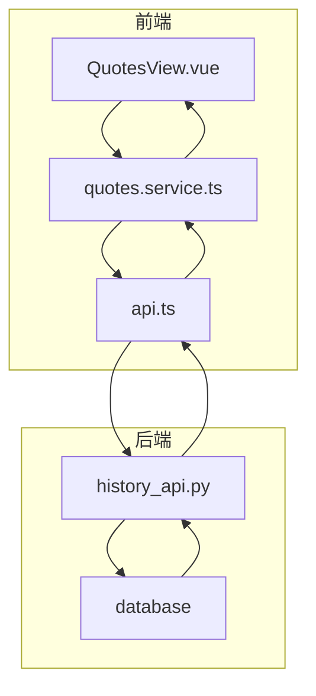
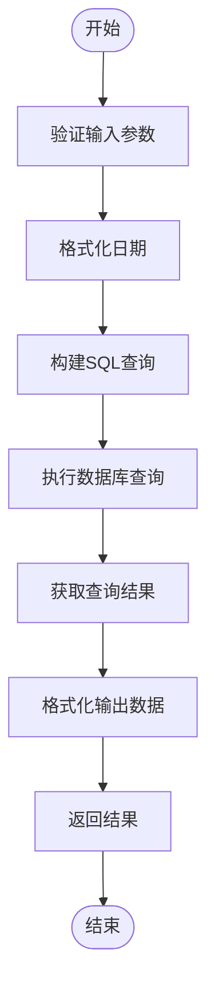
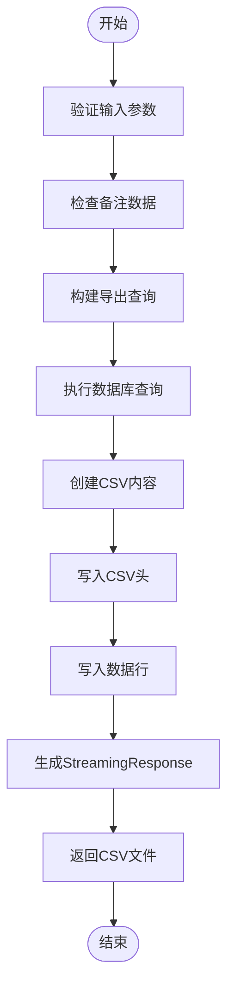
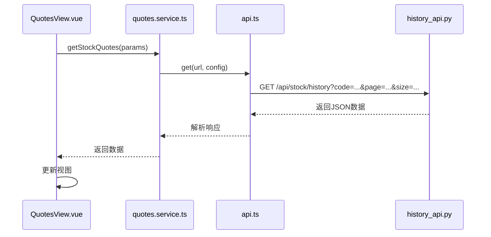
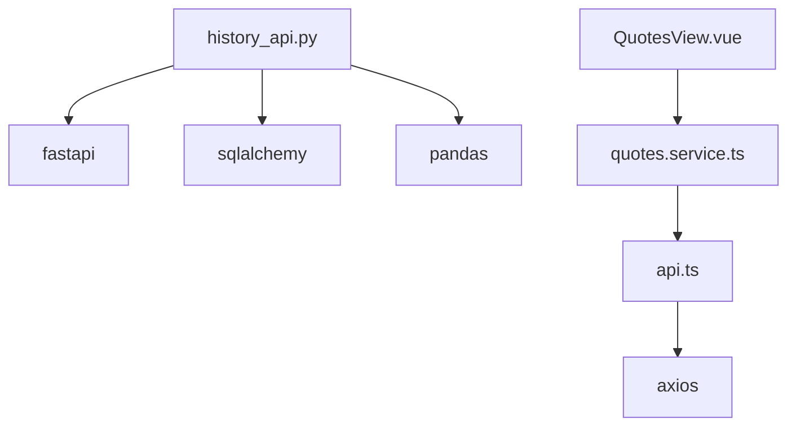

# 历史数据API

<cite>
**本文档中引用的文件**  
- [history_api.py](file://backend_api/stock/history_api.py)
- [api.ts](file://admin/src/services/api.ts)
- [quotes.service.ts](file://admin/src/services/quotes.service.ts)
- [QuotesView.vue](file://admin/src/views/QuotesView.vue)
</cite>

## 目录
1. [简介](#简介)
2. [项目结构](#项目结构)
3. [核心组件](#核心组件)
4. [架构概述](#架构概述)
5. [详细组件分析](#详细组件分析)
6. [依赖分析](#依赖分析)
7. [性能考虑](#性能考虑)
8. [故障排除指南](#故障排除指南)
9. [结论](#结论)

## 简介
本文档旨在为股票历史行情查询接口提供全面的技术说明。重点介绍 `/api/stock/history` 端点的功能，涵盖股票代码、时间范围和数据粒度等查询参数，以及返回数据的格式，包括日期、开盘价、收盘价、最高价、最低价和成交量等字段。文档还详细说明了对不同时间周期（日线、周线、月线）的支持情况和性能特征，并结合 `history_api.py` 的实现逻辑，解释数据分页、时间范围验证和缺失数据处理策略。此外，文档提供了与前端 `api.ts` 中调用代码对应的使用示例，包括错误处理和加载状态管理。

## 项目结构
项目结构清晰地分为前端和后端两个主要部分。前端位于 `admin` 目录下，使用 Vue.js 框架构建，包含组件、服务、视图和配置文件。后端位于 `backend_api` 目录下，采用 FastAPI 框架，提供 RESTful API 接口，处理数据请求和业务逻辑。`backend_core` 目录负责数据收集和核心模型定义。`frontend` 目录包含传统的 HTML/CSS/JS 页面，而 `test` 目录则存放各种测试脚本。

**Section sources**
- [history_api.py](file://backend_api/stock/history_api.py#L1-L602)
- [api.ts](file://admin/src/services/api.ts#L1-L75)
- [quotes.service.ts](file://admin/src/services/quotes.service.ts#L1-L122)
- [QuotesView.vue](file://admin/src/views/QuotesView.vue#L1-L799)

## 核心组件
核心组件包括后端的 `history_api.py`，它定义了 `/api/stock/history` 端点，处理股票历史数据的查询和导出请求。前端的 `api.ts` 和 `quotes.service.ts` 文件提供了与后端 API 交互的服务层，封装了 HTTP 请求逻辑。`QuotesView.vue` 是前端视图组件，负责展示股票、指数和行业板块的实时行情数据，并通过调用 `quotes.service.ts` 中的方法获取数据。

**Section sources**
- [history_api.py](file://backend_api/stock/history_api.py#L1-L602)
- [api.ts](file://admin/src/services/api.ts#L1-L75)
- [quotes.service.ts](file://admin/src/services/quotes.service.ts#L1-L122)
- [QuotesView.vue](file://admin/src/views/QuotesView.vue#L1-L799)

## 架构概述
系统采用前后端分离的架构。前端通过 Axios 发送 HTTP 请求到后端 FastAPI 服务。后端服务处理请求，从数据库中查询数据，并将结果返回给前端。`history_api.py` 中的 `get_stock_history` 函数负责处理历史数据查询，支持分页、时间范围过滤和备注包含选项。`export_stock_history` 函数则用于导出 CSV 格式的历史数据。前端通过 `quotes.service.ts` 中定义的服务方法调用这些 API，并在 `QuotesView.vue` 中展示数据。

**Diagram sources**
- [history_api.py](file://backend_api/stock/history_api.py#L1-L602)
- [api.ts](file://admin/src/services/api.ts#L1-L75)
- [quotes.service.ts](file://admin/src/services/quotes.service.ts#L1-L122)
- [QuotesView.vue](file://admin/src/views/QuotesView.vue#L1-L799)

## 详细组件分析

### 历史数据查询分析
`get_stock_history` 函数是历史数据查询的核心。它接受股票代码、起始日期、结束日期、页码、每页大小和是否包含备注等参数。函数首先格式化日期，然后根据是否包含备注构建不同的 SQL 查询语句。查询结果按日期降序排列，并通过分页机制返回指定范围的数据。函数还计算总记录数，以便前端实现分页功能。

**Diagram sources**
- [history_api.py](file://backend_api/stock/history_api.py#L1-L602)

**Section sources**
- [history_api.py](file://backend_api/stock/history_api.py#L1-L602)

### 数据导出分析
`export_stock_history` 函数用于导出历史数据为 CSV 文件。它支持包含或不包含交易备注的导出。函数首先检查 `trading_notes` 表是否存在，并统计有备注的记录数。然后，根据是否有备注数据设置不同的 CSV 头。数据写入 CSV 文件后，通过 `StreamingResponse` 返回给前端，确保大文件导出的效率。

**Diagram sources**
- [history_api.py](file://backend_api/stock/history_api.py#L1-L602)

**Section sources**
- [history_api.py](file://backend_api/stock/history_api.py#L1-L602)

### 前端调用分析
前端通过 `quotes.service.ts` 中的 `getStockQuotes` 方法调用后端 API。该方法构建查询参数，如页码、页面大小、关键词和排序方式，并通过 `apiService.get` 发送 GET 请求。`api.ts` 中的 `ApiService` 类负责处理 HTTP 请求的细节，包括添加认证 token 和处理 401 未授权响应。`QuotesView.vue` 组件在挂载时调用 `fetchStockData` 方法，获取并展示股票数据。

**Diagram sources**
- [quotes.service.ts](file://admin/src/services/quotes.service.ts#L1-L122)
- [api.ts](file://admin/src/services/api.ts#L1-L75)
- [QuotesView.vue](file://admin/src/views/QuotesView.vue#L1-L799)
- [history_api.py](file://backend_api/stock/history_api.py#L1-L602)

**Section sources**
- [quotes.service.ts](file://admin/src/services/quotes.service.ts#L1-L122)
- [api.ts](file://admin/src/services/api.ts#L1-L75)
- [QuotesView.vue](file://admin/src/views/QuotesView.vue#L1-L799)

## 依赖分析
后端 `history_api.py` 依赖于 `fastapi`、`sqlalchemy` 和 `pandas` 等库。`fastapi` 用于构建 API 路由，`sqlalchemy` 用于数据库操作，`pandas` 用于数据处理。前端 `api.ts` 依赖于 `axios` 进行 HTTP 请求，`quotes.service.ts` 依赖于 `api.ts` 提供的 `apiService`。`QuotesView.vue` 依赖于 `quotes.service.ts` 中的 `quotesService` 来获取数据。

**Diagram sources**
- [history_api.py](file://backend_api/stock/history_api.py#L1-L602)
- [api.ts](file://admin/src/services/api.ts#L1-L75)
- [quotes.service.ts](file://admin/src/services/quotes.service.ts#L1-L122)
- [QuotesView.vue](file://admin/src/views/QuotesView.vue#L1-L799)

**Section sources**
- [history_api.py](file://backend_api/stock/history_api.py#L1-L602)
- [api.ts](file://admin/src/services/api.ts#L1-L75)
- [quotes.service.ts](file://admin/src/services/quotes.service.ts#L1-L122)

## 性能考虑
为了提高性能，`get_stock_history` 函数实现了分页机制，避免一次性返回大量数据。`export_stock_history` 函数使用 `StreamingResponse`，允许在数据生成的同时逐步发送给客户端，减少内存占用。数据库查询使用索引优化，特别是在 `code` 和 `date` 字段上。此外，`format_date_yyyymmdd` 函数支持多种日期格式，减少了前端数据预处理的负担。

## 故障排除指南
常见问题包括 401 未授权错误和 500 服务器内部错误。401 错误通常由认证 token 过期或缺失引起，前端会自动清除本地存储的 token 并重定向到登录页面。500 错误可能由数据库连接问题或 SQL 查询错误导致，应检查后端日志以获取详细信息。如果导出 CSV 文件时出现中文乱码，确保文件包含 BOM 头。

**Section sources**
- [api.ts](file://admin/src/services/api.ts#L1-L75)
- [history_api.py](file://backend_api/stock/history_api.py#L1-L602)

## 结论
本文档详细介绍了历史数据API的设计和实现，涵盖了从后端逻辑到前端调用的各个方面。通过合理的架构设计和性能优化，该API能够高效地处理股票历史行情的查询和导出请求。前端与后端的良好协作确保了用户体验的流畅性。未来可以考虑增加对周线和月线数据的支持，以及更高级的数据分析功能。