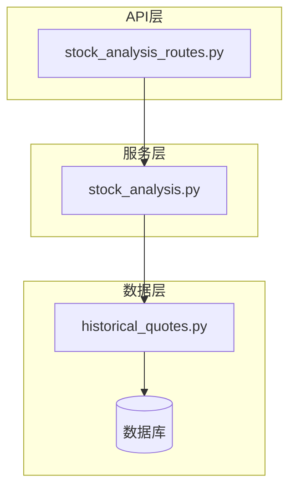
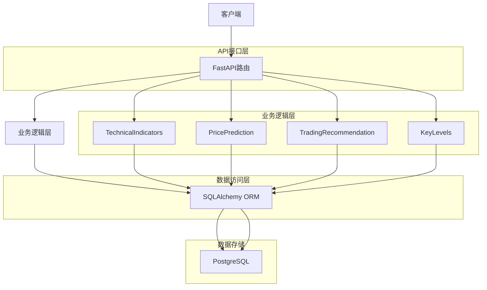
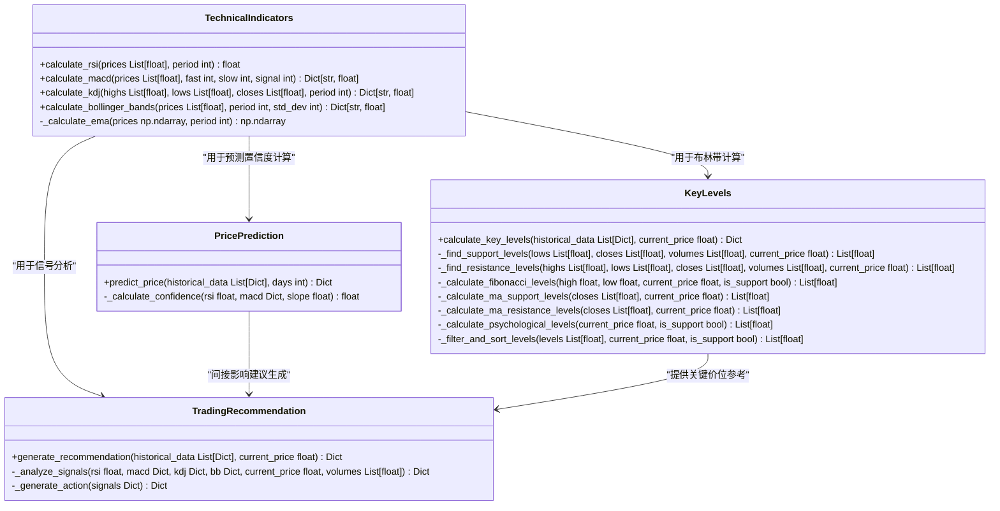
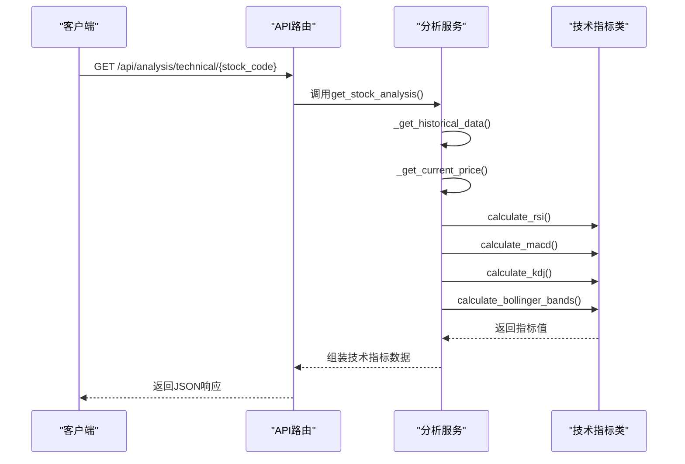
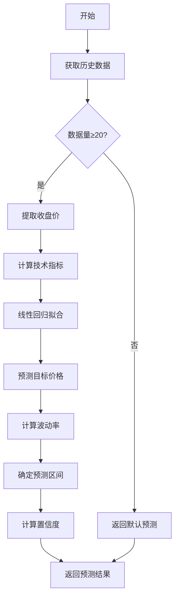
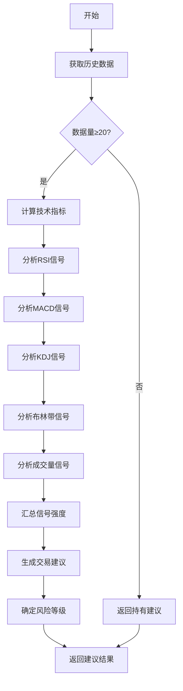
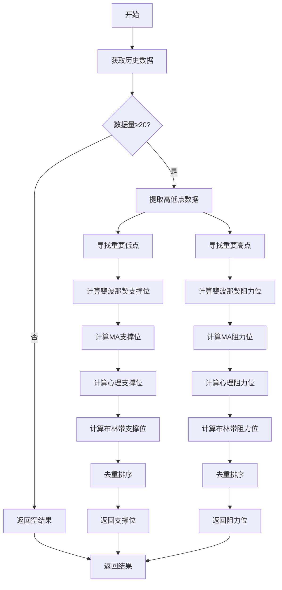
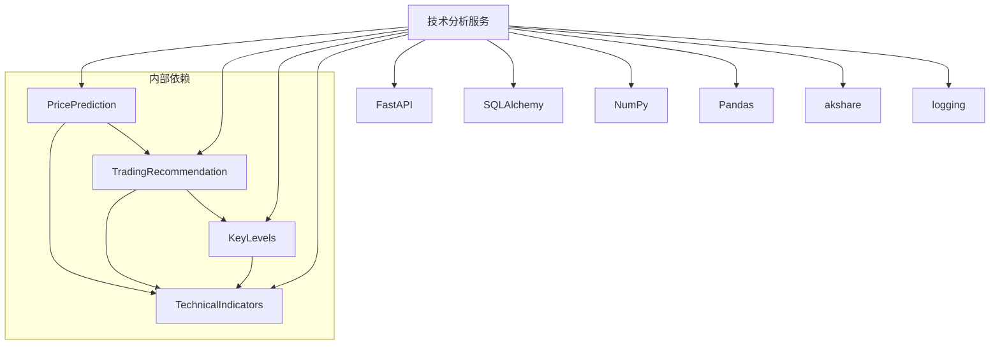

# 技术分析API

<cite>
**本文档引用的文件**
- [stock_analysis_routes.py](file://backend_api/stock/stock_analysis_routes.py)
- [stock_analysis.py](file://backend_api/stock/stock_analysis.py)
- [historical_quotes.py](file://backend_core/models/historical_quotes.py)
</cite>

## 目录
1. [简介](#简介)
2. [项目结构](#项目结构)
3. [核心组件](#核心组件)
4. [架构概述](#架构概述)
5. [详细组件分析](#详细组件分析)
6. [依赖分析](#依赖分析)
7. [性能考虑](#性能考虑)
8. [故障排除指南](#故障排除指南)
9. [结论](#结论)

## 简介
本文档详细描述了股票技术指标计算服务的技术分析API。该服务提供多种技术指标计算功能，包括移动平均线、布林带、相对强弱指数（RSI）、MACD、KDJ等。API通过`/api/analysis`端点提供全面的股票分析功能，支持获取完整分析结果、单独的技术指标、价格预测、交易建议和关键价位信息。系统集成了实时行情数据和历史数据，采用科学的算法模型进行分析计算，为投资者提供专业的决策支持。

## 项目结构
技术分析服务主要由两个核心文件构成：`stock_analysis_routes.py`负责API路由定义和请求处理，`stock_analysis.py`包含具体的分析算法实现。数据模型定义在`backend_core/models/historical_quotes.py`中，用于与数据库交互获取历史行情数据。整个分析流程从接收HTTP请求开始，经过参数验证、数据获取、指标计算、结果生成等步骤，最终返回结构化的JSON响应。

**图示来源**
- [stock_analysis_routes.py](file://backend_api/stock/stock_analysis_routes.py#L1-L270)
- [stock_analysis.py](file://backend_api/stock/stock_analysis.py#L1-L805)
- [historical_quotes.py](file://backend_core/models/historical_quotes.py#L1-L28)

**本节来源**
- [stock_analysis_routes.py](file://backend_api/stock/stock_analysis_routes.py#L1-L270)
- [stock_analysis.py](file://backend_api/stock/stock_analysis.py#L1-L805)

## 核心组件
技术分析服务的核心组件包括技术指标计算、价格预测、交易建议生成和关键价位分析四大模块。这些模块协同工作，为用户提供全面的股票分析服务。系统通过`StockAnalysisService`类封装所有分析功能，采用模块化设计，各功能组件相互独立又有机集成。API路由层将用户请求分发到相应的分析方法，确保服务的高内聚低耦合特性。

**本节来源**
- [stock_analysis.py](file://backend_api/stock/stock_analysis.py#L12-L635)
- [stock_analysis_routes.py](file://backend_api/stock/stock_analysis_routes.py#L1-L270)

## 架构概述
技术分析服务采用分层架构设计，包括API接口层、业务逻辑层和数据访问层。API接口层使用FastAPI框架提供RESTful接口，处理HTTP请求和响应。业务逻辑层包含多个静态工具类，分别负责技术指标计算、价格预测、交易建议生成和关键价位分析。数据访问层通过SQLAlchemy ORM与数据库交互，获取所需的历史行情数据。这种分层架构确保了代码的可维护性和可扩展性。

**图示来源**
- [stock_analysis_routes.py](file://backend_api/stock/stock_analysis_routes.py#L1-L270)
- [stock_analysis.py](file://backend_api/stock/stock_analysis.py#L12-L635)

## 详细组件分析

### 技术指标计算分析
技术指标计算模块实现了多种经典技术分析指标的算法，包括RSI、MACD、KDJ和布林带。这些指标基于历史价格数据进行计算，为投资者提供市场趋势和动量的量化分析。

#### 技术指标类图

**图示来源**
- [stock_analysis.py](file://backend_api/stock/stock_analysis.py#L12-L635)

#### 技术指标计算流程

**图示来源**
- [stock_analysis_routes.py](file://backend_api/stock/stock_analysis_routes.py#L50-L75)
- [stock_analysis.py](file://backend_api/stock/stock_analysis.py#L637-L804)

**本节来源**
- [stock_analysis.py](file://backend_api/stock/stock_analysis.py#L12-L115)
- [stock_analysis_routes.py](file://backend_api/stock/stock_analysis_routes.py#L50-L75)

### 价格预测分析
价格预测模块基于历史数据和多种技术指标，采用线性回归模型进行价格趋势预测。系统不仅提供目标价格预测，还计算预测区间和置信度，帮助用户评估预测的可靠性。

#### 价格预测流程

**图示来源**
- [stock_analysis.py](file://backend_api/stock/stock_analysis.py#L117-L192)

**本节来源**
- [stock_analysis.py](file://backend_api/stock/stock_analysis.py#L117-L192)
- [stock_analysis_routes.py](file://backend_api/stock/stock_analysis_routes.py#L77-L102)

### 交易建议分析
交易建议模块综合多个技术指标信号，生成买入、卖出或持有的操作建议。系统通过量化分析各种技术信号的强度，计算建议的置信度和风险等级，为投资者提供决策支持。

#### 交易建议生成流程

**图示来源**
- [stock_analysis.py](file://backend_api/stock/stock_analysis.py#L194-L316)

**本节来源**
- [stock_analysis.py](file://backend_api/stock/stock_analysis.py#L194-L316)
- [stock_analysis_routes.py](file://backend_api/stock/stock_analysis_routes.py#L104-L129)

### 关键价位分析
关键价位分析模块计算股票的支撑位和阻力位，帮助投资者识别重要的价格水平。系统采用多种方法综合确定关键价位，包括重要高低点、斐波那契回调位、移动平均线和心理价位等。

#### 关键价位计算流程

**图示来源**
- [stock_analysis.py](file://backend_api/stock/stock_analysis.py#L318-L635)

**本节来源**
- [stock_analysis.py](file://backend_api/stock/stock_analysis.py#L318-L635)
- [stock_analysis_routes.py](file://backend_api/stock/stock_analysis_routes.py#L131-L156)

## 依赖分析
技术分析服务依赖于多个外部组件和内部模块。主要依赖包括FastAPI框架用于API路由处理，SQLAlchemy用于数据库操作，NumPy和Pandas用于数值计算，akshare用于获取实时行情数据。服务内部各模块之间也存在明确的依赖关系，如价格预测和交易建议模块都依赖于技术指标计算模块的结果。

**图示来源**
- [stock_analysis.py](file://backend_api/stock/stock_analysis.py#L1-L805)
- [stock_analysis_routes.py](file://backend_api/stock/stock_analysis_routes.py#L1-L270)

**本节来源**
- [stock_analysis.py](file://backend_api/stock/stock_analysis.py#L1-L805)
- [stock_analysis_routes.py](file://backend_api/stock/stock_analysis_routes.py#L1-L270)

## 性能考虑
技术分析服务在设计时充分考虑了性能优化。系统采用批量获取历史数据的方式减少数据库查询次数，使用NumPy和Pandas进行高效的数值计算。对于实时性要求较高的场景，服务优先从实时API获取最新价格，只有在失败时才查询数据库。关键价位计算中采用了多种优化策略，如限制返回的价位数量、设置最小距离阈值等，避免返回过多冗余信息。此外，系统还实现了合理的错误处理机制，确保在部分功能失败时仍能返回可用的分析结果。

## 故障排除指南
当技术分析API出现异常时，可参考以下常见问题及解决方案：

1. **无法获取历史数据**：检查数据库连接是否正常，确认`historical_quotes`表中是否存在对应股票的数据。
2. **实时价格获取失败**：检查akshare库是否正常安装，确认网络连接是否畅通。
3. **技术指标计算异常**：验证输入的历史数据是否完整，确保至少有20个交易日的数据。
4. **API响应超时**：检查服务器资源使用情况，考虑增加超时时间或优化数据库查询。
5. **预测结果不准确**：确认历史数据质量，检查是否有异常值或缺失数据。

**本节来源**
- [stock_analysis.py](file://backend_api/stock/stock_analysis.py#L637-L804)
- [stock_analysis_routes.py](file://backend_api/stock/stock_analysis_routes.py#L1-L270)

## 结论
技术分析API提供了一套完整的股票分析解决方案，涵盖了技术指标计算、价格预测、交易建议和关键价位分析等核心功能。系统采用模块化设计，代码结构清晰，易于维护和扩展。通过集成多种技术分析方法，服务能够为投资者提供全面、专业的决策支持。未来可考虑引入机器学习模型进一步提升预测准确性，或增加更多技术指标以满足不同投资者的需求。