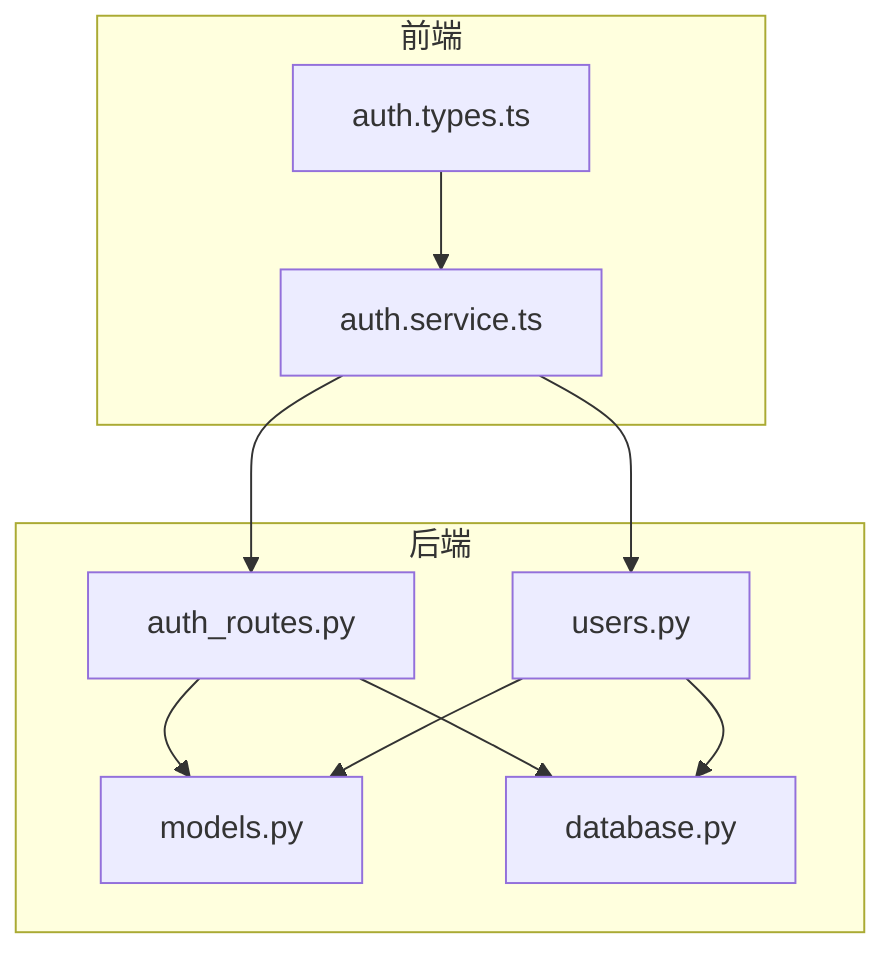
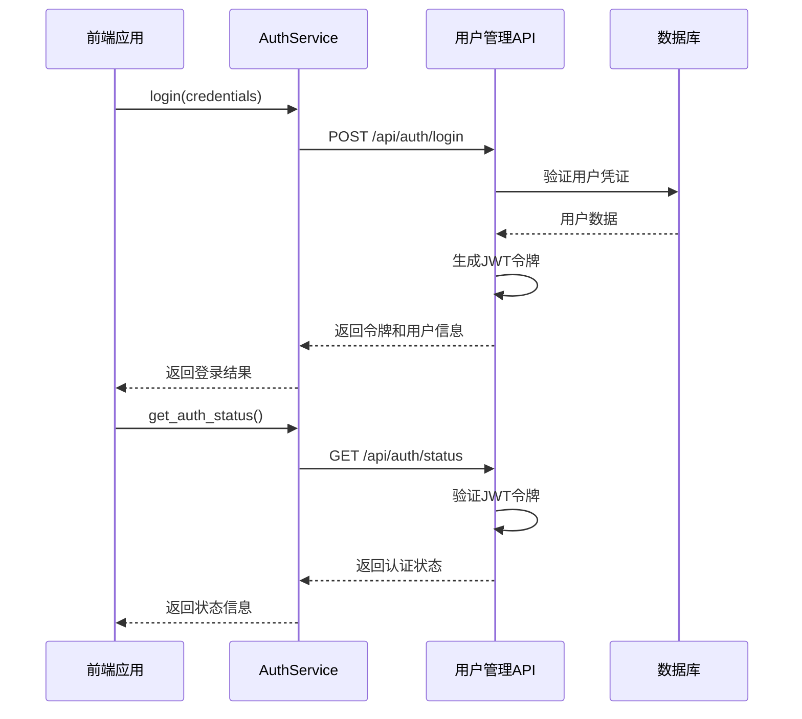
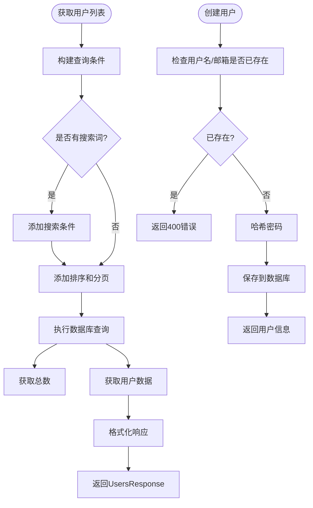
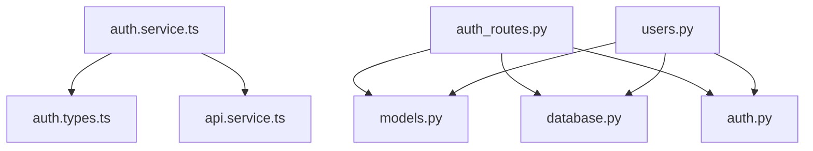

# 用户管理API

<cite>
**本文档引用的文件**  
- [auth_routes.py](file://backend_api/auth_routes.py)
- [auth.service.ts](file://admin/src/services/auth.service.ts)
- [users.py](file://backend_api/admin/users.py)
- [auth.types.ts](file://admin/src/types/auth.types.ts)
- [users.types.ts](file://admin/src/types/users.types.ts)
</cite>

## 目录
1. [简介](#简介)
2. [项目结构](#项目结构)
3. [核心组件](#核心组件)
4. [架构概述](#架构概述)
5. [详细组件分析](#详细组件分析)
6. [依赖分析](#依赖分析)
7. [性能考虑](#性能考虑)
8. [故障排除指南](#故障排除指南)
9. [结论](#结论)

## 简介
本文档详细描述了用户管理API的功能，涵盖用户认证、注册、权限管理和用户信息操作。重点说明了JWT认证流程、用户CRUD操作、密码加密策略、权限级别和会话管理机制。同时包含错误处理场景、HTTP状态码和错误消息格式。

## 项目结构
系统分为前端（admin）和后端（backend_api）两大部分。后端使用FastAPI框架实现用户认证和管理功能，前端使用TypeScript调用API。用户认证相关路由定义在`auth_routes.py`中，用户管理功能在`users.py`中实现，前端服务封装在`auth.service.ts`中。



**图示来源**  
- [auth_routes.py](file://backend_api/auth_routes.py#L1-L331)
- [users.py](file://backend_api/admin/users.py#L1-L197)
- [auth.service.ts](file://admin/src/services/auth.service.ts#L1-L32)

**本节来源**  
- [auth_routes.py](file://backend_api/auth_routes.py#L1-L331)
- [users.py](file://backend_api/admin/users.py#L1-L197)

## 核心组件
核心组件包括用户认证系统（JWT）、用户管理CRUD接口、权限控制系统和前端服务封装。认证系统负责用户登录和token生成，用户管理接口提供完整的用户生命周期管理，权限系统通过角色和状态字段实现访问控制。

**本节来源**  
- [auth_routes.py](file://backend_api/auth_routes.py#L1-L331)
- [users.py](file://backend_api/admin/users.py#L1-L197)

## 架构概述
系统采用前后端分离架构，后端提供RESTful API，前端通过HTTP请求与后端交互。认证使用JWT令牌机制，用户状态和权限通过数据库字段管理。所有敏感操作都需要有效的JWT令牌进行身份验证。



**图示来源**  
- [auth_routes.py](file://backend_api/auth_routes.py#L1-L331)
- [auth.service.ts](file://admin/src/services/auth.service.ts#L1-L32)

## 详细组件分析

### 认证系统分析
认证系统基于JWT实现，提供登录、状态检查和登出功能。使用OAuth2PasswordBearer方案进行令牌验证。

```mermaid
classDiagram
class LoginRequest {
+string username
+string password
}
class Token {
+string access_token
+string token_type
+UserInDB user
}
class UserInDB {
+int id
+string username
+string email
+string role
+string status
+datetime created_at
+datetime updated_at
+datetime last_login
}
class AuthService {
+login(credentials) Promise~LoginResponse~
+logout() Promise~void~
+verifyToken() Promise~{valid : boolean}~
}
LoginRequest --> Token : "登录返回"
Token --> UserInDB : "包含用户信息"
AuthService --> LoginRequest : "使用"
AuthService --> Token : "处理"
```

**图示来源**  
- [auth_routes.py](file://backend_api/auth_routes.py#L1-L331)
- [auth.types.ts](file://admin/src/types/auth.types.ts#L1-L27)

**本节来源**  
- [auth_routes.py](file://backend_api/auth_routes.py#L1-L331)
- [auth.service.ts](file://admin/src/services/auth.service.ts#L1-L32)
- [auth.types.ts](file://admin/src/types/auth.types.ts#L1-L27)

### 用户管理分析
用户管理组件提供完整的CRUD操作，包括用户创建、查询、更新和删除。支持分页、搜索和统计功能。



**图示来源**  
- [users.py](file://backend_api/admin/users.py#L1-L197)
- [users.types.ts](file://admin/src/types/users.types.ts#L1-L29)

**本节来源**  
- [users.py](file://backend_api/admin/users.py#L1-L197)
- [users.types.ts](file://admin/src/types/users.types.ts#L1-L29)

## 依赖分析
系统依赖关系清晰，前端服务依赖类型定义，后端路由依赖模型和数据库服务。认证和用户管理功能共享用户模型和数据库连接。



**图示来源**  
- [auth.service.ts](file://admin/src/services/auth.service.ts#L1-L32)
- [auth_routes.py](file://backend_api/auth_routes.py#L1-L331)
- [users.py](file://backend_api/admin/users.py#L1-L197)

**本节来源**  
- [auth.service.ts](file://admin/src/services/auth.service.ts#L1-L32)
- [auth_routes.py](file://backend_api/auth_routes.py#L1-L331)
- [users.py](file://backend_api/admin/users.py#L1-L197)

## 性能考虑
- 认证请求记录详细日志，便于监控和调试
- 用户列表查询支持分页，避免一次性加载过多数据
- 搜索功能使用数据库索引优化查询性能
- JWT令牌验证高效，减少数据库查询次数
- 登录时间更新使用非阻塞方式，避免影响主要流程

## 故障排除指南
常见问题及解决方案：

| 问题 | 可能原因 | 解决方案 |
|------|---------|---------|
| 登录失败 | 用户名或密码错误 | 检查凭证是否正确 |
| 登录失败 | 账号被禁用 | 检查用户状态是否为active |
| 创建用户失败 | 用户名或邮箱已存在 | 使用不同的用户名或邮箱 |
| API访问被拒绝 | JWT令牌无效或过期 | 重新登录获取新令牌 |
| 搜索无结果 | 搜索关键词不匹配 | 尝试更宽泛的搜索词 |

**本节来源**  
- [auth_routes.py](file://backend_api/auth_routes.py#L1-L331)
- [users.py](file://backend_api/admin/users.py#L1-L197)

## 结论
用户管理API提供了完整的用户生命周期管理功能，包括安全的JWT认证、灵活的用户CRUD操作和细粒度的权限控制。系统设计合理，前后端分离清晰，易于维护和扩展。建议定期审查用户权限和状态，确保系统安全。