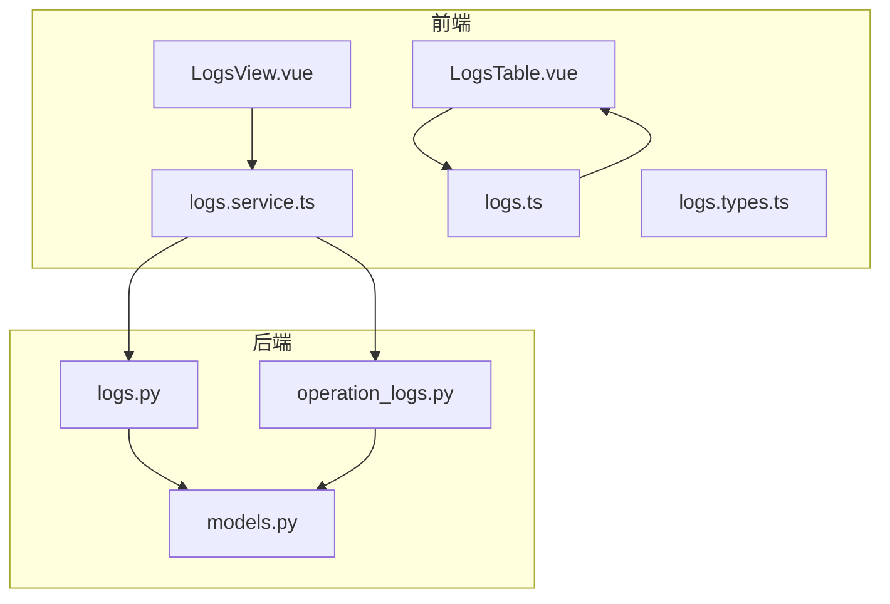
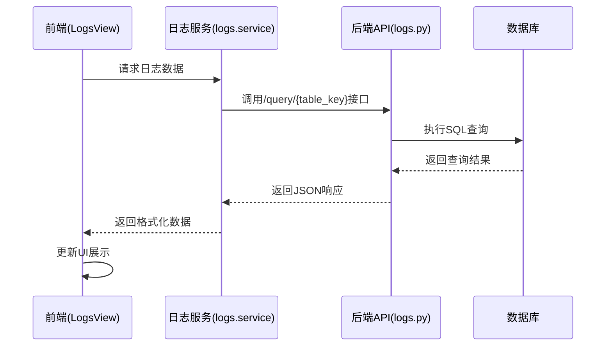
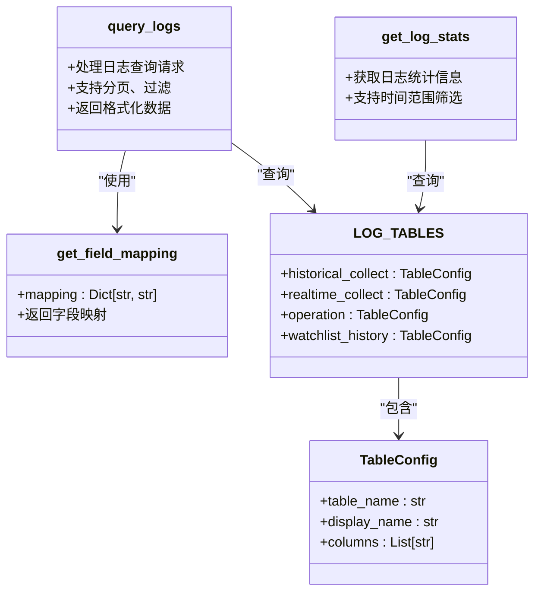
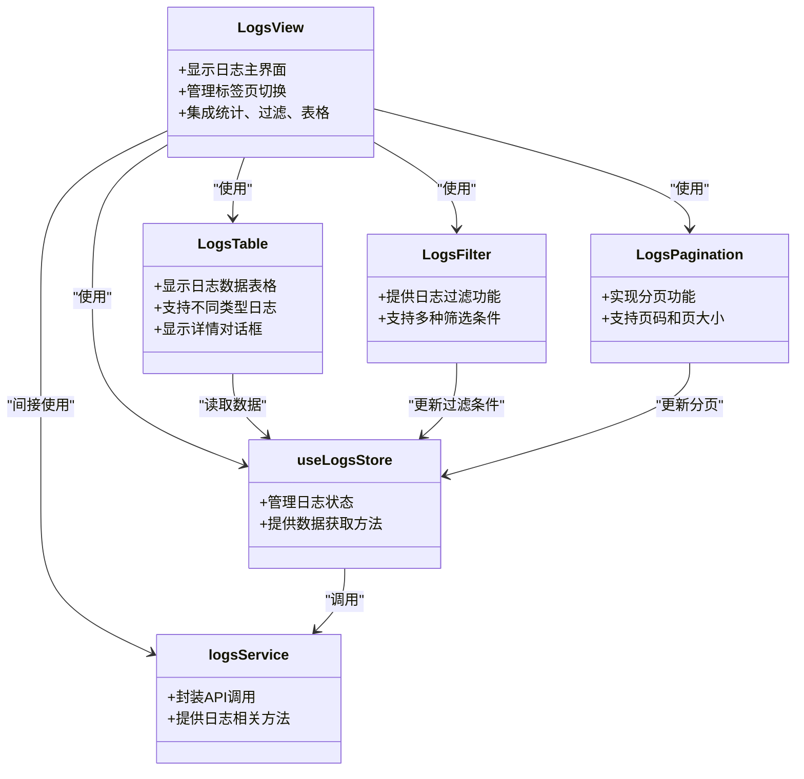
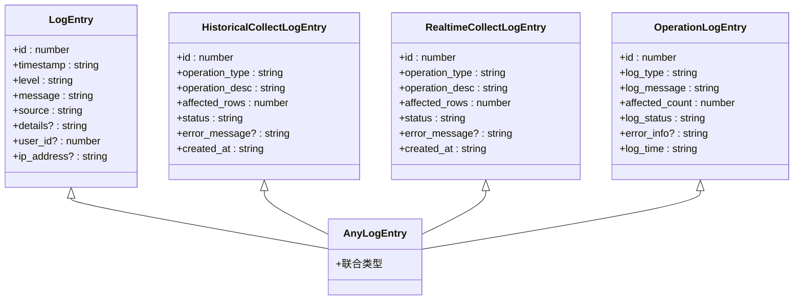
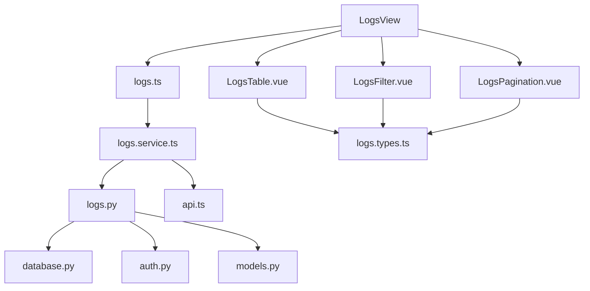

# 系统日志API

<cite>
**本文档引用的文件**
- [logs.py](file://backend_api/admin/logs.py)
- [operation_logs.py](file://backend_api/admin/operation_logs.py)
- [LogsTable.vue](file://admin/src/components/logs/LogsTable.vue)
- [logs.service.ts](file://admin/src/services/logs.service.ts)
- [logs.types.ts](file://admin/src/types/logs.types.ts)
- [logs.ts](file://admin/src/stores/logs.ts)
- [LogsView.vue](file://admin/src/views/LogsView.vue)
</cite>

## 目录
1. [简介](#简介)
2. [项目结构](#项目结构)
3. [核心组件](#核心组件)
4. [架构概述](#架构概述)
5. [详细组件分析](#详细组件分析)
6. [依赖分析](#依赖分析)
7. [性能考虑](#性能考虑)
8. [故障排除指南](#故障排除指南)
9. [结论](#结论)

## 简介
本文档详细说明了股票分析系统中的系统日志API，涵盖操作日志和系统日志的访问接口。文档详细描述了`/logs/`端点的查询参数（时间范围、日志级别、操作类型、用户过滤）和响应格式（时间戳、操作描述、操作者、IP地址等）。同时，文档化了日志分页、排序和搜索功能的实现方式，结合后端`logs.py`和前端`LogsTable.vue`组件，说明完整的日志查看流程。此外，还解释了日志存储策略、保留周期、安全审计功能以及高并发场景下的性能优化措施。

## 项目结构
系统日志功能分布在前后端两个主要模块中。后端日志API位于`backend_api/admin/`目录下，前端展示组件位于`admin/src/`目录中。日志功能通过模块化设计实现了采集、存储、查询和展示的完整闭环。

**图示来源**
- [LogsView.vue](file://admin/src/views/LogsView.vue)
- [LogsTable.vue](file://admin/src/components/logs/LogsTable.vue)
- [logs.service.ts](file://admin/src/services/logs.service.ts)
- [logs.ts](file://admin/src/stores/logs.ts)
- [logs.types.ts](file://admin/src/types/logs.types.ts)
- [logs.py](file://backend_api/admin/logs.py)
- [operation_logs.py](file://backend_api/admin/operation_logs.py)
- [models.py](file://backend_api/models.py)

## 核心组件
系统日志功能的核心组件包括后端API路由、前端展示组件、服务层和状态管理。后端通过FastAPI实现RESTful接口，前端使用Vue 3和Element Plus构建用户界面。日志数据通过Pinia进行状态管理，实现了跨组件的数据共享和响应式更新。

**组件来源**
- [logs.py](file://backend_api/admin/logs.py#L1-L385)
- [operation_logs.py](file://backend_api/admin/operation_logs.py#L1-L245)
- [LogsTable.vue](file://admin/src/components/logs/LogsTable.vue#L1-L390)
- [logs.service.ts](file://admin/src/services/logs.service.ts#L1-L104)
- [logs.ts](file://admin/src/stores/logs.ts#L1-L242)

## 架构概述
系统日志功能采用典型的前后端分离架构。前端通过HTTP请求调用后端API获取日志数据，后端从数据库查询日志记录并返回JSON格式的响应。整个流程涉及多个层次的组件协作，包括视图层、服务层、API路由和数据访问层。

**图示来源**
- [LogsView.vue](file://admin/src/views/LogsView.vue#L1-L168)
- [logs.service.ts](file://admin/src/services/logs.service.ts#L1-L104)
- [logs.py](file://backend_api/admin/logs.py#L1-L385)

## 详细组件分析

### 后端API分析
后端日志API通过FastAPI框架实现，提供了多个端点用于查询不同类型的日志数据。API设计遵循RESTful原则，使用清晰的URL路径和HTTP方法。日志数据存储在多个专用表中，通过配置化的字段映射支持不同表结构的适配。

**图示来源**
- [logs.py](file://backend_api/admin/logs.py#L1-L385)

### 前端组件分析
前端日志组件采用Vue 3的组合式API设计，通过Pinia进行状态管理。组件结构清晰，职责分明，包括视图组件、表格组件、过滤器、分页器和状态管理模块。类型系统使用TypeScript定义，确保了代码的类型安全。

**图示来源**
- [LogsView.vue](file://admin/src/views/LogsView.vue#L1-L168)
- [LogsTable.vue](file://admin/src/components/logs/LogsTable.vue#L1-L390)
- [logs.service.ts](file://admin/src/services/logs.service.ts#L1-L104)
- [logs.ts](file://admin/src/stores/logs.ts#L1-L242)

### 日志类型分析
系统定义了多种日志类型，每种类型有特定的字段结构和用途。通过TypeScript的接口和联合类型，实现了类型安全的日志数据处理。不同类型的日志在前端有不同的展示方式，提高了用户体验。

**图示来源**
- [logs.types.ts](file://admin/src/types/logs.types.ts#L1-L77)

## 依赖分析
系统日志功能依赖于多个核心模块，包括数据库访问、身份认证、API路由和前端框架。这些依赖关系确保了日志功能的完整性和安全性。通过依赖注入和模块化设计，降低了组件间的耦合度。

**图示来源**
- [LogsView.vue](file://admin/src/views/LogsView.vue#L1-L168)
- [logs.ts](file://admin/src/stores/logs.ts#L1-L242)
- [logs.service.ts](file://admin/src/services/logs.service.ts#L1-L104)
- [logs.py](file://backend_api/admin/logs.py#L1-L385)
- [database.py](file://backend_api/database.py)
- [auth.py](file://backend_api/admin/auth.py)
- [api.ts](file://admin/src/services/api.ts)
- [models.py](file://backend_api/models.py)

## 性能考虑
系统在设计日志功能时充分考虑了性能因素。后端API使用数据库索引和分页查询，避免了全表扫描。前端采用虚拟滚动和懒加载技术，确保大量日志数据的流畅展示。查询参数的合理设计也减少了不必要的数据传输。

**性能优化来源**
- [logs.py](file://backend_api/admin/logs.py#L1-L385)
- [LogsTable.vue](file://admin/src/components/logs/LogsTable.vue#L1-L390)

## 故障排除指南
当遇到日志功能问题时，可以按照以下步骤进行排查：首先检查后端API是否正常运行，然后验证数据库连接和查询权限，接着确认前端服务调用是否正确，最后检查网络连接和CORS配置。详细的错误日志可以帮助快速定位问题根源。

**故障排除来源**
- [logs.py](file://backend_api/admin/logs.py#L1-L385)
- [logs.service.ts](file://admin/src/services/logs.service.ts#L1-L104)
- [LogsView.vue](file://admin/src/views/LogsView.vue#L1-L168)

## 结论
系统日志API设计合理，功能完整，能够满足操作日志和系统日志的查看需求。通过前后端的紧密协作，实现了高效、安全、易用的日志管理功能。未来可以考虑增加日志分析、告警和导出功能，进一步提升系统的可维护性和用户体验。