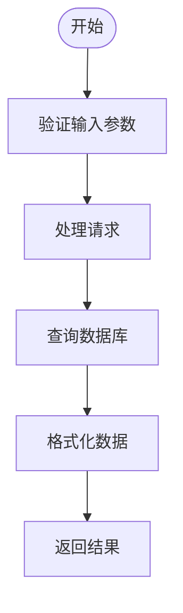
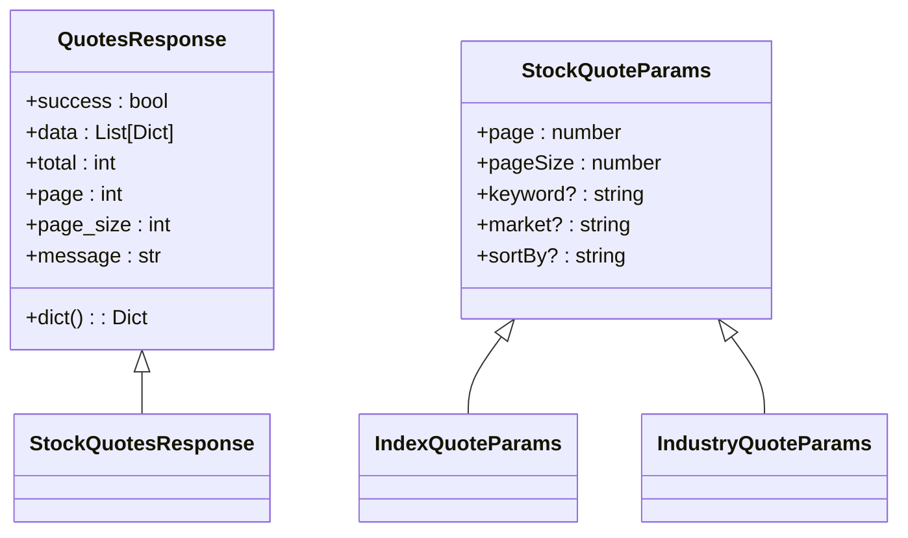
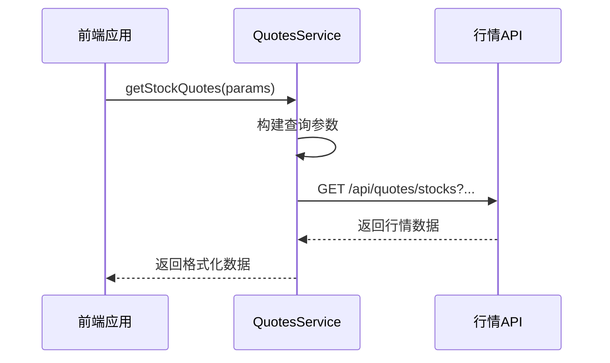

# 行情数据API

<cite>
**本文档引用的文件**  
- [quotes_routes.py](file://backend_api/quotes_routes.py)
- [quotes.service.ts](file://admin/src/services/quotes.service.ts)
- [models.py](file://backend_api/models.py)
</cite>

## 目录
1. [简介](#简介)
2. [核心接口](#核心接口)
3. [请求参数说明](#请求参数说明)
4. [响应数据结构](#响应数据结构)
5. [使用场景分析](#使用场景分析)
6. [前端调用示例](#前端调用示例)
7. [性能与缓存策略](#性能与缓存策略)
8. [异常处理指南](#异常处理指南)
9. [数据更新机制](#数据更新机制)

## 简介
本API提供实时股票、指数和行业板块的行情数据查询服务，支持分页、搜索、排序等功能。系统通过后端定时采集数据并存储于数据库中，前端可通过RESTful接口获取最新行情信息。

**Section sources**
- [quotes_routes.py](file://backend_api/quotes_routes.py#L1-L50)

## 核心接口
行情数据API主要包含以下端点：

| 接口 | HTTP方法 | 描述 |
|------|---------|------|
| `/api/quotes/stocks` | GET | 获取股票实时行情数据 |
| `/api/quotes/indices` | GET | 获取指数实时行情数据 |
| `/api/quotes/industries` | GET | 获取行业板块实时行情数据 |
| `/api/quotes/stats` | GET | 获取行情数据统计信息 |
| `/api/quotes/refresh` | POST | 刷新所有行情数据 |

```mermaid
graph TB
A[客户端] --> B[/api/quotes/stocks]
A --> C[/api/quotes/indices]
A --> D[/api/quotes/industries]
A --> E[/api/quotes/stats]
A --> F[/api/quotes/refresh]
B --> G[数据库查询]
C --> G
D --> G
E --> G
F --> H[数据刷新任务]
```

**Diagram sources**
- [quotes_routes.py](file://backend_api/quotes_routes.py#L100-L500)

**Section sources**
- [quotes_routes.py](file://backend_api/quotes_routes.py#L100-L500)

## 请求参数说明
各接口支持的请求参数如下：

### 股票行情请求参数
- `page`: 页码（默认1）
- `page_size`: 每页数量（1-200，默认20）
- `keyword`: 搜索关键词（支持代码和名称模糊匹配）
- `market`: 市场类型（sh:沪市, sz:深市, cy:创业板, bj:北交所）
- `sort_by`: 排序字段（change_percent:涨跌幅, current_price:现价等）

### 指数与行业板块请求参数
- `page`: 页码
- `page_size`: 每页数量（1-100）
- `keyword`: 搜索关键词
- `sort_by`: 排序字段



**Diagram sources**
- [quotes_routes.py](file://backend_api/quotes_routes.py#L100-L300)

**Section sources**
- [quotes_routes.py](file://backend_api/quotes_routes.py#L100-L300)

## 响应数据结构
### 通用响应格式
所有接口返回统一的响应结构：
```json
{
  "success": true,
  "data": [],
  "total": 100,
  "page": 1,
  "page_size": 20,
  "message": ""
}
```

### 股票行情数据结构
```json
{
  "code": "600036",
  "name": "招商银行",
  "current_price": 38.5,
  "change_percent": 2.34,
  "volume": 123456789,
  "amount": 4567890123,
  "high": 38.8,
  "low": 37.9,
  "open": 38.0,
  "pre_close": 37.6,
  "turnover_rate": 0.45,
  "pe_dynamic": 8.7,
  "total_market_value": 9876543210,
  "pb_ratio": 1.2,
  "circulating_market_value": 876543210,
  "update_time": "2024-01-01T15:00:00"
}
```

### 指数行情数据结构
```json
{
  "code": "000001",
  "name": "上证指数",
  "price": 3200.5,
  "change": 15.2,
  "pct_chg": 0.48,
  "high": 3210.0,
  "low": 3190.0,
  "open": 3195.0,
  "pre_close": 3185.3,
  "volume": 234567890,
  "amount": 3456789012,
  "amplitude": 0.63,
  "turnover": 1.23,
  "pe": 12.5,
  "volume_ratio": 0.98,
  "update_time": "2024-01-01T15:00:00"
}
```

**Section sources**
- [quotes_routes.py](file://backend_api/quotes_routes.py#L50-L100)
- [models.py](file://backend_api/models.py#L300-L400)

## 使用场景分析
### 批量查询场景
适用于行情列表页、自选股列表等需要展示多只股票信息的场景：
- 分页获取数据，每页20-50条
- 支持按市场、涨跌幅等条件筛选
- 可用于构建行情排行榜

### 单只股票查询场景
虽然当前接口主要支持批量查询，但可通过以下方式实现单只股票查询：
- 使用`keyword`参数精确匹配股票代码
- 设置`page_size=1`限制返回数量
- 结合前端缓存机制提高性能



**Diagram sources**
- [quotes_routes.py](file://backend_api/quotes_routes.py#L20-L50)
- [quotes.service.ts](file://admin/src/services/quotes.service.ts#L1-L30)

**Section sources**
- [quotes_routes.py](file://backend_api/quotes_routes.py#L20-L50)
- [quotes.service.ts](file://admin/src/services/quotes.service.ts#L1-L30)

## 前端调用示例
基于`quotes.service.ts`的服务调用示例：



**Diagram sources**
- [quotes.service.ts](file://admin/src/services/quotes.service.ts#L30-L80)

**Section sources**
- [quotes.service.ts](file://admin/src/services/quotes.service.ts#L30-L80)

## 性能与缓存策略
### 数据更新频率
- 实时行情数据：每5分钟更新一次
- 历史数据：每日收盘后更新
- 指数数据：与交易所同步更新

### 缓存机制
- 数据库层面：使用索引优化查询性能
- 应用层面：通过分页和排序优化减少数据传输量
- 前端缓存：客户端可缓存最近获取的数据

### 性能优化措施
- 使用`safe_float`和`safe_datetime`函数确保数据类型安全
- 对null值进行特殊处理，避免排序异常
- 采用分页查询减少单次响应数据量
- 使用数据库索引加速关键词搜索

**Section sources**
- [quotes_routes.py](file://backend_api/quotes_routes.py#L50-L100)

## 异常处理指南
### 常见异常情况及响应
| 异常情况 | HTTP状态码 | 响应格式 |
|--------|----------|--------|
| 股票代码不存在 | 200 (success=false) | {"success": false, "message": "暂无行情数据"} |
| 数据源暂时不可用 | 500 | {"success": false, "detail": "获取股票行情数据失败: ..."} |
| 参数验证失败 | 422 | FastAPI默认验证错误格式 |
| 数据库连接失败 | 500 | {"success": false, "detail": "数据库连接失败"} |

### 错误处理最佳实践
- 前端应检查`success`字段判断请求是否成功
- 对于`success=false`的情况，显示`message`中的错误信息
- 实现重试机制应对临时性故障
- 记录错误日志便于问题排查

**Section sources**
- [quotes_routes.py](file://backend_api/quotes_routes.py#L100-L500)

## 数据更新机制
### 自动更新流程
1. 定时任务触发数据采集
2. 从数据源（如AkShare）获取最新行情
3. 数据清洗和格式化
4. 存储到数据库
5. 更新最后更新时间戳

### 手动刷新
通过`/api/quotes/refresh`端点可手动触发数据刷新：
- HTTP方法：POST
- 无需请求参数
- 成功响应：{"success": true, "message": "行情数据刷新任务已启动"}

该功能可用于调试或紧急数据更新场景。

**Section sources**
- [quotes_routes.py](file://backend_api/quotes_routes.py#L500-L581)