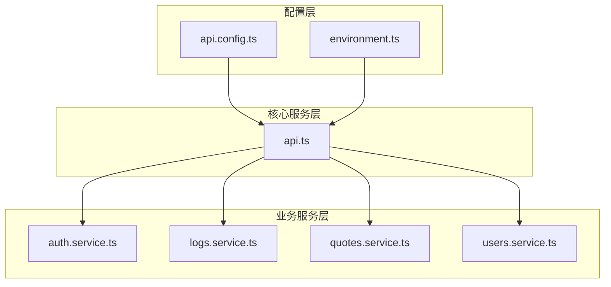
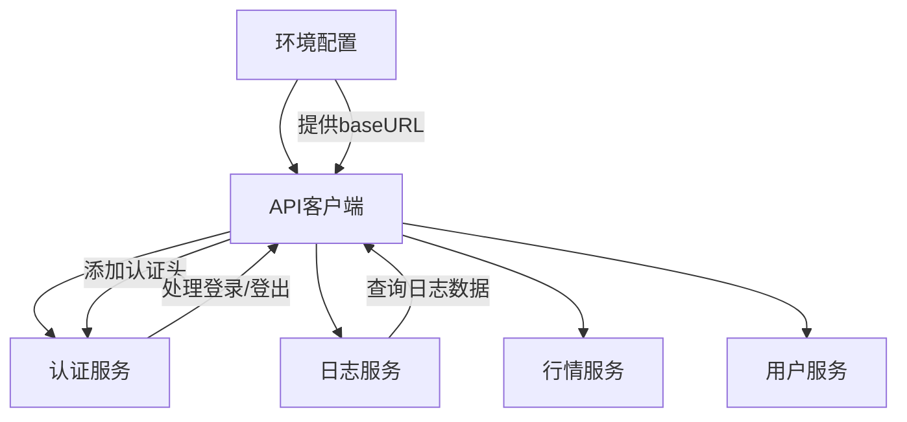
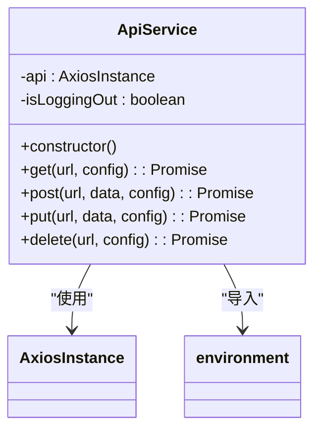
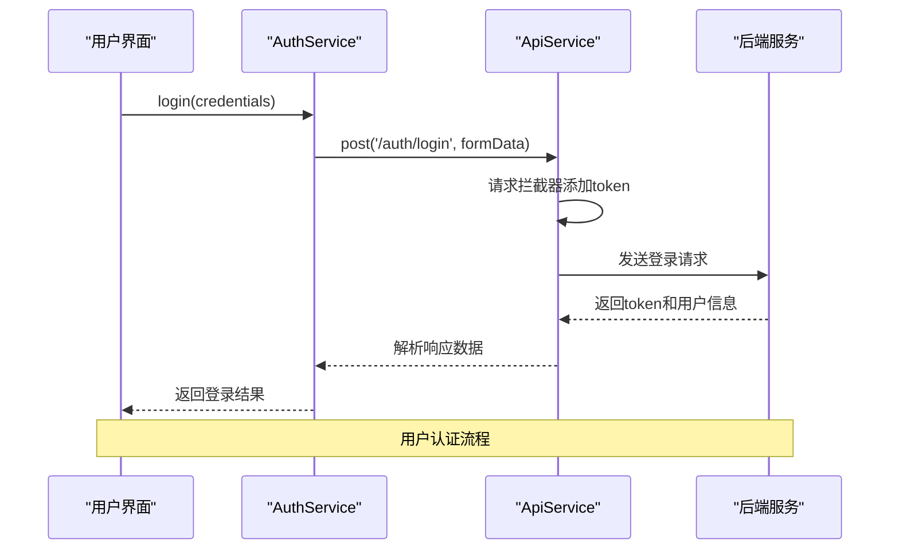
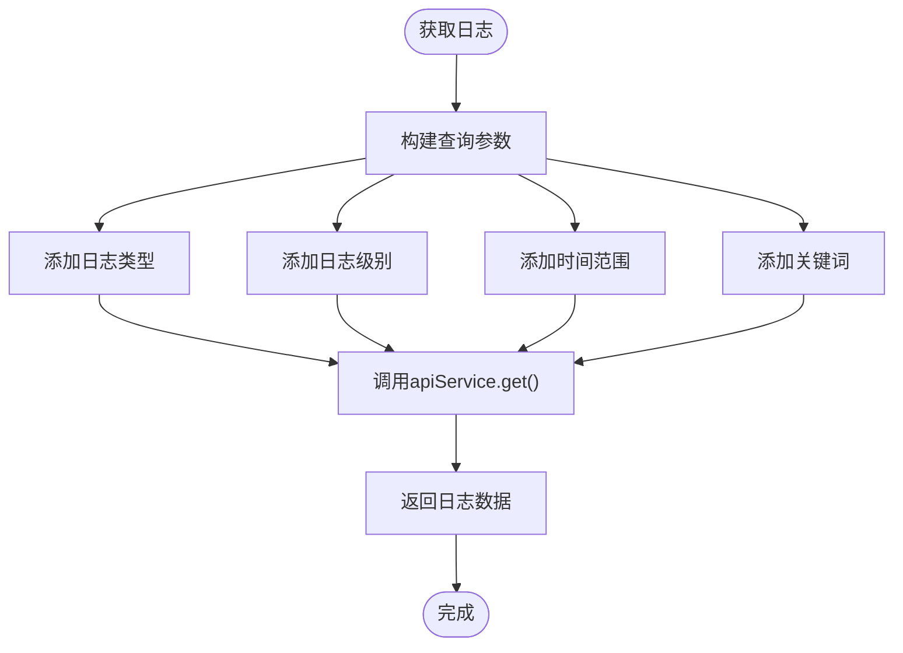
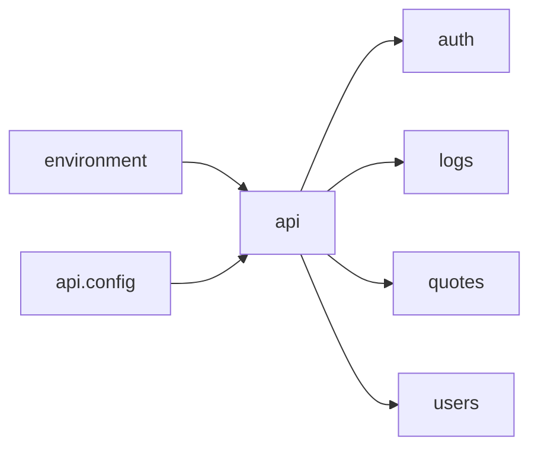

# API客户端

<cite>
**本文档中引用的文件**  
- [api.config.ts](file://admin/src/config/api.config.ts)
- [environment.ts](file://admin/src/config/environment.ts)
- [api.ts](file://admin/src/services/api.ts)
- [auth.service.ts](file://admin/src/services/auth.service.ts)
- [logs.service.ts](file://admin/src/services/logs.service.ts)
- [auth.types.ts](file://admin/src/types/auth.types.ts)
- [logs.types.ts](file://admin/src/types/logs.types.ts)
</cite>

## 目录
1. [简介](#简介)
2. [项目结构](#项目结构)
3. [核心组件](#核心组件)
4. [架构概述](#架构概述)
5. [详细组件分析](#详细组件分析)
6. [依赖分析](#依赖分析)
7. [性能考虑](#性能考虑)
8. [故障排除指南](#故障排除指南)
9. [结论](#结论)

## 简介
本文档深入剖析前端API服务层的设计与实现，重点解析基于Axios的HTTP客户端封装模式。说明多环境配置机制、认证拦截器、token刷新逻辑、错误重试机制以及具体服务模块如何复用基础客户端。同时涵盖请求/响应拦截器的使用示例和安全防范措施。

## 项目结构
前端API服务层主要由配置文件、基础API服务类和具体业务服务模块组成，采用模块化分层设计。

**图示来源**  
- [api.config.ts](file://admin/src/config/api.config.ts)
- [environment.ts](file://admin/src/config/environment.ts)
- [api.ts](file://admin/src/services/api.ts)

**本节来源**  
- [admin/src/config](file://admin/src/config)
- [admin/src/services](file://admin/src/services)

## 核心组件
系统通过`apiService`单例提供统一的HTTP客户端，`AuthService`和`LogsService`等业务服务类复用该客户端实现具体功能。

**本节来源**  
- [api.ts](file://admin/src/services/api.ts#L1-L75)
- [auth.service.ts](file://admin/src/services/auth.service.ts#L1-L32)
- [logs.service.ts](file://admin/src/services/logs.service.ts#L1-L104)

## 架构概述
系统采用分层架构，从环境配置到基础API服务再到具体业务服务，形成清晰的调用链路。

**图示来源**  
- [environment.ts](file://admin/src/config/environment.ts#L1-L51)
- [api.ts](file://admin/src/services/api.ts#L1-L75)

## 详细组件分析

### API客户端实现分析
`ApiService`类封装了Axios实例，实现了请求和响应拦截器，提供统一的HTTP方法接口。

**图示来源**  
- [api.ts](file://admin/src/services/api.ts#L1-L75)

**本节来源**  
- [api.ts](file://admin/src/services/api.ts#L1-L75)

### 认证服务分析
`AuthService`封装了登录、登出和token验证等认证相关操作，与`ApiService`协同工作。

**图示来源**  
- [auth.service.ts](file://admin/src/services/auth.service.ts#L1-L32)
- [api.ts](file://admin/src/services/api.ts#L1-L75)

**本节来源**  
- [auth.service.ts](file://admin/src/services/auth.service.ts#L1-L32)

### 日志服务分析
`LogsService`复用基础API客户端，定义了日志查询、统计和导出等专属请求方法。

**图示来源**  
- [logs.service.ts](file://admin/src/services/logs.service.ts#L1-L104)

**本节来源**  
- [logs.service.ts](file://admin/src/services/logs.service.ts#L1-L104)

## 依赖分析
各组件之间存在明确的依赖关系，基础服务为上层业务服务提供支持。

**图示来源**  
- [environment.ts](file://admin/src/config/environment.ts)
- [api.config.ts](file://admin/src/config/api.config.ts)
- [api.ts](file://admin/src/services/api.ts)

**本节来源**  
- [admin/src/config](file://admin/src/config)
- [admin/src/services](file://admin/src/services)

## 性能考虑
- 使用单例模式避免重复创建Axios实例
- 合理设置请求超时时间（30秒）
- 通过拦截器统一处理认证信息，避免重复代码
- 支持Blob响应类型用于文件导出

## 故障排除指南
常见问题及解决方案：

1. **401未授权错误**：检查token是否过期，确认登录状态
2. **跨域问题**：确保后端CORS配置正确
3. **环境配置错误**：检查`.env`文件和`environment.ts`配置
4. **请求超时**：检查网络连接或适当增加超时时间

**本节来源**  
- [api.ts](file://admin/src/services/api.ts#L50-L70)
- [auth.service.ts](file://admin/src/services/auth.service.ts#L15-L25)

## 结论
API客户端设计合理，通过分层架构实现了配置、基础服务和业务服务的分离。认证拦截器和错误处理机制完善，支持多环境部署，为前端应用提供了稳定可靠的网络通信基础。