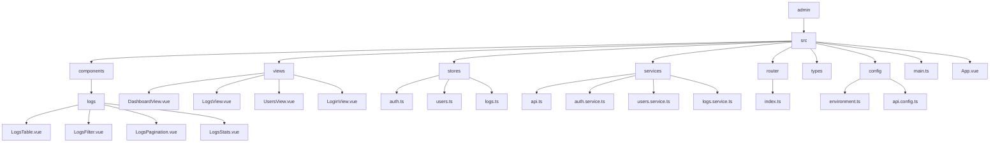
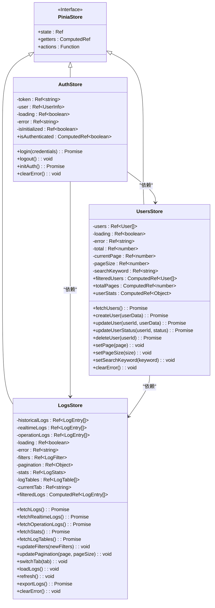
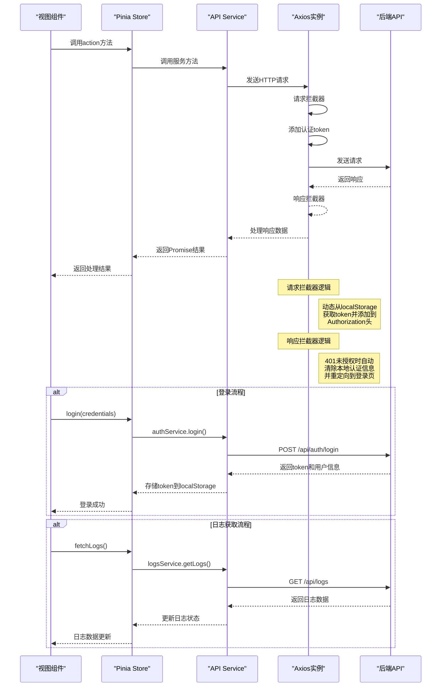
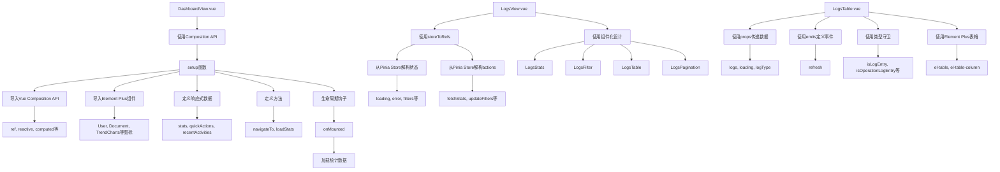
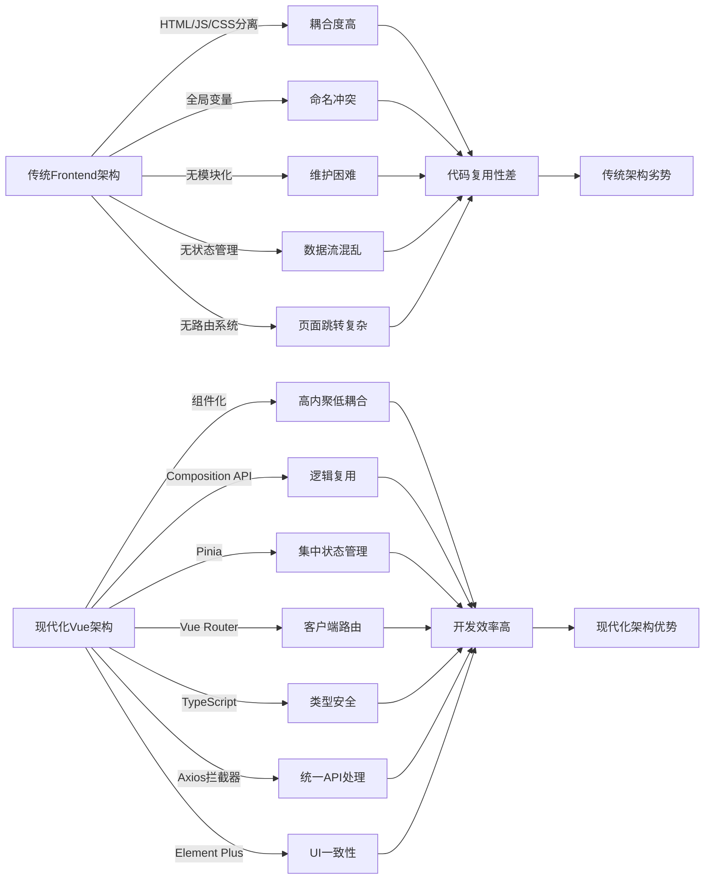

# 前端架构

<cite>
**本文档中引用的文件**   
- [main.ts](file://admin/src/main.ts)
- [index.ts](file://admin/src/router/index.ts)
- [api.ts](file://admin/src/services/api.ts)
- [auth.ts](file://admin/src/stores/auth.ts)
- [users.ts](file://admin/src/stores/users.ts)
- [logs.ts](file://admin/src/stores/logs.ts)
- [DashboardView.vue](file://admin/src/views/DashboardView.vue)
- [LogsView.vue](file://admin/src/views/LogsView.vue)
- [LogsTable.vue](file://admin/src/components/logs/LogsTable.vue)
- [LogsFilter.vue](file://admin/src/components/logs/LogsFilter.vue)
- [LogsPagination.vue](file://admin/src/components/logs/LogsPagination.vue)
- [LogsStats.vue](file://admin/src/components/logs/LogsStats.vue)
</cite>

## 目录
1. [项目结构](#项目结构)
2. [核心组件](#核心组件)
3. [应用初始化流程](#应用初始化流程)
4. [路由架构与视图映射](#路由架构与视图映射)
5. [状态管理设计](#状态管理设计)
6. [API通信机制](#api通信机制)
7. [组件化开发模式](#组件化开发模式)
8. [现代化架构优势](#现代化架构优势)
9. [最佳实践与优化建议](#最佳实践与优化建议)

## 项目结构



**图示来源**
- [main.ts](file://admin/src/main.ts)
- [App.vue](file://admin/src/App.vue)
- [index.ts](file://admin/src/router/index.ts)

**本节来源**
- [admin/src](file://admin/src)

## 核心组件

深入分析管理后台的核心功能组件，包括仪表板、日志管理、用户管理等关键视图组件及其子组件。

**本节来源**
- [DashboardView.vue](file://admin/src/views/DashboardView.vue)
- [LogsView.vue](file://admin/src/views/LogsView.vue)
- [UsersView.vue](file://admin/src/views/UsersView.vue)

## 应用初始化流程

```mermaid
flowchart TD
A[入口文件 main.ts] --> B[创建Vue应用实例]
B --> C[导入Element Plus UI库]
C --> D[注册所有Element Plus图标]
D --> E[创建Pinia状态管理实例]
E --> F[注册Pinia插件]
F --> G[注册Vue Router]
G --> H[挂载应用到DOM]
H --> I[应用启动完成]
subgraph "图标注册流程"
J[遍历ElementPlusIconsVue] --> K[获取组件名和组件]
K --> L[在应用实例中注册组件]
L --> M[完成所有图标注册]
end
subgraph "插件注册"
N[app.use(createPinia())] --> O[app.use(router)]
O --> P[app.use(ElementPlus)]
end
A --> J
M --> E
P --> H
```

**图示来源**
- [main.ts](file://admin/src/main.ts#L1-L23)

**本节来源**
- [main.ts](file://admin/src/main.ts#L1-L23)

## 路由架构与视图映射

```mermaid
graph TD
A[路由配置 index.ts] --> B[创建路由实例]
B --> C[定义路由规则]
C --> D[/login 路由]
D --> D1[组件: LoginView.vue]
D --> D2[元信息: 不需要认证]
C --> E[/ 根路由]
E --> E1[组件: AdminLayout.vue]
E --> E2[元信息: 需要认证]
E --> F[子路由]
F --> G[dashboard]
G --> G1[组件: DashboardView.vue]
F --> H[logs]
H --> H1[组件: LogsView.vue]
F --> I[users]
I --> I1[组件: UsersView.vue]
F --> J[quotes]
J --> J1[组件: QuotesView.vue]
F --> K[datacollect]
K --> K1[组件: DataCollectView.vue]
F --> L[monitoring]
L --> L1[组件: MonitoringView.vue]
F --> M[models]
M --> M1[组件: ModelsView.vue]
F --> N[content]
N --> N1[组件: ContentView.vue]
F --> O[announcements]
O --> O1[组件: AnnouncementsView.vue]
B --> P[路由守卫]
P --> Q[beforeEach 全局前置守卫]
Q --> R[检查认证状态]
R --> S{已认证?}
S --> |否| T[重定向到登录页]
S --> |是| U[允许访问]
Q --> V{访问登录页?}
V --> |是| W{已登录?}
W --> |是| X[重定向到dashboard]
W --> |否| Y[允许访问登录页]
```

**图示来源**
- [index.ts](file://admin/src/router/index.ts#L1-L103)

**本节来源**
- [index.ts](file://admin/src/router/index.ts#L1-L103)
- [LoginView.vue](file://admin/src/views/LoginView.vue)
- [DashboardView.vue](file://admin/src/views/DashboardView.vue)
- [LogsView.vue](file://admin/src/views/LogsView.vue)

## 状态管理设计



**图示来源**
- [auth.ts](file://admin/src/stores/auth.ts#L1-L119)
- [users.ts](file://admin/src/stores/users.ts#L1-L243)
- [logs.ts](file://admin/src/stores/logs.ts#L1-L243)

**本节来源**
- [auth.ts](file://admin/src/stores/auth.ts#L1-L119)
- [users.ts](file://admin/src/stores/users.ts#L1-L243)
- [logs.ts](file://admin/src/stores/logs.ts#L1-L243)

## API通信机制



**图示来源**
- [api.ts](file://admin/src/services/api.ts#L1-L76)
- [auth.service.ts](file://admin/src/services/auth.service.ts)
- [logs.service.ts](file://admin/src/services/logs.service.ts)

**本节来源**
- [api.ts](file://admin/src/services/api.ts#L1-L76)

## 组件化开发模式



**图示来源**
- [DashboardView.vue](file://admin/src/views/DashboardView.vue#L1-L505)
- [LogsView.vue](file://admin/src/views/LogsView.vue#L1-L169)
- [LogsTable.vue](file://admin/src/components/logs/LogsTable.vue#L1-L391)

**本节来源**
- [DashboardView.vue](file://admin/src/views/DashboardView.vue#L1-L505)
- [LogsView.vue](file://admin/src/views/LogsView.vue#L1-L169)
- [LogsTable.vue](file://admin/src/components/logs/LogsTable.vue#L1-L391)

## 现代化架构优势



**图示来源**
- [frontend](file://frontend)
- [admin](file://admin)

**本节来源**
- [frontend](file://frontend)
- [admin](file://admin)

## 最佳实践与优化建议

```mermaid
flowchart TD
A[组件通信最佳实践] --> B[父子组件通信]
B --> C[使用props传递数据]
B --> D[使用emits触发事件]
A --> E[跨组件通信]
E --> F[使用Pinia状态管理]
E --> G[避免使用事件总线]
H[状态管理最佳实践] --> I[单一状态树]
I --> J[每个模块独立store]
J --> K[auth, users, logs等]
H --> L[使用getters计算派生状态]
H --> M[使用actions处理异步操作]
H --> N[避免直接修改state]
O[API调用最佳实践] --> P[封装API服务]
P --> Q[使用Axios拦截器]
Q --> R[统一处理认证]
Q --> S[统一错误处理]
O --> T[使用TypeScript接口]
T --> U[定义请求/响应类型]
V[性能优化点] --> W[路由懒加载]
W --> X[import()动态导入]
V --> Y[组件懒加载]
Y --> Z[使用Suspense]
V --> AA[列表虚拟滚动]
AA --> AB[对于大数据量列表]
V --> AC[防抖节流]
AC --> AD[搜索输入框]
AC --> AE[窗口resize事件]
V --> AF[计算属性缓存]
AF --> AG[避免重复计算]
V --> AH[图片懒加载]
AH --> AI[对于大量图片]
AJ[潜在问题] --> AK[认证状态初始化]
AK --> AL[使用isInitialized标记]
AJ --> AM[401重定向循环]
AM --> AN[添加isLoggingOut保护]
AJ --> AO[内存泄漏风险]
AO --> AP[注意组件销毁清理]
```

**图示来源**
- [main.ts](file://admin/src/main.ts)
- [index.ts](file://admin/src/router/index.ts)
- [api.ts](file://admin/src/services/api.ts)
- [auth.ts](file://admin/src/stores/auth.ts)
- [users.ts](file://admin/src/stores/users.ts)
- [logs.ts](file://admin/src/stores/logs.ts)

**本节来源**
- [main.ts](file://admin/src/main.ts)
- [index.ts](file://admin/src/router/index.ts)
- [api.ts](file://admin/src/services/api.ts)
- [auth.ts](file://admin/src/stores/auth.ts)
- [users.ts](file://admin/src/stores/users.ts)
- [logs.ts](file://admin/src/stores/logs.ts)