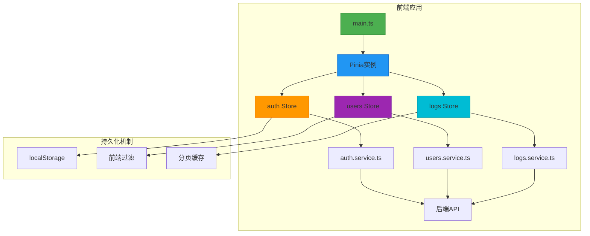
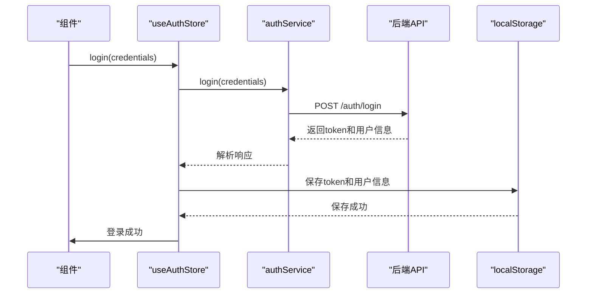
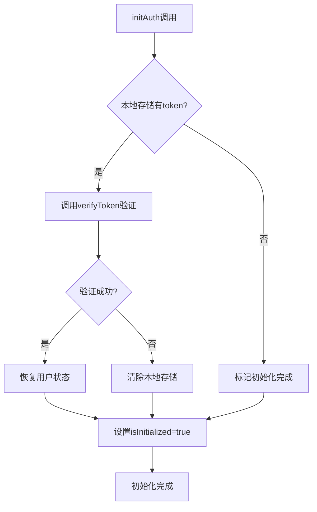
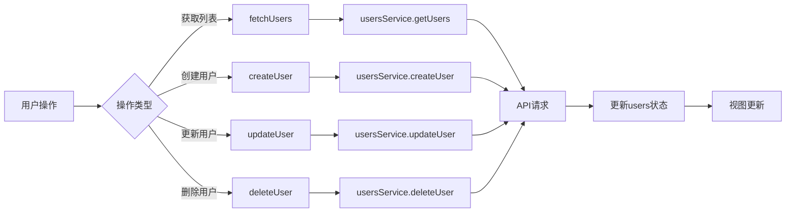
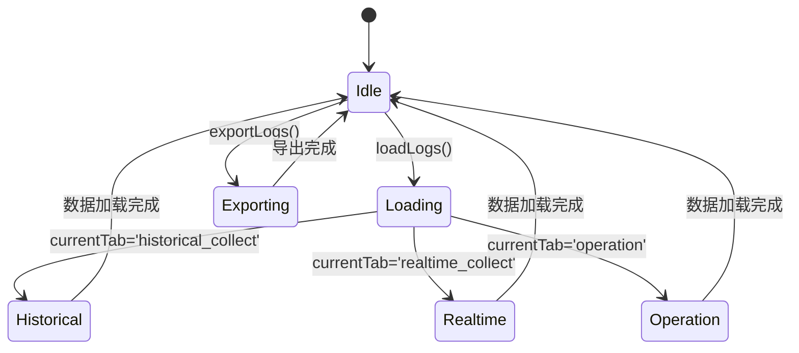

# 状态管理

<cite>
**本文档引用的文件**  
- [main.ts](file://admin/src/main.ts)
- [auth.ts](file://admin/src/stores/auth.ts)
- [users.ts](file://admin/src/stores/users.ts)
- [logs.ts](file://admin/src/stores/logs.ts)
- [auth.service.ts](file://admin/src/services/auth.service.ts)
</cite>

## 目录
1. [引言](#引言)
2. [项目结构概览](#项目结构概览)
3. [核心状态模块分析](#核心状态模块分析)
4. [状态管理模式架构](#状态管理模式架构)
5. [详细组件分析](#详细组件分析)
6. [依赖关系分析](#依赖关系分析)
7. [性能考量](#性能考量)
8. [故障排查指南](#故障排查指南)
9. [结论](#结论)

## 引言
本文档详细阐述了基于Pinia的状态管理模式在股票分析软件管理后台中的实现机制。重点分析`auth`、`users`、`logs`三个store模块的设计结构与数据流机制，说明如何通过`defineStore`创建持久化状态容器，并结合`auth.service.ts`实现用户认证状态的同步管理。同时描述`main.ts`中`app.use(createPinia())`的初始化过程及其在应用生命周期中的位置。

## 项目结构概览
项目采用典型的Vue 3 + Pinia + TypeScript架构，状态管理模块集中于`admin/src/stores/`目录下，包含`auth.ts`、`users.ts`、`logs.ts`三个核心store文件。服务层位于`admin/src/services/`目录，提供与后端API的通信能力。类型定义位于`admin/src/types/`目录，确保类型安全。

**Section sources**
- [main.ts](file://admin/src/main.ts#L1-L22)

## 核心状态模块分析
系统通过Pinia实现集中式状态管理，`auth`、`users`、`logs`三个store分别管理认证状态、用户数据和日志信息。每个store使用`defineStore`函数创建，包含响应式状态（state）、计算属性（getters）和动作方法（actions），并通过`ref`和`computed`实现数据的响应式更新。

**Section sources**
- [auth.ts](file://admin/src/stores/auth.ts#L1-L118)
- [users.ts](file://admin/src/stores/users.ts#L1-L242)
- [logs.ts](file://admin/src/stores/logs.ts#L1-L242)

## 状态管理模式架构


**Diagram sources**
- [main.ts](file://admin/src/main.ts#L1-L22)
- [auth.ts](file://admin/src/stores/auth.ts#L1-L118)
- [users.ts](file://admin/src/stores/users.ts#L1-L242)
- [logs.ts](file://admin/src/stores/logs.ts#L1-L242)

## 详细组件分析

### 认证状态管理模块
`auth` store负责管理用户认证状态，通过`defineStore`创建名为`auth`的持久化状态容器。状态包含`token`、`user`、`loading`、`error`等字段，通过`isAuthenticated`计算属性判断用户是否已认证。

#### 认证流程序列图


**Diagram sources**
- [auth.ts](file://admin/src/stores/auth.ts#L1-L118)
- [auth.service.ts](file://admin/src/services/auth.service.ts#L1-L32)

#### 初始化流程


**Diagram sources**
- [auth.ts](file://admin/src/stores/auth.ts#L1-L118)

**Section sources**
- [auth.ts](file://admin/src/stores/auth.ts#L1-L118)
- [auth.service.ts](file://admin/src/services/auth.service.ts#L1-L32)

### 用户状态管理模块
`users` store管理用户数据的获取、创建、更新和删除操作，包含分页、搜索和统计功能。通过`fetchUsers`、`createUser`等actions与后端交互，并使用`filteredUsers`计算属性实现前端搜索过滤。

#### 用户管理数据流


**Diagram sources**
- [users.ts](file://admin/src/stores/users.ts#L1-L242)

**Section sources**
- [users.ts](file://admin/src/stores/users.ts#L1-L242)

### 日志状态管理模块
`logs` store管理三种类型的日志数据：历史采集日志、实时行情采集日志和操作日志。通过`currentTab`状态管理当前激活的标签页，并根据标签页动态加载对应的数据。

#### 日志模块状态机


**Diagram sources**
- [logs.ts](file://admin/src/stores/logs.ts#L1-L242)

**Section sources**
- [logs.ts](file://admin/src/stores/logs.ts#L1-L242)

## 依赖关系分析
```mermaid
classDiagram
class useAuthStore {
+token : Ref<string | null>
+user : Ref<UserInfo | null>
+loading : Ref<boolean>
+error : Ref<string | null>
+isInitialized : Ref<boolean>
+isAuthenticated : ComputedRef<boolean>
+login(credentials) : Promise~LoginResponse~
+logout() : Promise~void~
+initAuth() : Promise~void~
+clearError() : void
}
class useUsersStore {
+users : Ref~User[]~
+loading : Ref~boolean~
+error : Ref~string | null~
+total : Ref~number~
+currentPage : Ref~number~
+pageSize : Ref~20~
+searchKeyword : Ref~string~
+filteredUsers : ComputedRef~User[]~
+totalPages : ComputedRef~number~
+fetchUsers() : Promise~void~
+createUser(userData) : Promise~User~
+updateUser(userId, userData) : Promise~User~
+updateUserStatus(userId, status) : Promise~void~
+deleteUser(userId) : Promise~void~
+setPage(page) : void
+setPageSize(size) : void
+setSearchKeyword(keyword) : void
+clearError() : void
}
class useLogsStore {
+historicalLogs : Ref~AnyLogEntry[]~
+realtimeLogs : Ref~AnyLogEntry[]~
+operationLogs : Ref~AnyLogEntry[]~
+loading : Ref~boolean~
+error : Ref~string | null~
+filters : Ref~LogFilter~
+pagination : Ref~{current, pageSize, total}~
+stats : Ref~LogStats | null~
+logTables : Ref~LogTable[]~
+currentTab : Ref~'historical_collect' | 'realtime_collect' | 'operation'~
+filteredLogs : ComputedRef~AnyLogEntry[]~
+fetchLogs() : Promise~void~
+fetchRealtimeLogs() : Promise~void~
+fetchOperationLogs() : Promise~void~
+fetchStats() : Promise~void~
+fetchLogTables() : Promise~void~
+updateFilters(newFilters) : void
+updatePagination(page, pageSize) : void
+switchTab(tab) : void
+loadLogs() : void
+refresh() : void
+exportLogs() : Promise~void~
+clearError() : void
}
class AuthService {
+login(credentials) : Promise~LoginResponse~
+logout() : Promise~void~
+verifyToken() : Promise~{valid : boolean}~
}
class UsersService {
+getUsers(page, pageSize, keyword) : Promise~{data, total, page, pageSize}~
+getUserStats() : Promise~{total, active, disabled, suspended}~
+createUser(userData) : Promise~User~
+updateUser(userId, userData) : Promise~User~
+updateUserStatus(userId, status) : Promise~void~
+deleteUser(userId) : Promise~void~
}
class LogsService {
+getLogs(filter) : Promise~{data, total}~
+getRealtimeLogs(filter) : Promise~{data, total}~
+getOperationLogs(filter) : Promise~{data, total}~
+getLogStats() : Promise~LogStats~
+getLogTables() : Promise~LogTable[]~
+exportLogs(filter) : Promise~Blob~
}
useAuthStore --> AuthService : "依赖"
useUsersStore --> UsersService : "依赖"
useLogsStore --> LogsService : "依赖"
AuthService --> ApiService : "使用"
UsersService --> ApiService : "使用"
LogsService --> ApiService : "使用"
```

**Diagram sources**
- [auth.ts](file://admin/src/stores/auth.ts#L1-L118)
- [users.ts](file://admin/src/stores/users.ts#L1-L242)
- [logs.ts](file://admin/src/stores/logs.ts#L1-L242)
- [auth.service.ts](file://admin/src/services/auth.service.ts#L1-L32)

**Section sources**
- [auth.ts](file://admin/src/stores/auth.ts#L1-L118)
- [users.ts](file://admin/src/stores/users.ts#L1-L242)
- [logs.ts](file://admin/src/stores/logs.ts#L1-L242)
- [auth.service.ts](file://admin/src/services/auth.service.ts#L1-L32)

## 性能考量
- **状态持久化**：通过`localStorage`实现认证状态持久化，避免页面刷新后重新登录
- **数据缓存**：在`users` store中使用`userStatsData`缓存统计数据，减少API调用频率
- **分页加载**：所有列表数据均采用分页机制，`pageSize`默认为20条，避免一次性加载过多数据
- **错误处理**：每个action都包含完整的try-catch-finally结构，确保错误被捕获并适当处理
- **资源清理**：在`logout`操作中，不仅清除状态，还清除本地存储中的认证信息

## 故障排查指南
- **认证状态丢失**：检查`localStorage`中`admin_token`和`admin_user`是否正确存储
- **数据未更新**：确认`fetchUsers`等action是否被正确调用，检查网络请求是否成功
- **搜索功能失效**：验证`searchKeyword`状态是否正确更新，检查`filteredUsers`计算属性逻辑
- **分页异常**：检查`currentPage`和`pageSize`状态是否同步更新，确认API响应包含正确的分页信息
- **日志标签页切换失败**：确认`switchTab`方法是否正确更新`currentTab`状态并触发`loadLogs`

**Section sources**
- [auth.ts](file://admin/src/stores/auth.ts#L1-L118)
- [users.ts](file://admin/src/stores/users.ts#L1-L242)
- [logs.ts](file://admin/src/stores/logs.ts#L1-L242)

## 结论
本系统通过Pinia实现了高效、可维护的状态管理。`auth`、`users`、`logs`三个store模块设计合理，职责分明，通过actions、getters和state的有机结合，实现了复杂的业务逻辑。认证状态的持久化机制确保了用户体验的连续性，而模块间的状态共享通过Pinia的全局store实例自然实现。建议在后续开发中继续遵循此模式，保持代码的一致性和可预测性。