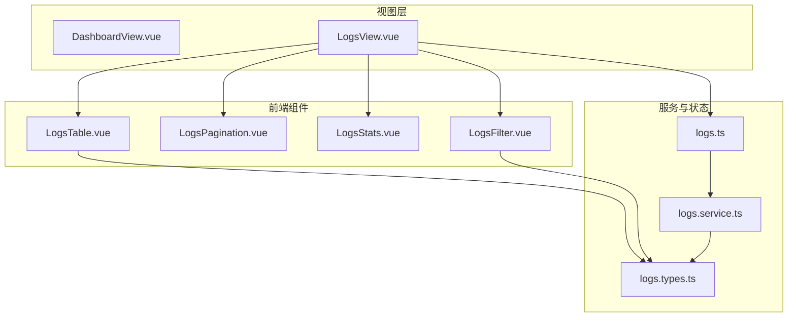
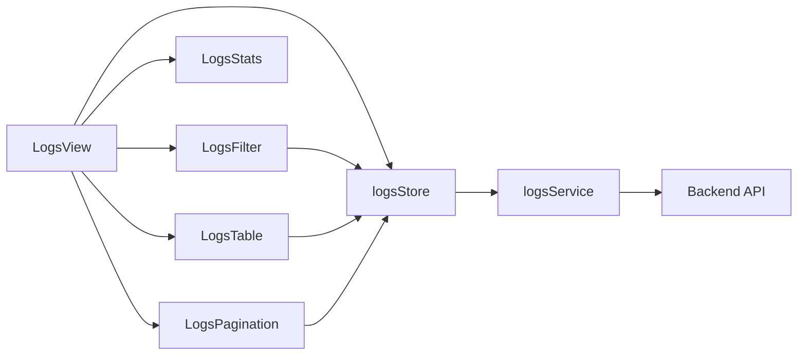
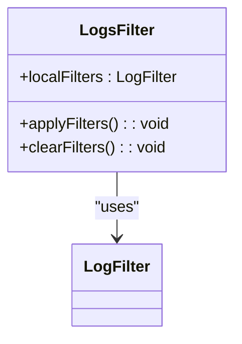
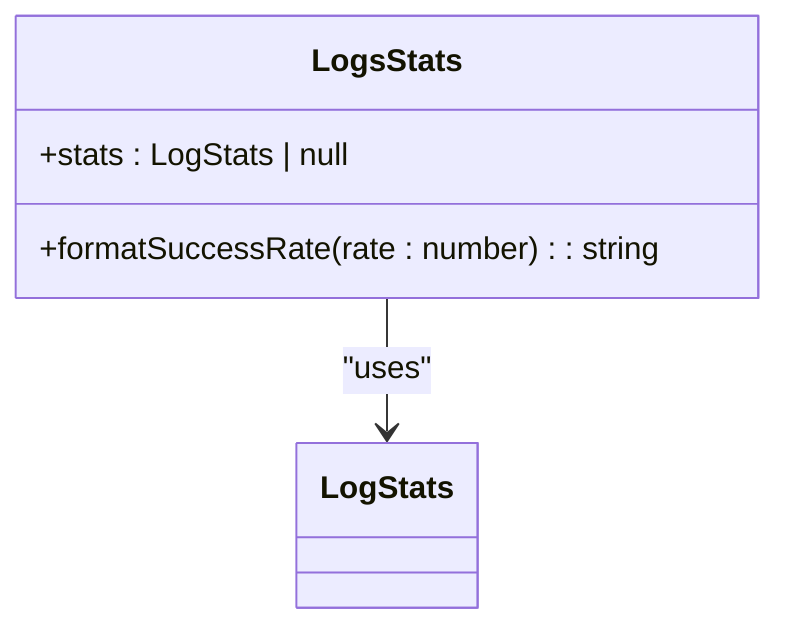
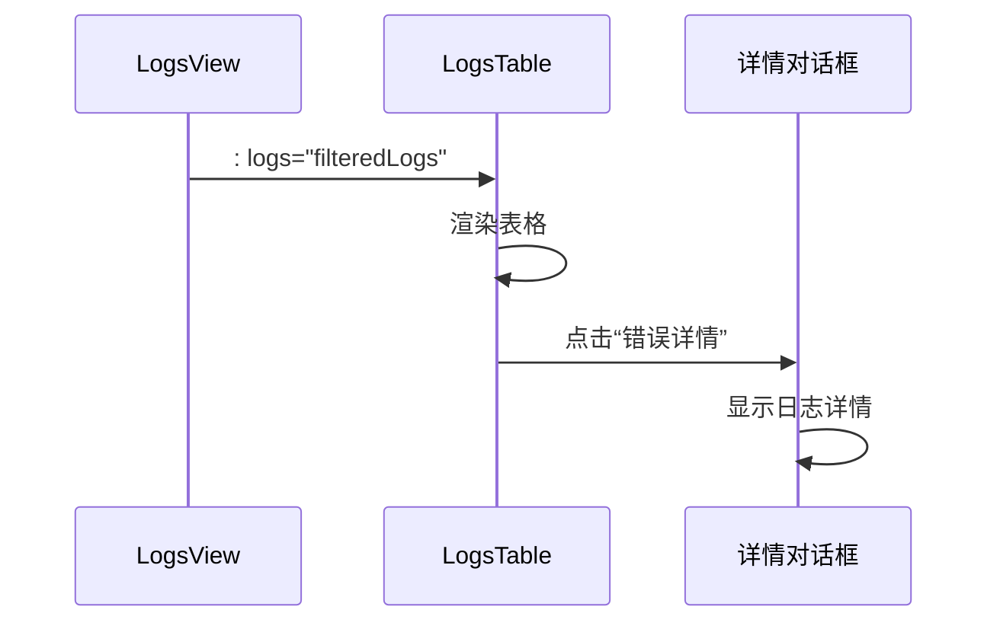
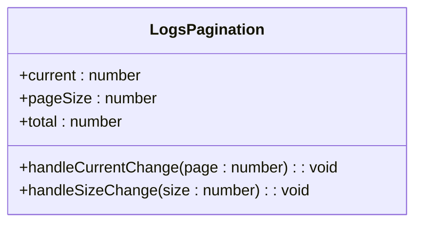
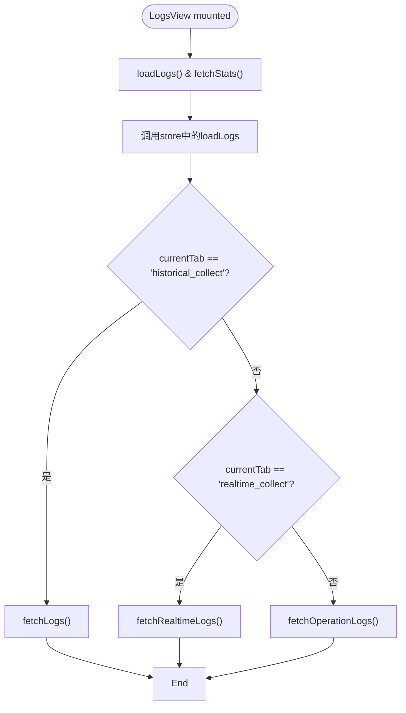
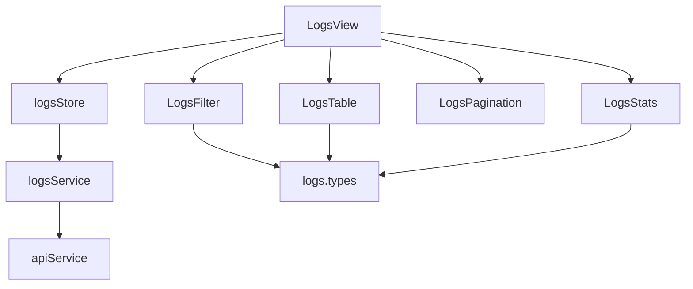

# 组件体系

<cite>
**本文档中引用的文件**  
- [LogsFilter.vue](file://admin/src/components/logs/LogsFilter.vue)
- [LogsPagination.vue](file://admin/src/components/logs/LogsPagination.vue)
- [LogsStats.vue](file://admin/src/components/logs/LogsStats.vue)
- [LogsTable.vue](file://admin/src/components/logs/LogsTable.vue)
- [LogsTable.test.ts](file://admin/src/components/logs/LogsTable.test.ts)
- [DashboardView.vue](file://admin/src/views/DashboardView.vue)
- [LogsView.vue](file://admin/src/views/LogsView.vue)
- [logs.service.ts](file://admin/src/services/logs.service.ts)
- [logs.ts](file://admin/src/stores/logs.ts)
- [logs.types.ts](file://admin/src/types/logs.types.ts)
</cite>

## 目录
1. [引言](#引言)
2. [项目结构](#项目结构)
3. [核心组件](#核心组件)
4. [架构概览](#架构概览)
5. [详细组件分析](#详细组件分析)
6. [依赖分析](#依赖分析)
7. [性能考量](#性能考量)
8. [故障排除指南](#故障排除指南)
9. [结论](#结论)

## 引言
本文档深入解析基于Vue 3的组件化架构设计，重点分析`logs`目录下的日志相关组件（LogsFilter、LogsPagination、LogsStats、LogsTable）的职责划分与复用机制。说明各组件如何通过props、events和slots实现解耦通信，并结合DashboardView和LogsView等视图组件展示组件组合模式。提供Composition API的使用范例，包括setup函数、ref、reactive等响应式API的实际应用。解释单元测试文件LogsTable.test.ts中的测试覆盖策略。阐述Element Plus组件库的集成方式及其在UI一致性保障中的作用。指出组件设计中的可优化点，如懒加载、虚拟滚动等性能提升方案。

## 项目结构

**图示来源**  
- [LogsFilter.vue](file://admin/src/components/logs/LogsFilter.vue)
- [LogsPagination.vue](file://admin/src/components/logs/LogsPagination.vue)
- [LogsStats.vue](file://admin/src/components/logs/LogsStats.vue)
- [LogsTable.vue](file://admin/src/components/logs/LogsTable.vue)
- [DashboardView.vue](file://admin/src/views/DashboardView.vue)
- [LogsView.vue](file://admin/src/views/LogsView.vue)
- [logs.service.ts](file://admin/src/services/logs.service.ts)
- [logs.ts](file://admin/src/stores/logs.ts)
- [logs.types.ts](file://admin/src/types/logs.types.ts)

**本节来源**  
- [LogsFilter.vue](file://admin/src/components/logs/LogsFilter.vue)
- [LogsPagination.vue](file://admin/src/components/logs/LogsPagination.vue)
- [LogsStats.vue](file://admin/src/components/logs/LogsStats.vue)
- [LogsTable.vue](file://admin/src/components/logs/LogsTable.vue)
- [DashboardView.vue](file://admin/src/views/DashboardView.vue)
- [LogsView.vue](file://admin/src/views/LogsView.vue)

## 核心组件

日志功能模块由多个高内聚、低耦合的组件构成，包括`LogsFilter`（筛选器）、`LogsStats`（统计信息）、`LogsTable`（表格展示）和`LogsPagination`（分页器）。这些组件通过清晰的props和events接口进行通信，实现了良好的复用性和可维护性。视图组件`LogsView`负责组合这些基础组件，形成完整的日志管理界面。

**本节来源**  
- [LogsFilter.vue](file://admin/src/components/logs/LogsFilter.vue#L1-L168)
- [LogsPagination.vue](file://admin/src/components/logs/LogsPagination.vue#L1-L47)
- [LogsStats.vue](file://admin/src/components/logs/LogsStats.vue#L1-L164)
- [LogsTable.vue](file://admin/src/components/logs/LogsTable.vue#L1-L390)

## 架构概览

系统采用典型的分层架构，由视图层、状态管理层、服务层和类型定义层组成。`LogsView`作为视图入口，通过Pinia store（`logs.ts`）与`logs.service.ts`进行数据交互。服务层封装了与后端API的通信逻辑，而`logs.types.ts`则统一了前后端的数据契约。组件间通过props向下传递数据，通过自定义事件向上通信，形成了清晰的单向数据流。

**图示来源**  
- [LogsView.vue](file://admin/src/views/LogsView.vue#L1-L168)
- [logs.ts](file://admin/src/stores/logs.ts#L1-L242)
- [logs.service.ts](file://admin/src/services/logs.service.ts#L1-L104)

## 详细组件分析

### LogsFilter 组件分析

`LogsFilter`组件封装了日志筛选的UI和逻辑，接收外部传入的`filters`对象，并通过`update-filters`事件将更新后的筛选条件通知给父组件。组件内部使用`reactive`创建本地响应式数据`localFilters`，并通过`watch`监听props的变化以保持同步。这体现了Composition API在状态管理上的灵活性。

**图示来源**  
- [LogsFilter.vue](file://admin/src/components/logs/LogsFilter.vue#L1-L168)
- [logs.types.ts](file://admin/src/types/logs.types.ts#L1-L77)

### LogsStats 组件分析

`LogsStats`组件用于展示日志的统计信息，如总日志数、成功日志数、错误日志数和成功率。它接收一个`stats` prop，该prop为`LogStats`类型，包含所有必要的统计字段。组件内部通过`formatSuccessRate`方法对成功率进行格式化处理，体现了展示逻辑与数据的分离。

**图示来源**  
- [LogsStats.vue](file://admin/src/components/logs/LogsStats.vue#L1-L164)
- [logs.types.ts](file://admin/src/types/logs.types.ts#L1-L77)

### LogsTable 组件分析

`LogsTable`是日志模块的核心展示组件，负责渲染不同类型的日志数据。它通过`logType` prop动态决定渲染哪一组表格列，支持`historical_collect`、`realtime_collect`和`operation`三种日志类型。组件使用类型守卫函数（`isLogEntry`, `isOperationLogEntry`, `isCollectLogEntry`）来安全地访问不同类型日志的属性，并通过`showDetails`方法弹出详情对话框，实现了良好的用户体验。

**图示来源**  
- [LogsTable.vue](file://admin/src/components/logs/LogsTable.vue#L1-L390)
- [LogsView.vue](file://admin/src/views/LogsView.vue#L1-L168)

### LogsPagination 组件分析

`LogsPagination`组件封装了分页逻辑，提供页码和每页条数的控制。它通过`v-model`双向绑定`current`和`pageSize`，并通过`change`事件通知父组件分页参数已更改。这种设计使得分页状态可以由父组件统一管理，同时保持了子组件的独立性。

**图示来源**  
- [LogsPagination.vue](file://admin/src/components/logs/LogsPagination.vue#L1-L47)

### LogsView 视图组件分析

`LogsView`是日志功能的主视图，它集成了`LogsStats`、`LogsFilter`、`LogsTable`和`LogsPagination`四个子组件，并通过`el-tabs`实现了多标签页的日志管理。视图组件不直接管理复杂状态，而是通过`storeToRefs`从Pinia store中解构出所需的状态和方法，实现了状态的集中管理和视图的简洁性。

**图示来源**  
- [LogsView.vue](file://admin/src/views/LogsView.vue#L1-L168)
- [logs.ts](file://admin/src/stores/logs.ts#L1-L242)

**本节来源**  
- [LogsFilter.vue](file://admin/src/components/logs/LogsFilter.vue#L1-L168)
- [LogsPagination.vue](file://admin/src/components/logs/LogsPagination.vue#L1-L47)
- [LogsStats.vue](file://admin/src/components/logs/LogsStats.vue#L1-L164)
- [LogsTable.vue](file://admin/src/components/logs/LogsTable.vue#L1-L390)
- [LogsView.vue](file://admin/src/views/LogsView.vue#L1-L168)

## 依赖分析

**图示来源**  
- [LogsView.vue](file://admin/src/views/LogsView.vue#L1-L168)
- [logs.ts](file://admin/src/stores/logs.ts#L1-L242)
- [logs.service.ts](file://admin/src/services/logs.service.ts#L1-L104)
- [logs.types.ts](file://admin/src/types/logs.types.ts#L1-L77)

**本节来源**  
- [LogsView.vue](file://admin/src/views/LogsView.vue#L1-L168)
- [logs.ts](file://admin/src/stores/logs.ts#L1-L242)
- [logs.service.ts](file://admin/src/services/logs.service.ts#L1-L104)
- [logs.types.ts](file://admin/src/types/logs.types.ts#L1-L77)

## 性能考量

当前组件设计在数据量较大时可能存在性能瓶颈。`LogsTable`组件在渲染大量日志条目时可能导致页面卡顿。建议的优化方案包括：
1. **虚拟滚动**：对于长列表，采用虚拟滚动技术，只渲染可视区域内的行。
2. **懒加载**：在`LogsView`中，可以考虑在用户切换到某个标签页时才加载对应的数据，而不是在初始化时加载所有类型日志。
3. **防抖处理**：在`LogsFilter`的输入框中添加防抖逻辑，避免频繁触发筛选请求。
4. **分页优化**：确保后端API支持高效的分页查询，避免全表扫描。

## 故障排除指南

当遇到日志数据无法加载的问题时，应按以下步骤排查：
1. 检查浏览器控制台是否有网络错误或JavaScript异常。
2. 确认`logsStore`中的`error`状态是否被设置，并查看具体的错误信息。
3. 在`logs.service.ts`中检查API端点是否正确。
4. 验证后端服务是否正常运行，并能响应日志查询请求。
5. 检查`LogsTable.test.ts`中的单元测试是否通过，以确认组件本身逻辑无误。

**本节来源**  
- [LogsView.vue](file://admin/src/views/LogsView.vue#L1-L168)
- [logs.ts](file://admin/src/stores/logs.ts#L1-L242)
- [logs.service.ts](file://admin/src/services/logs.service.ts#L1-L104)
- [LogsTable.test.ts](file://admin/src/components/logs/LogsTable.test.ts#L1-L128)

## 结论

本文档详细分析了基于Vue 3的组件化日志系统。该系统通过清晰的职责划分和Composition API的合理运用，构建了一个可复用、易维护的组件体系。`LogsView`作为容器组件，有效地协调了`LogsFilter`、`LogsStats`、`LogsTable`和`LogsPagination`等展示组件，并通过Pinia store实现了状态的集中管理。尽管当前设计已较为完善，但仍可通过引入虚拟滚动、懒加载等技术进一步提升性能，为用户提供更流畅的操作体验。