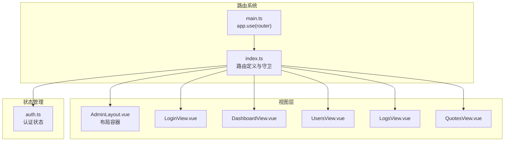
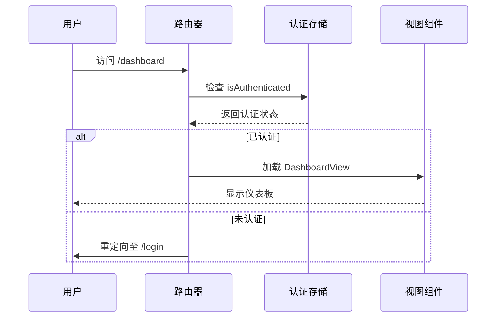
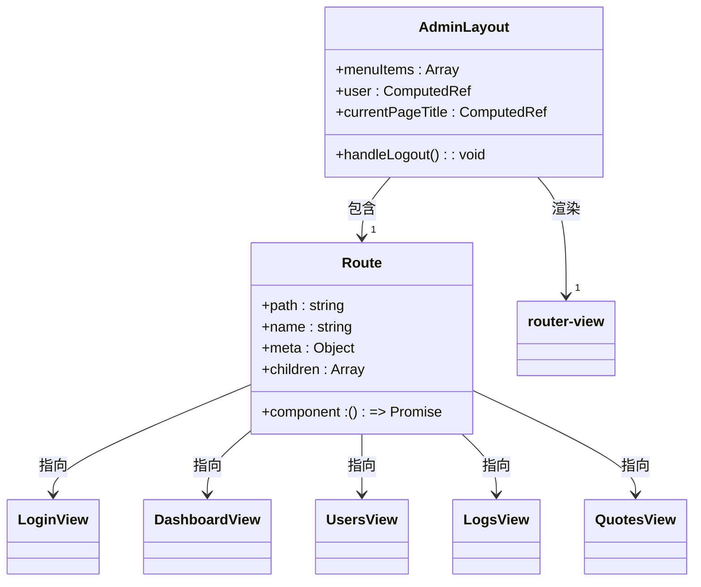
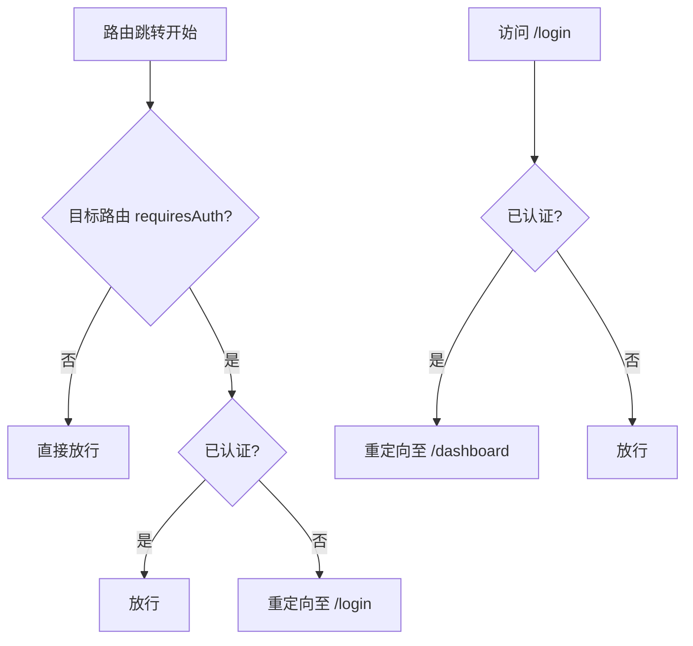
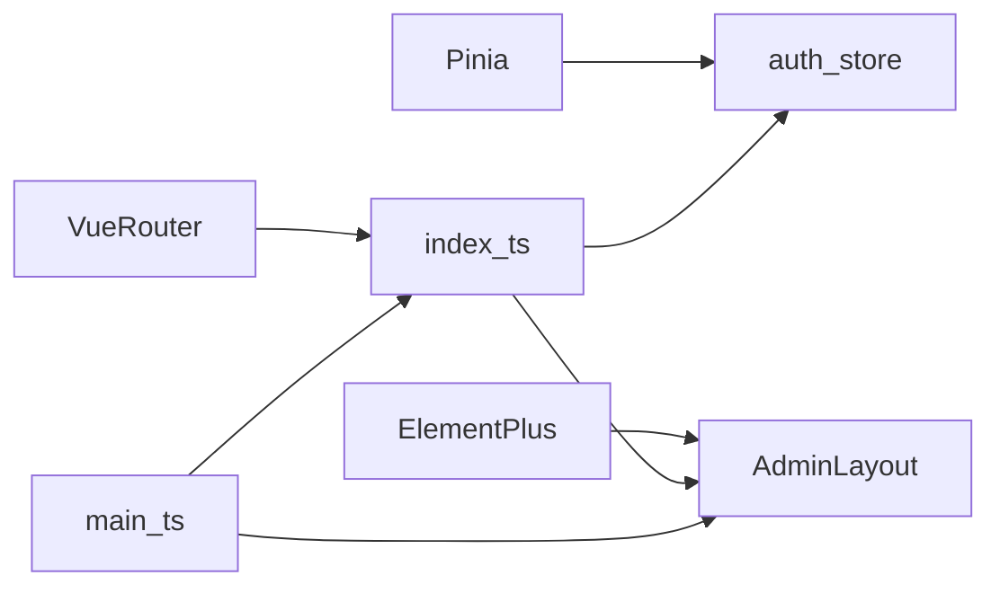

# 路由配置

<cite>
**本文档中引用的文件**  
- [index.ts](file://admin/src/router/index.ts)
- [main.ts](file://admin/src/main.ts)
- [AdminLayout.vue](file://admin/src/views/AdminLayout.vue)
- [auth.ts](file://admin/src/stores/auth.ts)
</cite>

## 目录
1. [简介](#简介)
2. [项目结构](#项目结构)
3. [核心组件](#核心组件)
4. [架构概览](#架构概览)
5. [详细组件分析](#详细组件分析)
6. [依赖分析](#依赖分析)
7. [性能考虑](#性能考虑)
8. [故障排除指南](#故障排除指南)
9. [结论](#结论)

## 简介
本文档全面解析股票分析软件管理后台的Vue Router路由配置机制，重点阐述路由守卫、动态路由、嵌套路由、路由懒加载及权限控制的实现方式。结合`index.ts`和`main.ts`文件，说明路由实例的初始化与挂载流程，并提供生产环境下的最佳实践建议。

## 项目结构
管理后台采用标准Vue 3 + TypeScript + Vite架构，路由配置集中于`src/router/index.ts`，视图组件存放于`src/views`目录，状态管理使用Pinia，存放于`src/stores`。路由通过`main.ts`挂载至应用实例。



**Diagram sources**
- [index.ts](file://admin/src/router/index.ts#L1-L102)
- [main.ts](file://admin/src/main.ts#L1-L22)
- [AdminLayout.vue](file://admin/src/views/AdminLayout.vue#L1-L556)

**Section sources**
- [index.ts](file://admin/src/router/index.ts#L1-L102)
- [main.ts](file://admin/src/main.ts#L1-L22)

## 核心组件
核心路由组件包括：`index.ts`定义路由规则与守卫，`main.ts`负责挂载，`AdminLayout.vue`作为嵌套路由的布局容器，`auth.ts`提供认证状态支持。路由采用懒加载提升首屏性能，并通过Pinia状态实现权限控制。

**Section sources**
- [index.ts](file://admin/src/router/index.ts#L1-L102)
- [AdminLayout.vue](file://admin/src/views/AdminLayout.vue#L1-L556)
- [auth.ts](file://admin/src/stores/auth.ts#L1-L118)

## 架构概览
系统采用基于角色的访问控制（RBAC）模型，通过Vue Router的路由元信息（meta）和全局前置守卫实现权限拦截。未认证用户访问受保护路由时重定向至登录页，已认证用户访问登录页则跳转至仪表板。



**Diagram sources**
- [index.ts](file://admin/src/router/index.ts#L79-L102)
- [auth.ts](file://admin/src/stores/auth.ts#L1-L118)

## 详细组件分析

### 路由配置分析
`index.ts`文件定义了登录页和主布局两大路由。主布局路由包含多个子路由（如仪表板、用户管理、日志等），实现嵌套路由结构。所有子组件均采用`import()`语法进行懒加载，优化加载性能。

#### 路由结构与嵌套关系


**Diagram sources**
- [index.ts](file://admin/src/router/index.ts#L1-L78)
- [AdminLayout.vue](file://admin/src/views/AdminLayout.vue#L1-L556)

#### 路由守卫执行流程


**Diagram sources**
- [index.ts](file://admin/src/router/index.ts#L79-L102)

**Section sources**
- [index.ts](file://admin/src/router/index.ts#L79-L102)
- [auth.ts](file://admin/src/stores/auth.ts#L1-L118)

### 路由挂载流程
`main.ts`中通过`app.use(router)`将路由实例注册到Vue应用，完成路由系统的初始化与挂载。

```mermaid
flowchart LR
A[createApp(App)] --> B[use(createPinia())]
B --> C[use(router)]
C --> D[use(ElementPlus)]
D --> E[app.mount('#app')]
```

**Diagram sources**
- [main.ts](file://admin/src/main.ts#L1-L22)

**Section sources**
- [main.ts](file://admin/src/main.ts#L1-L22)

## 依赖分析
路由系统依赖于Pinia状态管理（`auth.ts`）进行认证状态判断，依赖Element Plus组件库进行UI展示，依赖Vue Router核心库实现路由功能。各视图组件通过`router-view`与路由系统解耦。



**Diagram sources**
- [index.ts](file://admin/src/router/index.ts#L1-L102)
- [auth.ts](file://admin/src/stores/auth.ts#L1-L118)
- [main.ts](file://admin/src/main.ts#L1-L22)

**Section sources**
- [index.ts](file://admin/src/router/index.ts#L1-L102)
- [auth.ts](file://admin/src/stores/auth.ts#L1-L118)

## 性能考虑
路由采用动态导入（`import()`）实现组件懒加载，确保初始包体积最小化，提升首屏加载速度。结合Vite的按需编译，进一步优化开发与生产环境的构建性能。

## 故障排除指南
- **404问题**：检查路由路径拼写，确保`path`与`router-link`或`router.push`一致；确认嵌套路由的`children`配置正确。
- **参数传递失败**：使用`useRoute()`获取路由参数，检查`params`或`query`属性。
- **守卫不生效**：确认`router.beforeEach`已正确定义并导出；检查`next()`调用是否遗漏。
- **权限控制失效**：确保`authStore.isInitialized`已完成初始化；检查`localStorage`中的认证信息是否有效。

**Section sources**
- [index.ts](file://admin/src/router/index.ts#L79-L102)
- [auth.ts](file://admin/src/stores/auth.ts#L1-L118)

## 结论
本系统通过Vue Router实现了结构清晰、权限可控的路由系统。嵌套路由与布局组件分离，提升代码可维护性；路由守卫结合Pinia状态实现细粒度权限控制；懒加载优化性能。建议在生产环境中结合HTTP缓存与CDN进一步提升加载速度。