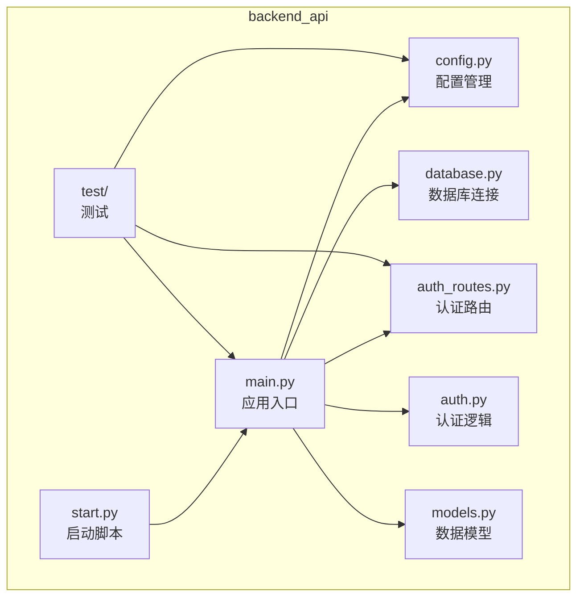
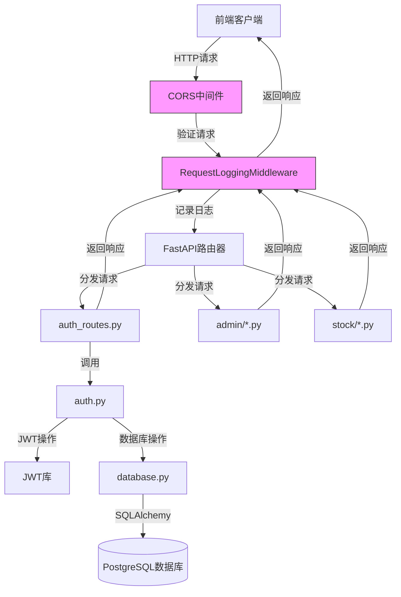
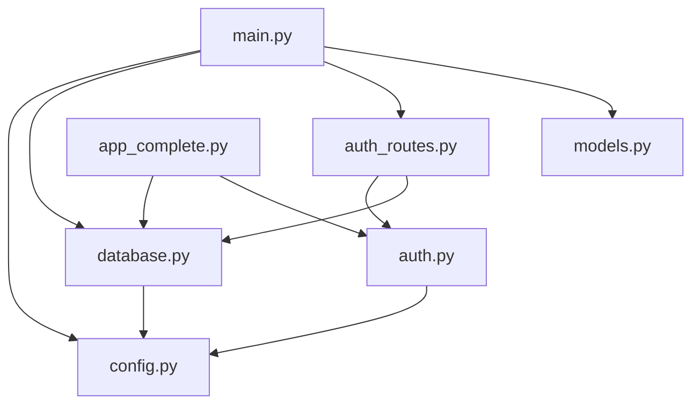

# API基础设施

<cite>
**本文档中引用的文件**  
- [main.py](file://backend_api/main.py)
- [config.py](file://backend_api/config.py)
- [auth_routes.py](file://backend_api/auth_routes.py)
- [test_cors_fix.py](file://backend_api/test/test_cors_fix.py)
</cite>

## 目录
1. [简介](#简介)
2. [项目结构](#项目结构)
3. [核心组件](#核心组件)
4. [架构概述](#架构概述)
5. [详细组件分析](#详细组件分析)
6. [依赖分析](#依赖分析)
7. [性能考虑](#性能考虑)
8. [故障排除指南](#故障排除指南)
9. [结论](#结论)

## 简介
本文档旨在全面阐述股票分析系统后端API的基础设施架构，重点聚焦于FastAPI应用的核心配置与横切关注点。文档详细解析了`main.py`中FastAPI应用实例的初始化流程，包括中间件注册、异常处理配置和生命周期事件管理。同时，深入分析了`config.py`中的多环境配置方案、CORS策略的实现与验证、全局错误处理机制以及日志记录配置。最后，提供了一份部署前的配置检查清单和常见问题解决方案。

## 项目结构
后端API项目（`backend_api`）采用模块化设计，核心文件位于项目根目录，各功能模块以独立的Python包（如`admin`、`stock`）组织。配置、数据库、认证和路由等基础设施组件清晰分离，便于维护和扩展。



**图示来源**
- [main.py](file://backend_api/main.py)
- [config.py](file://backend_api/config.py)
- [auth_routes.py](file://backend_api/auth_routes.py)

**本节来源**
- [main.py](file://backend_api/main.py)
- [config.py](file://backend_api/config.py)

## 核心组件
本系统的核心基础设施组件包括：
1.  **FastAPI应用实例 (`app`)**: 位于`main.py`，是整个API服务的中心枢纽。
2.  **配置管理 (`config.py`)**: 集中管理数据库、JWT和CORS等关键配置。
3.  **认证系统 (`auth.py` 和 `auth_routes.py`)**: 提供用户认证、JWT令牌生成与验证功能。
4.  **中间件 (`RequestLoggingMiddleware`)**: 实现全局请求日志记录。
5.  **跨域资源共享 (CORS)**: 配置允许的前端源，确保安全的跨域通信。

**本节来源**
- [main.py](file://backend_api/main.py)
- [config.py](file://backend_api/config.py)
- [auth_routes.py](file://backend_api/auth_routes.py)

## 架构概述
系统采用典型的FastAPI分层架构。`main.py`作为应用入口，负责初始化应用实例、加载配置、注册中间件和挂载所有路由。`config.py`提供统一的配置源。业务逻辑通过多个`APIRouter`实例分散在不同的模块中（如`admin`、`stock`），并在`main.py`中被集中注册。数据库操作通过`database.py`提供的会话工厂进行。认证和授权逻辑由`auth.py`和`auth_routes.py`处理。



**图示来源**
- [main.py](file://backend_api/main.py#L1-L128)
- [auth_routes.py](file://backend_api/auth_routes.py#L1-L331)
- [database.py](file://backend_api/database.py#L1-L71)

## 详细组件分析

### FastAPI应用初始化分析
`main.py`文件是应用的启动点，其核心任务是创建和配置`FastAPI`应用实例。

#### 应用实例创建与配置
应用实例通过`FastAPI`类创建，并传入标题、描述和版本等元数据。这些信息会自动展示在自动生成的API文档（Swagger UI）中。

```python
app = FastAPI(
    title="股票分析系统API",
    description="股票分析系统的后端API服务",
    version="1.0.0"
)
```

**本节来源**
- [main.py](file://backend_api/main.py#L65-L71)

#### 中间件注册
系统注册了两个关键中间件：
1.  **请求日志中间件 (`RequestLoggingMiddleware`)**: 该中间件位于`auth_routes.py`，它继承自`BaseHTTPMiddleware`。它在每个请求处理前后执行，记录请求方法、URL、客户端IP、状态码、处理时间和请求体（对密码进行脱敏）等详细信息，为调试和监控提供了重要依据。
2.  **CORS中间件**: 通过`CORSMiddleware`类注册，用于处理浏览器的跨域请求。其配置在`main.py`中硬编码指定，允许来自多个开发和生产环境前端的请求。

**本节来源**
- [main.py](file://backend_api/main.py#L74-L75)
- [main.py](file://backend_api/main.py#L84-L98)
- [auth_routes.py](file://backend_api/auth_routes.py#L100-L130)

#### 路由注册
系统通过`include_router`方法将定义在不同模块中的路由集合（`APIRouter`实例）挂载到主应用上。这种方式实现了功能的模块化和解耦。

```python
app.include_router(auth_router)  # 认证路由
app.include_router(admin_router) # 管理后台路由
# ... 其他路由
```

**本节来源**
- [main.py](file://backend_api/main.py#L107-L124)

#### 生命周期事件
`@app.on_event("startup")`装饰器定义了应用启动时执行的`startup_event`函数。目前该函数主要用于记录日志，提示数据库初始化开始，但实际的`init_db()`函数调用被注释掉了。

```python
@app.on_event("startup")
async def startup_event():
    """应用启动时执行"""
    try:
        logger.info("正在初始化数据库...")
        #init_db()
        logger.info("数据库初始化完成")
    except Exception as e:
        logger.error(f"数据库初始化失败: {str(e)}")
        raise
```

**本节来源**
- [main.py](file://backend_api/main.py#L126-L134)

### 配置管理分析
`config.py`文件是系统配置的中心，它使用Python字典来组织不同模块的配置。

#### 多环境配置与敏感信息处理
当前的配置方案存在明显缺陷。所有配置（包括数据库URL和JWT密钥）都直接硬编码在`config.py`文件中。这不符合多环境（开发、测试、生产）分离的最佳实践，也存在严重的安全风险，因为敏感信息（如数据库密码）会暴露在代码仓库中。

正确的做法是使用环境变量（`.env`文件）来管理配置。例如，应使用`python-dotenv`库加载`.env`文件，并从环境变量中读取配置值。

```python
# config.py (改进方案)
from dotenv import load_dotenv
import os

load_dotenv()  # 加载 .env 文件

DATABASE_CONFIG = {
    "url": os.getenv("DATABASE_URL"),
    "pool_size": int(os.getenv("DB_POOL_SIZE", 5)),
    "max_overflow": int(os.getenv("DB_MAX_OVERFLOW", 10)),
    "echo": os.getenv("DB_ECHO", "False").lower() == "true"
}

JWT_CONFIG = {
    "secret_key": os.getenv("JWT_SECRET_KEY"), # 从环境变量读取
    "algorithm": "HS256",
    "access_token_expire_minutes": 1440
}
```

**本节来源**
- [config.py](file://backend_api/config.py#L1-L48)

### CORS策略分析
CORS（跨域资源共享）策略在`main.py`中通过`CORSMiddleware`进行配置。

#### 实现与安全性
当前的CORS配置允许了多个特定的前端源（如`http://localhost:3000`, `https://www.icemaplecity.com`），这比允许所有源（`allow_origins=["*"]`）更安全。它还允许凭据（cookies）、所有HTTP方法和所有请求头，并设置了较长的预检请求缓存时间（3600秒）。

```python
app.add_middleware(
    CORSMiddleware,
    allow_origins=origins,
    allow_credentials=True,
    allow_methods=["*"],
    allow_headers=["*"],
    expose_headers=["*"],
    max_age=3600,
)
```

尽管配置了具体源，但仍允许所有方法和头，这在生产环境中可能过于宽松。建议根据实际需求，将`allow_methods`和`allow_headers`限制为必需的最小集合。

**本节来源**
- [main.py](file://backend_api/main.py#L84-L98)

#### 配置验证
`test_cors_fix.py`文件中的测试用例验证了CORS配置的正确性。它通过`requests`库模拟了浏览器的预检请求（OPTIONS）和实际登录请求（POST），并检查响应头中是否包含正确的CORS头（如`Access-Control-Allow-Origin`和`Access-Control-Allow-Credentials`），从而确保前端能够成功进行跨域通信。

```python
def test_cors_preflight():
    """测试CORS预检请求"""
    response = requests.options('http://localhost:5000/api/auth/login', 
                              headers={
                                  'Origin': 'http://localhost:8000',
                                  'Access-Control-Request-Method': 'POST',
                                  'Access-Control-Request-Headers': 'Content-Type'
                              })
    # 检查响应头
    cors_origin = response.headers.get('Access-Control-Allow-Origin')
    # ...
```

**本节来源**
- [main.py](file://backend_api/main.py#L84-L98)
- [test_cors_fix.py](file://backend_api/test/test_cors_fix.py#L1-L119)

### 全局错误处理与日志记录
系统通过中间件和异常处理器实现了全局的错误处理和日志记录。

#### 全局错误处理
虽然`main.py`中没有显式定义全局异常处理器，但`auth_routes.py`中的`RequestLoggingMiddleware`起到了类似的作用。当请求处理过程中发生未捕获的异常时，该中间件会捕获异常，记录详细的错误日志（包括堆栈跟踪），然后将异常重新抛出。FastAPI框架会将这些异常转换为适当的HTTP错误响应（如500 Internal Server Error）。

#### 日志记录格式与级别
系统在`main.py`和`auth_routes.py`中都配置了日志记录器。日志格式非常详细，包含了时间戳、日志器名称、日志级别、文件名、行号和日志消息。日志级别设置为`INFO`，并同时输出到文件（`app.log`, `auth.log`）和控制台。

```python
logging.basicConfig(
    level=logging.INFO,
    format='%(asctime)s - %(name)s - %(levelname)s - [%(filename)s:%(lineno)d] - %(message)s',
    handlers=[
        logging.FileHandler('app.log', encoding='utf-8', mode='a'),
        logging.StreamHandler()
    ]
)
```

**本节来源**
- [main.py](file://backend_api/main.py#L15-L24)
- [auth_routes.py](file://backend_api/auth_routes.py#L15-L24)

## 依赖分析
系统依赖关系清晰。`main.py`是核心，直接依赖`config.py`（获取配置）、`database.py`（数据库连接）、`auth_routes.py`（认证路由）和`models.py`（数据模型）。`auth_routes.py`又依赖`auth.py`（认证逻辑）和`database.py`。`config.py`是所有配置的源头，被多个组件引用。



**图示来源**
- [main.py](file://backend_api/main.py)
- [config.py](file://backend_api/config.py)
- [database.py](file://backend_api/database.py)
- [auth_routes.py](file://backend_api/auth_routes.py)

**本节来源**
- [main.py](file://backend_api/main.py)
- [config.py](file://backend_api/config.py)
- [database.py](file://backend_api/database.py)
- [auth_routes.py](file://backend_api/auth_routes.py)

## 性能考虑
1.  **数据库连接池**: `database.py`中通过`pool_size`和`max_overflow`参数配置了SQLAlchemy的连接池，避免了频繁创建和销毁数据库连接的开销。
2.  **日志I/O**: 日志同时写入文件和控制台，高并发下可能成为性能瓶颈。建议在生产环境中评估是否需要同时写入文件，或使用异步日志记录。
3.  **CORS缓存**: `max_age=3600`的设置可以有效缓存预检请求的结果，减少浏览器对同一资源的重复预检，提升性能。

## 故障排除指南

### 配置检查清单
在部署应用前，请务必检查以下配置：
- [ ] **数据库URL**: 确认`config.py`中的`DATABASE_CONFIG["url"]`指向正确的生产数据库。
- [ ] **JWT密钥**: 确认`config.py`中的`JWT_CONFIG["secret_key"]`是一个长且随机的密钥，并已从代码中移除，改用环境变量。
- [ ] **CORS源**: 确认`main.py`中的`origins`列表包含了生产环境前端的正确域名。
- [ ] **日志路径**: 确保应用有权限在运行目录下创建`app.log`和`auth.log`文件。
- [ ] **环境变量**: 如果已改为使用`.env`文件，确保该文件已部署到服务器且权限设置正确。

### 常见配置错误及解决方案
1.  **问题**: 前端无法登录，浏览器报CORS错误。
    *   **原因**: `main.py`中的`allow_origins`列表未包含前端应用的域名或端口。
    *   **解决方案**: 检查前端应用的完整URL（包括协议、域名、端口），并将其添加到`origins`列表中。

2.  **问题**: 应用启动时报数据库连接失败。
    *   **原因**: `config.py`中的数据库URL配置错误，或数据库服务未运行。
    *   **解决方案**: 检查数据库URL的主机、端口、数据库名、用户名和密码是否正确；确认数据库服务已启动并可从应用服务器访问。

3.  **问题**: 用户登录成功，但后续请求返回401 Unauthorized。
    *   **原因**: JWT密钥不匹配。可能是`config.py`中的`SECRET_KEY`与生成令牌时使用的密钥不一致。
    *   **解决方案**: 确保所有服务实例使用相同的JWT密钥。强烈建议使用环境变量来管理此密钥。

4.  **问题**: 日志文件未生成或没有写入权限。
    *   **原因**: 应用进程没有对日志文件所在目录的写入权限。
    *   **解决方案**: 确保应用运行的用户对日志文件目录有写权限，或修改日志文件的路径到一个有权限的目录。

**本节来源**
- [config.py](file://backend_api/config.py)
- [main.py](file://backend_api/main.py)
- [auth_routes.py](file://backend_api/auth_routes.py)

## 结论
本文档详细分析了股票分析系统API的基础设施。`main.py`成功地将FastAPI应用的初始化、中间件、路由和生命周期事件组织起来。然而，`config.py`中的配置管理方式存在安全隐患和缺乏灵活性，亟需通过环境变量进行重构。CORS策略已配置，但可通过限制允许的方法和头来进一步增强安全性。全局日志记录提供了良好的可观测性。通过遵循本文档提供的检查清单和解决方案，可以有效保障应用的稳定和安全运行。