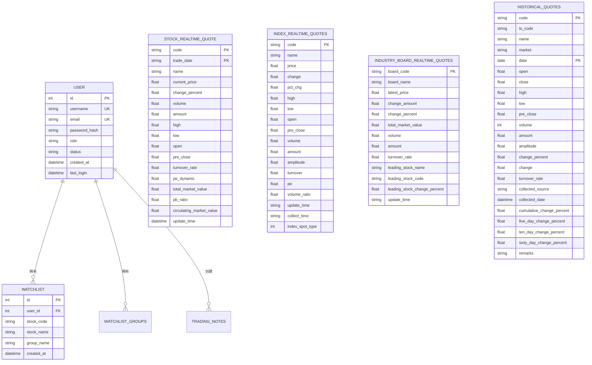

# 后端API架构

<cite>
**本文档中引用的文件**  
- [main.py](file://backend_api/main.py)
- [auth_routes.py](file://backend_api/auth_routes.py)
- [auth.py](file://backend_api/auth.py)
- [models.py](file://backend_api/models.py)
- [config.py](file://backend_api/config.py)
- [stock_analysis_routes.py](file://backend_api/stock/stock_analysis_routes.py)
- [stock_analysis.py](file://backend_api/stock/stock_analysis.py)
- [quotes_routes.py](file://backend_api/quotes_routes.py)
- [database.py](file://backend_api/database.py)
</cite>

## 目录
1. [简介](#简介)
2. [项目结构](#项目结构)
3. [核心组件](#核心组件)
4. [架构概览](#架构概览)
5. [详细组件分析](#详细组件分析)
6. [依赖分析](#依赖分析)
7. [性能考虑](#性能考虑)
8. [故障排除指南](#故障排除指南)
9. [结论](#结论)

## 简介
本文档旨在全面描述基于FastAPI构建的股票分析系统后端API层的架构设计。文档重点阐述了应用实例的初始化流程、JWT认证机制、数据模型与数据库的ORM映射、各业务模块的设计模式以及配置管理机制。同时，涵盖了API版本控制、错误处理、CORS配置和日志记录等横切关注点，并通过实际请求/响应示例说明API的使用方式。

## 项目结构


**Diagram sources**
- [main.py](file://backend_api/main.py#L1-L128)
- [config.py](file://backend_api/config.py#L1-L48)
- [models.py](file://backend_api/models.py#L1-L434)
- [auth_routes.py](file://backend_api/auth_routes.py#L1-L331)
- [stock_analysis_routes.py](file://backend_api/stock/stock_analysis_routes.py#L1-L270)
- [quotes_routes.py](file://backend_api/quotes_routes.py#L1-L581)

**Section sources**
- [main.py](file://backend_api/main.py#L1-L128)
- [config.py](file://backend_api/config.py#L1-L48)

## 核心组件

本文档的核心组件包括：
- **应用入口**：`main.py` 文件负责创建FastAPI应用实例、配置中间件和挂载所有路由。
- **认证系统**：`auth_routes.py` 和 `auth.py` 实现了基于JWT的用户认证流程，包括登录、登出、状态检查和令牌验证。
- **数据模型**：`models.py` 定义了所有数据库表的SQLAlchemy模型和用于API交互的Pydantic模型。
- **配置管理**：`config.py` 集中管理数据库、JWT、API和CORS等配置。
- **业务模块**：`stock` 目录下的各路由文件实现了股票分析、行情数据、资金流、新闻等核心业务功能。

**Section sources**
- [main.py](file://backend_api/main.py#L1-L128)
- [auth_routes.py](file://backend_api/auth_routes.py#L1-L331)
- [models.py](file://backend_api/models.py#L1-L434)
- [config.py](file://backend_api/config.py#L1-L48)
- [stock_analysis_routes.py](file://backend_api/stock/stock_analysis_routes.py#L1-L270)
- [quotes_routes.py](file://backend_api/quotes_routes.py#L1-L581)

## 架构概览

```mermaid
graph TD
Client[前端客户端] --> |HTTP请求| API[FastAPI应用]
API --> Middleware[中间件层]
Middleware --> CORS[CORS中间件]
Middleware --> Logging[请求日志中间件]
API --> Router[路由分发]
Router --> AuthRouter[认证路由 /api/auth]
Router --> StockRouter[股票分析路由 /api/analysis]
Router --> QuotesRouter[行情数据路由 /api/quotes]
Router --> AdminRouter[管理后台路由 /api/admin]
Router --> SystemRouter[系统路由 /api/system]
AuthRouter --> AuthService[认证服务]
AuthService --> AuthLogic[auth.py]
AuthService --> Token[JWT令牌生成/验证]
AuthService --> DB[(数据库)]
StockRouter --> AnalysisService[股票分析服务]
AnalysisService --> stock_analysis[stock_analysis.py]
AnalysisService --> DB
QuotesRouter --> QuotesService[行情数据服务]
QuotesService --> quotes_routes[quotes_routes.py]
QuotesService --> DB
DB < --> Models[models.py]
Models --> User[用户模型]
Models --> Stock[股票模型]
Models --> Watchlist[自选股模型]
Models --> Quotes[行情数据模型]
Config[config.py] --> API
Config --> DB
Config --> JWT
style Client fill:#f9f,stroke:#333
style API fill:#bbf,stroke:#333,color:#fff
style DB fill:#f96,stroke:#333,color:#fff
style Config fill:#9f9,stroke:#333
```

**Diagram sources**
- [main.py](file://backend_api/main.py#L1-L128)
- [auth_routes.py](file://backend_api/auth_routes.py#L1-L331)
- [auth.py](file://backend_api/auth.py#L1-L100)
- [models.py](file://backend_api/models.py#L1-L434)
- [config.py](file://backend_api/config.py#L1-L48)
- [stock_analysis_routes.py](file://backend_api/stock/stock_analysis_routes.py#L1-L270)
- [quotes_routes.py](file://backend_api/quotes_routes.py#L1-L581)

## 详细组件分析

### 应用初始化与路由挂载

`main.py` 是整个API服务的入口点，负责创建FastAPI应用实例并配置全局设置。


**Diagram sources**
- [main.py](file://backend_api/main.py#L1-L128)

**Section sources**
- [main.py](file://backend_api/main.py#L1-L128)

### JWT认证流程分析

`auth_routes.py` 实现了完整的JWT认证流程，包括用户登录、状态检查和登出功能。


**Diagram sources**
- [auth_routes.py](file://backend_api/auth_routes.py#L1-L331)
- [auth.py](file://backend_api/auth.py#L1-L100)
- [models.py](file://backend_api/models.py#L1-L434)

**Section sources**
- [auth_routes.py](file://backend_api/auth_routes.py#L1-L331)
- [auth.py](file://backend_api/auth.py#L1-L100)

### 数据模型与ORM映射

`models.py` 文件定义了系统中所有实体的数据模型，采用SQLAlchemy进行ORM映射。



**Diagram sources**
- [models.py](file://backend_api/models.py#L1-L434)

**Section sources**
- [models.py](file://backend_api/models.py#L1-L434)

### 股票分析模块设计

`stock` 目录下的API模块实现了股票智能分析功能，采用分层设计模式。


**Diagram sources**
- [stock_analysis_routes.py](file://backend_api/stock/stock_analysis_routes.py#L1-L270)
- [stock_analysis.py](file://backend_api/stock/stock_analysis.py#L1-L100)

**Section sources**
- [stock_analysis_routes.py](file://backend_api/stock/stock_analysis_routes.py#L1-L270)
- [stock_analysis.py](file://backend_api/stock/stock_analysis.py#L1-L100)

### 行情数据API设计

`quotes_routes.py` 提供了股票、指数和行业板块的实时行情数据查询服务。


**Diagram sources**
- [quotes_routes.py](file://backend_api/quotes_routes.py#L1-L581)
- [models.py](file://backend_api/models.py#L1-L434)

**Section sources**
- [quotes_routes.py](file://backend_api/quotes_routes.py#L1-L581)

### 配置管理机制

`config.py` 文件集中管理了系统的所有配置项，采用模块化设计。


**Diagram sources**
- [config.py](file://backend_api/config.py#L1-L48)

**Section sources**
- [config.py](file://backend_api/config.py#L1-L48)

## 依赖分析


**Diagram sources**
- [main.py](file://backend_api/main.py#L1-L128)
- [auth_routes.py](file://backend_api/auth_routes.py#L1-L331)
- [stock_analysis_routes.py](file://backend_api/stock/stock_analysis_routes.py#L1-L270)
- [quotes_routes.py](file://backend_api/quotes_routes.py#L1-L581)
- [config.py](file://backend_api/config.py#L1-L48)
- [models.py](file://backend_api/models.py#L1-L434)
- [database.py](file://backend_api/database.py#L1-L50)
- [auth.py](file://backend_api/auth.py#L1-L100)
- [stock_analysis.py](file://backend_api/stock/stock_analysis.py#L1-L100)

**Section sources**
- [main.py](file://backend_api/main.py#L1-L128)
- [auth_routes.py](file://backend_api/auth_routes.py#L1-L331)
- [stock_analysis_routes.py](file://backend_api/stock/stock_analysis_routes.py#L1-L270)
- [quotes_routes.py](file://backend_api/quotes_routes.py#L1-L581)

## 性能考虑

系统在设计时考虑了以下性能优化措施：
- **数据库连接池**：通过SQLAlchemy的连接池机制复用数据库连接，减少连接开销。
- **分页查询**：所有列表接口均支持分页，避免一次性返回大量数据。
- **索引优化**：关键查询字段（如股票代码、交易日期）已建立数据库索引。
- **缓存策略**：虽然当前代码未显式实现，但可通过Redis等缓存热点数据。
- **异步处理**：对于数据采集等耗时操作，建议采用Celery等异步任务队列。

## 故障排除指南

常见问题及解决方案：

| 问题现象 | 可能原因 | 解决方案 |
|--------|--------|--------|
| 500 Internal Server Error | 数据库连接失败 | 检查`config.py`中的数据库URL配置 |
| 401 Unauthorized | JWT令牌无效或过期 | 检查`JWT_CONFIG`中的密钥和过期时间 |
| CORS错误 | 跨域请求被拒绝 | 检查`CORS_CONFIG`中的`allow_origins`配置 |
| 行情数据为空 | 数据采集未完成 | 检查数据采集服务是否正常运行 |
| 登录缓慢 | 密码哈希计算耗时 | 考虑优化密码哈希算法或增加日志监控 |

**Section sources**
- [config.py](file://backend_api/config.py#L1-L48)
- [auth_routes.py](file://backend_api/auth_routes.py#L1-L331)
- [database.py](file://backend_api/database.py#L1-L50)

## 结论

本文档详细阐述了股票分析系统后端API的架构设计。系统采用FastAPI框架构建，具有良好的可扩展性和高性能。通过模块化的路由设计、清晰的分层架构和集中的配置管理，实现了高内聚低耦合的系统结构。JWT认证机制保障了系统的安全性，而丰富的业务API模块则满足了股票分析的核心需求。建议未来进一步完善API文档、增加单元测试覆盖率，并考虑引入API版本控制以支持系统的持续演进。