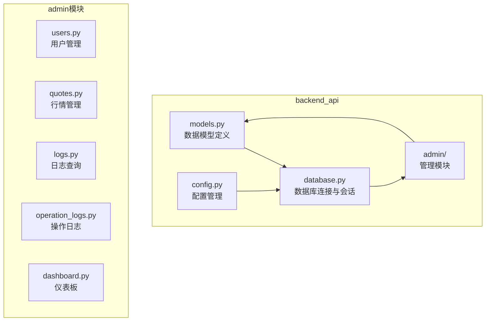
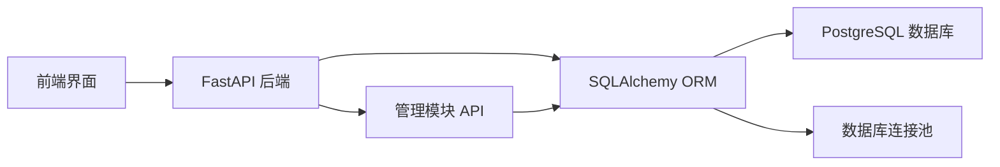
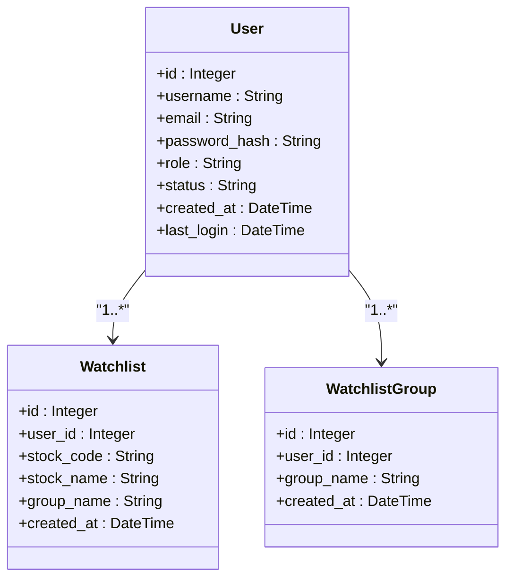
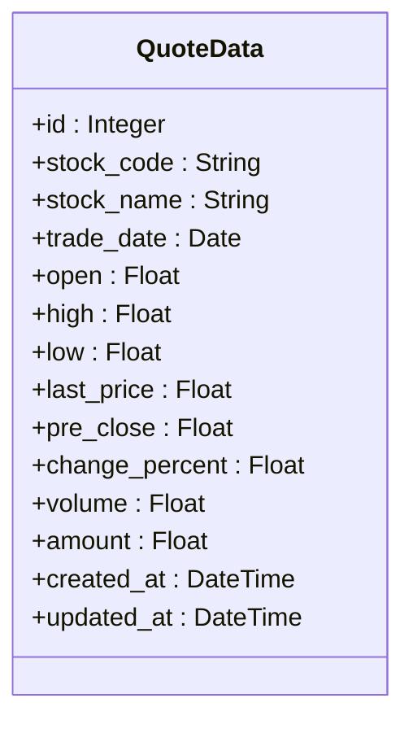
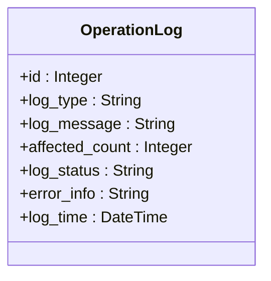
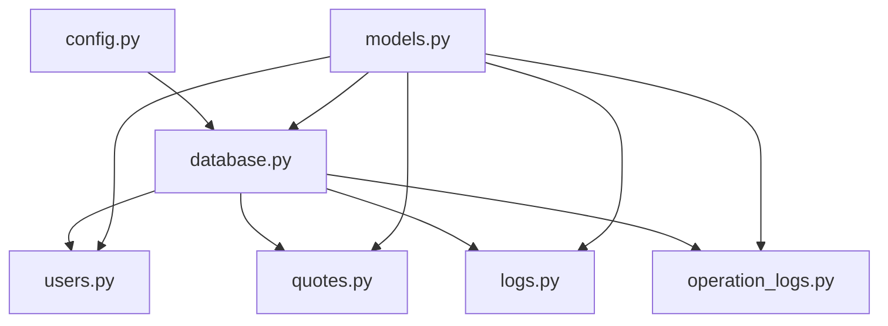

# 数据模型与ORM

<cite>
**本文档中引用的文件**   
- [models.py](file://backend_api/models.py)
- [database.py](file://backend_api/database.py)
- [config.py](file://backend_api/config.py)
- [users.py](file://backend_api/admin/users.py)
- [operation_logs.py](file://backend_api/admin/operation_logs.py)
- [logs.py](file://backend_api/admin/logs.py)
- [quotes.py](file://backend_api/admin/quotes.py)
</cite>

## 目录
1. [简介](#简介)
2. [项目结构](#项目结构)
3. [核心组件](#核心组件)
4. [架构概述](#架构概述)
5. [详细组件分析](#详细组件分析)
6. [依赖分析](#依赖分析)
7. [性能考虑](#性能考虑)
8. [故障排除指南](#故障排除指南)
9. [结论](#结论)

## 简介
本文档详细解析了股票分析系统中基于SQLAlchemy定义的数据库实体模型，涵盖数据模型定义、ORM映射关系、数据库连接配置、会话管理机制以及在管理模块中的实际应用。重点分析了用户、行情数据、自选股列表和操作日志等核心模型的字段定义、索引设置和关系映射，并阐述了数据库连接池配置和事务处理模式。

## 项目结构
项目后端API部分采用分层架构，核心数据模型定义在`models.py`文件中，数据库连接和会话管理在`database.py`中实现，配置信息在`config.py`中集中管理。管理模块（admin）包含多个功能路由文件，分别处理用户、行情、日志等管理操作。

**Diagram sources**
- [models.py](file://backend_api/models.py#L1-L50)
- [database.py](file://backend_api/database.py#L1-L20)
- [config.py](file://backend_api/config.py#L1-L10)

**Section sources**
- [models.py](file://backend_api/models.py#L1-L50)
- [database.py](file://backend_api/database.py#L1-L30)
- [config.py](file://backend_api/config.py#L1-L15)

## 核心组件
本系统的核心数据模型包括用户（User）、自选股（Watchlist）、行情数据（QuoteData）和操作日志（OperationLog）等。这些模型通过SQLAlchemy ORM映射到数据库表，实现了数据的持久化存储和关系管理。数据库连接通过连接池配置，确保了高并发下的性能和稳定性。

**Section sources**
- [models.py](file://backend_api/models.py#L50-L100)
- [database.py](file://backend_api/database.py#L20-L40)

## 架构概述
系统采用典型的分层架构，前端通过API与后端交互，后端使用FastAPI框架处理请求，通过SQLAlchemy ORM与PostgreSQL数据库进行数据交互。管理模块提供了对用户、行情、日志等资源的增删改查接口，所有数据库操作都通过会话管理器进行，确保了事务的一致性。

**Diagram sources**
- [models.py](file://backend_api/models.py#L1-L20)
- [database.py](file://backend_api/database.py#L1-L15)

## 详细组件分析

### 用户模型分析
用户模型（User）是系统的核心身份实体，定义了用户的基本信息和状态。该模型与自选股列表（Watchlist）和自选股分组（WatchlistGroup）存在一对多的关系，通过外键关联。

**Diagram sources**
- [models.py](file://backend_api/models.py#L15-L40)
- [models.py](file://backend_api/models.py#L90-L110)

**Section sources**
- [models.py](file://backend_api/models.py#L15-L110)
- [users.py](file://backend_api/admin/users.py#L1-L200)

### 行情数据模型分析
行情数据模型（QuoteData）用于存储股票的实时和历史行情信息。该模型定义了丰富的字段来描述股票的交易状态，并设置了适当的索引以优化查询性能。

**Diagram sources**
- [models.py](file://backend_api/models.py#L250-L270)

**Section sources**
- [models.py](file://backend_api/models.py#L250-L270)
- [quotes.py](file://backend_api/admin/quotes.py#L1-L225)

### 操作日志模型分析
操作日志模型（OperationLog）用于记录系统的关键操作和状态变更。该模型支持按时间、状态和类型进行高效查询，为系统监控和故障排查提供了数据支持。

**Diagram sources**
- [operation_logs.py](file://backend_api/admin/operation_logs.py#L15-L30)

**Section sources**
- [operation_logs.py](file://backend_api/admin/operation_logs.py#L1-L250)
- [logs.py](file://backend_api/admin/logs.py#L1-L386)

## 依赖分析
系统各组件之间存在明确的依赖关系。数据模型（models.py）依赖于SQLAlchemy库，数据库连接模块（database.py）依赖于模型定义和配置文件（config.py）。管理模块的各个路由文件依赖于数据库会话和模型定义，形成了清晰的依赖链。

**Diagram sources**
- [config.py](file://backend_api/config.py#L1-L50)
- [database.py](file://backend_api/database.py#L1-L70)
- [models.py](file://backend_api/models.py#L1-L50)

**Section sources**
- [config.py](file://backend_api/config.py#L1-L50)
- [database.py](file://backend_api/database.py#L1-L70)
- [models.py](file://backend_api/models.py#L1-L50)

## 性能考虑
数据库连接池配置了5个固定连接和10个溢出连接，能够在高并发场景下保持稳定性能。对于大量数据的查询操作，建议使用分页机制避免内存溢出。在进行批量数据插入或更新时，应使用ORM的批量操作接口以提高效率。

## 故障排除指南
当遇到数据库连接问题时，首先检查`config.py`中的数据库URL配置是否正确。如果出现查询性能问题，检查相关字段是否已建立索引。对于外键约束导致的删除失败，需要先删除关联的子记录。日志查询接口提供了详细的错误信息，可帮助快速定位问题。

**Section sources**
- [database.py](file://backend_api/database.py#L10-L30)
- [logs.py](file://backend_api/admin/logs.py#L1-L50)

## 结论
本文档全面解析了股票分析系统的数据模型与ORM实现，涵盖了从模型定义、关系映射到数据库配置和实际应用的各个方面。通过合理的模型设计和ORM映射，系统实现了高效、可靠的数据管理，为上层业务逻辑提供了坚实的基础。