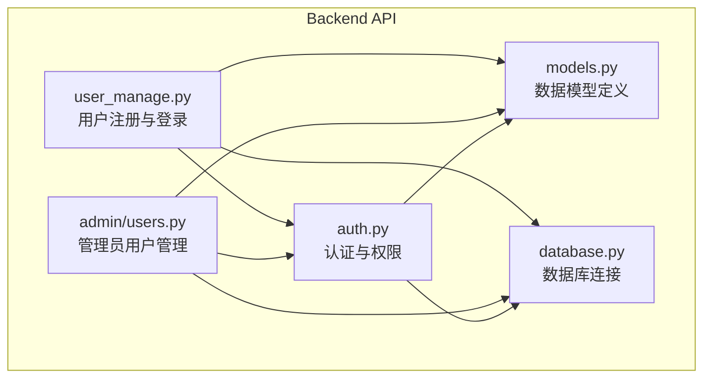
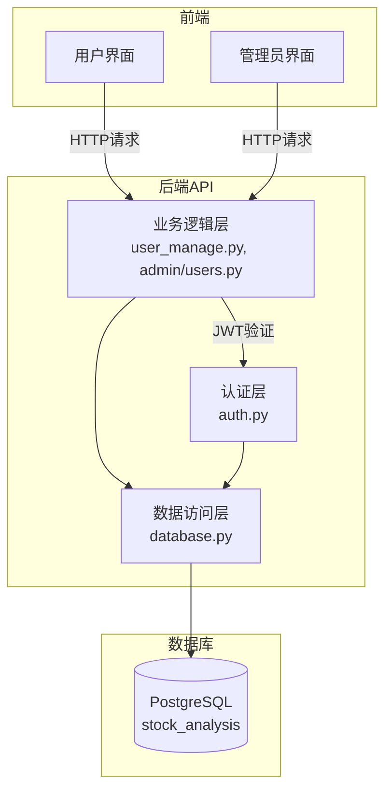
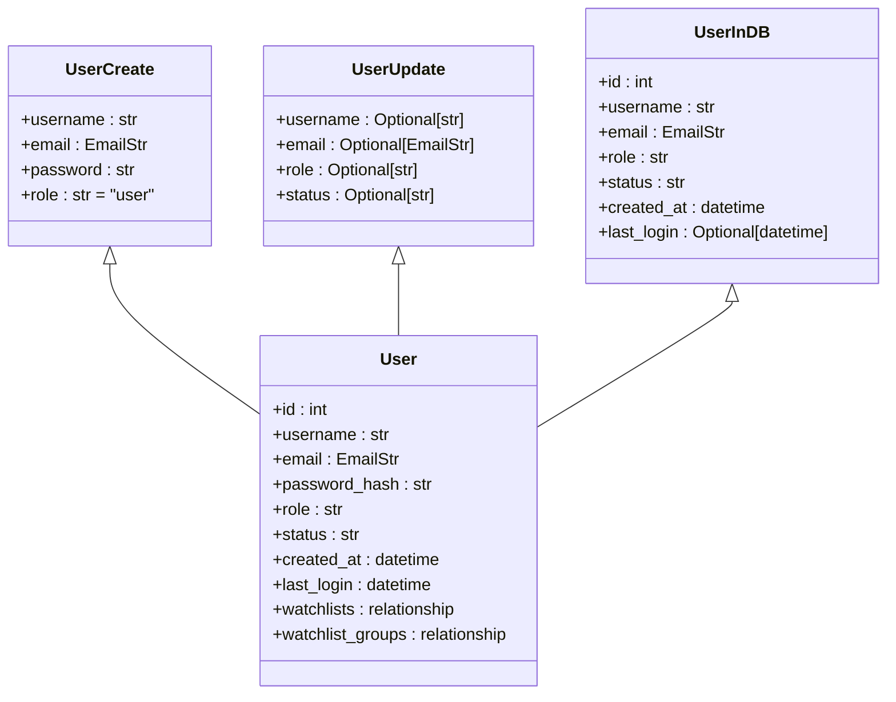
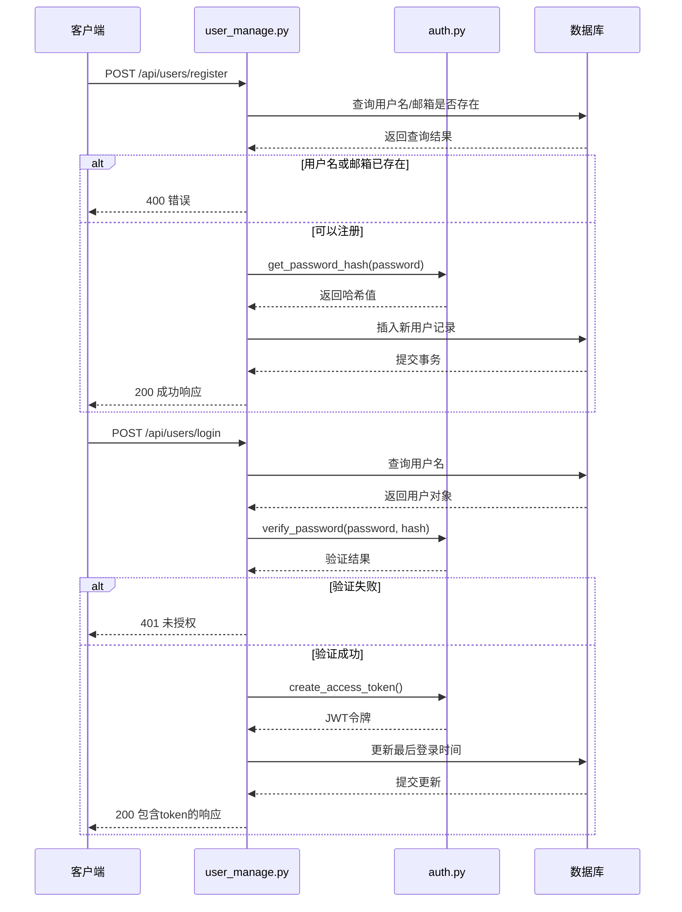
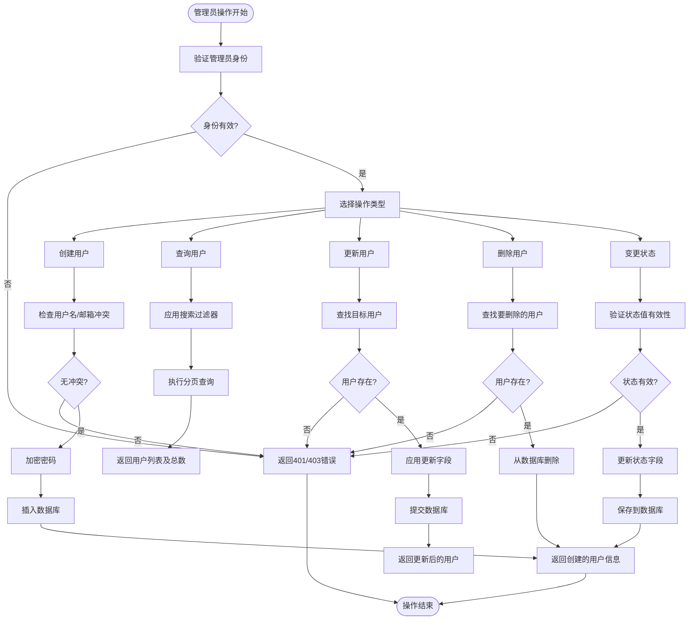
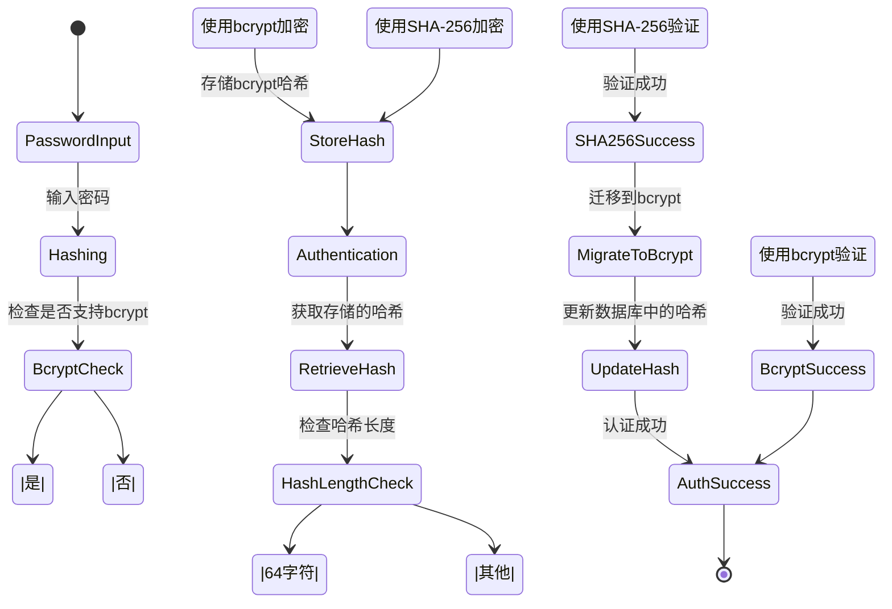
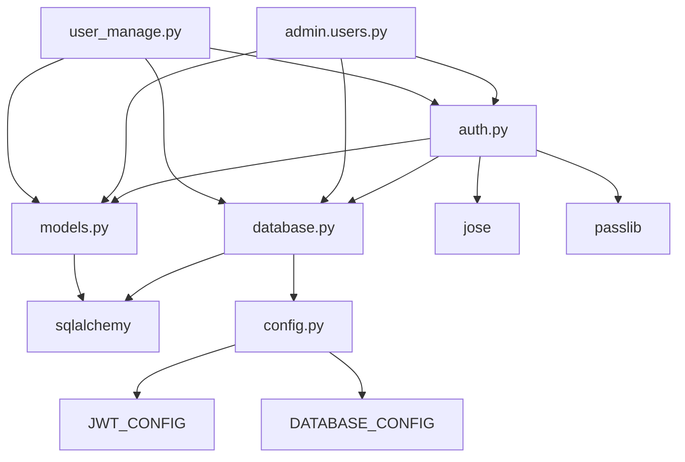

# 用户管理

<cite>
**本文档引用的文件**
- [user_manage.py](file://backend_api/user_manage.py)
- [models.py](file://backend_api/models.py)
- [admin/users.py](file://backend_api/admin/users.py)
- [auth.py](file://backend_api/auth.py)
- [check_users.py](file://backend_api/test/check_users.py)
</cite>

## 目录
1. [简介](#简介)
2. [项目结构](#项目结构)
3. [核心组件](#核心组件)
4. [架构概览](#架构概览)
5. [详细组件分析](#详细组件分析)
6. [依赖分析](#依赖分析)
7. [性能考虑](#性能考虑)
8. [故障排除指南](#故障排除指南)
9. [结论](#结论)

## 简介
本文档详细描述了股票分析系统中的用户管理功能，涵盖用户创建、查询、更新和删除（CRUD）操作。重点分析了用户数据的密码加密存储、用户状态管理（启用/禁用）、权限分配机制以及管理员接口。结合数据库模型定义，说明了字段映射与约束规则，并提供API调用示例和测试验证方法。

## 项目结构
用户管理功能主要分布在后端API模块中，涉及多个关键文件协同工作。

**图示来源**
- [user_manage.py](file://backend_api/user_manage.py#L1-L20)
- [admin/users.py](file://backend_api/admin/users.py#L1-L20)
- [models.py](file://backend_api/models.py#L1-L30)

**本节来源**
- [user_manage.py](file://backend_api/user_manage.py#L1-L50)
- [admin/users.py](file://backend_api/admin/users.py#L1-L50)

## 核心组件
用户管理功能由四个核心模块构成：用户模型定义、普通用户接口、管理员管理接口和认证服务。这些组件共同实现了完整的用户生命周期管理。

**本节来源**
- [user_manage.py](file://backend_api/user_manage.py#L25-L100)
- [models.py](file://backend_api/models.py#L15-L80)
- [admin/users.py](file://backend_api/admin/users.py#L15-L45)

## 架构概览
系统采用分层架构设计，前端通过RESTful API与后端交互，后端基于FastAPI框架实现业务逻辑，并通过SQLAlchemy ORM与PostgreSQL数据库通信。

**图示来源**
- [user_manage.py](file://backend_api/user_manage.py#L10-L30)
- [admin/users.py](file://backend_api/admin/users.py#L10-L30)
- [auth.py](file://backend_api/auth.py#L15-L40)

## 详细组件分析

### 用户模型分析
`User` 模型定义了用户的核心属性和约束条件，是整个用户管理系统的基础。

**图示来源**
- [models.py](file://backend_api/models.py#L20-L60)

**本节来源**
- [models.py](file://backend_api/models.py#L15-L100)

### 用户注册与登录流程
该流程展示了普通用户如何通过安全的方式注册和登录系统。

**图示来源**
- [user_manage.py](file://backend_api/user_manage.py#L50-L150)
- [auth.py](file://backend_api/auth.py#L80-L120)

**本节来源**
- [user_manage.py](file://backend_api/user_manage.py#L50-L194)
- [auth.py](file://backend_api/auth.py#L50-L150)

### 管理员用户管理
管理员拥有对所有用户的完全管理权限，包括创建、更新、状态变更和删除操作。

**图示来源**
- [admin/users.py](file://backend_api/admin/users.py#L50-L180)

**本节来源**
- [admin/users.py](file://backend_api/admin/users.py#L1-L197)

### 密码安全机制
系统实现了多层次的密码安全策略，确保用户凭证的安全存储和验证。

**图示来源**
- [auth.py](file://backend_api/auth.py#L30-L80)

**本节来源**
- [auth.py](file://backend_api/auth.py#L1-L197)

## 依赖分析
用户管理功能依赖于多个内部模块和外部库，形成了清晰的依赖关系网络。

**图示来源**
- [user_manage.py](file://backend_api/user_manage.py#L1-L20)
- [admin/users.py](file://backend_api/admin/users.py#L1-L20)
- [auth.py](file://backend_api/auth.py#L1-L20)
- [models.py](file://backend_api/models.py#L1-L20)
- [config.py](file://backend_api/config.py#L1-L20)

**本节来源**
- [user_manage.py](file://backend_api/user_manage.py#L1-L194)
- [admin/users.py](file://backend_api/admin/users.py#L1-L197)
- [auth.py](file://backend_api/auth.py#L1-L197)

## 性能考虑
虽然当前实现满足基本功能需求，但在高并发场景下可能存在性能瓶颈。建议对频繁查询的字段（如username、email）建立复合索引，并考虑引入缓存机制来减轻数据库压力。分页查询已实现基本的limit/offset机制，但在大数据集上可能影响性能，可考虑采用游标分页优化。

## 故障排除指南
当用户管理功能出现问题时，可按照以下步骤进行排查：

1. **检查数据库连接**：确认PostgreSQL服务正常运行，连接参数正确
2. **验证JWT配置**：确保`config.py`中的`JWT_CONFIG`设置正确
3. **查看日志输出**：检查认证过程中的详细日志信息
4. **使用测试脚本**：运行`check_users.py`脚本来验证数据库状态
5. **测试API连通性**：使用`test_api.py`执行端到端测试

**本节来源**
- [check_users.py](file://backend_api/test/check_users.py#L1-L80)
- [test_api.py](file://backend_api/test/test_api.py#L1-L70)
- [auth.py](file://backend_api/auth.py#L1-L197)

## 结论
用户管理系统实现了完整的CRUD操作和安全的认证机制。通过合理的分层设计和模块化组织，系统具有良好的可维护性和扩展性。未来可考虑增加更多安全特性如双因素认证、登录尝试限制等，并优化大规模用户场景下的查询性能。