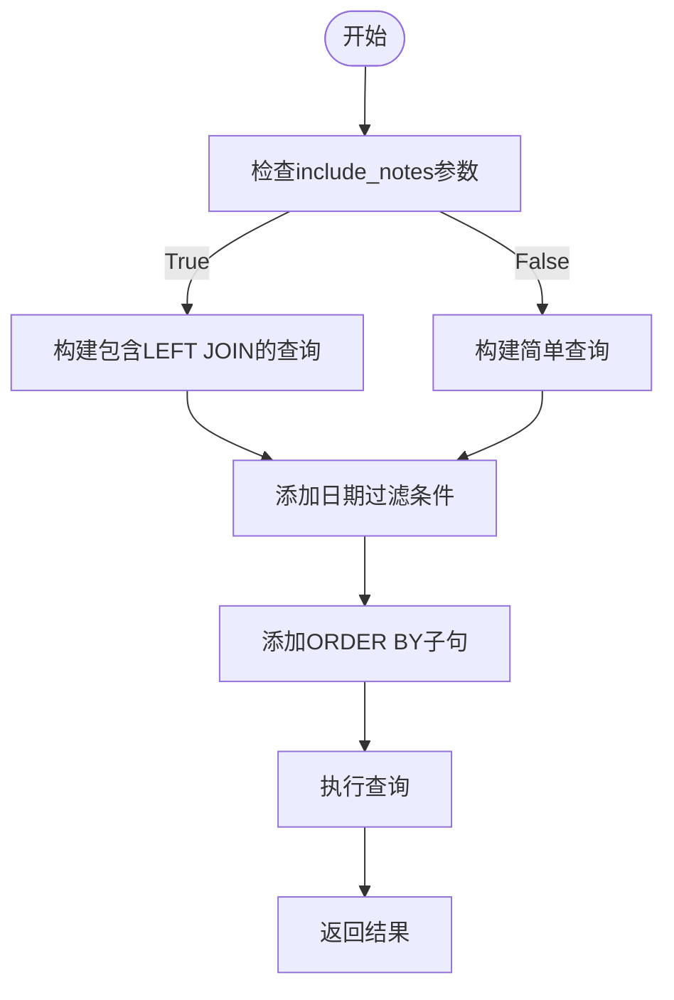
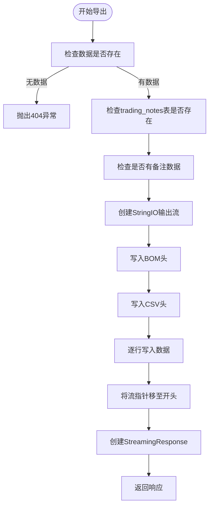
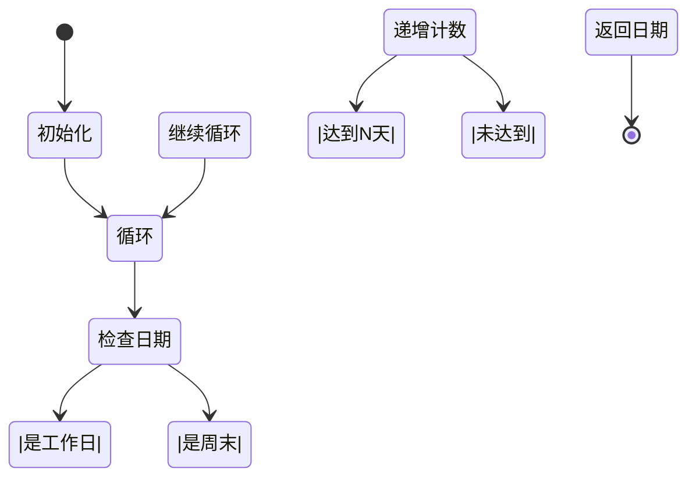
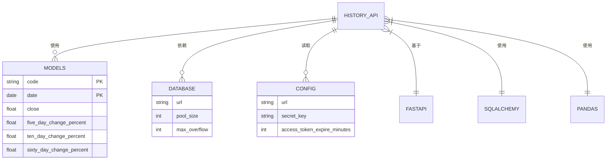

# 历史数据API

<cite>
**本文档引用的文件**   
- [history_api.py](file://backend_api/stock/history_api.py)
- [models.py](file://backend_api/models.py)
- [database.py](file://backend_api/database.py)
- [config.py](file://backend_api/config.py)
</cite>

## 目录
1. [简介](#简介)
2. [项目结构](#项目结构)
3. [核心组件](#核心组件)
4. [架构概述](#架构概述)
5. [详细组件分析](#详细组件分析)
6. [依赖分析](#依赖分析)
7. [性能考虑](#性能考虑)
8. [故障排除指南](#故障排除指南)
9. [结论](#结论)

## 简介
本文档全面分析了股票分析系统中的历史数据API，重点深入解析`history_api.py`文件中的核心功能。文档详细说明了`/get_stock_history`接口的查询参数设计，包括股票代码、日期范围、分页和是否包含交易备注的灵活配置。阐述了查询SQL如何根据`include_notes`参数动态构建，以及LEFT JOIN交易备注表的实现逻辑。解释了`/export_stock_history`接口的CSV导出功能，包括BOM头处理中文乱码、动态CSV头生成和流式响应的实现。重点分析了`/calculate_five_day_change`、`/calculate_ten_day_change`和`/calculate_sixty_day_change`三个计算接口的工作原理，特别是`_get_date_before_business_days`函数如何准确计算N个工作日前的日期，以及扩展查询范围确保有足够的历史数据进行计算。提供了各接口的请求参数验证、事务管理、错误处理和性能优化策略的详细说明。

## 项目结构
历史数据API是`backend_api`模块的一部分，位于`backend_api/stock/`目录下。该API通过FastAPI框架实现，与数据库模型和配置文件紧密协作，为前端提供历史行情数据的查询、导出和计算服务。

```mermaid
graph TB
subgraph "Backend API"
HA[history_api.py]
M[models.py]
DB[database.py]
C[config.py]
end
HA --> M : "使用"
HA --> DB : "依赖"
HA --> C : "读取配置"
DB --> M : "初始化"
```

**Diagram sources**
- [history_api.py](file://backend_api/stock/history_api.py)
- [models.py](file://backend_api/models.py)
- [database.py](file://backend_api/database.py)
- [config.py](file://backend_api/config.py)

**Section sources**
- [history_api.py](file://backend_api/stock/history_api.py)
- [models.py](file://backend_api/models.py)

## 核心组件
历史数据API的核心组件包括：
- **`get_stock_history`**: 基础历史数据查询接口，支持分页和备注关联。
- **`export_stock_history`**: CSV数据导出接口，解决中文乱码问题。
- **`calculate_five_day_change`**: 计算5天涨跌幅的接口。
- **`calculate_ten_day_change`**: 计算10天涨跌幅的接口。
- **`calculate_sixty_day_change`**: 计算60天涨跌幅的接口。
- **`_get_date_before_business_days`**: 计算N个工作日前日期的辅助函数。

这些组件共同构成了一个完整的股票历史数据分析和处理系统。

**Section sources**
- [history_api.py](file://backend_api/stock/history_api.py#L1-L602)

## 架构概述
历史数据API采用分层架构，由路由层、业务逻辑层和数据访问层组成。API通过FastAPI的`APIRouter`定义路由，使用SQLAlchemy进行数据库操作，并通过依赖注入`get_db`来管理数据库会话。

```mermaid
graph TD
Client[客户端] --> API[API路由]
API --> BL[业务逻辑]
BL --> DAL[数据访问层]
DAL --> DB[(数据库)]
subgraph "Backend API"
API
BL
DAL
end
API -.-> BL : "调用"
BL -.-> DAL : "调用"
DAL -.-> DB : "执行SQL"
```

**Diagram sources**
- [history_api.py](file://backend_api/stock/history_api.py#L1-L602)
- [database.py](file://backend_api/database.py#L1-L71)

## 详细组件分析

### `/get_stock_history` 接口分析
该接口是获取股票历史行情数据的核心接口，支持灵活的查询参数。

#### 查询参数设计
接口通过Query参数接收以下配置：
- `code`: 股票代码（必填）
- `start_date`: 开始日期（可选）
- `end_date`: 结束日期（可选）
- `page`: 页码（默认1）
- `size`: 每页数量（默认20，最大100）
- `include_notes`: 是否包含交易备注（默认True）

#### SQL动态构建逻辑
根据`include_notes`参数的值，接口动态构建不同的SQL查询语句：
- 当`include_notes=True`时，使用LEFT JOIN关联`historical_quotes`和`trading_notes`表，获取用户备注信息。
- 当`include_notes=False`时，仅查询`historical_quotes`表的基础数据。



**Diagram sources**
- [history_api.py](file://backend_api/stock/history_api.py#L30-L150)

**Section sources**
- [history_api.py](file://backend_api/stock/history_api.py#L30-L150)

### `/export_stock_history` 接口分析
该接口提供CSV格式的数据导出功能，解决了中文乱码等实际问题。

#### BOM头处理
为了确保在Microsoft Excel中打开CSV文件时中文不乱码，接口在输出流的开头写入了UTF-8 BOM头（`\ufeff`）。

#### 动态CSV头生成
CSV的列标题根据`include_notes`参数和实际数据动态生成：
- 当包含备注且存在备注数据时，使用包含用户备注、策略类型、风险等级的完整标题。
- 否则，使用基础标题。

#### 流式响应实现
接口使用`StreamingResponse`返回数据，避免了将整个文件加载到内存中，提高了大文件导出的性能和稳定性。



**Diagram sources**
- [history_api.py](file://backend_api/stock/history_api.py#L153-L321)

**Section sources**
- [history_api.py](file://backend_api/stock/history_api.py#L153-L321)

### 计算接口分析
系统提供了三个计算接口，用于计算不同时间周期的涨跌幅。

#### 计算工作原理
三个计算接口（5天、10天、60天）遵循相同的计算逻辑：
1. 接收股票代码和日期范围。
2. 扩展查询范围，确保有足够的历史数据。
3. 获取扩展范围内的收盘价数据。
4. 遍历数据，计算当前日期与N天前的涨跌幅。
5. 更新数据库中指定日期范围内的记录。

#### `_get_date_before_business_days` 函数
该函数是计算逻辑的核心，用于准确计算N个工作日前的日期，自动跳过周末。



**Diagram sources**
- [history_api.py](file://backend_api/stock/history_api.py#L323-L602)
- [history_api.py](file://backend_api/stock/history_api.py#L280-L298)

**Section sources**
- [history_api.py](file://backend_api/stock/history_api.py#L280-L602)

## 依赖分析
历史数据API依赖于多个核心模块和外部库。



**Diagram sources**
- [history_api.py](file://backend_api/stock/history_api.py)
- [models.py](file://backend_api/models.py)
- [database.py](file://backend_api/database.py)
- [config.py](file://backend_api/config.py)

**Section sources**
- [history_api.py](file://backend_api/stock/history_api.py)
- [models.py](file://backend_api/models.py)
- [database.py](file://backend_api/database.py)
- [config.py](file://backend_api/config.py)

## 性能考虑
API在设计时考虑了多项性能优化策略：
- **分页查询**: `/get_stock_history`接口支持分页，避免一次性返回大量数据。
- **流式导出**: `/export_stock_history`使用流式响应，减少内存占用。
- **批量更新**: 计算接口在单个事务中批量更新多条记录，提高数据库操作效率。
- **索引优化**: 数据库表`historical_quotes`和`trading_notes`在关键字段（如`code`、`date`）上建立了索引，加速查询。

## 故障排除指南
### 常见问题及解决方案
- **问题**: 导出的CSV文件在Excel中显示乱码。
  - **解决方案**: 确认API已正确写入BOM头（`\ufeff`），检查客户端是否正确处理UTF-8编码。

- **问题**: 计算接口返回"数据不足"错误。
  - **解决方案**: 检查指定日期范围内是否有足够的历史数据，确认数据库中存在连续的交易日数据。

- **问题**: 包含备注的查询性能较慢。
  - **解决方案**: 确保`trading_notes`表的`stock_code`和`trade_date`字段有联合索引，优化LEFT JOIN查询。

**Section sources**
- [history_api.py](file://backend_api/stock/history_api.py#L153-L321)
- [history_api.py](file://backend_api/stock/history_api.py#L323-L602)

## 结论
历史数据API为股票分析系统提供了强大而灵活的数据访问和处理能力。通过精心设计的查询参数、动态SQL构建、流式数据导出和精确的涨跌幅计算，API能够满足多样化的业务需求。其模块化的架构和清晰的依赖关系使得系统易于维护和扩展。未来可以考虑增加缓存机制以进一步提升高频查询的性能。