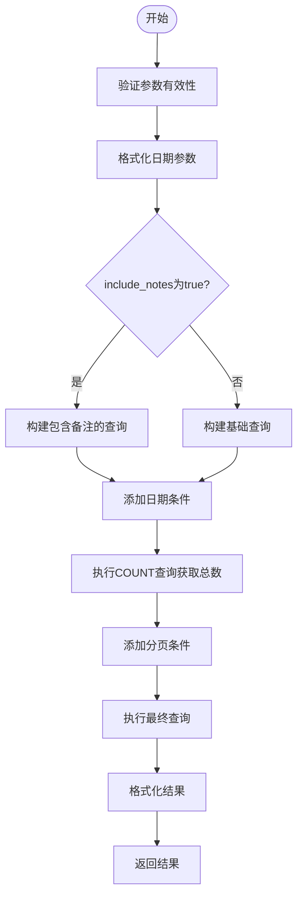
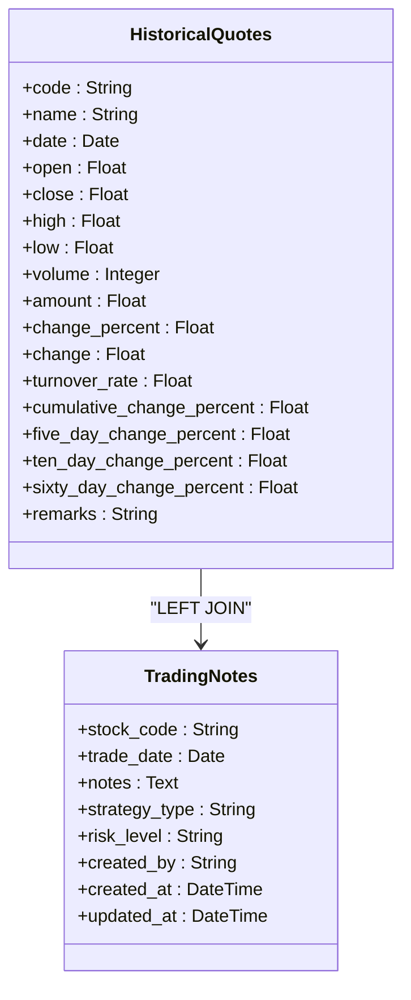
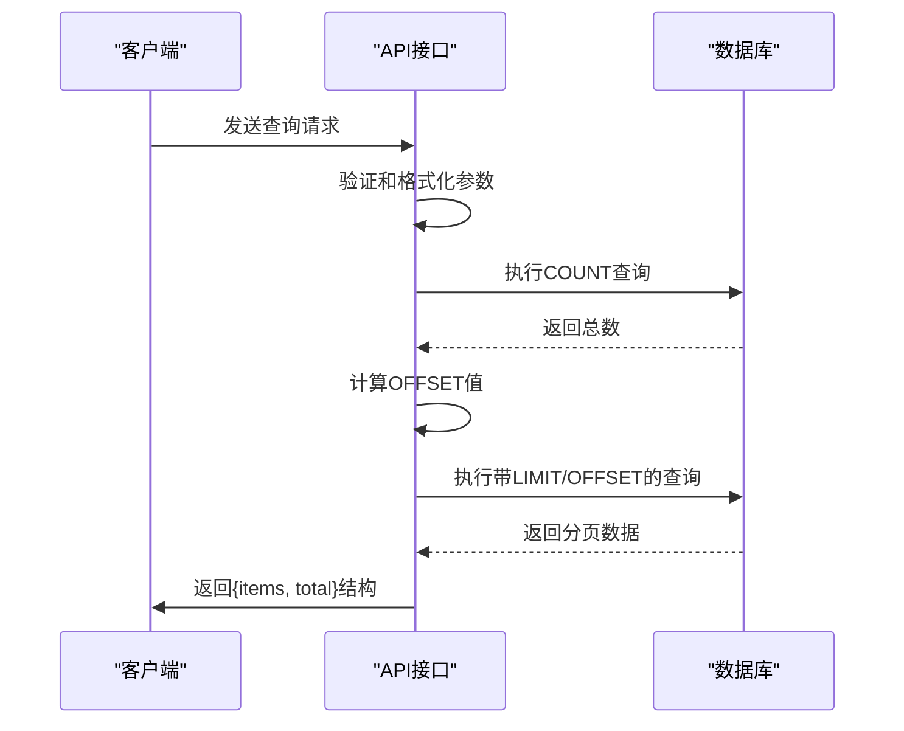
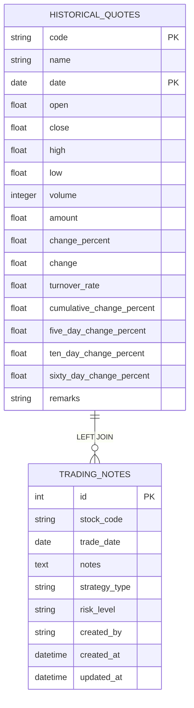

# 历史数据查询接口

<cite>
**本文档引用的文件**
- [history_api.py](file://backend_api/stock/history_api.py)
- [models.py](file://backend_api/models.py)
- [trading_notes_routes.py](file://backend_api/trading_notes_routes.py)
</cite>

## 目录
1. [简介](#简介)
2. [核心功能分析](#核心功能分析)
3. [接口参数详解](#接口参数详解)
4. [SQL查询构建逻辑](#sql查询构建逻辑)
5. [分页机制实现](#分页机制实现)
6. [交易备注关联查询](#交易备注关联查询)
7. [请求示例与响应结构](#请求示例与响应结构)
8. [错误处理策略](#错误处理策略)

## 简介
历史数据查询接口提供了对股票历史行情数据的灵活查询功能，支持通过股票代码、日期范围、分页参数和备注包含选项进行精确检索。该接口是系统中数据访问的核心组件，为前端展示和数据分析提供基础数据支持。

## 核心功能分析

`get_stock_history`函数实现了股票历史数据的查询功能，通过灵活的参数组合满足不同场景下的数据需求。函数位于`backend_api/stock/history_api.py`文件中，是FastAPI路由系统的一部分。

**Section sources**
- [history_api.py](file://backend_api/stock/history_api.py#L43-L137)

## 接口参数详解

接口支持以下参数配置：

| 参数 | 类型 | 必需 | 默认值 | 描述 |
|------|------|------|--------|------|
| code | 字符串 | 是 | 无 | 股票代码，用于指定查询的股票 |
| start_date | 字符串 | 否 | 无 | 查询起始日期，支持多种格式 |
| end_date | 字符串 | 否 | 无 | 查询结束日期，支持多种格式 |
| page | 整数 | 否 | 1 | 页码，从1开始 |
| size | 整数 | 否 | 20 | 每页记录数，最大100 |
| include_notes | 布尔值 | 否 | true | 是否包含交易备注信息 |

日期参数支持"YYYY-MM-DD"、"YYYY/MM/DD"、"YYYY.MM.DD"和"YYYYMMDD"等多种格式，通过`format_date_yyyymmdd`函数进行标准化处理。



**Diagram sources**
- [history_api.py](file://backend_api/stock/history_api.py#L43-L137)

**Section sources**
- [history_api.py](file://backend_api/stock/history_api.py#L43-L137)

## SQL查询构建逻辑

查询构建过程根据`include_notes`参数的值动态生成不同的SQL语句：

### 基础查询（不包含备注）
```sql
SELECT 
    code, name, date, open, close, high, low, 
    volume, amount, change_percent, change, turnover_rate,
    cumulative_change_percent, five_day_change_percent, ten_day_change_percent, 
    sixty_day_change_percent, remarks
FROM historical_quotes 
WHERE code = :code
```

### 包含备注的查询
```sql
SELECT 
    h.code, h.name, h.date, h.open, h.close, h.high, h.low, 
    h.volume, h.amount, h.change_percent, h.change, h.turnover_rate,
    h.cumulative_change_percent, h.five_day_change_percent, h.ten_day_change_percent, 
    h.sixty_day_change_percent, h.remarks,
    COALESCE(tn.notes, '') as user_notes,
    COALESCE(tn.strategy_type, '') as strategy_type,
    COALESCE(tn.risk_level, '') as risk_level,
    COALESCE(tn.created_by, '') as notes_creator,
    tn.created_at as notes_created_at,
    tn.updated_at as notes_updated_at
FROM historical_quotes h
LEFT JOIN trading_notes tn ON h.code = tn.stock_code AND h.date::date = tn.trade_date
WHERE h.code = :code
```

动态条件拼接逻辑：
- 如果提供了`start_date`，添加`AND date >= :start_date`条件
- 如果提供了`end_date`，添加`AND date <= :end_date`条件
- 查询结果按日期降序排列



**Diagram sources**
- [models.py](file://backend_api/models.py#L400-L415)
- [models.py](file://backend_api/models.py#L417-L434)

**Section sources**
- [history_api.py](file://backend_api/stock/history_api.py#L43-L137)

## 分页机制实现

分页机制通过两步查询实现：

1. **总数查询**：使用COUNT子查询获取匹配条件的总记录数
```python
count_query = f"SELECT COUNT(*) FROM ({query})"
total = db.execute(text(count_query), params).scalar()
```

2. **分页查询**：在原始查询基础上添加LIMIT和OFFSET
```python
query += " LIMIT :limit OFFSET :offset"
params["limit"] = size
params["offset"] = (page - 1) * size
```

这种实现方式确保了分页的准确性和性能，避免了全表扫描。



**Diagram sources**
- [history_api.py](file://backend_api/stock/history_api.py#L43-L137)

**Section sources**
- [history_api.py](file://backend_api/stock/history_api.py#L43-L137)

## 交易备注关联查询

当`include_notes`参数为true时，系统通过LEFT JOIN关联`historical_quotes`和`trading_notes`表获取交易备注信息：

- **关联条件**：`h.code = tn.stock_code AND h.date::date = tn.trade_date`
- **字段映射**：使用COALESCE函数确保空值返回空字符串
- **LEFT JOIN**：保证即使没有备注记录，历史行情数据也能正常返回

这种设计实现了数据的完整性，同时避免了因备注缺失导致的数据丢失问题。



**Diagram sources**
- [models.py](file://backend_api/models.py#L400-L434)

**Section sources**
- [history_api.py](file://backend_api/stock/history_api.py#L43-L137)
- [trading_notes_routes.py](file://backend_api/trading_notes_routes.py#L100-L130)

## 请求示例与响应结构

### 请求示例
```http
GET /api/stock/history?code=000001&start_date=2024-01-01&end_date=2024-12-31&page=1&size=10&include_notes=true
```

### 响应结构
```json
{
  "items": [
    {
      "code": "000001",
      "name": "平安银行",
      "date": "2024-12-31",
      "open": 12.34,
      "close": 12.56,
      "high": 12.67,
      "low": 12.23,
      "volume": 12345678,
      "amount": 152345678.90,
      "change_percent": 1.23,
      "change": 0.15,
      "turnover_rate": 0.45,
      "cumulative_change_percent": 15.67,
      "five_day_change_percent": 2.34,
      "ten_day_change_percent": 3.45,
      "sixty_day_change_percent": 8.90,
      "remarks": "数据正常",
      "user_notes": "重点关注突破形态",
      "strategy_type": "观察",
      "risk_level": "中",
      "notes_creator": "admin",
      "notes_created_at": "2024-12-31T15:30:00",
      "notes_updated_at": "2024-12-31T15:30:00"
    }
  ],
  "total": 250
}
```

**Section sources**
- [history_api.py](file://backend_api/stock/history_api.py#L43-L137)

## 错误处理策略

接口实现了多层次的错误处理机制：

1. **参数验证**：使用FastAPI的Query参数验证确保输入合法性
2. **异常捕获**：通过try-except结构捕获数据库操作异常
3. **日志记录**：关键操作通过print语句记录输入输出，便于调试
4. **HTTP异常**：使用HTTPException返回标准化的错误响应

错误处理流程确保了接口的稳定性和可维护性，为系统提供了可靠的错误反馈机制。

**Section sources**
- [history_api.py](file://backend_api/stock/history_api.py#L43-L137)