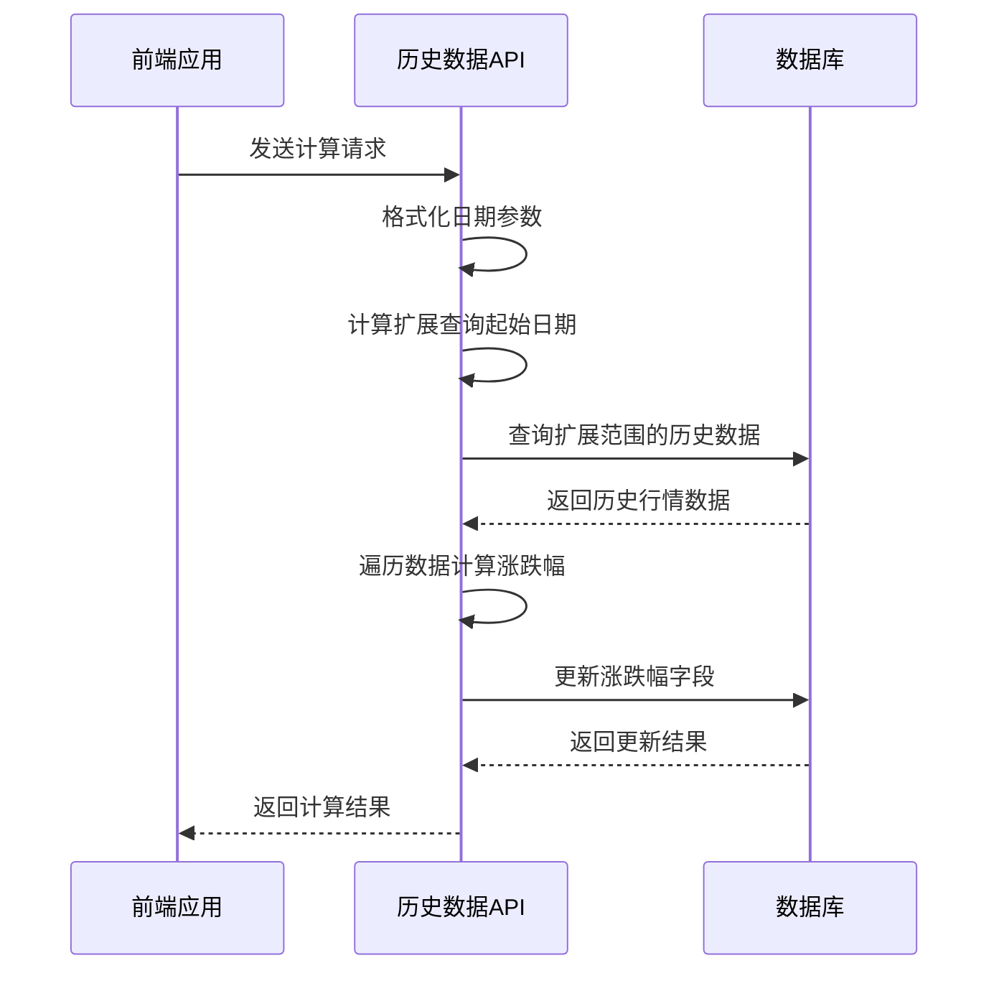
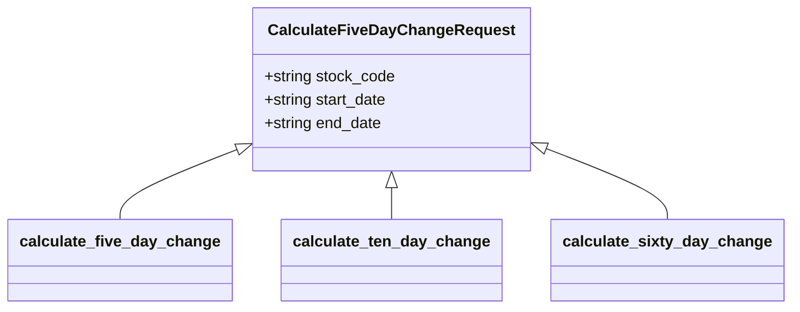
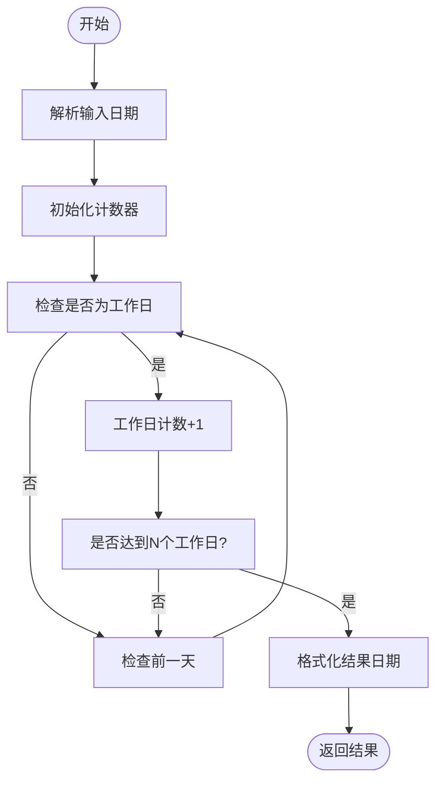
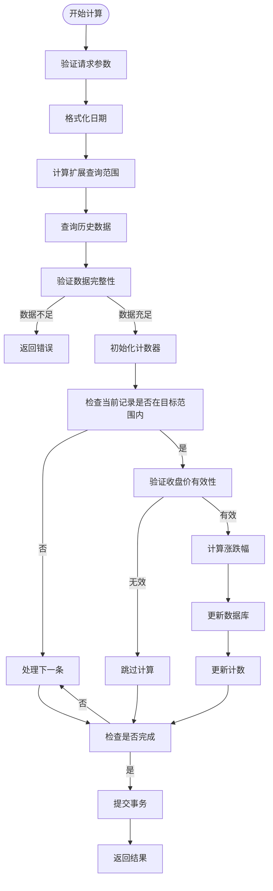

# 历史数据计算服务

<cite>
**本文档引用的文件**
- [calculate_five_day_change.py](file://backend_core/data_collectors/tushare/calculate_five_day_change.py)
- [extended_change_calculator.py](file://backend_core/data_collectors/tushare/extended_change_calculator.py)
- [historical_quotes.py](file://backend_core/models/historical_quotes.py)
- [history_api.py](file://backend_api/stock/history_api.py)
</cite>

## 目录
1. [简介](#简介)
2. [核心接口分析](#核心接口分析)
3. [请求模型复用机制](#请求模型复用机制)
4. [工作日计算工具函数](#工作日计算工具函数)
5. [历史数据查询扩展](#历史数据查询扩展)
6. [涨跌幅计算流程](#涨跌幅计算流程)
7. [事务管理与错误处理](#事务管理与错误处理)
8. [性能优化策略](#性能优化策略)
9. [结论](#结论)

## 简介
历史数据计算服务是股票分析系统的核心组件，负责计算股票在不同周期内的涨跌幅指标。该服务提供了三个主要接口：`calculate_five_day_change`、`calculate_ten_day_change`和`calculate_sixty_day_change`，用于计算5日、10日和60日的涨跌幅百分比。这些指标对于技术分析和投资决策具有重要意义，能够帮助投资者识别短期、中期和长期的趋势变化。

本服务通过精确的日期计算、合理的数据查询策略和稳健的事务管理，确保了计算结果的准确性和系统的可靠性。服务不仅支持实时计算，还具备批量处理能力，能够满足不同场景下的需求。

**Section sources**
- [history_api.py](file://backend_api/stock/history_api.py#L20-L23)

## 核心接口分析
历史数据计算服务提供了三个核心接口，分别用于计算不同周期的涨跌幅：

1. **5日涨跌幅计算接口** (`calculate_five_day_change`)：计算指定日期范围内股票的5日涨跌幅
2. **10日涨跌幅计算接口** (`calculate_ten_day_change`)：计算指定日期范围内股票的10日涨跌幅
3. **60日涨跌幅计算接口** (`calculate_sixty_day_change`)：计算指定日期范围内股票的60日涨跌幅

这些接口均采用POST请求方式，接收相同的请求模型`CalculateFiveDayChangeRequest`，包含股票代码、开始日期和结束日期三个参数。每个接口的实现逻辑相似，主要区别在于计算周期和所需的历史数据量。

**Diagram sources**
- [history_api.py](file://backend_api/stock/history_api.py#L20-L23)
- [history_api.py](file://backend_api/stock/history_api.py#L300-L350)

**Section sources**
- [history_api.py](file://backend_api/stock/history_api.py#L290-L600)

## 请求模型复用机制
服务采用了一个巧妙的复用机制，通过共享同一个请求模型`CalculateFiveDayChangeRequest`来简化接口设计和代码维护。尽管模型名称为"FiveDayChange"，但它实际上被三个不同周期的计算接口共同使用。

这种设计具有以下优势：
- **代码简洁性**：避免了为每个接口创建独立的请求模型，减少了代码重复
- **维护便利性**：当需要修改请求参数时，只需修改一个模型定义
- **一致性保证**：确保所有计算接口使用相同的参数结构和验证规则

请求模型包含三个核心字段：`stock_code`（股票代码）、`start_date`（开始日期）和`end_date`（结束日期），这些字段对于所有周期的涨跌幅计算都是必需的。

**Diagram sources**
- [history_api.py](file://backend_api/stock/history_api.py#L20-L23)

**Section sources**
- [history_api.py](file://backend_api/stock/history_api.py#L20-L23)

## 工作日计算工具函数
服务中的`_get_date_before_business_days`工具函数是确保计算准确性的关键组件。该函数能够精确计算指定日期前N个工作日的日期，自动排除周末的影响。

函数实现逻辑如下：
1. 将输入的日期字符串转换为`datetime`对象
2. 从目标日期开始，逐日向前回溯
3. 检查每个日期是否为工作日（周一至周五）
4. 当累计找到N个工作日时，返回对应的日期

这种实现方式确保了在计算涨跌幅时，所使用的"5天前"、"10天前"或"60天前"的日期确实是实际的交易日，而不是简单的日历天数减法。

**Diagram sources**
- [history_api.py](file://backend_api/stock/history_api.py#L280-L290)

**Section sources**
- [history_api.py](file://backend_api/stock/history_api.py#L280-L290)

## 历史数据查询扩展
为了确保有足够的历史数据进行涨跌幅计算，服务采用了查询范围扩展策略。这是计算准确性的关键保障措施。

对于不同周期的计算，服务会相应地扩展查询范围：
- **5日涨跌幅**：查询起始日期前5个工作日的数据
- **10日涨跌幅**：查询起始日期前10个工作日的数据
- **60日涨跌幅**：查询起始日期前60个工作日的数据

这种扩展查询策略解决了以下问题：
1. **边界计算问题**：确保指定日期范围内的第一条记录也能正确计算涨跌幅
2. **数据完整性**：避免因数据不足而导致计算失败
3. **连续性保证**：确保计算过程不会因缺少前置数据而中断

例如，在计算5日涨跌幅时，如果用户请求计算2024-01-08至2024-01-12的数据，服务会从2024-01-03（5个工作日之前）开始查询，确保有足够的前置数据进行计算。

**Section sources**
- [history_api.py](file://backend_api/stock/history_api.py#L310-L315)

## 涨跌幅计算流程
涨跌幅计算流程是服务的核心处理逻辑，主要包括以下步骤：

1. **参数验证与格式化**：验证输入参数的有效性，并将日期格式统一为标准格式
2. **扩展查询**：根据计算周期确定扩展的查询范围，获取足够的历史数据
3. **数据验证**：检查获取的数据量是否满足最小要求（5日计算需至少6条数据）
4. **遍历计算**：从第N条记录开始，遍历所有符合条件的记录
5. **百分比计算**：使用公式`((当前收盘价 - N日前收盘价) / N日前收盘价) * 100`计算涨跌幅
6. **数据库更新**：将计算结果四舍五入到小数点后两位，并更新到数据库

计算过程中，服务会严格检查收盘价的有效性，确保不为null且大于0，避免除零错误和无效计算。

**Diagram sources**
- [history_api.py](file://backend_api/stock/history_api.py#L300-L400)

**Section sources**
- [history_api.py](file://backend_api/stock/history_api.py#L300-L400)

## 事务管理与错误处理
服务采用了严格的事务管理和错误处理机制，确保数据的一致性和系统的稳定性。

**事务管理策略**：
- 使用数据库事务包装整个计算过程
- 在所有计算完成后统一提交事务
- 任何异常都会触发事务回滚，保持数据一致性

**错误处理机制**：
- **输入验证**：对日期格式、股票代码等参数进行严格验证
- **数据完整性检查**：确保有足够的历史数据进行计算
- **异常捕获**：捕获并处理各种可能的异常情况
- **错误回滚**：发生错误时自动回滚数据库更改
- **详细日志**：记录详细的错误信息，便于问题排查

当计算过程中发生异常时，服务会执行以下操作：
1. 捕获异常并记录详细错误信息
2. 执行数据库事务回滚
3. 向客户端返回500错误状态码和错误描述
4. 继续处理其他股票或日期的计算（在批量处理场景下）

这种稳健的错误处理机制确保了即使在部分计算失败的情况下，也不会影响整体系统的稳定性和数据的完整性。

**Section sources**
- [history_api.py](file://backend_api/stock/history_api.py#L300-L600)

## 性能优化策略
服务采用了多项性能优化策略，确保在处理大量数据时仍能保持良好的响应速度。

**主要优化措施**：
1. **批量查询**：一次性查询所有需要的历史数据，减少数据库往返次数
2. **索引优化**：在`historical_quotes`表的`code`和`date`字段上建立复合索引
3. **内存计算**：在内存中完成所有计算操作，避免多次数据库查询
4. **事务优化**：将所有更新操作放在一个事务中提交，减少事务开销
5. **数据过滤**：只更新目标日期范围内的记录，避免不必要的数据库操作

此外，服务还提供了批量处理能力，可以通过`extended_change_calculator.py`中的`calculate_batch_for_date_range`方法批量处理多个日期的计算任务，进一步提高了处理效率。

**Section sources**
- [history_api.py](file://backend_api/stock/history_api.py#L300-L600)
- [extended_change_calculator.py](file://backend_core/data_collectors/tushare/extended_change_calculator.py#L150-L200)

## 结论
历史数据计算服务通过精心设计的架构和实现，提供了一个可靠、高效且易于维护的涨跌幅计算解决方案。服务的核心优势在于：

1. **接口设计简洁**：通过请求模型复用，简化了接口设计
2. **计算准确**：通过工作日计算和查询范围扩展，确保了计算结果的准确性
3. **数据安全**：通过事务管理和错误回滚，保证了数据的一致性
4. **性能优良**：通过批量查询和内存计算等优化策略，确保了良好的性能表现

该服务不仅满足了当前的业务需求，还具备良好的扩展性，可以方便地添加新的计算周期或功能。建议在未来的版本中考虑增加缓存机制，进一步提升频繁查询场景下的性能表现。