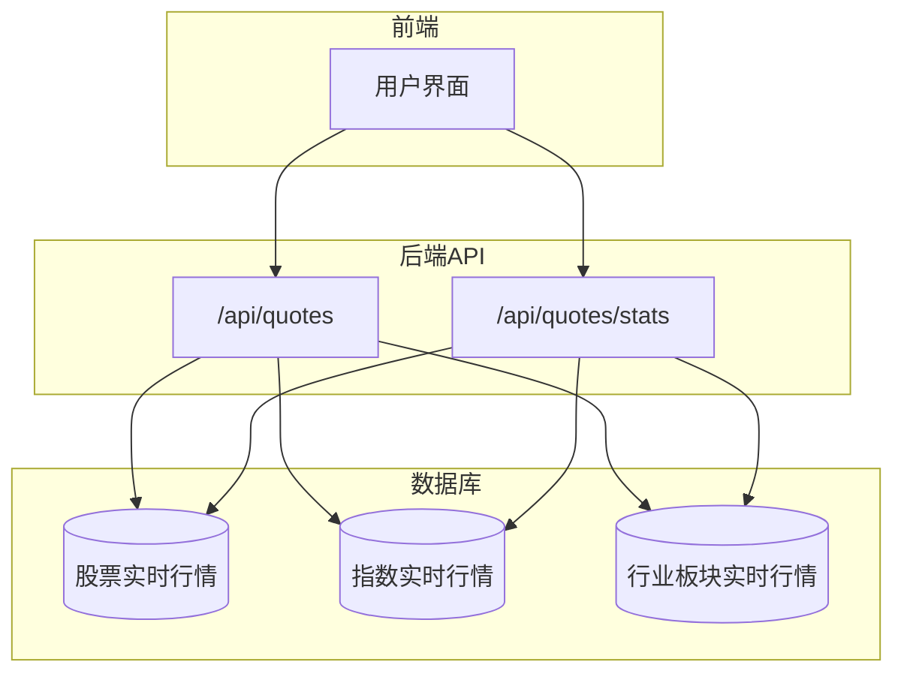
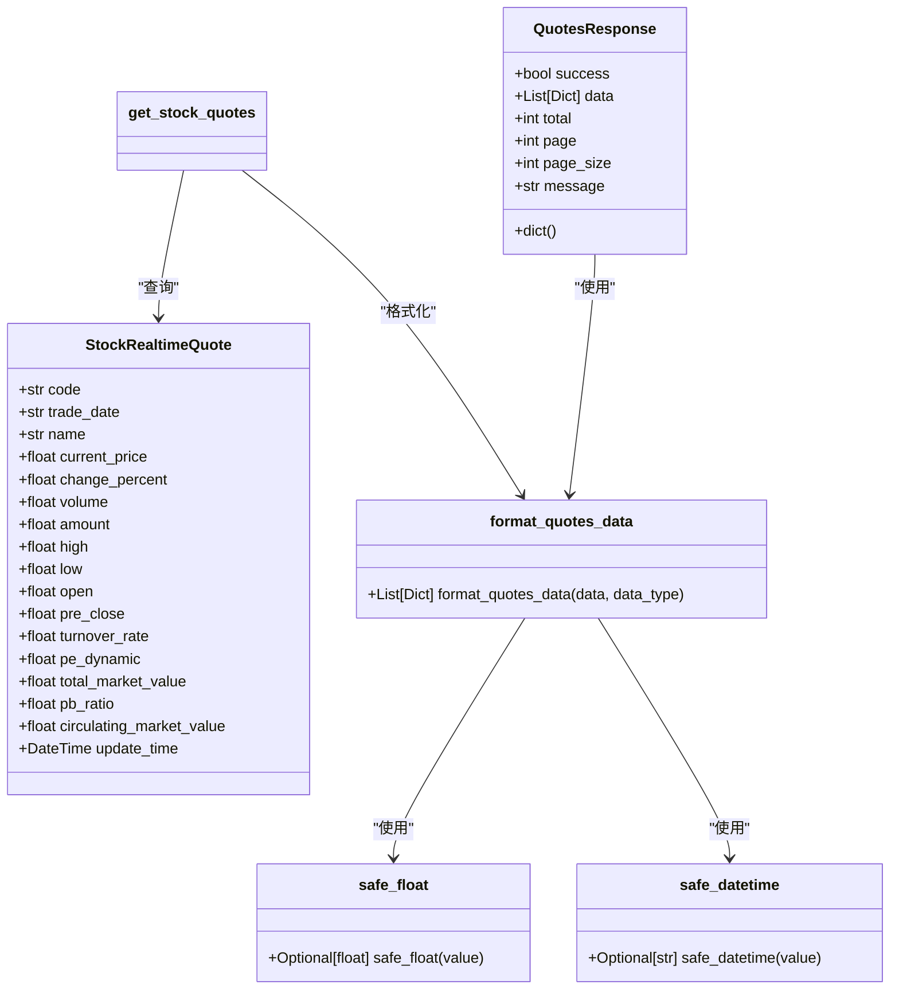
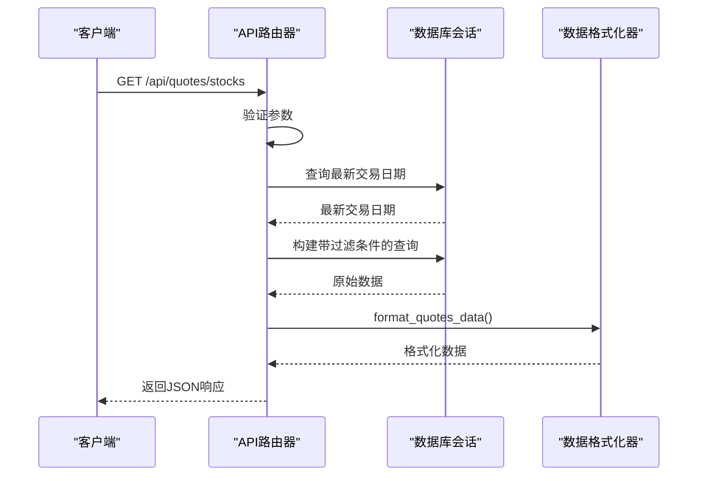
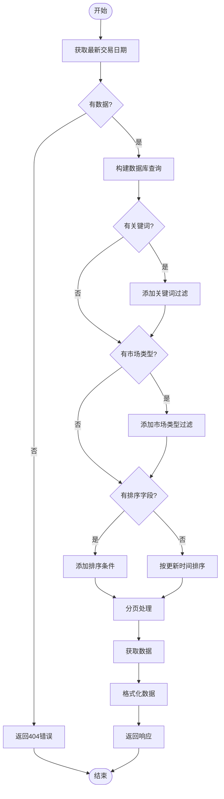
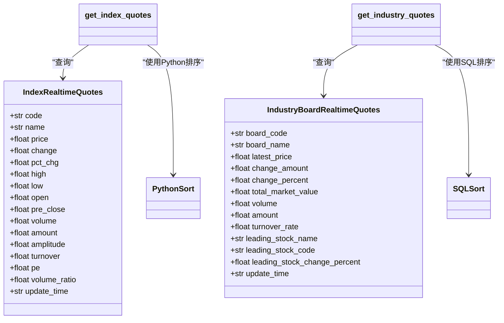
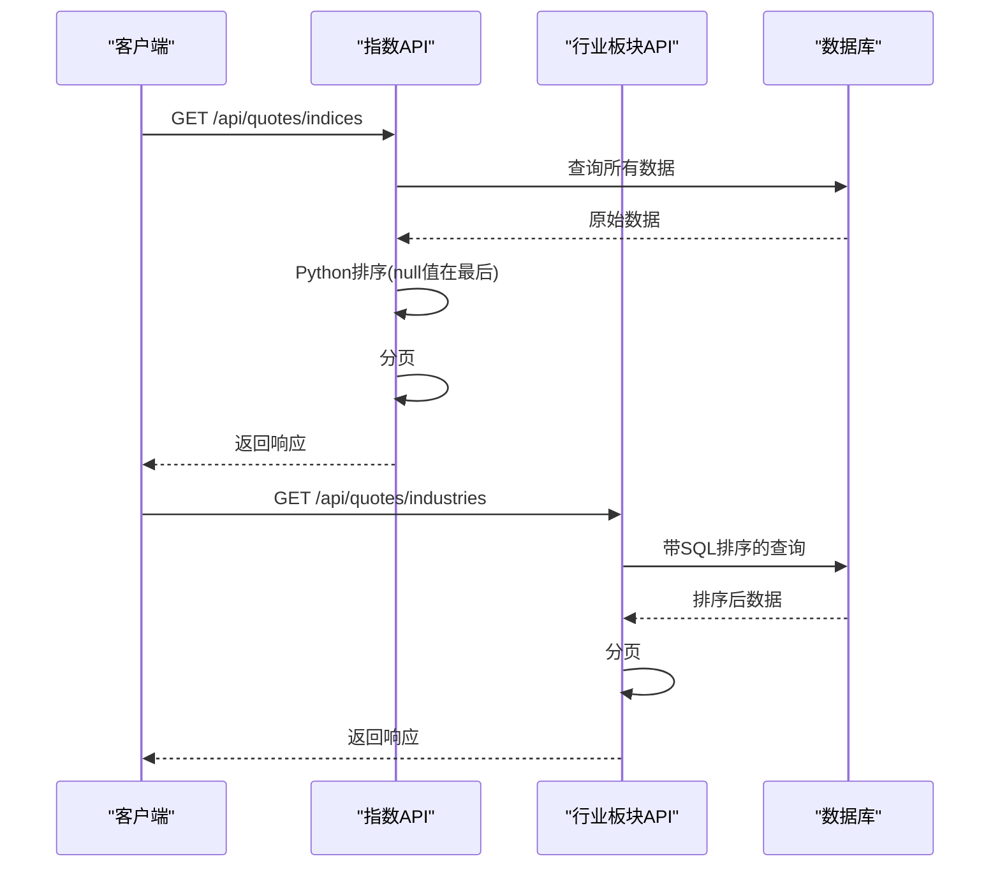
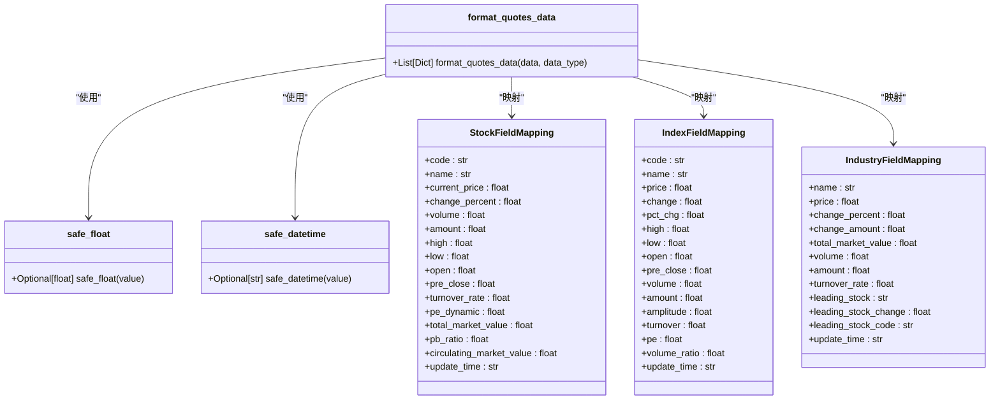
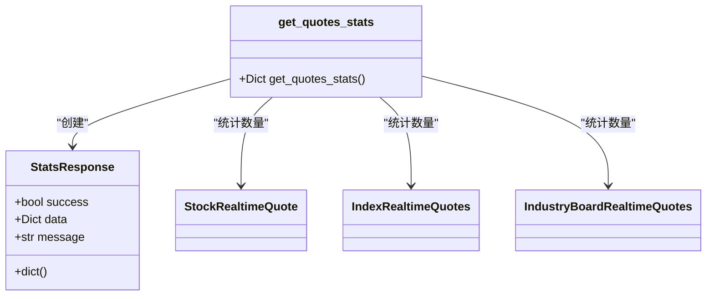
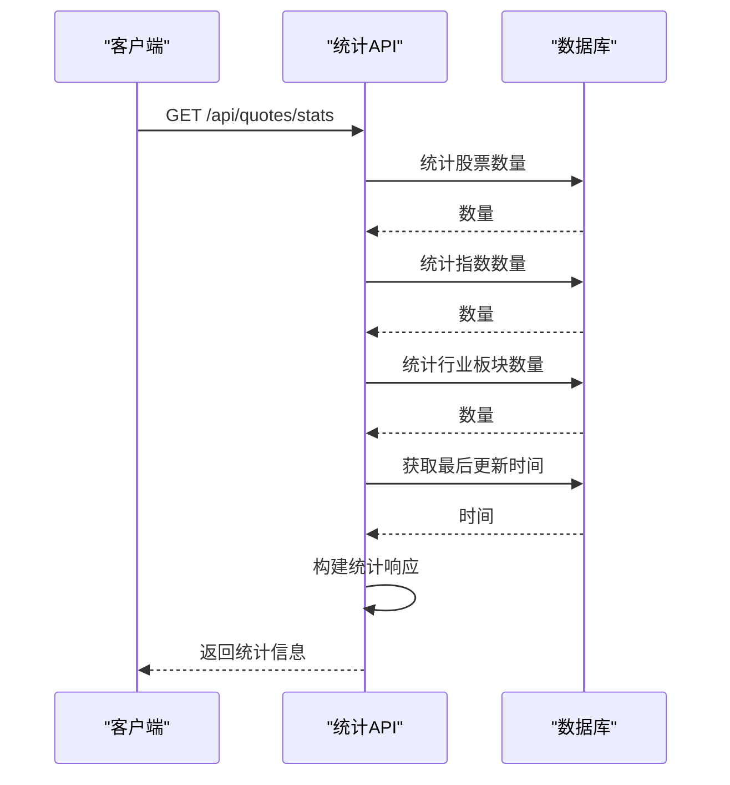

# 实时行情API

<cite>
**本文档中引用的文件**  
- [quotes_routes.py](file://backend_api/quotes_routes.py)
- [models.py](file://backend_api/models.py)
- [database.py](file://backend_api/database.py)
</cite>

## 目录
1. [介绍](#介绍)
2. [核心组件](#核心组件)
3. [架构概述](#架构概述)
4. [详细组件分析](#详细组件分析)
5. [依赖分析](#依赖分析)
6. [性能考虑](#性能考虑)
7. [故障排除指南](#故障排除指南)
8. [结论](#结论)

## 介绍
本API提供股票、指数和行业板块的实时行情数据查询服务，支持分页、关键词搜索、市场类型过滤和多字段排序功能。系统通过统一的数据格式化机制处理不同类型行情数据，并提供数据统计接口，确保前端应用能够稳定、高效地获取所需信息。

## 核心组件

[深入分析核心组件，包括代码片段和解释]

**节来源**
- [quotes_routes.py](file://backend_api/quotes_routes.py#L60-L95)
- [quotes_routes.py](file://backend_api/quotes_routes.py#L97-L160)
- [quotes_routes.py](file://backend_api/quotes_routes.py#L163-L348)

## 架构概述

[系统架构的全面可视化和说明]



**图来源**  
- [quotes_routes.py](file://backend_api/quotes_routes.py#L1-L20)
- [models.py](file://backend_api/models.py#L200-L250)

## 详细组件分析

[对每个关键组件进行彻底分析，包括图表、代码片段路径和解释]

### 股票行情接口分析
[组件分析内容，包含特定文件分析]

#### 对象导向组件：


**图来源**  
- [quotes_routes.py](file://backend_api/quotes_routes.py#L10-L50)
- [models.py](file://backend_api/models.py#L200-L220)

#### API/服务组件：


**图来源**  
- [quotes_routes.py](file://backend_api/quotes_routes.py#L163-L348)
- [database.py](file://backend_api/database.py#L50-L60)

#### 复杂逻辑组件：


**图来源**  
- [quotes_routes.py](file://backend_api/quotes_routes.py#L163-L348)
- [quotes_routes.py](file://backend_api/quotes_routes.py#L97-L160)

**节来源**
- [quotes_routes.py](file://backend_api/quotes_routes.py#L163-L348)
- [models.py](file://backend_api/models.py#L200-L220)

### 指数与行业板块接口差异分析
[组件分析内容，包含特定文件分析]

#### 对象导向组件：


**图来源**  
- [quotes_routes.py](file://backend_api/quotes_routes.py#L351-L432)
- [quotes_routes.py](file://backend_api/quotes_routes.py#L435-L511)
- [models.py](file://backend_api/models.py#L250-L270)

#### API/服务组件：


**图来源**  
- [quotes_routes.py](file://backend_api/quotes_routes.py#L351-L432)
- [quotes_routes.py](file://backend_api/quotes_routes.py#L435-L511)

**节来源**
- [quotes_routes.py](file://backend_api/quotes_routes.py#L351-L511)
- [models.py](file://backend_api/models.py#L250-L270)

### 数据格式化组件分析
[组件分析内容，包含特定文件分析]

#### 对象导向组件：


**图来源**  
- [quotes_routes.py](file://backend_api/quotes_routes.py#L97-L160)
- [quotes_routes.py](file://backend_api/quotes_routes.py#L60-L80)
- [quotes_routes.py](file://backend_api/quotes_routes.py#L82-L95)

**节来源**
- [quotes_routes.py](file://backend_api/quotes_routes.py#L60-L160)

### 统计接口分析
[组件分析内容，包含特定文件分析]

#### 对象导向组件：


**图来源**  
- [quotes_routes.py](file://backend_api/quotes_routes.py#L514-L561)
- [models.py](file://backend_api/models.py#L200-L270)

#### API/服务组件：


**图来源**  
- [quotes_routes.py](file://backend_api/quotes_routes.py#L514-L561)

**节来源**
- [quotes_routes.py](file://backend_api/quotes_routes.py#L514-L561)

## 依赖分析

[分析组件之间的依赖关系并进行可视化]

```mermaid
graph TD
quotes_routes --> database : "依赖"
quotes_routes --> models : "依赖"
get_stock_quotes --> safe_float : "使用"
get_stock_quotes --> safe_datetime : "使用"
get_stock_quotes --> format_quotes_data : "使用"
get_index_quotes --> safe_float : "使用"
get_index_quotes --> safe_datetime : "使用"
get_index_quotes --> format_quotes_data : "使用"
get_industry_quotes --> safe_float : "使用"
get_industry_quotes --> safe_datetime : "使用"
get_industry_quotes --> format_quotes_data : "使用"
get_quotes_stats --> safe_datetime : "使用"
format_quotes_data --> safe_float : "使用"
format_quotes_data --> safe_datetime : "使用"
```

**图来源**  
- [quotes_routes.py](file://backend_api/quotes_routes.py#L1-L20)
- [database.py](file://backend_api/database.py#L1-L10)

**节来源**
- [quotes_routes.py](file://backend_api/quotes_routes.py#L1-L20)
- [database.py](file://backend_api/database.py#L1-L10)

## 性能考虑

[一般性能讨论，不分析特定文件]
[无来源，因为本节提供一般性指导]

## 故障排除指南

[分析错误处理代码和调试工具]

**节来源**
- [quotes_routes.py](file://backend_api/quotes_routes.py#L163-L561)
- [quotes_routes.py](file://backend_api/quotes_routes.py#L60-L95)

## 结论

[研究结果和建议的总结]
[无来源，因为本节进行总结而不分析特定文件]