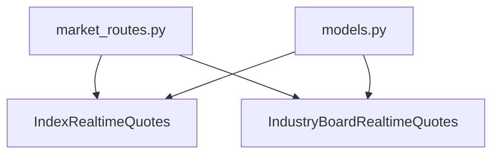
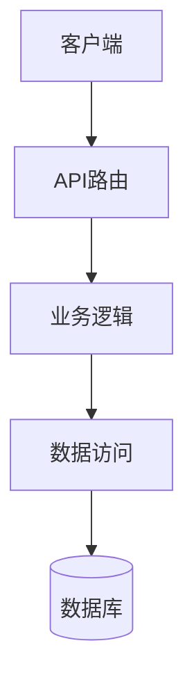
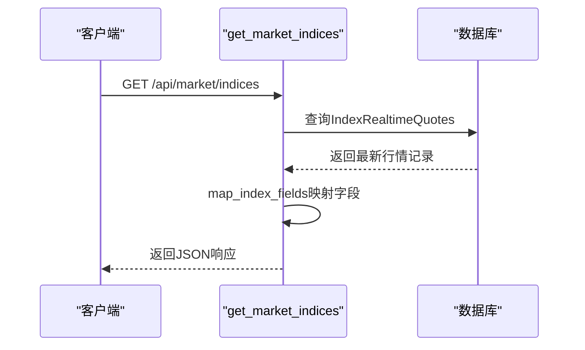
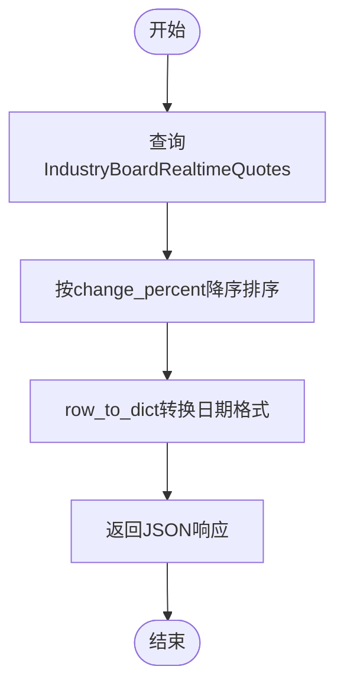
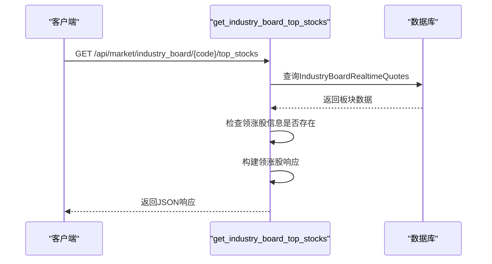
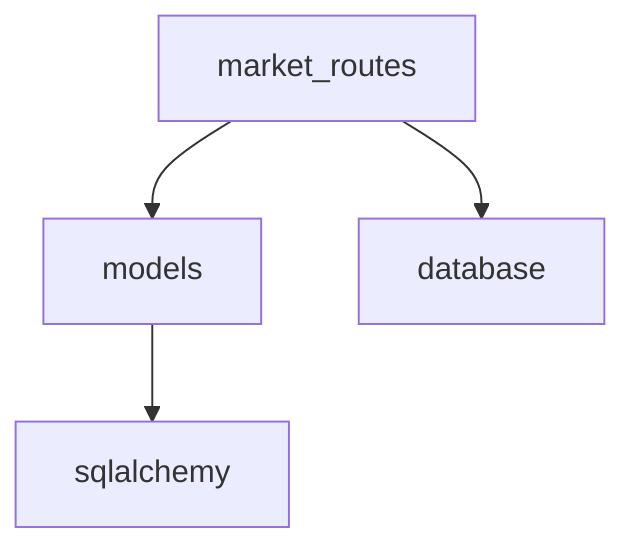

# 市场数据聚合API

<cite>
**本文档中引用的文件**  
- [market_routes.py](file://backend_api/market_routes.py)
- [models.py](file://backend_api/models.py)
</cite>

## 目录
1. [简介](#简介)
2. [项目结构](#项目结构)
3. [核心组件](#核心组件)
4. [架构概述](#架构概述)
5. [详细组件分析](#详细组件分析)
6. [依赖分析](#依赖分析)
7. [性能考虑](#性能考虑)
8. [故障排除指南](#故障排除指南)
9. [结论](#结论)

## 简介
本文档详细描述了市场数据聚合API的实现，重点分析了`market_routes.py`中定义的市场级数据接口。文档涵盖了主要市场指数、行业板块行情以及领涨股信息的获取机制，详细说明了数据字段映射、日期序列化处理、错误处理机制以及性能优化策略。

## 项目结构
市场数据聚合功能主要位于`backend_api`模块下的`market_routes.py`文件中，该文件实现了多个用于获取市场行情数据的RESTful API接口。数据模型定义在`models.py`中，通过SQLAlchemy与数据库进行交互。

**Diagram sources **  
- [market_routes.py](file://backend_api/market_routes.py#L1-L10)
- [models.py](file://backend_api/models.py#L1-L10)

**Section sources**
- [market_routes.py](file://backend_api/market_routes.py#L1-L168)
- [models.py](file://backend_api/models.py#L324-L359)

## 核心组件
核心组件包括三个主要接口：`/get_market_indices`用于获取主要市场指数实时行情，`/get_industry_board`用于获取所有行业板块行情并按涨幅排序，`/get_industry_board/{board_code}/top_stocks`用于获取指定板块的领涨股信息。这些接口均从预存的数据库表中读取数据，避免了对第三方API的实时调用。

**Section sources**
- [market_routes.py](file://backend_api/market_routes.py#L40-L168)

## 架构概述
系统采用分层架构，API路由层负责处理HTTP请求，业务逻辑层执行数据查询和转换，数据访问层通过SQLAlchemy ORM与数据库交互。所有市场数据均由后台任务预先采集并存储在数据库中，API接口仅负责读取和格式化数据。

**Diagram sources **
- [market_routes.py](file://backend_api/market_routes.py#L1-L168)
- [models.py](file://backend_api/models.py#L324-L359)

## 详细组件分析

### 市场指数接口分析
`/get_market_indices`接口从`index_realtime_quotes`表中获取主要市场指数的实时行情数据，包括上证指数、深圳成指等。通过`map_index_fields`函数将数据库字段映射为API响应字段。

**Diagram sources **
- [market_routes.py](file://backend_api/market_routes.py#L40-L67)
- [models.py](file://backend_api/models.py#L324-L343)

### 行业板块接口分析
`/get_industry_board`接口从`industry_board_realtime_quotes`表中获取所有行业板块的实时行情，并按涨跌幅降序排列。`row_to_dict`辅助函数处理日期字段的序列化。

**Diagram sources **
- [market_routes.py](file://backend_api/market_routes.py#L70-L88)
- [models.py](file://backend_api/models.py#L345-L359)

### 领涨股接口分析
`/get_industry_board/{board_code}/top_stocks`接口直接从`industry_board_realtime_quotes`表获取领涨股信息，而不是实时调用AKShare，从而提高性能和可靠性。

**Diagram sources **
- [market_routes.py](file://backend_api/market_routes.py#L90-L168)

**Section sources**
- [market_routes.py](file://backend_api/market_routes.py#L90-L168)

## 依赖分析
市场数据API依赖于数据库中的预存数据，避免了对AKShare等外部API的实时依赖。这种设计提高了系统的可靠性和响应速度。

**Diagram sources **
- [market_routes.py](file://backend_api/market_routes.py#L1-L10)
- [models.py](file://backend_api/models.py#L1-L10)

**Section sources**
- [market_routes.py](file://backend_api/market_routes.py#L1-L168)
- [models.py](file://backend_api/models.py#L324-L359)

## 性能考虑
接口设计采用预取数据模式，所有市场数据均由后台任务定期采集并存储。API接口仅执行简单的数据库查询操作，避免了复杂的实时计算和外部API调用，确保了高并发下的稳定性能。建议实施Redis缓存策略，对热点数据进行缓存，进一步提升响应速度。

## 故障排除指南
当接口返回错误时，系统会捕获异常并返回详细的错误信息和完整的堆栈跟踪。常见问题包括数据库连接失败、数据不存在等。检查数据库连接状态和后台数据采集任务的运行情况是排查问题的第一步。

**Section sources**
- [market_routes.py](file://backend_api/market_routes.py#L60-L65)
- [market_routes.py](file://backend_api/market_routes.py#L150-L160)

## 结论
市场数据聚合API通过从预存数据库表中读取数据的方式，实现了高效、可靠的市场行情数据服务。接口设计合理，错误处理完善，性能表现优异。建议进一步优化缓存策略，以应对更高的并发访问需求。