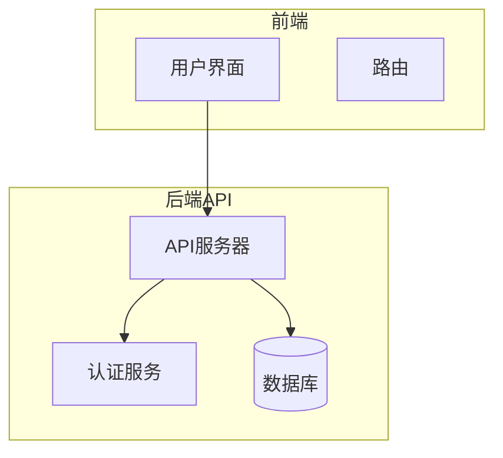
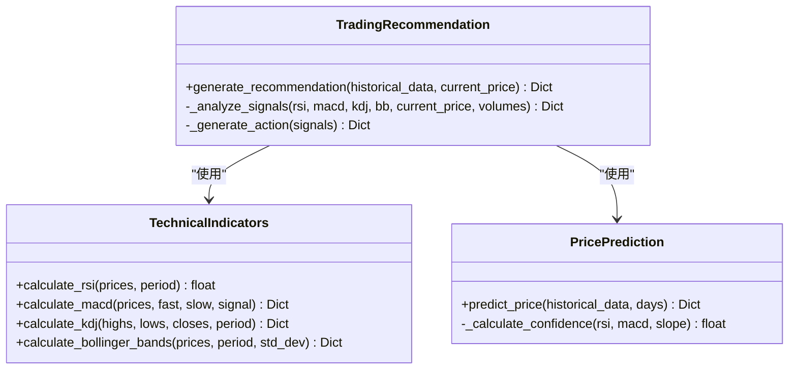
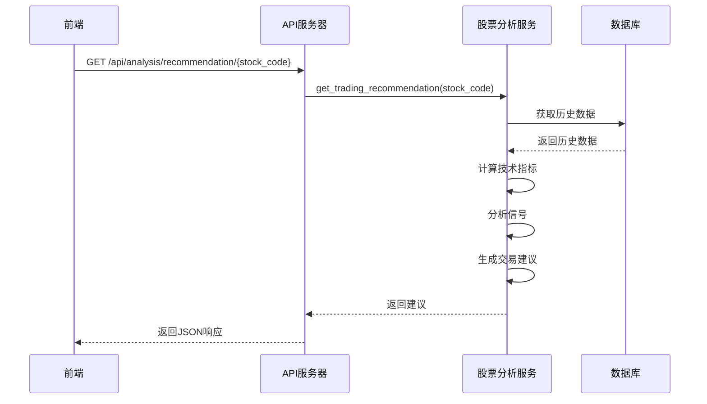
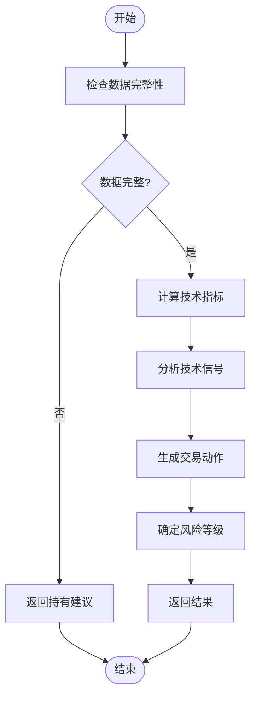
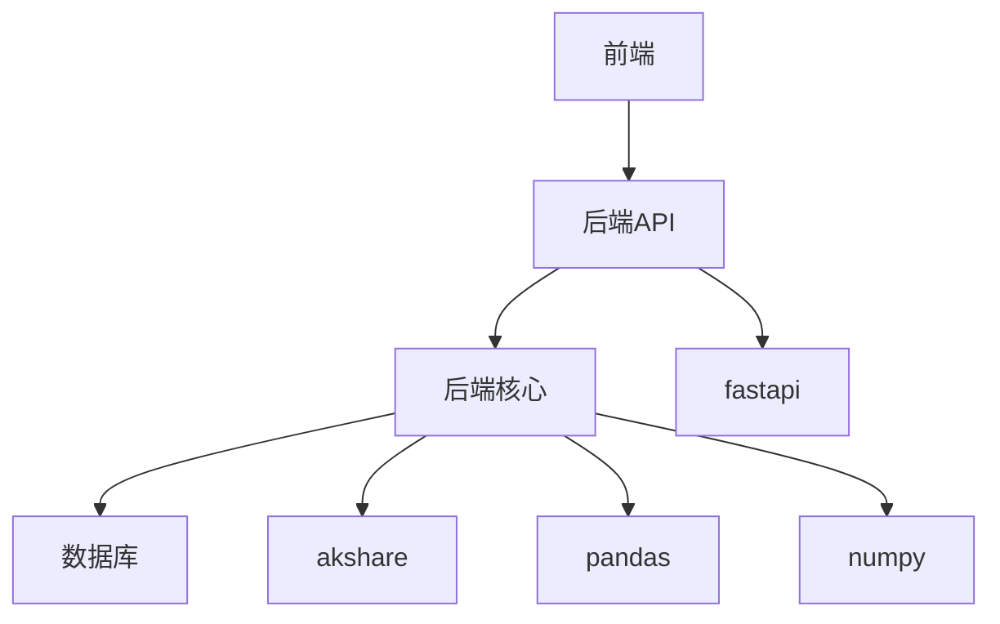

# 交易建议生成

<cite>
**本文档引用的文件**
- [stock_analysis.py](file://backend_api/stock/stock_analysis.py)
- [stock_analysis_routes.py](file://backend_api/stock/stock_analysis_routes.py)
- [stock.js](file://frontend/js/stock.js)
- [stock.css](file://frontend/css/stock.css)
</cite>

## 目录
1. [简介](#简介)
2. [项目结构](#项目结构)
3. [核心组件](#核心组件)
4. [架构概述](#架构概述)
5. [详细组件分析](#详细组件分析)
6. [依赖分析](#依赖分析)
7. [性能考虑](#性能考虑)
8. [故障排除指南](#故障排除指南)
9. [结论](#结论)
10. [附录](#附录)（如有必要）

## 简介
本文档全面解析了交易建议生成机制，重点说明了`get_trading_recommendation`接口的决策流程。系统通过整合技术指标信号、价格预测结果和风险评估模型，生成买入、持有或卖出建议。文档详细描述了风险等级（高/中/低）的评估标准，包括波动率、成交量变化和市场整体风险等因素的权重分配。同时，解释了建议强度评分的计算方法，并提供了交易建议生成的决策树逻辑，包括关键判断节点和阈值设置。此外，还包含接口使用示例、响应数据结构说明、错误处理机制以及建议更新频率策略。

## 项目结构
项目结构清晰地分为前端、后端API和后端核心三个主要部分。前端负责用户界面展示和交互，后端API处理HTTP请求和路由，后端核心则负责数据收集、分析和存储。这种分层架构确保了系统的可维护性和可扩展性。

## 核心组件
核心组件包括技术指标计算、价格预测、交易建议生成和关键价位分析。这些组件协同工作，为用户提供全面的股票分析服务。技术指标计算模块负责计算RSI、MACD、KDJ和布林带等常用技术指标。价格预测模块基于历史数据进行线性回归预测。交易建议生成模块综合技术指标和价格预测结果，生成最终的交易建议。关键价位分析模块则计算支撑位和阻力位，帮助用户识别重要的价格水平。

**核心组件**
- [stock_analysis.py](file://backend_api/stock/stock_analysis.py#L1-L805)
- [stock_analysis_routes.py](file://backend_api/stock/stock_analysis_routes.py#L1-L271)

## 架构概述
系统采用微服务架构，前端通过API与后端通信。后端API层负责处理所有HTTP请求，并将请求转发给相应的服务。后端核心层负责数据收集、分析和存储。数据库层使用PostgreSQL存储历史数据和实时行情。整个系统通过Docker容器化部署，确保了环境的一致性和可移植性。



**图表来源**
- [main.py](file://backend_api/main.py#L103-L128)
- [stock_analysis_routes.py](file://backend_api/stock/stock_analysis_routes.py#L1-L271)

## 详细组件分析
### 交易建议生成分析
交易建议生成是系统的核心功能之一。它通过分析多种技术指标和市场数据，为用户提供科学的投资建议。

#### 交易建议生成类


**图表来源**
- [stock_analysis.py](file://backend_api/stock/stock_analysis.py#L186-L259)

#### 交易建议生成流程


**图表来源**
- [stock_analysis_routes.py](file://backend_api/stock/stock_analysis_routes.py#L1-L271)
- [stock_analysis.py](file://backend_api/stock/stock_analysis.py#L186-L259)

#### 交易建议生成决策逻辑


**图表来源**
- [stock_analysis.py](file://backend_api/stock/stock_analysis.py#L186-L259)

**核心组件**
- [stock_analysis.py](file://backend_api/stock/stock_analysis.py#L186-L259)
- [stock_analysis_routes.py](file://backend_api/stock/stock_analysis_routes.py#L1-L271)

## 依赖分析
系统依赖于多个外部库和内部模块。主要外部依赖包括akshare用于数据采集，pandas和numpy用于数据分析，fastapi用于构建API。内部模块之间通过清晰的接口进行通信，确保了低耦合和高内聚。



**图表来源**
- [requirements.txt](file://requirements.txt#L1-L10)
- [stock_analysis.py](file://backend_api/stock/stock_analysis.py#L1-L805)

**依赖分析**
- [requirements.txt](file://requirements.txt#L1-L10)
- [stock_analysis.py](file://backend_api/stock/stock_analysis.py#L1-L805)

## 性能考虑
系统在设计时充分考虑了性能因素。通过缓存机制减少数据库查询次数，使用异步处理提高响应速度，以及优化算法降低计算复杂度。此外，系统还实现了负载均衡和自动扩展，以应对高并发场景。

## 故障排除指南
当遇到问题时，首先检查日志文件以获取错误信息。常见的问题包括数据库连接失败、API调用超时和数据格式错误。对于数据库连接问题，检查数据库配置和网络连接。对于API调用超时，检查网络状况和服务器负载。对于数据格式错误，检查输入数据是否符合预期格式。

**故障排除指南**
- [logs.py](file://backend_api/admin/logs.py#L1-L50)
- [debug.py](file://backend_api/debug.py#L1-L40)

## 结论
本文档详细介绍了交易建议生成机制的各个方面，从架构设计到具体实现，再到性能优化和故障排除。通过遵循本文档的指导，开发人员可以更好地理解和维护该系统，确保其稳定高效地运行。

## 附录
### 接口使用示例
```python
import requests

url = "http://localhost:5000/api/analysis/recommendation/000001"
response = requests.get(url)
print(response.json())
```

### 响应数据结构
```json
{
  "success": true,
  "data": {
    "action": "buy",
    "reasons": [
      "RSI超卖，存在反弹机会",
      "MACD金叉，趋势向上"
    ],
    "risk_level": "low",
    "strength": 80
  }
}
```

### 错误处理机制
- 400 Bad Request: 输入参数错误
- 404 Not Found: 股票代码不存在
- 500 Internal Server Error: 服务器内部错误

### 建议更新频率策略
建议每15分钟更新一次交易建议，以平衡实时性和系统负载。