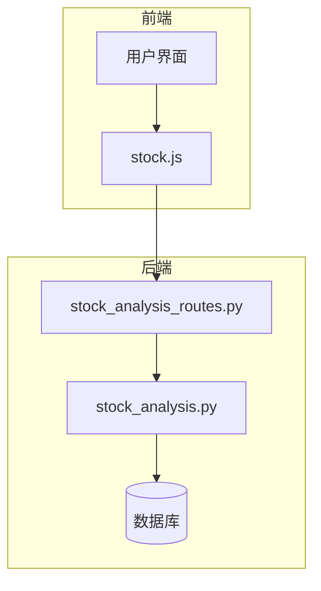
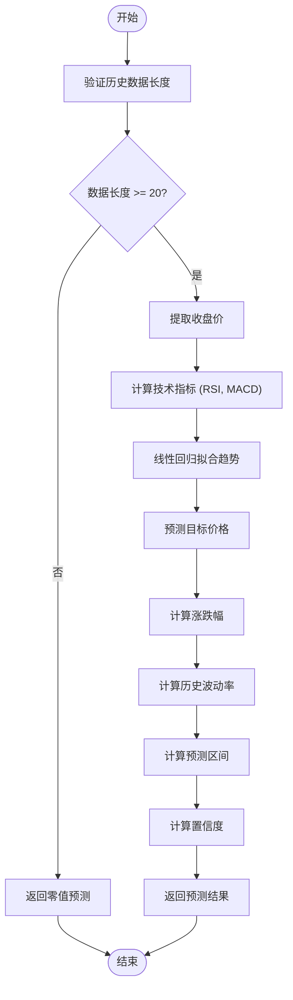
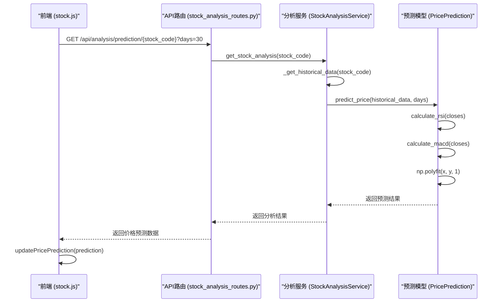
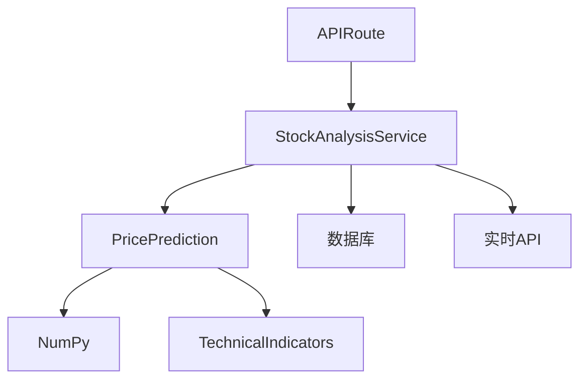

# 价格预测模型

<cite>
**本文档引用的文件**   
- [stock_analysis.py](file://backend_api/stock/stock_analysis.py)
- [stock_analysis_routes.py](file://backend_api/stock/stock_analysis_routes.py)
- [stock.js](file://frontend/js/stock.js)
</cite>

## 目录
1. [简介](#简介)
2. [项目结构](#项目结构)
3. [核心组件](#核心组件)
4. [架构概述](#架构概述)
5. [详细组件分析](#详细组件分析)
6. [依赖分析](#依赖分析)
7. [性能考虑](#性能考虑)
8. [故障排除指南](#故障排除指南)
9. [结论](#结论)
10. [附录](#附录)（如有必要）

## 简介
本文档详细解析了股票分析软件中的价格预测模型，重点阐述了`get_price_prediction`接口的预测算法原理。该模型通过综合历史价格走势、技术指标信号和市场情绪因素，为用户提供股票价格的目标价格、涨跌幅预测和置信度评估。文档将深入说明预测模型的计算方法、接口调用示例、输入验证规则、异常处理策略以及预测结果的缓存更新机制。

## 项目结构
项目采用前后端分离的架构，前端位于`frontend`目录，后端API服务位于`backend_api`目录。价格预测的核心逻辑实现在`backend_api/stock/stock_analysis.py`文件中，通过`backend_api/stock/stock_analysis_routes.py`文件中的API路由对外提供服务。前端通过`frontend/js/stock.js`文件调用后端API并更新UI。



**图表来源**
- [stock_analysis.py](file://backend_api/stock/stock_analysis.py#L113-L191)
- [stock_analysis_routes.py](file://backend_api/stock/stock_analysis_routes.py#L140-L169)
- [stock.js](file://frontend/js/stock.js#L1015-L1047)

**章节来源**
- [stock_analysis.py](file://backend_api/stock/stock_analysis.py#L0-L805)
- [stock_analysis_routes.py](file://backend_api/stock/stock_analysis_routes.py#L0-L271)
- [stock.js](file://frontend/js/stock.js#L0-L2762)

## 核心组件
价格预测模型的核心组件包括`PricePrediction`类和`StockAnalysisService`类。`PricePrediction`类负责具体的预测算法实现，而`StockAnalysisService`类负责协调数据获取、技术指标计算和预测结果的整合。

**章节来源**
- [stock_analysis.py](file://backend_api/stock/stock_analysis.py#L113-L191)

## 架构概述
系统架构分为前端展示层、后端服务层和数据存储层。前端通过API调用获取预测结果，后端服务层负责数据处理和模型计算，数据存储层提供历史数据支持。


**图表来源**
- [stock_analysis.py](file://backend_api/stock/stock_analysis.py#L113-L191)
- [stock_analysis_routes.py](file://backend_api/stock/stock_analysis_routes.py#L140-L169)
- [stock.js](file://frontend/js/stock.js#L1015-L1047)

## 详细组件分析
### 价格预测组件分析
`PricePrediction`类实现了基于历史数据的价格预测算法。该算法结合了线性回归、技术指标信号和市场情绪因素，生成目标价格、涨跌幅和置信度评估。

#### 价格预测算法流程图


**图表来源**
- [stock_analysis.py](file://backend_api/stock/stock_analysis.py#L113-L191)

#### 价格预测接口序列图


**图表来源**
- [stock_analysis_routes.py](file://backend_api/stock/stock_analysis_routes.py#L140-L169)
- [stock_analysis.py](file://backend_api/stock/stock_analysis.py#L113-L191)
- [stock.js](file://frontend/js/stock.js#L1015-L1047)

**章节来源**
- [stock_analysis.py](file://backend_api/stock/stock_analysis.py#L113-L191)
- [stock_analysis_routes.py](file://backend_api/stock/stock_analysis_routes.py#L140-L169)
- [stock.js](file://frontend/js/stock.js#L1015-L1047)

## 依赖分析
价格预测模型依赖于多个外部库和内部模块。主要依赖包括NumPy用于数值计算，SQLAlchemy用于数据库操作，以及akshare用于实时数据获取。



**图表来源**
- [stock_analysis.py](file://backend_api/stock/stock_analysis.py#L0-L805)
- [stock_analysis_routes.py](file://backend_api/stock/stock_analysis_routes.py#L0-L271)

**章节来源**
- [stock_analysis.py](file://backend_api/stock/stock_analysis.py#L0-L805)
- [stock_analysis_routes.py](file://backend_api/stock/stock_analysis_routes.py#L0-L271)

## 性能考虑
价格预测模型的性能主要受历史数据长度和预测天数的影响。模型使用线性回归算法，计算复杂度为O(n)，其中n为历史数据点数。对于大量请求，建议实现结果缓存机制以提高响应速度。

## 故障排除指南
当价格预测功能出现问题时，可以按照以下步骤进行排查：
1. 检查历史数据是否足够（至少20个数据点）
2. 验证股票代码格式是否正确（6位数字）
3. 确认数据库连接是否正常
4. 检查实时API是否可用

**章节来源**
- [stock_analysis.py](file://backend_api/stock/stock_analysis.py#L113-L191)
- [stock_analysis_routes.py](file://backend_api/stock/stock_analysis_routes.py#L140-L169)

## 结论
本文档详细解析了股票分析软件中的价格预测模型，涵盖了算法原理、系统架构、核心组件和故障排除等方面。该模型通过综合多种因素进行预测，为用户提供有价值的参考信息。未来可以考虑引入更复杂的机器学习模型（如LSTM、XGBoost）来提高预测精度。

## 附录
### 接口调用示例
```bash
GET /api/analysis/prediction/000001?days=30
```

### 输入验证规则
- 股票代码：必须为6位数字
- 预测天数：1-365天

### 异常处理策略
- 数据不足时返回零值预测
- 数据库连接失败时返回错误信息
- 实时API调用失败时使用数据库数据作为备选