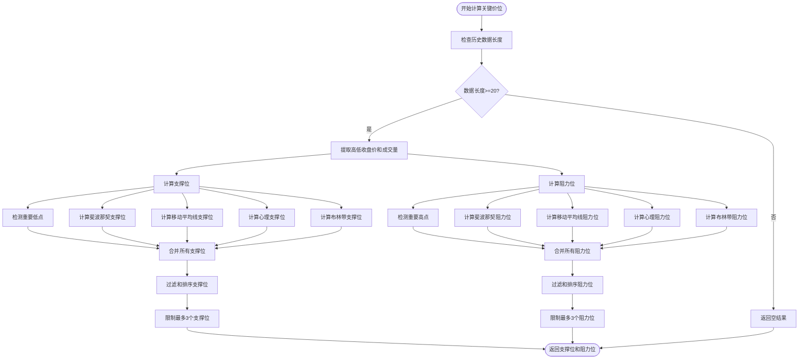
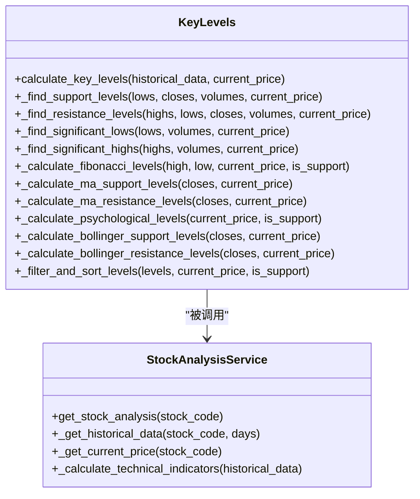
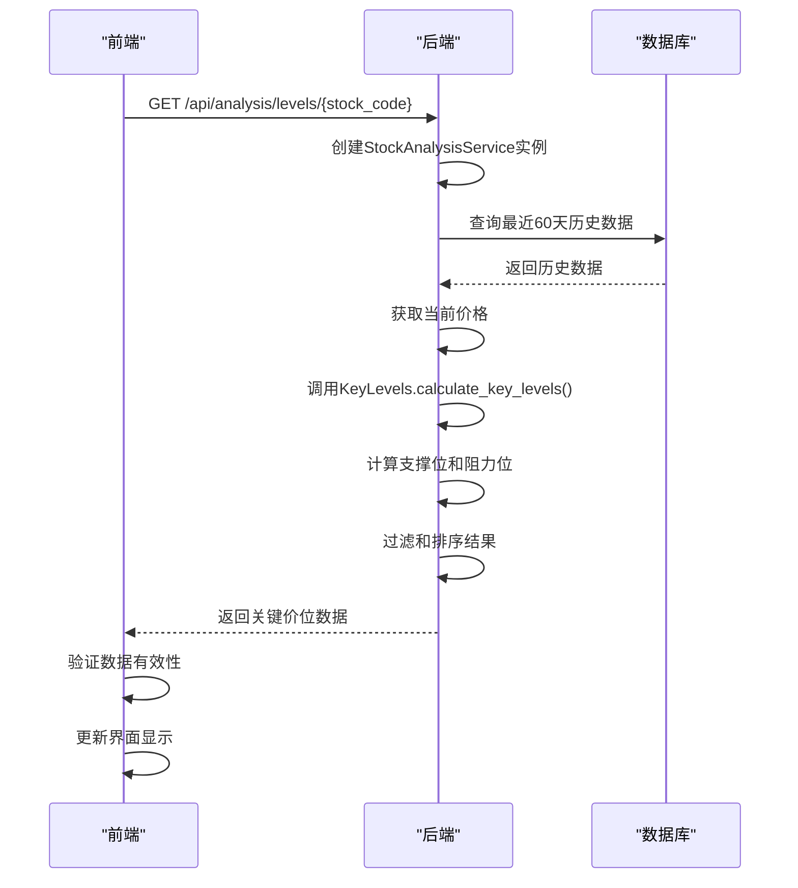

# 关键价位识别

<cite>
**本文档引用的文件**   
- [stock_analysis.py](file://backend_api/stock/stock_analysis.py)
- [stock_analysis_routes.py](file://backend_api/stock/stock_analysis_routes.py)
- [test_key_levels.py](file://backend_api/test/test_key_levels.py)
- [test_support_resistance_logic.py](file://test/test_support_resistance_logic.py)
- [stock.js](file://frontend/js/stock.js)
</cite>

## 目录
1. [接口概述](#接口概述)
2. [算法组合应用](#算法组合应用)
3. [强度评分机制](#强度评分机制)
4. [动态调整机制](#动态调整机制)
5. [接口调用示例](#接口调用示例)
6. [性能优化措施](#性能优化措施)

## 接口概述

`get_key_levels` 接口用于获取股票的关键支撑位和阻力位。该接口通过分析历史价格数据和当前市场价格，识别出对未来价格走势具有重要影响的关键价位。

**Section sources**
- [stock_analysis_routes.py](file://backend_api/stock/stock_analysis_routes.py#L174-L210)

## 算法组合应用

系统采用多种算法的组合来识别关键价位，确保识别结果的准确性和可靠性。

### 枢轴点计算
系统使用改进的极值检测算法来寻找重要高点和低点。对于支撑位，系统检测局部最低点；对于阻力位，系统检测局部最高点。检测过程中考虑了成交量因素，只有成交量超过平均值80%的重要价位才会被采纳。

### 斐波那契回撤位分析
系统计算斐波那契回调位，使用常见的比例0.236、0.382、0.5、0.618和0.786。只有当高低点差距大于当前价格5%时，才会计算斐波那契位，以避免在价格波动较小的情况下产生误导性结果。

### 历史价格密集区检测
系统结合多种方法检测历史价格密集区：
- **移动平均线**：计算5、10、20、30和60日移动平均线作为支撑/阻力位
- **心理价位**：识别整数价位和半整数价位（如10.5、9.5）作为心理支撑/阻力位
- **布林带**：使用布林带上轨和下轨作为阻力位和支撑位



**Diagram sources **
- [stock_analysis.py](file://backend_api/stock/stock_analysis.py#L318-L635)

**Section sources**
- [stock_analysis.py](file://backend_api/stock/stock_analysis.py#L318-L635)

## 强度评分机制

虽然代码中没有直接实现强度评分，但系统通过多种因素间接评估关键价位的重要性：

### 成交量验证
系统在检测重要高点和低点时，考虑了成交量因素。只有成交量超过平均值80%的价位才会被采纳，这确保了关键价位得到了市场参与者的充分验证。

### 测试次数
系统通过滑动窗口算法检测局部极值，窗口大小为3，这相当于要求价位在至少3个交易日内保持其极值特性，间接反映了价位的测试次数。

### 时间衰减因素
系统优先考虑近期的历史数据（最近20个交易日），这体现了时间衰减的思想，即近期的价格行为比远期的价格行为更具参考价值。



**Diagram sources **
- [stock_analysis.py](file://backend_api/stock/stock_analysis.py#L318-L635)

**Section sources**
- [stock_analysis.py](file://backend_api/stock/stock_analysis.py#L318-L635)

## 动态调整机制

系统通过以下机制实现关键价位的动态调整：

### 基于最新价格行为的更新
每次调用`get_key_levels`接口时，系统都会获取最新的历史数据和当前价格，重新计算关键价位。这确保了识别结果始终反映最新的市场状况。

### 价格过滤规则
系统实施严格的过滤规则，确保：
- 支撑位必须严格小于当前价格
- 阻力位必须严格大于当前价格
- 价位必须为正数

### 去重和排序
系统通过以下方式处理识别出的关键价位：
- 去除重复的价位
- 按与当前价格的距离排序（支撑位从高到低，阻力位从低到高）
- 去除过于接近的价位（最小距离为当前价格的1.5%）



**Diagram sources **
- [stock_analysis_routes.py](file://backend_api/stock/stock_analysis_routes.py#L174-L210)
- [stock_analysis.py](file://backend_api/stock/stock_analysis.py#L318-L635)
- [stock.js](file://frontend/js/stock.js#L1138-L1187)

**Section sources**
- [stock_analysis_routes.py](file://backend_api/stock/stock_analysis_routes.py#L174-L210)
- [stock_analysis.py](file://backend_api/stock/stock_analysis.py#L318-L635)
- [stock.js](file://frontend/js/stock.js#L1138-L1187)

## 接口调用示例

### 请求参数
- `stock_code`: 股票代码（6位数字）

### 响应数据格式
```json
{
  "success": true,
  "data": {
    "resistance_levels": [32.5, 33.2, 33.8],
    "support_levels": [30.2, 29.8, 29.5],
    "current_price": 31.5
  }
}
```

### 错误处理策略
- **数据不足错误**：当历史数据少于20条时，返回空的支撑位和阻力位列表
- **股票代码格式错误**：返回400状态码和错误信息
- **系统错误**：返回500状态码和错误信息

**Section sources**
- [stock_analysis_routes.py](file://backend_api/stock/stock_analysis_routes.py#L174-L210)
- [stock_analysis.py](file://backend_api/stock/stock_analysis.py#L318-L635)

## 性能优化措施

### 预计算
系统在`StockAnalysisService.get_stock_analysis`方法中一次性计算所有分析结果，包括技术指标、价格预测、交易建议和关键价位，避免了重复计算。

### 缓存更新机制
虽然代码中没有显式的缓存机制，但系统通过以下方式优化性能：
- 限制历史数据查询为最近60天
- 限制返回的关键价位数量（最多3个）
- 使用高效的算法和数据结构进行计算

**Section sources**
- [stock_analysis.py](file://backend_api/stock/stock_analysis.py#L318-L635)