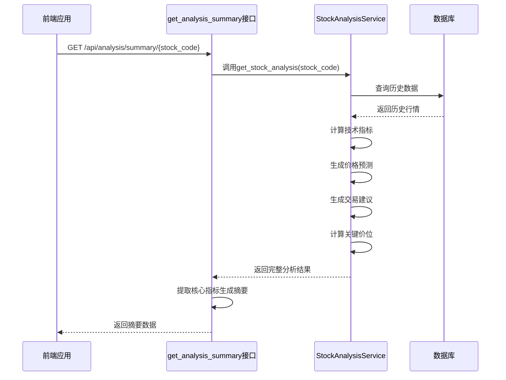
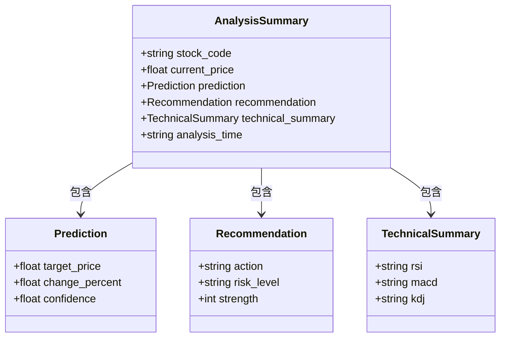
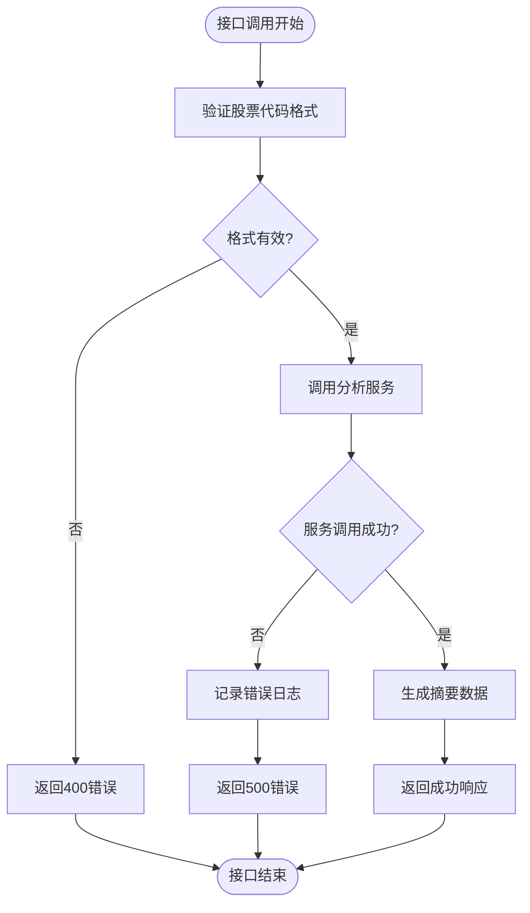
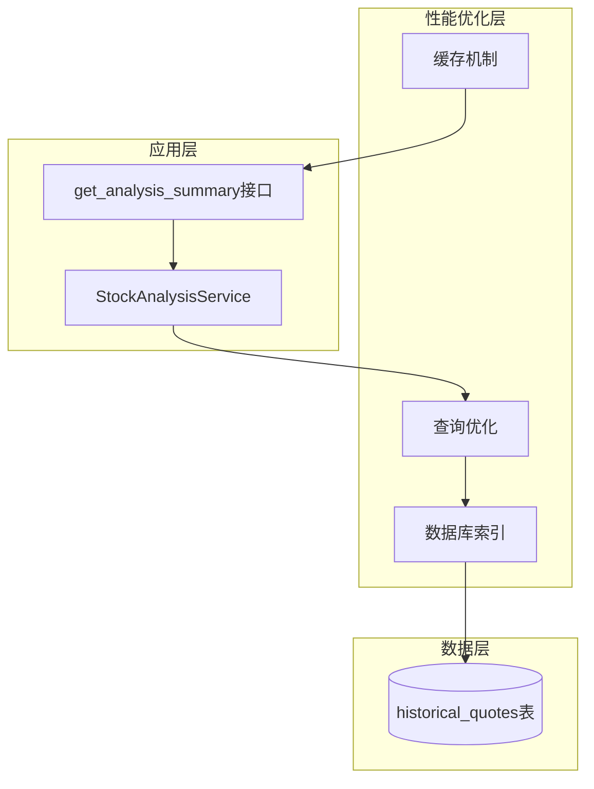
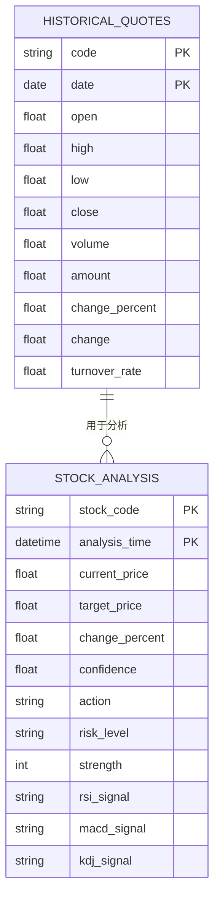

# 分析摘要接口

<cite>
**本文档中引用的文件**   
- [stock_analysis_routes.py](file://backend_api/stock/stock_analysis_routes.py)
- [stock_analysis.py](file://backend_api/stock/stock_analysis.py)
- [config.py](file://backend_api/config.py)
- [main.py](file://backend_api/main.py)
</cite>

## 目录
1. [简介](#简介)
2. [核心组件](#核心组件)
3. [接口实现逻辑](#接口实现逻辑)
4. [数据结构设计](#数据结构设计)
5. [错误处理机制](#错误处理机制)
6. [性能优化策略](#性能优化策略)
7. [数据一致性保证](#数据一致性保证)
8. [接口调用示例](#接口调用示例)
9. [结论](#结论)

## 简介
分析摘要接口（get_analysis_summary）是股票分析系统中的核心接口之一，旨在为移动端和快速查看场景提供简化版的分析结果。该接口从完整的分析数据中提取关键指标，生成轻量化的摘要信息，确保用户能够快速获取最重要的投资决策依据。通过聚合当前价格、目标价格、涨跌幅、置信度、交易动作、风险等级等核心数据，该接口实现了高效的数据展示和用户体验优化。

## 核心组件

分析摘要接口依赖于多个核心组件协同工作，包括股票分析服务类（StockAnalysisService）、技术指标计算类（TechnicalIndicators）、价格预测类（PricePrediction）、交易建议类（TradingRecommendation）和关键价位分析类（KeyLevels）。这些组件共同构成了完整的分析引擎，为摘要接口提供数据支持。

**Section sources**
- [stock_analysis.py](file://backend_api/stock/stock_analysis.py#L637-L804)
- [stock_analysis_routes.py](file://backend_api/stock/stock_analysis_routes.py#L210-L270)

## 接口实现逻辑



**Diagram sources **
- [stock_analysis_routes.py](file://backend_api/stock/stock_analysis_routes.py#L210-L270)
- [stock_analysis.py](file://backend_api/stock/stock_analysis.py#L637-L804)

**Section sources**
- [stock_analysis_routes.py](file://backend_api/stock/stock_analysis_routes.py#L210-L270)

## 数据结构设计



**Diagram sources **
- [stock_analysis_routes.py](file://backend_api/stock/stock_analysis_routes.py#L210-L270)

**Section sources**
- [stock_analysis_routes.py](file://backend_api/stock/stock_analysis_routes.py#L210-L270)

## 错误处理机制

分析摘要接口实现了完善的错误处理机制，确保在各种异常情况下都能返回有意义的响应。当获取分析数据失败时，接口会捕获异常并返回相应的错误信息，同时记录详细的错误日志用于后续排查。



**Diagram sources **
- [stock_analysis_routes.py](file://backend_api/stock/stock_analysis_routes.py#L210-L270)

**Section sources**
- [stock_analysis_routes.py](file://backend_api/stock/stock_analysis_routes.py#L210-L270)

## 性能优化策略

为了提高接口响应速度，系统采用了多种性能优化策略。虽然当前代码中未直接实现缓存机制，但通过FastAPI框架和数据库查询优化，已经具备了良好的性能基础。建议后续可以引入Redis等缓存系统来进一步提升性能。



**Diagram sources **
- [stock_analysis_routes.py](file://backend_api/stock/stock_analysis_routes.py#L210-L270)
- [stock_analysis.py](file://backend_api/stock/stock_analysis.py#L637-L804)
- [config.py](file://backend_api/config.py#L1-L48)

## 数据一致性保证

分析摘要接口通过与详细分析接口共享相同的数据源和服务逻辑，确保了数据的一致性。所有分析结果都基于相同的算法和数据处理流程生成，避免了不同接口间的数据差异。



**Diagram sources **
- [stock_analysis.py](file://backend_api/stock/stock_analysis.py#L637-L804)

**Section sources**
- [stock_analysis.py](file://backend_api/stock/stock_analysis.py#L637-L804)

## 接口调用示例

以下是分析摘要接口的调用示例，展示了如何获取特定股票的分析摘要：

```mermaid
sequenceDiagram
participant Client as 客户端
participant Server as 服务器
Client->>Server : GET /api/analysis/summary/000001
Server->>Server : 验证股票代码
Server->>Server : 调用StockAnalysisService
Server->>Server : 获取完整分析数据
Server->>Server : 提取核心指标
Server-->>Client : HTTP 200 OK
Note over Client,Server : {
"success" : true,
"data" : {
"stock_code" : "000001",
"current_price" : 15.68,
"prediction" : {
"target_price" : 18.25,
"change_percent" : 16.4,
"confidence" : 75.0
},
"recommendation" : {
"action" : "buy",
"risk_level" : "medium",
"strength" : 75
},
"technical_summary" : {
"rsi" : "中性",
"macd" : "看多",
"kdj" : "中性"
},
"analysis_time" : "2024-01-01 10 : 30 : 00"
}
}
```

**Diagram sources **
- [stock_analysis_routes.py](file://backend_api/stock/stock_analysis_routes.py#L210-L270)

**Section sources**
- [stock_analysis_routes.py](file://backend_api/stock/stock_analysis_routes.py#L210-L270)

## 结论

分析摘要接口通过精心设计的数据结构和高效的实现逻辑，成功实现了从完整分析数据中提取核心指标的功能。该接口不仅满足了移动端和快速查看场景下的性能要求，还通过统一的数据源和服务逻辑保证了与其他详细分析接口的数据一致性。未来可以通过引入缓存机制进一步提升接口响应速度，为用户提供更加流畅的使用体验。