# 技术分析API

<cite>
**本文档引用的文件**  
- [stock_analysis_routes.py](file://backend_api/stock/stock_analysis_routes.py)
- [stock_analysis.py](file://backend_api/stock/stock_analysis.py)
</cite>

## 目录
1. [接口概览](#接口概览)
2. [主分析接口](#主分析接口)
3. [技术指标接口](#技术指标接口)
4. [价格预测接口](#价格预测接口)
5. [交易建议接口](#交易建议接口)
6. [关键价位接口](#关键价位接口)
7. [分析摘要接口](#分析摘要接口)
8. [输入验证与错误处理](#输入验证与错误处理)
9. [性能与缓存策略](#性能与缓存策略)

## 接口概览

技术分析API提供了一套完整的股票智能分析功能，通过多个端点为前端应用提供多维度的分析数据。API设计遵循RESTful原则，所有接口均位于`/api/analysis`前缀下，返回统一的JSON响应格式。

```mermaid
graph TB
subgraph "技术分析API"
A[/api/analysis/stock/{stock_code}\] --> B[获取完整分析]
C[/api/analysis/technical/{stock_code}\] --> D[获取技术指标]
E[/api/analysis/prediction/{stock_code}\] --> F[获取价格预测]
G[/api/analysis/recommendation/{stock_code}\] --> H[获取交易建议]
I[/api/analysis/levels/{stock_code}\] --> J[获取关键价位]
K[/api/analysis/summary/{stock_code}\] --> L[获取分析摘要]
end
B --> M[技术指标]
B --> N[价格预测]
B --> O[交易建议]
B --> P[关键价位]
style A fill:#4CAF50,stroke:#388E3C,color:white
style C fill:#2196F3,stroke:#1976D2,color:white
style E fill:#FF9800,stroke:#F57C00,color:white
style G fill:#9C27B0,stroke:#7B1FA2,color:white
style I fill:#F44336,stroke:#D32F2F,color:white
style K fill:#607D8B,stroke:#455A64,color:white
```

**Diagram sources**  
- [stock_analysis_routes.py](file://backend_api/stock/stock_analysis_routes.py#L1-L270)

**Section sources**  
- [stock_analysis_routes.py](file://backend_api/stock/stock_analysis_routes.py#L1-L270)

## 主分析接口

`/api/analysis/stock/{stock_code}` 接口是技术分析的核心端点，整合了所有分析模块的结果，提供全面的智能分析报告。

该接口通过`StockAnalysisService`服务类协调各个分析组件，将技术指标、价格预测、交易建议和关键价位等多维度分析结果整合为一个完整的JSON响应。接口首先验证股票代码格式，然后调用分析服务获取结果，最后返回标准化的响应。

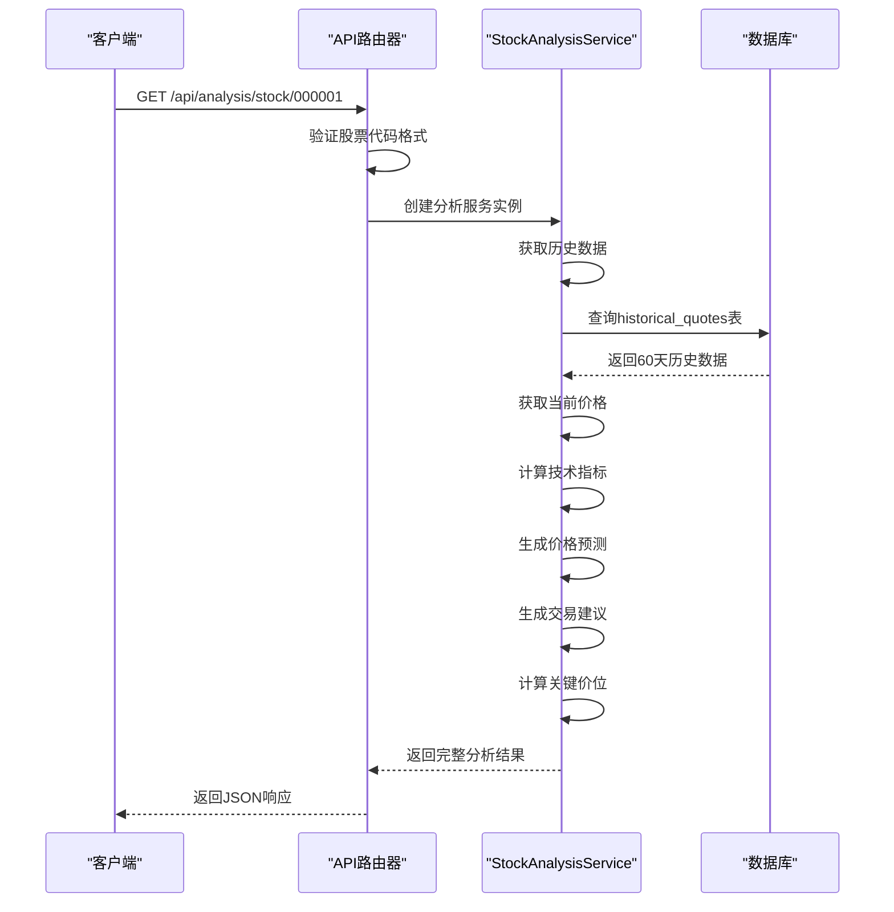

**Diagram sources**  
- [stock_analysis_routes.py](file://backend_api/stock/stock_analysis_routes.py#L15-L45)
- [stock_analysis.py](file://backend_api/stock/stock_analysis.py#L300-L350)

**Section sources**  
- [stock_analysis_routes.py](file://backend_api/stock/stock_analysis_routes.py#L15-L45)
- [stock_analysis.py](file://backend_api/stock/stock_analysis.py#L300-L350)

## 技术指标接口

`/api/analysis/technical/{stock_code}` 接口提供详细的RSI、MACD、KDJ和布林带等技术指标数据。

### RSI指标计算

RSI（相对强弱指数）通过比较一定周期内的平均涨幅和平均跌幅来衡量市场超买超卖状态。

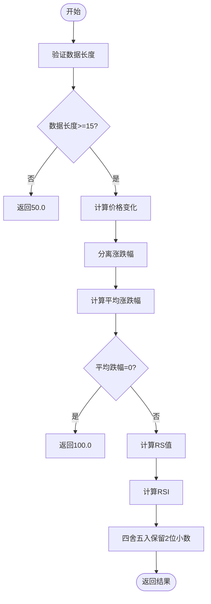

**Diagram sources**  
- [stock_analysis.py](file://backend_api/stock/stock_analysis.py#L20-L35)

### MACD指标计算

MACD（指数平滑异同移动平均线）通过快慢两条指数移动平均线的差值来判断市场趋势。

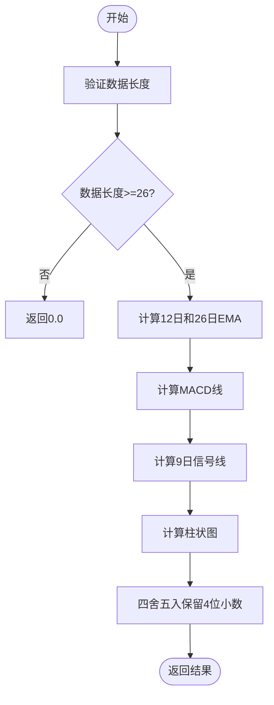

**Diagram sources**  
- [stock_analysis.py](file://backend_api/stock/stock_analysis.py#L37-L55)

### KDJ指标计算

KDJ指标通过计算未成熟随机值（RSV）并进行平滑处理，生成K、D、J三条线来判断市场状态。

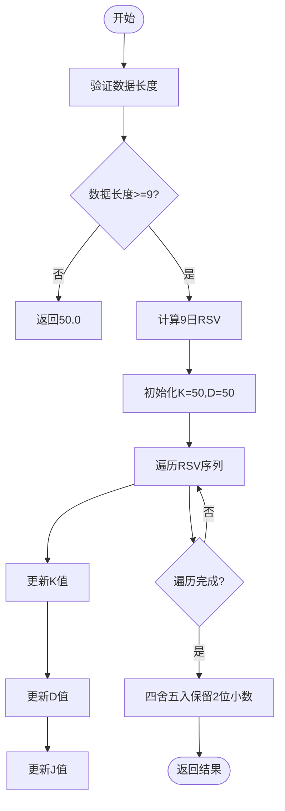

**Diagram sources**  
- [stock_analysis.py](file://backend_api/stock/stock_analysis.py#L57-L75)

### 布林带计算

布林带通过计算移动平均线和标准差，形成上轨、中轨和下轨三条轨道来判断价格波动范围。

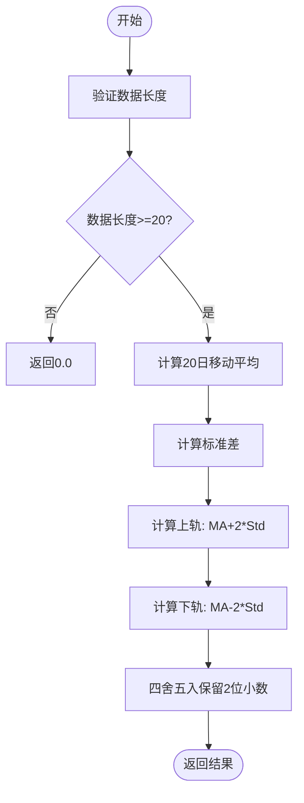

**Diagram sources**  
- [stock_analysis.py](file://backend_api/stock/stock_analysis.py#L77-L90)

**Section sources**  
- [stock_analysis.py](file://backend_api/stock/stock_analysis.py#L20-L90)

## 价格预测接口

`/api/analysis/prediction/{stock_code}` 接口提供基于历史数据的价格预测功能，支持1-365天的预测周期。

### 预测算法原理

价格预测采用线性回归模型结合技术指标置信度评估的方法。首先通过线性回归计算价格趋势，然后结合技术指标的一致性来评估预测的置信度。

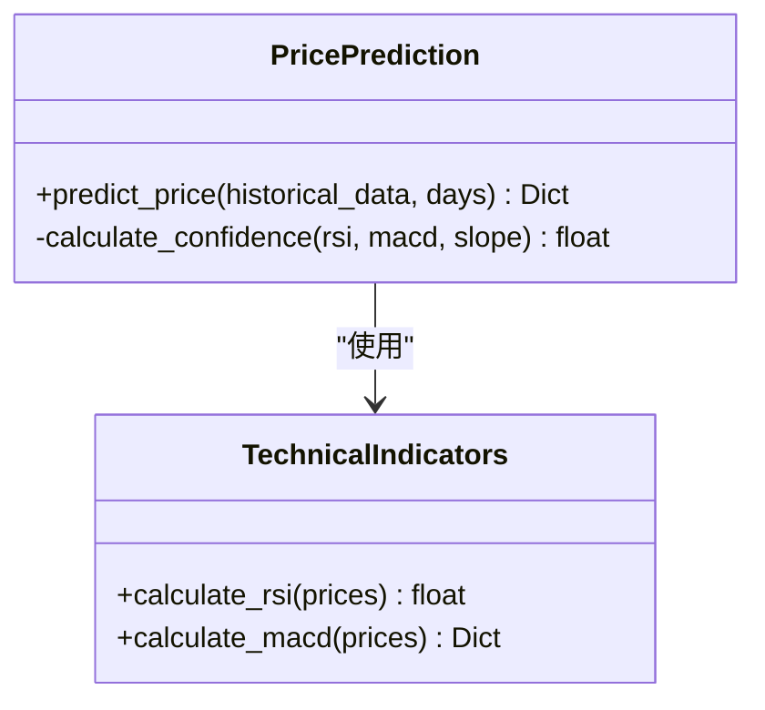

**Diagram sources**  
- [stock_analysis.py](file://backend_api/stock/stock_analysis.py#L92-L150)

### 置信度评估机制

预测置信度基于技术指标的一致性进行评估，基础置信度为50%，根据各指标信号进行调整：

- **RSI调整**：30-70区间增加10%，超买超卖减少5%
- **MACD调整**：金叉增加15%，死叉减少10%
- **趋势调整**：上升趋势增加10%，下降趋势减少10%

最终置信度限制在0-100%范围内。

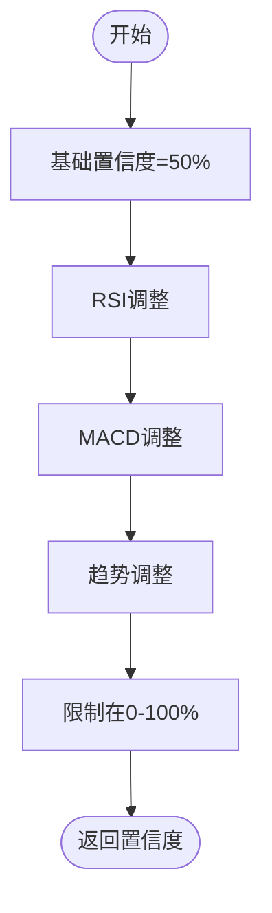

**Diagram sources**  
- [stock_analysis.py](file://backend_api/stock/stock_analysis.py#L135-L150)

**Section sources**  
- [stock_analysis.py](file://backend_api/stock/stock_analysis.py#L92-L150)

## 交易建议接口

`/api/analysis/recommendation/{stock_code}` 接口根据综合技术分析生成交易建议，包括买入、卖出或持有操作。

### 决策流程

交易建议的生成基于多指标信号的综合分析，每个技术指标产生一个信号，系统根据信号的强度和一致性做出决策。

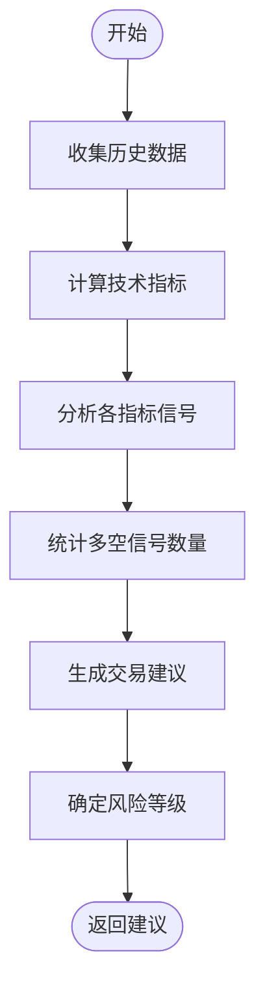

**Diagram sources**  
- [stock_analysis.py](file://backend_api/stock/stock_analysis.py#L152-L250)

### 风险等级评估标准

风险等级根据建议的强度来确定：

- **低风险**：强度≥80%
- **中风险**：强度≥60%
- **高风险**：强度<60%

建议强度由信号数量决定，每个有效信号增加25%强度，最多100%。

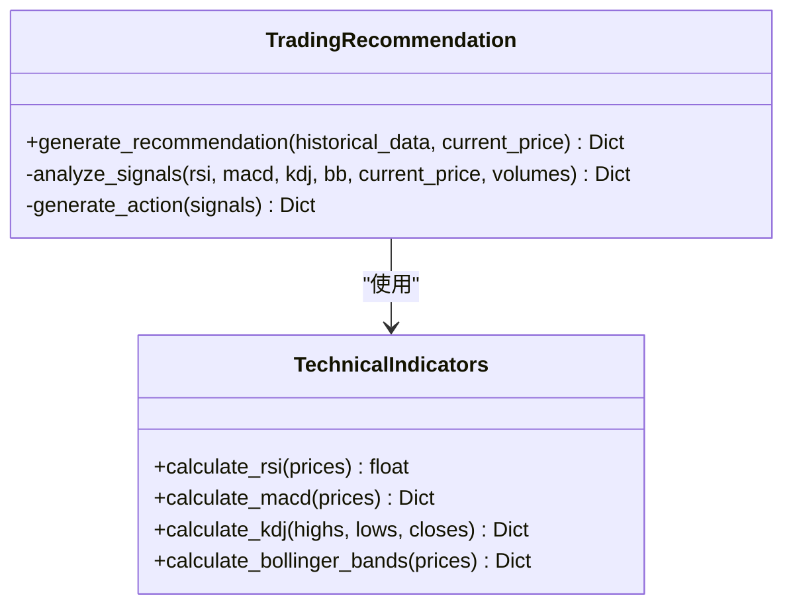

**Diagram sources**  
- [stock_analysis.py](file://backend_api/stock/stock_analysis.py#L152-L250)

**Section sources**  
- [stock_analysis.py](file://backend_api/stock/stock_analysis.py#L152-L250)

## 关键价位接口

`/api/analysis/levels/{stock_code}` 接口识别股票的关键支撑位和阻力位，为交易决策提供重要参考。

### 支撑位识别

支撑位的识别采用多维度综合方法，包括：

1. **重要低点**：基于成交量加权的局部最低点
2. **斐波那契回调位**：基于近期高低点的黄金分割位
3. **移动平均线**：5、10、20、30、60日均线
4. **心理价位**：整数价位和半整数价位
5. **布林带下轨**：价格波动的理论下限

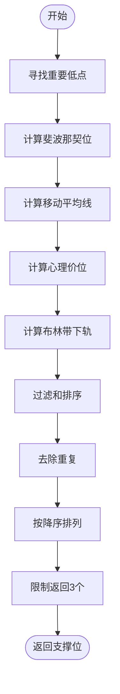

**Diagram sources**  
- [stock_analysis.py](file://backend_api/stock/stock_analysis.py#L252-L450)

### 阻力位识别

阻力位的识别方法与支撑位类似，但方向相反：

1. **重要高点**：基于成交量加权的局部最高点
2. **斐波那契扩展位**：基于近期高低点的黄金分割位
3. **移动平均线**：5、10、20、30、60日均线
4. **心理价位**：整数价位和半整数价位
5. **布林带上轨**：价格波动的理论上限

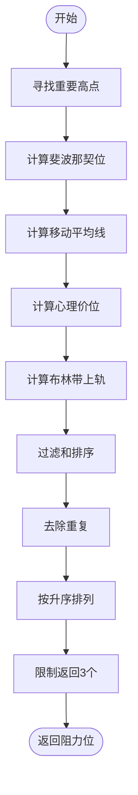

**Diagram sources**  
- [stock_analysis.py](file://backend_api/stock/stock_analysis.py#L252-L450)

**Section sources**  
- [stock_analysis.py](file://backend_api/stock/stock_analysis.py#L252-L450)

## 分析摘要接口

`/api/analysis/summary/{stock_code}` 接口提供简化版的分析摘要，聚合核心指标便于快速查看。

### 摘要内容

分析摘要包含以下关键信息：

- **股票基本信息**：股票代码、当前价格
- **价格预测**：目标价格、预期涨跌幅、置信度
- **交易建议**：操作建议、风险等级、建议强度
- **技术摘要**：RSI、MACD、KDJ信号
- **分析时间**：结果生成时间

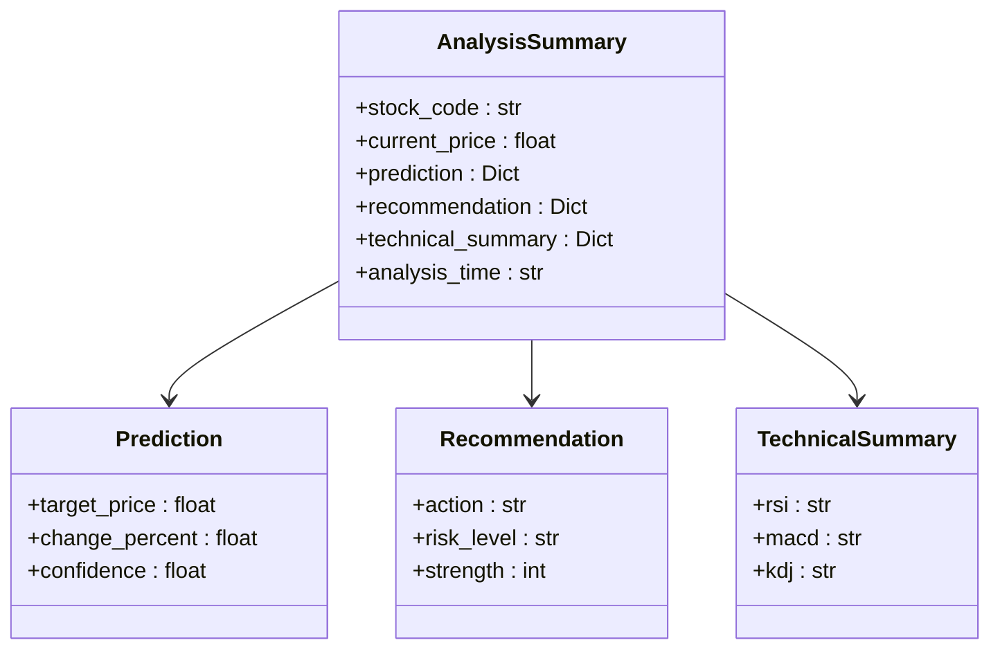

**Diagram sources**  
- [stock_analysis_routes.py](file://backend_api/stock/stock_analysis_routes.py#L220-L270)

**Section sources**  
- [stock_analysis_routes.py](file://backend_api/stock/stock_analysis_routes.py#L220-L270)

## 输入验证与错误处理

API实现了全面的输入验证和错误处理机制，确保系统的稳定性和可靠性。

### 输入验证

所有接口都对股票代码进行格式验证，要求必须是6位数字：

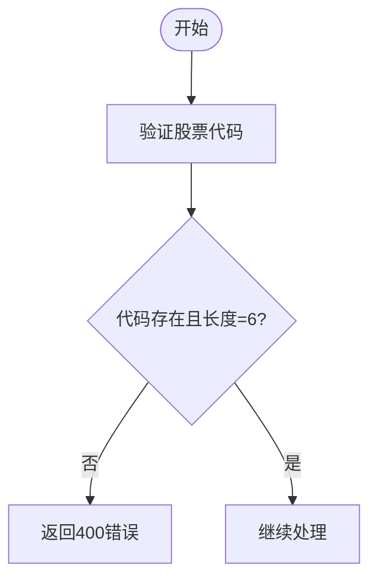

**Section sources**  
- [stock_analysis_routes.py](file://backend_api/stock/stock_analysis_routes.py#L20-L25)

### 错误处理

系统采用统一的错误处理策略，所有异常都会被捕获并记录日志，然后返回标准化的错误响应：

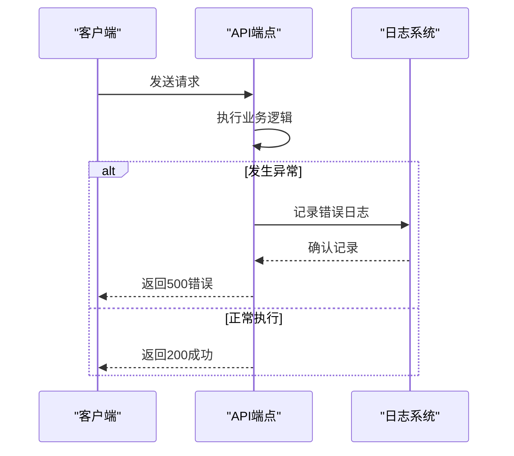

**Diagram sources**  
- [stock_analysis_routes.py](file://backend_api/stock/stock_analysis_routes.py#L25-L45)

**Section sources**  
- [stock_analysis_routes.py](file://backend_api/stock/stock_analysis_routes.py#L25-L45)

## 性能与缓存策略

### 性能监控

虽然当前代码中没有显式的性能监控代码，但系统通过日志记录了关键操作的执行情况，为性能分析提供了基础数据。

### 缓存策略

当前实现中未包含显式的缓存机制。所有请求都会实时计算分析结果，这确保了数据的实时性，但可能影响高并发场景下的性能表现。

**Section sources**  
- [stock_analysis_routes.py](file://backend_api/stock/stock_analysis_routes.py#L1-L270)
- [stock_analysis.py](file://backend_api/stock/stock_analysis.py#L1-L805)