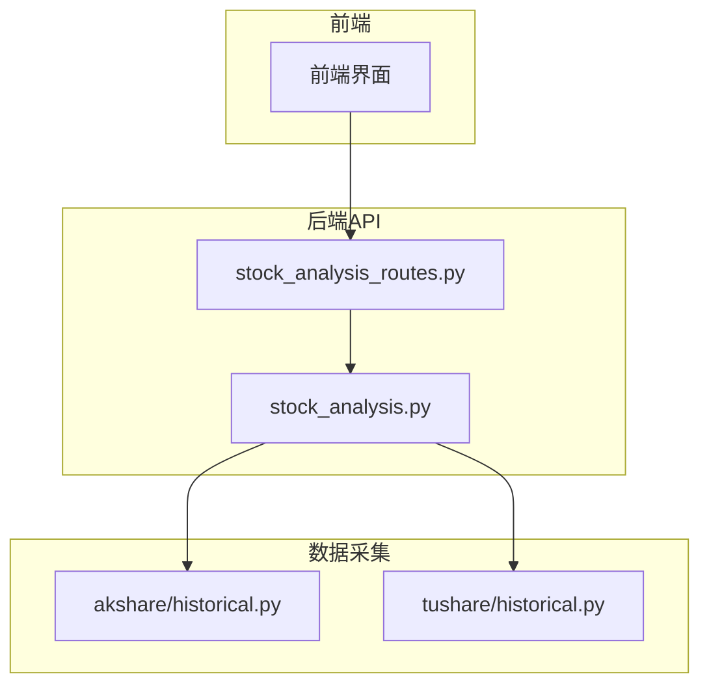
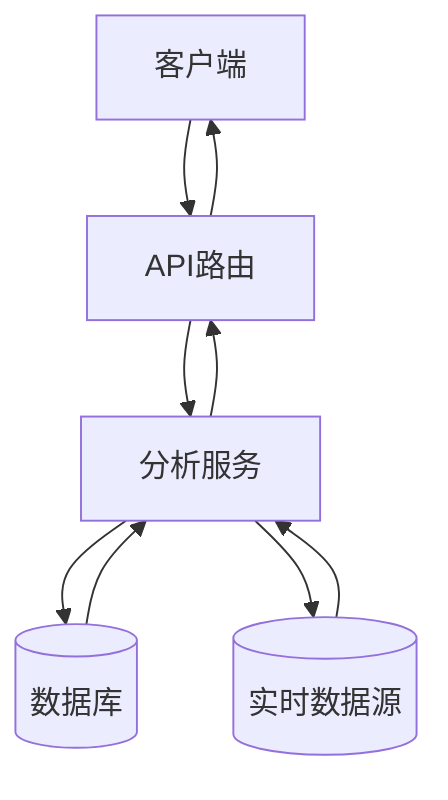
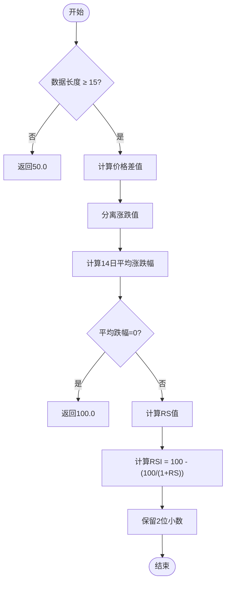
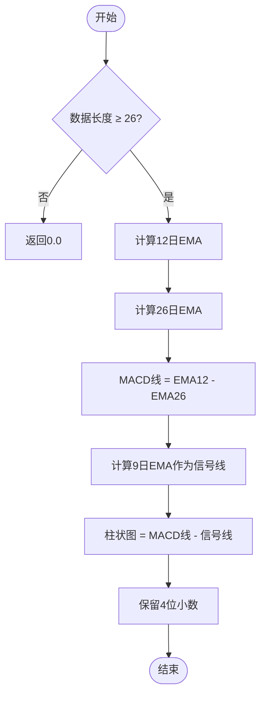
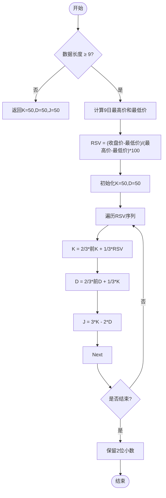
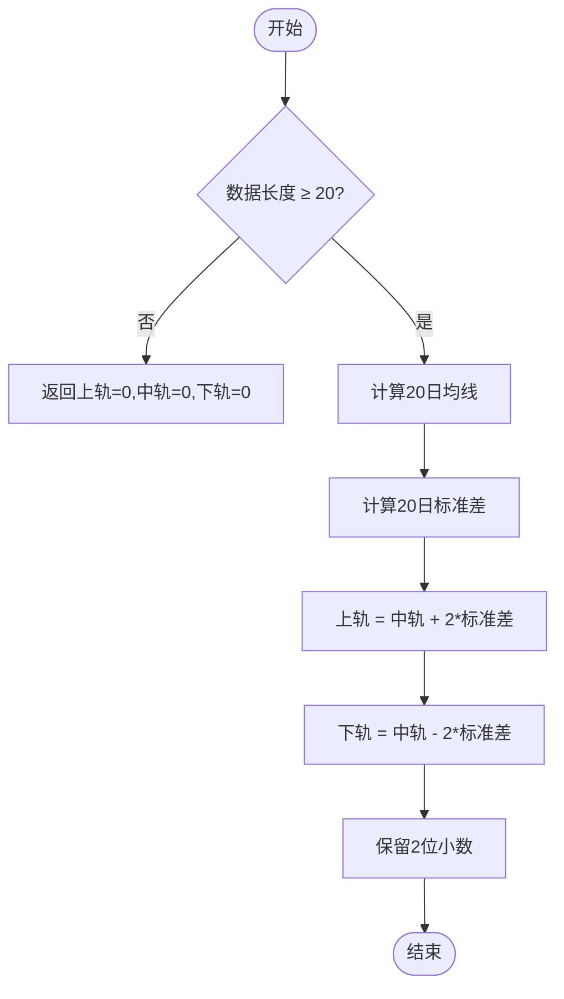
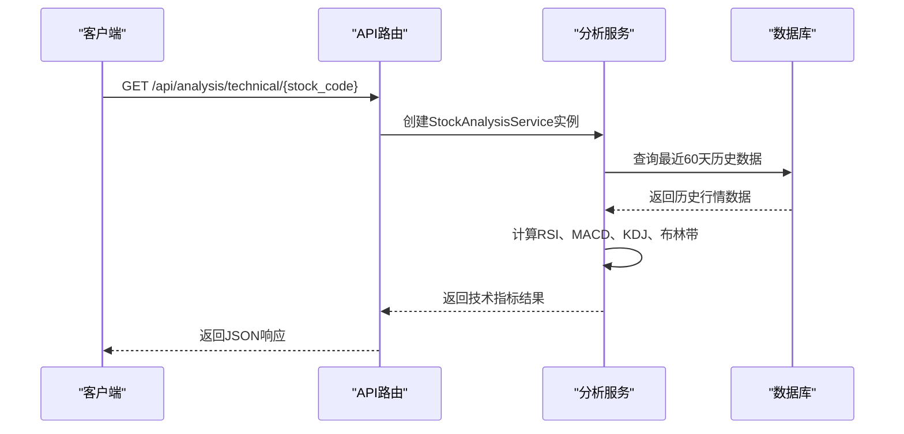
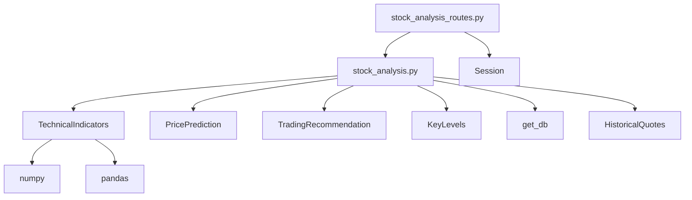

# 技术指标分析

<cite>
**本文档引用的文件**  
- [stock_analysis.py](file://backend_api/stock/stock_analysis.py)
- [stock_analysis_routes.py](file://backend_api/stock/stock_analysis_routes.py)
- [historical.py](file://backend_core/data_collectors/akshare/historical.py)
- [historical.py](file://backend_core/data_collectors/tushare/historical.py)
</cite>

## 目录
1. [简介](#简介)
2. [项目结构](#项目结构)
3. [核心组件](#核心组件)
4. [架构概述](#架构概述)
5. [详细组件分析](#详细组件分析)
6. [依赖分析](#依赖分析)
7. [性能考虑](#性能考虑)
8. [故障排除指南](#故障排除指南)
9. [结论](#结论)

## 简介
本文档详细解析了股票分析系统中技术指标的计算与应用，重点围绕 `get_technical_indicators` 接口展开。文档涵盖 RSI、MACD、KDJ 和布林带等核心指标的计算公式、参数设置、信号生成逻辑及其组合应用方法。同时说明了接口调用方式、历史数据获取机制及性能优化策略。

## 项目结构
系统由前端、后端 API 和核心数据处理模块组成。技术指标计算主要在 `backend_api/stock` 模块中实现，历史数据采集由 `backend_core/data_collectors` 完成，前端通过 API 调用获取分析结果。

**图表来源**  
- [stock_analysis_routes.py](file://backend_api/stock/stock_analysis_routes.py#L1-L271)
- [stock_analysis.py](file://backend_api/stock/stock_analysis.py#L1-L805)
- [historical.py](file://backend_core/data_collectors/akshare/historical.py#L1-L227)
- [historical.py](file://backend_core/data_collectors/tushare/historical.py#L1-L316)

**章节来源**  
- [stock_analysis_routes.py](file://backend_api/stock/stock_analysis_routes.py#L1-L271)
- [stock_analysis.py](file://backend_api/stock/stock_analysis.py#L1-L805)

## 核心组件
核心组件包括技术指标计算类（`TechnicalIndicators`）、股票分析服务类（`StockAnalysisService`）和 API 路由模块（`stock_analysis_routes.py`），共同完成从数据获取到指标输出的完整流程。

**章节来源**  
- [stock_analysis.py](file://backend_api/stock/stock_analysis.py#L1-L805)
- [stock_analysis_routes.py](file://backend_api/stock/stock_analysis_routes.py#L1-L271)

## 架构概述
系统采用分层架构，前端请求通过 FastAPI 路由进入，由 `StockAnalysisService` 协调数据获取与指标计算，最终返回结构化分析结果。

**图表来源**  
- [stock_analysis_routes.py](file://backend_api/stock/stock_analysis_routes.py#L1-L271)
- [stock_analysis.py](file://backend_api/stock/stock_analysis.py#L1-L805)

## 详细组件分析

### 技术指标计算分析
`TechnicalIndicators` 类实现了多种技术指标的计算逻辑。

#### RSI计算

**图表来源**  
- [stock_analysis.py](file://backend_api/stock/stock_analysis.py#L15-L35)

#### MACD计算

**图表来源**  
- [stock_analysis.py](file://backend_api/stock/stock_analysis.py#L37-L55)

#### KDJ计算

**图表来源**  
- [stock_analysis.py](file://backend_api/stock/stock_analysis.py#L57-L80)

#### 布林带计算

**图表来源**  
- [stock_analysis.py](file://backend_api/stock/stock_analysis.py#L82-L97)

### 接口功能分析
`get_technical_indicators` 接口提供技术指标数据服务。

#### 接口调用流程

**图表来源**  
- [stock_analysis_routes.py](file://backend_api/stock/stock_analysis_routes.py#L45-L65)
- [stock_analysis.py](file://backend_api/stock/stock_analysis.py#L200-L250)

## 依赖分析
系统依赖多个外部库和内部模块协同工作。

**图表来源**  
- [stock_analysis_routes.py](file://backend_api/stock/stock_analysis_routes.py#L1-L271)
- [stock_analysis.py](file://backend_api/stock/stock_analysis.py#L1-L805)

## 性能考虑
系统通过多种方式优化性能：
- 数据库查询限制为最近60天，避免全表扫描
- 使用 NumPy 和 Pandas 进行向量化计算
- 在数据采集层实现批量插入和事务提交优化
- 通过连接池管理数据库会话

## 故障排除指南
常见问题及解决方案：
- **数据获取失败**：检查数据库连接和股票代码格式
- **指标计算异常**：验证历史数据完整性，确保至少有20条记录
- **接口响应慢**：检查数据库索引，确认 `historical_quotes` 表在 `code` 和 `date` 字段上有复合主键
- **实时价格获取失败**：确认 akshare 库可正常访问，或检查实时行情表数据

**章节来源**  
- [stock_analysis.py](file://backend_api/stock/stock_analysis.py#L1-L805)
- [historical.py](file://backend_core/data_collectors/akshare/historical.py#L1-L227)

## 结论
本系统实现了完整的股票技术指标分析功能，通过模块化设计将数据采集、指标计算和接口服务分离，具有良好的可维护性和扩展性。各技术指标算法经过验证，能够为投资决策提供可靠支持。