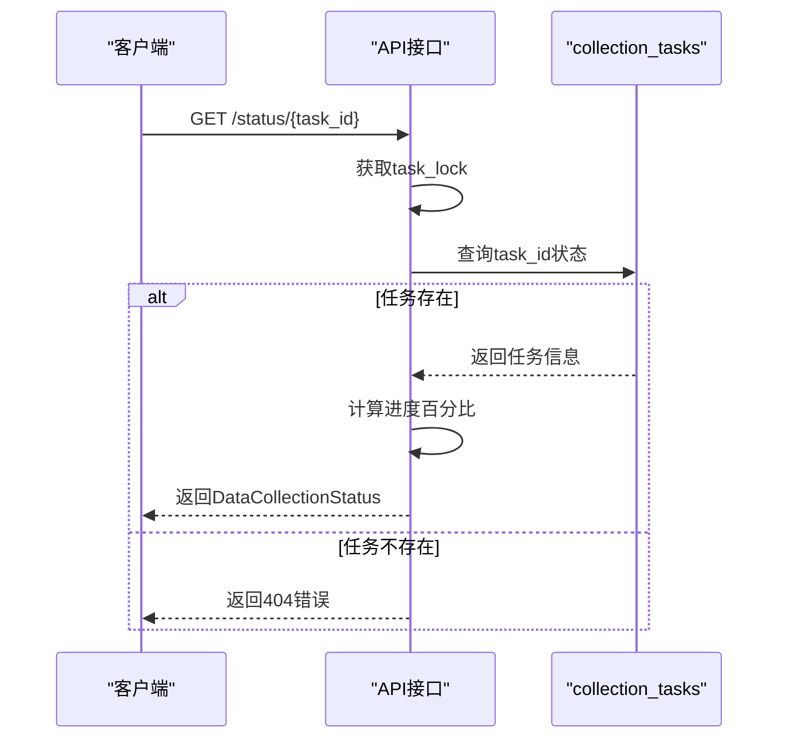
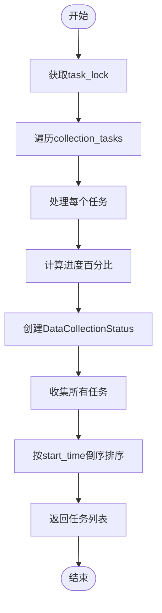
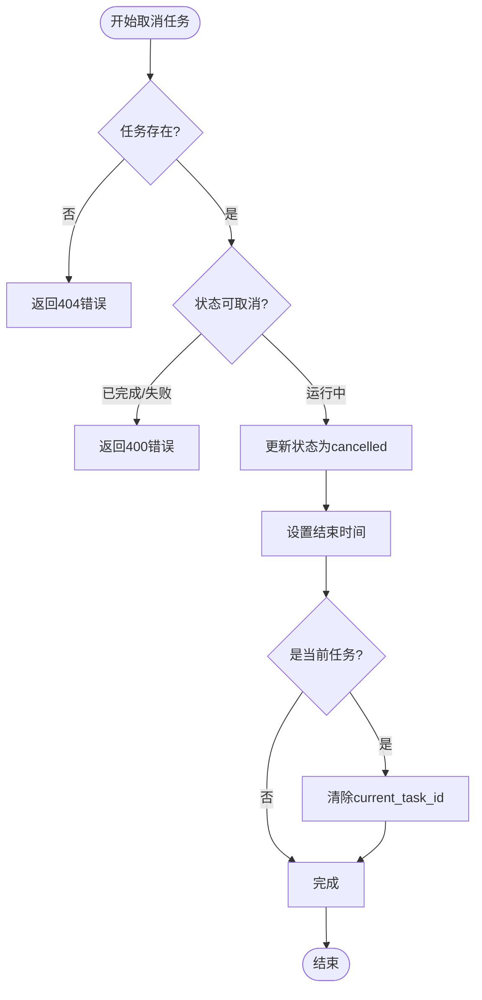
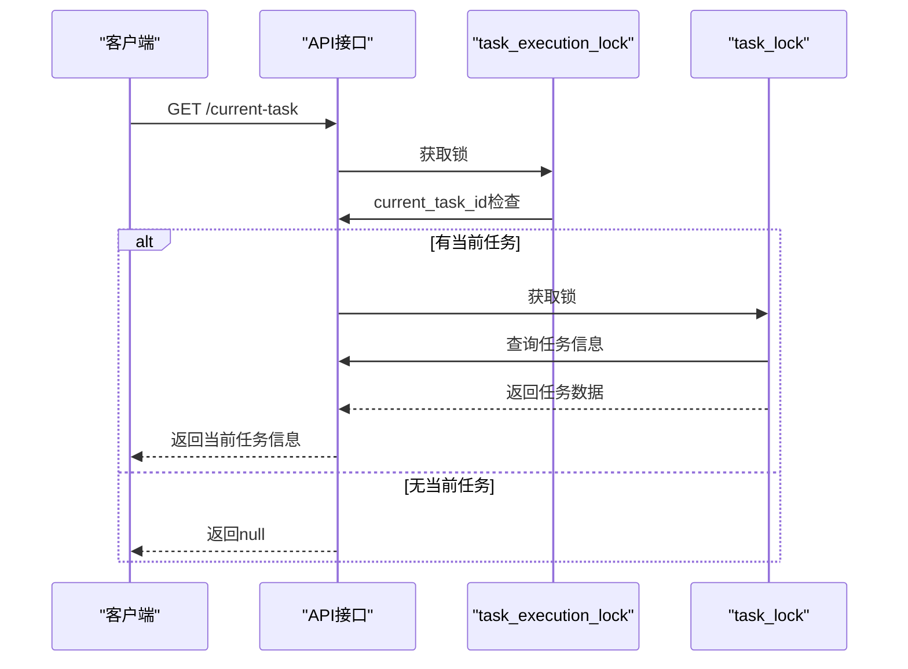
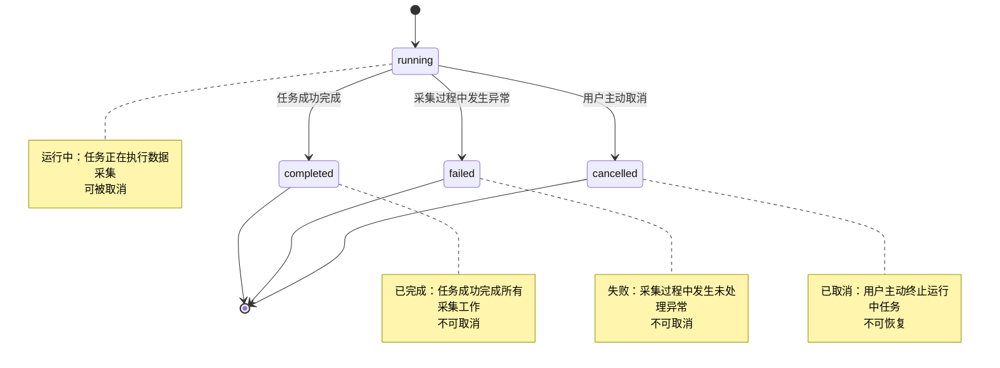

# 任务状态监控

<cite>
**本文档引用文件**   
- [data_collection_api.py](file://backend_api/stock/data_collection_api.py)
- [models.py](file://backend_api/models.py)
</cite>

## 目录
1. [任务状态监控](#任务状态监控)
2. [核心状态管理机制](#核心状态管理机制)
3. [任务状态查询接口](#任务状态查询接口)
4. [任务列表查询接口](#任务列表查询接口)
5. [任务取消接口](#任务取消接口)
6. [当前任务获取接口](#当前任务获取接口)
7. [任务状态转换说明](#任务状态转换说明)

## 核心状态管理机制

系统通过全局变量和线程锁机制实现任务状态的安全管理。`collection_tasks` 字典用于存储所有采集任务的实时状态信息，每个任务以任务ID为键，包含任务进度、股票处理数量、开始时间等关键字段。`current_task_id` 全局变量记录当前正在执行的任务ID，确保系统同一时间仅运行一个数据采集任务。

为保证多线程环境下的数据一致性，系统采用双重锁机制：`task_lock` 用于保护 `collection_tasks` 字典的读写操作，防止并发访问导致的数据竞争；`task_execution_lock` 用于保护 `current_task_id` 变量的修改，确保任务执行状态的原子性更新。

**Section sources**
- [data_collection_api.py](file://backend_api/stock/data_collection_api.py#L0-L645)

## 任务状态查询接口

### `/get_collection_status` 接口实现

`/get_collection_status` 接口通过任务ID查询 `collection_tasks` 字典中的实时状态信息。当请求到达时，系统首先在 `task_lock` 保护下检查任务ID是否存在，若不存在则返回404错误。

对于存在的任务，系统动态计算进度百分比：当 `total_stocks` 大于0时，进度值为 `(processed_stocks / total_stocks) * 100` 的整数部分，并通过 `min(100, ...)` 确保进度不会超过100%。接口返回 `DataCollectionStatus` 模型，包含任务ID、状态、进度、股票处理统计、时间戳等完整信息。

**Diagram sources**
- [data_collection_api.py](file://backend_api/stock/data_collection_api.py#L501-L533)

**Section sources**
- [data_collection_api.py](file://backend_api/stock/data_collection_api.py#L501-L533)
- [models.py](file://backend_api/models.py#L420-L434)

## 任务列表查询接口

### `/list_collection_tasks` 接口实现

`/list_collection_tasks` 接口返回所有采集任务的列表信息。系统在 `task_lock` 保护下遍历 `collection_tasks` 字典，为每个任务创建 `DataCollectionStatus` 响应对象，并同样动态计算进度百分比。

接口的核心特性是排序逻辑：所有任务按 `start_time` 字段进行倒序排列（`reverse=True`），确保最新创建的任务显示在列表最前面。这种排序方式便于用户快速查看最近执行的任务状态，符合常规的监控需求。

**Diagram sources**
- [data_collection_api.py](file://backend_api/stock/data_collection_api.py#L531-L559)

**Section sources**
- [data_collection_api.py](file://backend_api/stock/data_collection_api.py#L531-L559)

## 任务取消接口

### `/cancel_collection_task` 接口实现

`/cancel_collection_task` 接口实现任务取消功能，包含严格的取消条件判断。系统首先检查任务ID是否存在，若不存在返回404错误。对于存在的任务，系统验证其状态：仅当任务状态为"running"时允许取消，若状态为"completed"或"failed"则返回400错误，防止对已完成或失败的任务进行无效操作。

取消流程包括：将任务状态更新为"cancelled"，设置 `end_time` 为当前时间。特别地，如果取消的是当前正在运行的任务，系统会在 `task_execution_lock` 保护下将 `current_task_id` 重置为 `None`，释放任务执行锁，允许新的任务启动。

**Diagram sources**
- [data_collection_api.py](file://backend_api/stock/data_collection_api.py#L558-L590)

**Section sources**
- [data_collection_api.py](file://backend_api/stock/data_collection_api.py#L558-L590)

## 当前任务获取接口

### `/get_current_task` 接口实现

`/get_current_task` 接口通过双重锁机制安全地获取当前运行任务信息。系统首先在 `task_execution_lock` 保护下检查 `current_task_id` 是否为空，若为空则返回 `{"current_task": None}`。

当存在当前任务时，系统在 `task_lock` 保护下查询 `collection_tasks` 字典，获取任务的详细信息。接口仅返回任务ID、状态和开始时间三个核心字段，避免暴露过多内部状态。这种设计既满足了前端显示需求，又保证了系统的安全性。

**Diagram sources**
- [data_collection_api.py](file://backend_api/stock/data_collection_api.py#L620-L644)

**Section sources**
- [data_collection_api.py](file://backend_api/stock/data_collection_api.py#L620-L644)

## 任务状态转换说明

系统定义了四种主要任务状态，每种状态具有明确的业务含义和转换条件：

**状态转换条件与业务含义：**

- **running（运行中）**：任务已启动并正在处理股票数据。这是任务的初始状态，仅在此状态下可被取消。
- **completed（已完成）**：任务成功完成所有股票的数据采集，系统正常结束。状态转换发生在 `run_historical_collection_task` 函数成功执行完毕时。
- **failed（失败）**：任务执行过程中发生未捕获的异常，如网络错误或数据库连接失败。状态转换发生在异常处理的 `except` 块中。
- **cancelled（已取消）**：用户通过 `/cancel_collection_task` 接口主动取消运行中的任务。状态转换由用户操作触发，系统更新状态并终止任务。

**Section sources**
- [data_collection_api.py](file://backend_api/stock/data_collection_api.py#L469-L504)
- [data_collection_api.py](file://backend_api/stock/data_collection_api.py#L558-L590)
- [data_collection_api.py](file://backend_api/stock/data_collection_api.py#L620-L644)