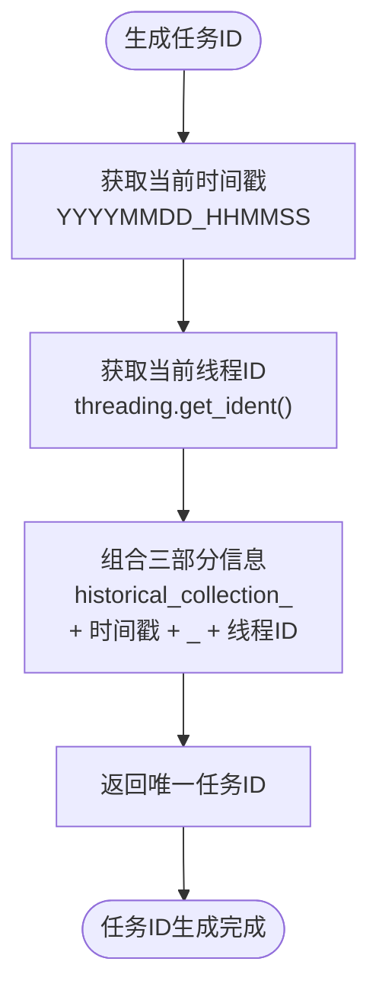
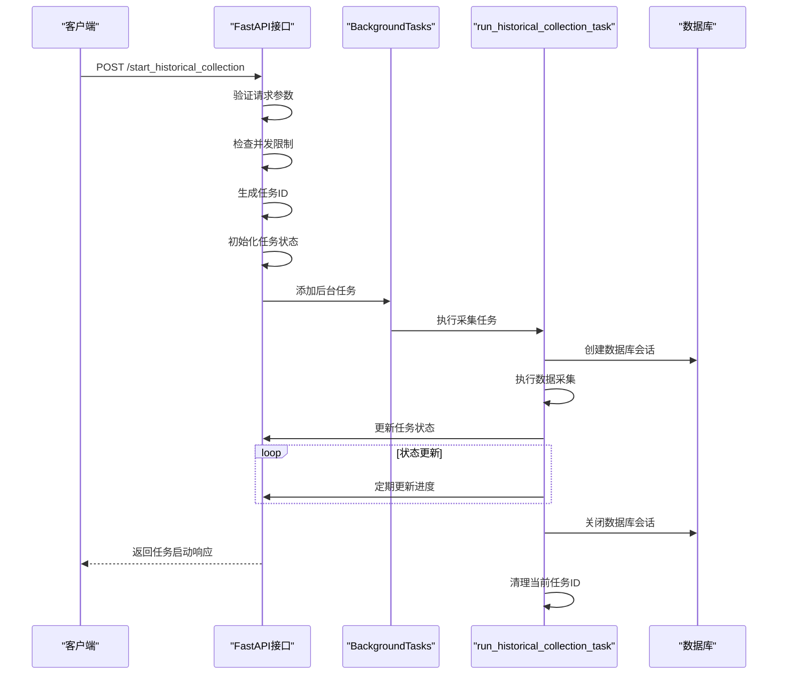
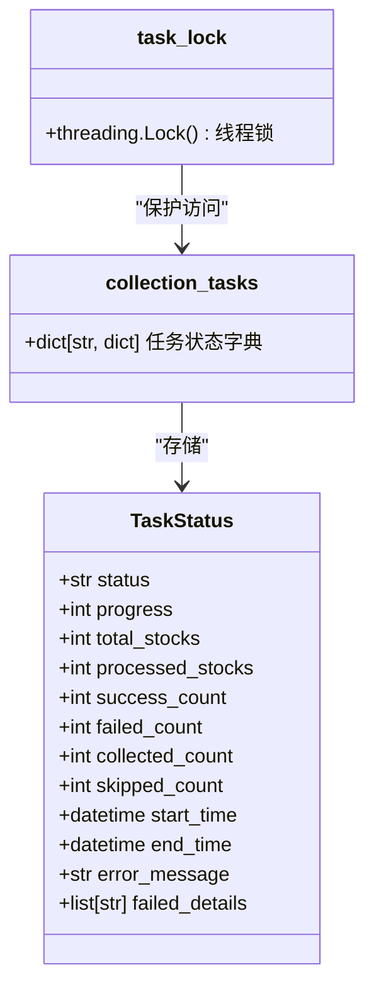
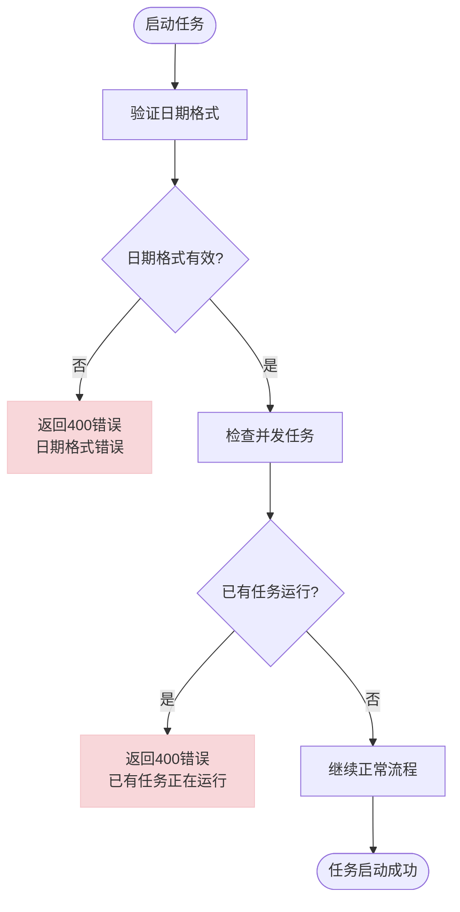

# 任务管理机制

<cite>
**本文档中引用的文件**   
- [data_collection_api.py](file://backend_api/stock/data_collection_api.py)
- [models.py](file://backend_api/models.py)
</cite>

## 目录
1. [任务管理机制](#任务管理机制)
2. [并发控制机制](#并发控制机制)
3. [任务ID生成策略](#任务id生成策略)
4. [后台任务调度流程](#后台任务调度流程)
5. [任务状态存储与线程安全](#任务状态存储与线程安全)
6. [异常处理机制](#异常处理机制)

## 并发控制机制

数据采集API通过两个全局锁实现并发控制，确保同一时间仅有一个采集任务运行。`current_task_id`变量用于标识当前正在运行的任务ID，而`task_execution_lock`锁用于保护对该变量的访问。

当客户端请求启动新的历史数据采集任务时，系统首先获取`task_execution_lock`锁，然后检查`current_task_id`是否为`None`。如果`current_task_id`不为`None`，说明已有任务正在运行，系统将返回400错误响应，提示"已有采集任务正在运行，请等待完成后再启动新任务"。只有当没有其他任务运行时，系统才会继续执行任务启动流程，并将当前任务ID赋值给`current_task_id`。

在任务执行完成后，无论成功或失败，系统都会在`finally`块中再次获取`task_execution_lock`锁，并将`current_task_id`重置为`None`，从而释放并发控制锁，允许新的任务启动。

**Section sources**
- [data_collection_api.py](file://backend_api/stock/data_collection_api.py#L29-L30)
- [data_collection_api.py](file://backend_api/stock/data_collection_api.py#L354-L424)
- [data_collection_api.py](file://backend_api/stock/data_collection_api.py#L426-L497)

## 任务ID生成策略

系统采用时间戳与线程ID组合的策略生成唯一任务ID，确保任务标识的全局唯一性。任务ID的生成格式为`historical_collection_YYYYMMDD_HHMMSS_threadID`，其中包含三个关键部分：前缀`historical_collection`标识任务类型，`YYYYMMDD_HHMMSS`格式的时间戳提供时间维度的唯一性保证，而`threading.get_ident()`获取的线程ID则确保在同一秒内启动的多个任务也能被区分。

这种组合策略有效避免了任务ID冲突的可能性。即使在高并发场景下，不同线程启动的任务也会因线程ID不同而具有唯一的任务ID。同时，时间戳的精确到秒的格式也降低了同一秒内启动多个任务的概率。任务ID作为字典`collection_tasks`的键，用于存储和检索任务的运行状态信息。

**Diagram sources**
- [data_collection_api.py](file://backend_api/stock/data_collection_api.py#L380-L380)

**Section sources**
- [data_collection_api.py](file://backend_api/stock/data_collection_api.py#L380-L380)

## 后台任务调度流程

系统采用FastAPI的BackgroundTasks机制实现后台任务调度，将耗时的数据采集操作从HTTP请求处理流程中解耦。当`/start_historical_collection`接口接收到请求后，立即返回任务启动成功的响应，同时通过`background_tasks.add_task()`方法将实际的数据采集工作委托给后台执行，确保API响应的及时性。

`run_historical_collection_task`函数作为后台任务的执行体，采用异步执行模型处理数据采集。该函数首先创建独立的数据库会话`SessionLocal()`，确保数据库操作的隔离性。任务执行完成后，无论成功与否，都会在`finally`块中显式调用`db.close()`关闭数据库连接，实现数据库会话的完整生命周期管理，防止连接泄漏。

后台任务执行过程中，系统会持续更新任务状态，包括处理进度、成功/失败计数等，并在任务结束时更新最终状态。这种设计模式既保证了API的响应性能，又确保了数据采集任务的可靠执行和资源的正确管理。

**Diagram sources**
- [data_collection_api.py](file://backend_api/stock/data_collection_api.py#L402-L402)
- [data_collection_api.py](file://backend_api/stock/data_collection_api.py#L426-L497)

**Section sources**
- [data_collection_api.py](file://backend_api/stock/data_collection_api.py#L402-L402)
- [data_collection_api.py](file://backend_api/stock/data_collection_api.py#L426-L497)

## 任务状态存储与线程安全

系统使用全局字典`collection_tasks`存储所有采集任务的状态信息，实现任务状态的持久化跟踪。该字典以任务ID为键，存储包含任务状态、进度、计数器和时间戳等信息的字典作为值。这种数据结构设计支持多任务并行管理，即使当前只有一个任务可以运行，系统仍能记录历史任务的状态供后续查询。

为确保对`collection_tasks`字典的线程安全访问，系统采用`task_lock`读写锁进行保护。每当需要读取或修改任务状态时，代码必须使用`with task_lock:`上下文管理器获取锁。这种机制防止了多线程环境下可能出现的数据竞争和状态不一致问题。例如，在更新任务进度或查询任务状态时，都必须先获取`task_lock`，确保操作的原子性。

`task_lock`与`task_execution_lock`分工明确：前者保护任务状态字典的访问，后者控制任务的并发执行。这种分离设计提高了系统的并发性能，允许状态查询操作与任务执行控制并行进行，而不会相互阻塞。

**Diagram sources**
- [data_collection_api.py](file://backend_api/stock/data_collection_api.py#L26-L27)
- [data_collection_api.py](file://backend_api/stock/data_collection_api.py#L370-L378)

**Section sources**
- [data_collection_api.py](file://backend_api/stock/data_collection_api.py#L26-L27)
- [data_collection_api.py](file://backend_api/stock/data_collection_api.py#L370-L378)

## 异常处理机制

系统在任务启动阶段实现了完善的异常处理机制，确保API的健壮性和用户体验。首先，系统会对请求中的日期格式进行严格验证，使用`datetime.strptime()`尝试解析`start_date`和`end_date`参数。如果日期格式不符合`YYYY-MM-DD`规范，系统将捕获`ValueError`异常，并返回400错误响应，提示"日期格式错误，请使用 YYYY-MM-DD 格式"。

其次，系统实现了重复任务检测机制。在启动新任务前，通过`task_execution_lock`锁保护的临界区检查`current_task_id`是否已存在。如果存在，说明已有任务正在运行，系统将主动抛出400错误，提示"已有采集任务正在运行，请等待完成后再启动新任务"，防止并发任务导致的数据混乱和资源竞争。

对于其他未预期的异常，系统采用顶层`try-catch`块进行捕获，记录详细的错误日志，并返回500服务器错误响应，包含错误信息的描述。这种分层异常处理策略既能处理预期的业务异常，又能妥善应对系统级错误，确保API的稳定运行。

**Diagram sources**
- [data_collection_api.py](file://backend_api/stock/data_collection_api.py#L358-L362)
- [data_collection_api.py](file://backend_api/stock/data_collection_api.py#L365-L369)

**Section sources**
- [data_collection_api.py](file://backend_api/stock/data_collection_api.py#L358-L369)