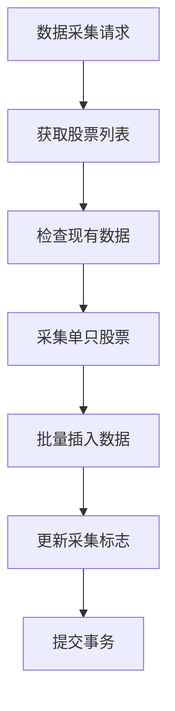
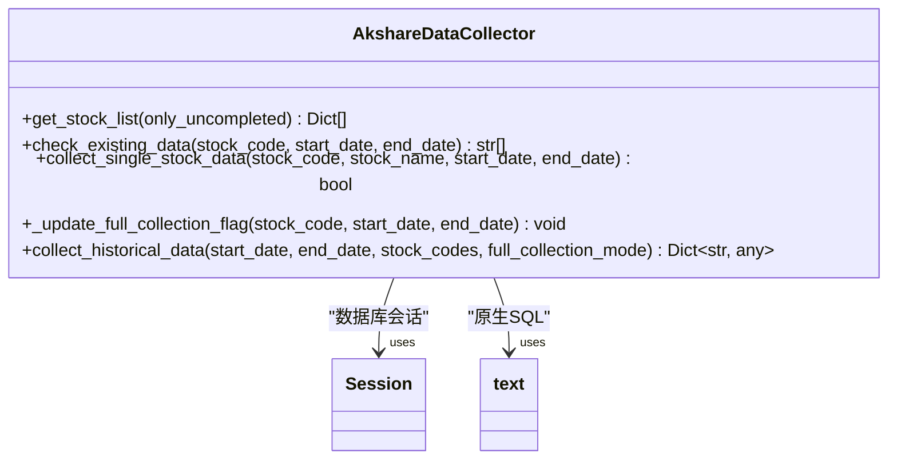
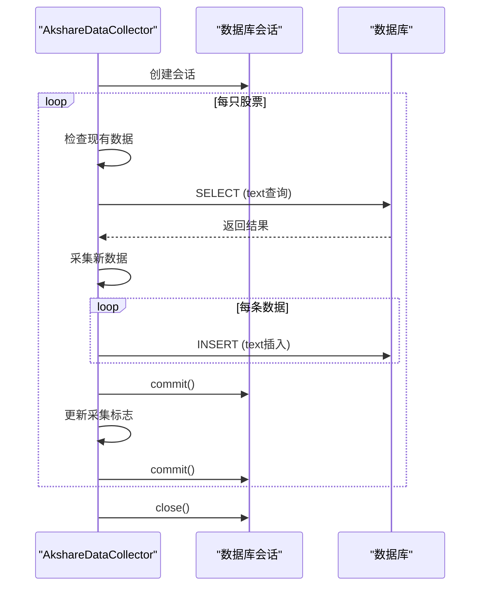
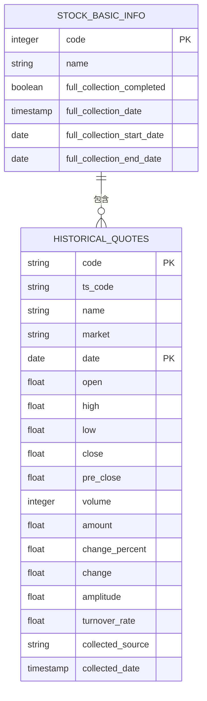
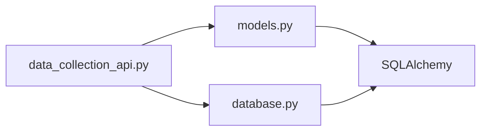

# 数据库操作与事务管理

<cite>
**本文档中引用的文件**  
- [data_collection_api.py](file://backend_api/stock/data_collection_api.py)
- [models.py](file://backend_api/models.py)
- [historical_quotes.py](file://backend_core/models/historical_quotes.py)
- [database.py](file://backend_api/database.py)
</cite>

## 目录
1. [引言](#引言)
2. [项目结构](#项目结构)
3. [核心组件](#核心组件)
4. [架构概述](#架构概述)
5. [详细组件分析](#详细组件分析)
6. [依赖分析](#依赖分析)
7. [性能考虑](#性能考虑)
8. [故障排除指南](#故障排除指南)
9. [结论](#结论)

## 引言
本文档深入分析股票分析软件中数据采集过程的数据库操作模式，重点研究使用SQLAlchemy `text()` 执行原生SQL查询和插入操作的实现机制。文档详细说明了批量插入的事务管理策略、全量采集标志的更新逻辑、数据模型之间的字段映射关系，以及数据库会话的最佳实践。

## 项目结构
项目采用分层架构，主要分为前端、后端API和核心数据采集模块。数据库操作主要集中在`backend_api`和`backend_core`两个模块中，其中`backend_api`负责提供数据采集接口，`backend_core`包含具体的数据采集逻辑。

**文档来源**
- [data_collection_api.py](file://backend_api/stock/data_collection_api.py)
- [models.py](file://backend_api/models.py)

## 核心组件
核心数据库操作组件包括数据采集API、数据模型定义和数据库会话管理。这些组件协同工作，实现了从股票基本信息查询到历史行情数据采集的完整流程。

**文档来源**
- [data_collection_api.py](file://backend_api/stock/data_collection_api.py)
- [models.py](file://backend_api/models.py)
- [historical_quotes.py](file://backend_core/models/historical_quotes.py)

## 架构概述
系统采用基于FastAPI的微服务架构，通过SQLAlchemy ORM与数据库交互。数据采集流程包括：获取股票列表 → 检查现有数据 → 采集单只股票数据 → 批量插入历史行情 → 更新采集状态。

**图表来源**  
- [data_collection_api.py](file://backend_api/stock/data_collection_api.py#L46-L443)
- [models.py](file://backend_api/models.py#L36-L70)

## 详细组件分析

### 数据采集API分析
数据采集API实现了完整的数据采集流程，包括股票列表获取、数据检查、单只股票采集和批量处理。

#### 原生SQL查询实现

**图表来源**  
- [data_collection_api.py](file://backend_api/stock/data_collection_api.py#L46-L443)

#### 事务管理机制

**图表来源**  
- [data_collection_api.py](file://backend_api/stock/data_collection_api.py#L150-L250)
- [database.py](file://backend_api/database.py#L1-L72)

#### 数据模型分析

**图表来源**  
- [models.py](file://backend_api/models.py#L36-L70)
- [historical_quotes.py](file://backend_core/models/historical_quotes.py#L1-L28)

## 依赖分析
系统依赖关系清晰，`data_collection_api.py`依赖`models.py`中的数据模型和`database.py`中的会话管理，形成完整的数据采集链路。

**图表来源**  
- [data_collection_api.py](file://backend_api/stock/data_collection_api.py)
- [models.py](file://backend_api/models.py)
- [database.py](file://backend_api/database.py)

## 性能考虑
系统通过以下方式优化性能：
- 使用原生SQL查询提高查询效率
- 为每只股票使用独立事务，避免长事务
- 添加随机延迟避免请求过于频繁
- 使用连接池管理数据库连接

## 故障排除指南
常见问题及解决方案：
- **数据库连接失败**：检查`DATABASE_CONFIG`配置
- **采集任务冲突**：确保没有其他任务正在运行
- **数据重复**：检查`check_existing_data`方法
- **事务提交失败**：检查会话关闭逻辑

**文档来源**
- [data_collection_api.py](file://backend_api/stock/data_collection_api.py#L450-L500)
- [database.py](file://backend_api/database.py#L60-L70)

## 结论
本文档详细分析了股票分析软件的数据采集数据库操作模式。系统通过原生SQL与ORM结合的方式，实现了高效的数据采集和事务管理。建议在实际使用中注意会话管理的最佳实践，确保数据一致性和系统稳定性。