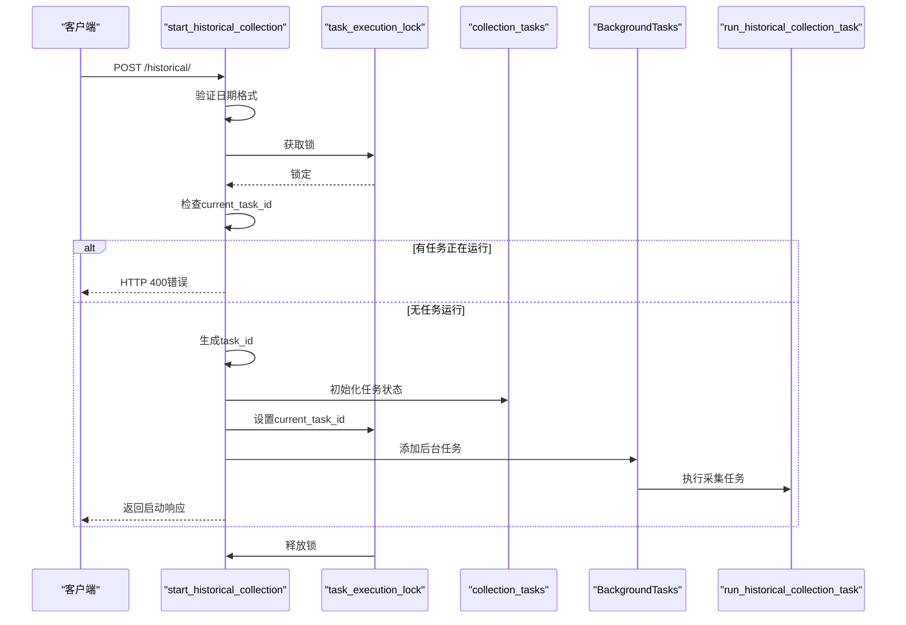
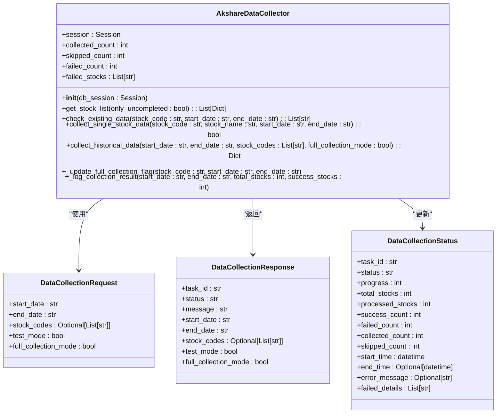
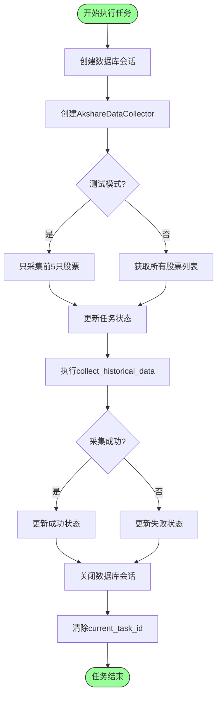
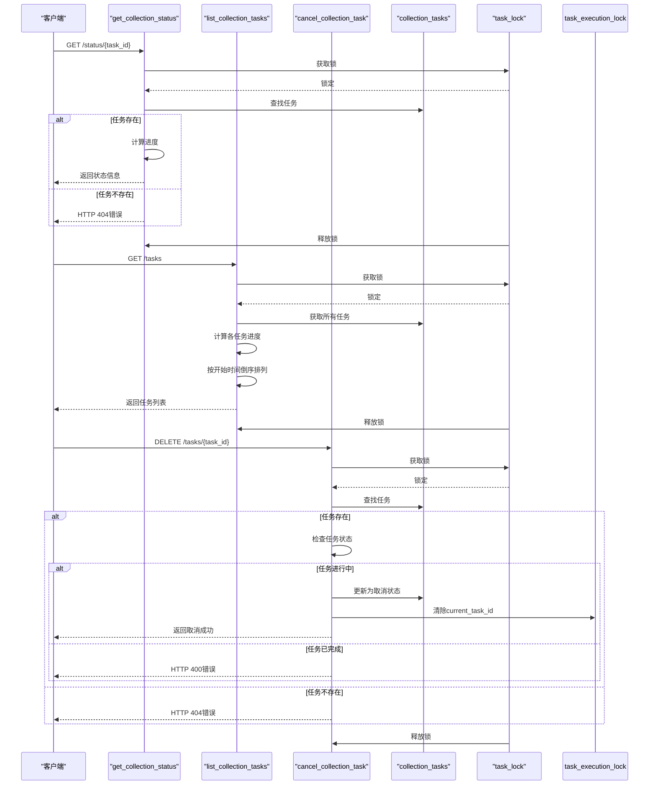
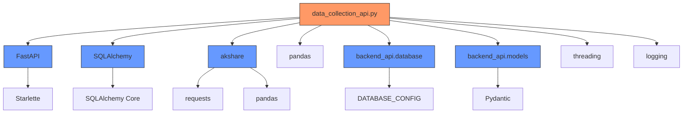
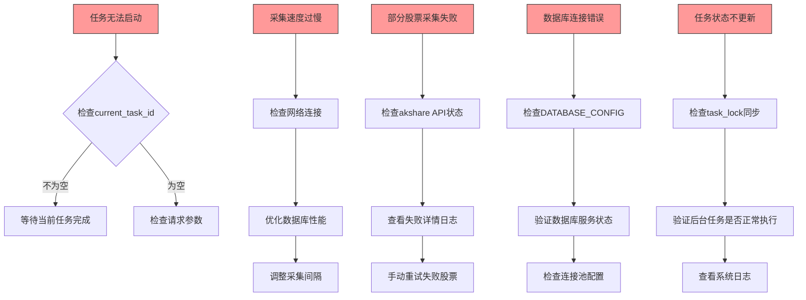

# 数据采集API

<cite>
**本文档中引用的文件**
- [data_collection_api.py](file://backend_api/stock/data_collection_api.py)
- [models.py](file://backend_api/models.py)
- [database.py](file://backend_api/database.py)
</cite>

## 目录
1. [简介](#简介)
2. [核心组件](#核心组件)
3. [架构概述](#架构概述)
4. [详细组件分析](#详细组件分析)
5. [依赖分析](#依赖分析)
6. [性能考虑](#性能考虑)
7. [故障排除指南](#故障排除指南)
8. [结论](#结论)

## 简介
本文档全面解析了基于FastAPI实现的数据采集API系统，重点阐述了历史数据采集任务的管理机制。该系统通过`/start_historical_collection`接口启动后台任务，利用线程锁实现并发控制，并通过`AkshareDataCollector`类完成股票数据的批量采集。文档详细说明了任务状态查询、任务列表管理和任务取消等核心功能，以及任务状态存储、线程安全和数据库会话管理的最佳实践。

## 核心组件

本系统的核心组件包括数据采集请求/响应模型、任务状态管理机制、Akshare数据采集器以及后台任务执行流程。这些组件协同工作，实现了安全、可靠的历史数据采集功能。

**Section sources**
- [data_collection_api.py](file://backend_api/stock/data_collection_api.py#L1-L645)
- [models.py](file://backend_api/models.py#L401-L434)

## 架构概述

该数据采集API采用分层架构设计，包含API路由层、业务逻辑层和数据访问层。系统通过全局变量管理任务状态，使用线程锁确保线程安全，并通过后台任务机制实现异步数据采集。

```mermaid
graph TB
subgraph "API层"
A[/start_historical_collection\nPOST /historical/]
B[/get_collection_status\nGET /status/{task_id}/]
C[/list_collection_tasks\nGET /tasks/]
D[/cancel_collection_task\nDELETE /tasks/{task_id}/]
end
subgraph "业务逻辑层"
E[AkshareDataCollector]
F[run_historical_collection_task]
end
subgraph "数据层"
G[stock_basic_info表]
H[historical_quotes表]
I[historical_collect_operation_logs表]
end
A --> E
B --> collection_tasks
C --> collection_tasks
D --> collection_tasks
E --> G
E --> H
E --> I
F --> E
collection_tasks[(collection_tasks\n字典)]
task_lock[(task_lock\n线程锁)]
current_task_id[(current_task_id\n当前任务ID)]
style collection_tasks fill:#f9f,stroke:#333
style task_lock fill:#f9f,stroke:#333
style current_task_id fill:#f9f,stroke:#333
```

**Diagram sources**
- [data_collection_api.py](file://backend_api/stock/data_collection_api.py#L1-L645)

## 详细组件分析

### 历史数据采集接口分析

`/start_historical_collection`接口是启动历史数据采集任务的入口点，它实现了任务ID生成、并发控制和后台任务调度等关键功能。



**Diagram sources**
- [data_collection_api.py](file://backend_api/stock/data_collection_api.py#L300-L350)

**Section sources**
- [data_collection_api.py](file://backend_api/stock/data_collection_api.py#L300-L350)

### AkshareDataCollector类分析

`AkshareDataCollector`类是数据采集的核心业务逻辑组件，负责股票列表获取、已存在数据检查、单只股票数据采集和全量采集标志更新等功能。



**Diagram sources**
- [data_collection_api.py](file://backend_api/stock/data_collection_api.py#L100-L290)
- [models.py](file://backend_api/models.py#L401-L434)

**Section sources**
- [data_collection_api.py](file://backend_api/stock/data_collection_api.py#L100-L290)

### 后台任务执行流程分析

`run_historical_collection_task`函数定义了后台任务的执行流程，包括重试机制和随机延迟以避免API限流。



**Diagram sources**
- [data_collection_api.py](file://backend_api/stock/data_collection_api.py#L352-L400)

**Section sources**
- [data_collection_api.py](file://backend_api/stock/data_collection_api.py#L352-L400)

### 任务状态管理接口分析

系统提供了多个接口用于任务状态的实时查询和管理，包括获取任务状态、列出所有任务和取消任务。



**Diagram sources**
- [data_collection_api.py](file://backend_api/stock/data_collection_api.py#L402-L550)

**Section sources**
- [data_collection_api.py](file://backend_api/stock/data_collection_api.py#L402-L550)

## 依赖分析

该数据采集API系统依赖于多个核心组件和外部库，形成了一个完整的数据采集生态系统。



**Diagram sources**
- [data_collection_api.py](file://backend_api/stock/data_collection_api.py#L1-L20)
- [models.py](file://backend_api/models.py#L1-L10)
- [database.py](file://backend_api/database.py#L1-L10)

**Section sources**
- [data_collection_api.py](file://backend_api/stock/data_collection_api.py#L1-L20)

## 性能考虑

在数据采集过程中，系统实施了多项性能优化措施，以确保高效、稳定地完成大规模数据采集任务。

1. **数据库会话管理**：每个后台任务创建独立的数据库会话，并在任务完成后正确关闭，避免连接泄漏。
2. **请求频率控制**：在采集单只股票数据后添加随机延迟（0.5-1.5秒），避免对akshare API造成过大压力。
3. **批量处理优化**：在数据库操作中采用批量提交策略，减少事务开销。
4. **内存使用控制**：通过分批处理股票列表，避免一次性加载过多数据到内存中。
5. **错误重试机制**：实现三次重试机制，每次重试间隔逐渐增加，提高采集成功率。

**Section sources**
- [data_collection_api.py](file://backend_api/stock/data_collection_api.py#L200-L250)

## 故障排除指南

当数据采集任务出现问题时，可以参考以下常见问题及解决方案：



**Section sources**
- [data_collection_api.py](file://backend_api/stock/data_collection_api.py#L300-L550)

## 结论

本文档全面解析了数据采集API的设计与实现，重点阐述了后台任务管理机制、并发控制策略和数据采集流程。系统通过精心设计的架构和实现，确保了历史数据采集任务的安全性、可靠性和效率。`AkshareDataCollector`类封装了核心采集逻辑，而全局任务状态管理机制则提供了完善的任务监控能力。通过合理的线程安全措施和数据库会话管理，系统能够在高并发环境下稳定运行。未来可进一步优化的方向包括引入更智能的重试策略、实现分布式任务调度以及增强任务状态的持久化能力。