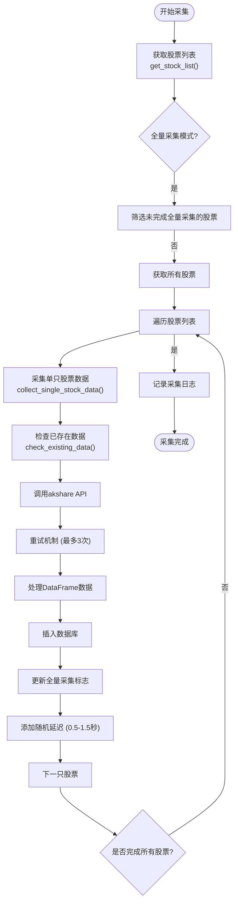
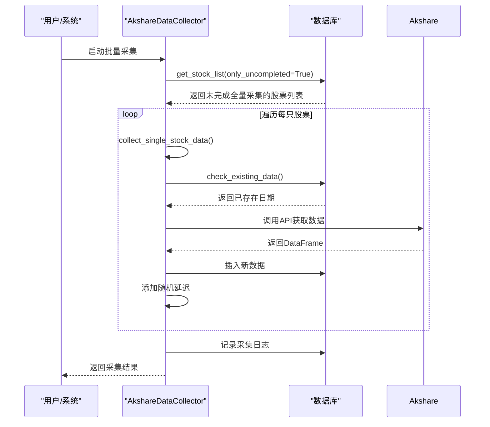

# 数据采集执行流程

<cite>
**本文档引用的文件**  
- [data_collection_api.py](file://backend_api/stock/data_collection_api.py)
- [historical_quotes.py](file://backend_core/models/historical_quotes.py)
- [models.py](file://backend_api/models.py)
</cite>

## 目录
1. [引言](#引言)
2. [核心流程概述](#核心流程概述)
3. [股票列表获取](#股票列表获取)
4. [数据去重检查](#数据去重检查)
5. [批量采集与全量模式](#批量采集与全量模式)
6. [数据插入与字段映射](#数据插入与字段映射)
7. [错误处理与重试机制](#错误处理与重试机制)
8. [流程总结](#流程总结)

## 引言
本文档详细描述了`AkshareDataCollector`类的数据采集执行流程，从获取股票列表开始，到调用akshare库采集单只股票数据的完整过程。重点解析了数据去重、全量采集模式、字段映射规则以及错误重试机制等核心功能。

## 核心流程概述
`AkshareDataCollector`类实现了从数据库读取股票列表，通过akshare库采集历史行情数据，并将结果写入数据库的完整流程。其核心方法包括`get_stock_list`、`check_existing_data`、`collect_single_stock_data`和`collect_historical_data`，形成了一个完整的数据采集工作流。



**Diagram sources**  
- [data_collection_api.py](file://backend_api/stock/data_collection_api.py#L34-L351)

**Section sources**  
- [data_collection_api.py](file://backend_api/stock/data_collection_api.py#L34-L351)

## 股票列表获取
`get_stock_list`方法负责从`stock_basic_info`表中获取股票列表。该方法支持两种模式：普通模式和仅未完成模式。

在普通模式下，方法执行SQL查询获取所有股票信息：
```sql
SELECT code, name, full_collection_completed, full_collection_date
FROM stock_basic_info 
ORDER BY code
```

在仅未完成模式下（`only_uncompleted=True`），方法只获取那些尚未完成全量采集的股票：
```sql
SELECT code, name, full_collection_completed, full_collection_date
FROM stock_basic_info 
WHERE full_collection_completed = FALSE OR full_collection_completed IS NULL
ORDER BY code
```

查询结果被转换为字典列表，包含股票代码、名称、全量采集完成状态和完成日期等信息。该方法确保股票代码为字符串类型，并对可能为空的字段进行安全处理。

**Section sources**  
- [data_collection_api.py](file://backend_api/stock/data_collection_api.py#L45-L75)

## 数据去重检查
`check_existing_data`方法用于避免重复采集已存在的历史行情数据。该方法接收股票代码和日期范围作为参数，查询`historical_quotes`表中已存在的数据日期。

其核心SQL查询如下：
```sql
SELECT date 
FROM historical_quotes 
WHERE code = :stock_code 
AND date >= :start_date 
AND date <= :end_date
ORDER BY date
```

该查询返回指定股票在指定日期范围内所有已存在的交易日期，结果以列表形式返回。在`collect_single_stock_data`方法中，这个列表用于判断是否跳过已存在的数据记录，从而避免数据重复插入。

**Section sources**  
- [data_collection_api.py](file://backend_api/stock/data_collection_api.py#L77-L95)

## 批量采集与全量模式
`collect_historical_data`方法实现了批量采集历史行情数据的功能，并支持全量采集模式（`full_collection_mode`）。

当`full_collection_mode`为`True`时，系统只采集那些未完成全量采集的股票：
```python
if full_collection_mode:
    stocks = self.get_stock_list(only_uncompleted=True)
```

这种模式主要用于首次全量数据采集或补全缺失数据的场景。而在普通模式下，系统会采集所有股票的数据。

批量采集过程中，系统会对每只股票调用`collect_single_stock_data`方法，并在每次采集后休眠20秒，以遵守API请求频率限制。每处理10只股票，系统会输出一次进度日志。



**Diagram sources**  
- [data_collection_api.py](file://backend_api/stock/data_collection_api.py#L220-L351)

**Section sources**  
- [data_collection_api.py](file://backend_api/stock/data_collection_api.py#L220-L351)

## 数据插入与字段映射
在数据插入阶段，系统需要将akshare返回的DataFrame数据映射到数据库表的字段。`historical_quotes`表的字段映射关系如下：

| 数据库字段 | 数据来源 | 说明 |
|----------|--------|------|
| `code` | `stock_code`参数 | 股票代码 |
| `ts_code` | 代码生成规则 | 深市股票加.SZ后缀，沪市股票加.SH后缀 |
| `name` | `stock_name`参数 | 股票名称 |
| `market` | 市场判断逻辑 | 以0开头为SZ，其他为SH |
| `date` | DataFrame['日期'] | 交易日期 |
| `open` | DataFrame['开盘'] | 开盘价 |
| `high` | DataFrame['最高'] | 最高价 |
| `low` | DataFrame['最低'] | 最低价 |
| `close` | DataFrame['收盘'] | 收盘价 |
| `pre_close` | None | akshare未提供前收盘价 |
| `volume` | DataFrame['成交量'] | 成交量 |
| `amount` | DataFrame['成交额'] | 成交额 |
| `change_percent` | DataFrame['涨跌幅'] | 涨跌幅 |
| `change` | DataFrame['涨跌额'] | 涨跌额 |
| `amplitude` | DataFrame['振幅'] | 振幅 |
| `turnover_rate` | DataFrame['换手率'] | 换手率 |
| `collected_source` | 'akshare' | 采集来源 |
| `collected_date` | 当前时间戳 | 采集时间 |

`ts_code`的生成规则基于股票代码的前缀：以'0'开头的股票被视为深市股票，添加'.SZ'后缀；其他股票被视为沪市股票，添加'.SH'后缀。市场判断逻辑与此相同。

**Section sources**  
- [data_collection_api.py](file://backend_api/stock/data_collection_api.py#L145-L175)
- [historical_quotes.py](file://backend_core/models/historical_quotes.py#L0-L27)

## 错误处理与重试机制
系统实现了完善的错误处理和重试机制，以应对网络波动和API限制。

单只股票采集的重试机制实现如下：
```python
max_retries = 3
for attempt in range(max_retries):
    try:
        df = ak.stock_zh_a_hist(...)
        break
    except Exception as e:
        if attempt < max_retries - 1:
            wait_time = (attempt + 1) * 2 + random.uniform(0, 1)
            time.sleep(wait_time)
        else:
            return False
```

当采集失败时，系统会进行最多3次重试。每次重试的等待时间逐渐增加，并加入随机因素（0-1秒），形成动态延迟策略。首次失败后等待2-3秒，第二次失败后等待4-5秒。

此外，在成功采集每只股票后，系统会添加0.5-1.5秒的随机延迟：
```python
time.sleep(random.uniform(0.5, 1.5))
```

这种随机延迟策略有效规避了akshare API的请求频率限制，防止因请求过于频繁而导致的采集失败。

**Section sources**  
- [data_collection_api.py](file://backend_api/stock/data_collection_api.py#L97-L143)

## 流程总结
`AkshareDataCollector`类的数据采集流程是一个完整的、健壮的数据获取系统。从获取股票列表开始，通过全量采集模式的智能筛选，利用去重机制避免重复工作，经过akshare API的数据获取和重试机制保障，最终将数据准确映射并插入数据库。

该流程充分考虑了实际运行中的各种异常情况，包括网络问题、API限制和数据一致性等，通过重试机制、随机延迟和事务提交等手段确保了数据采集的稳定性和可靠性。同时，系统还记录了详细的采集日志，便于后续的监控和问题排查。