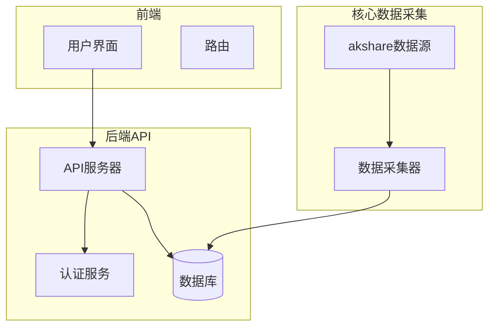
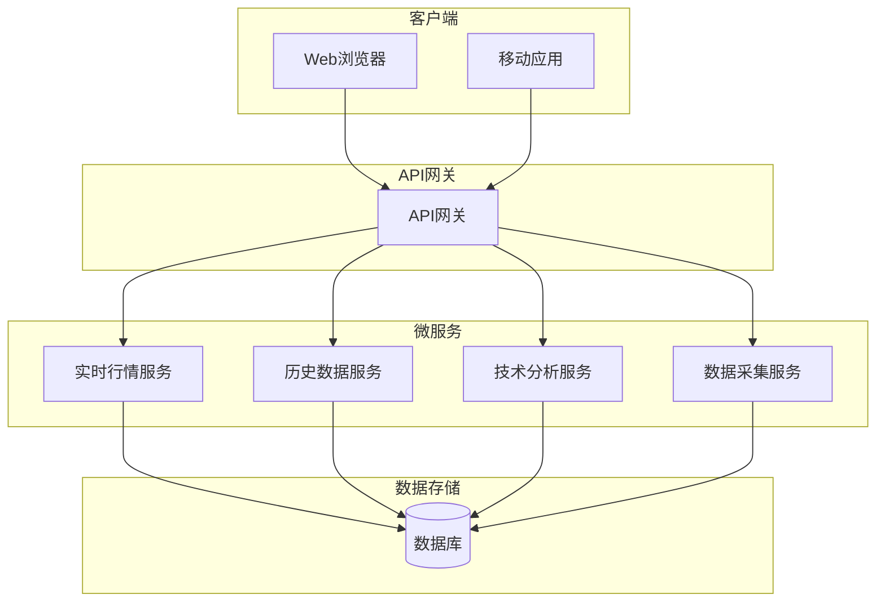
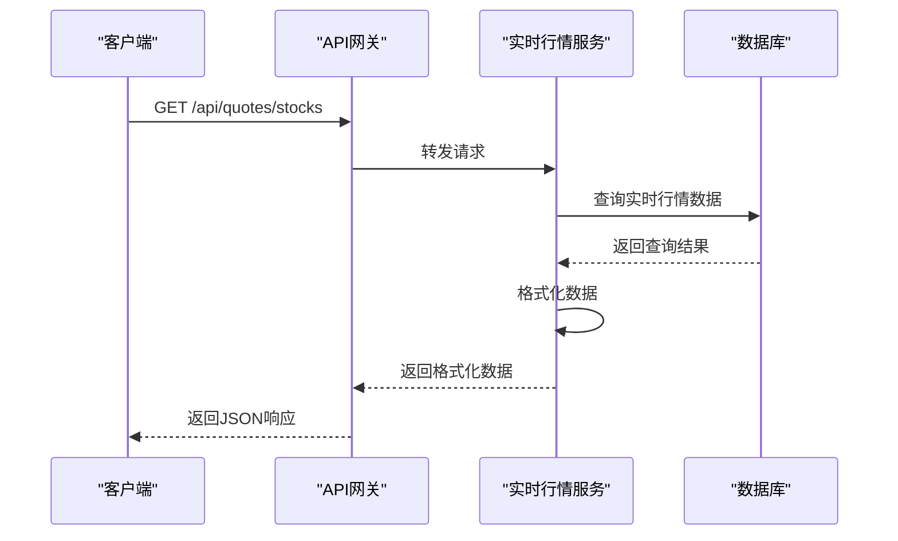
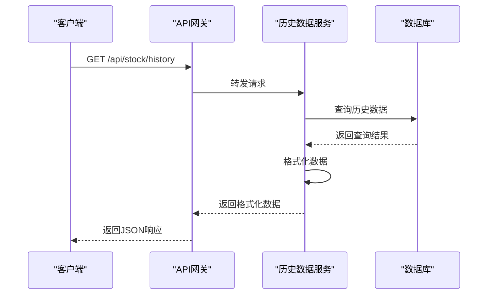
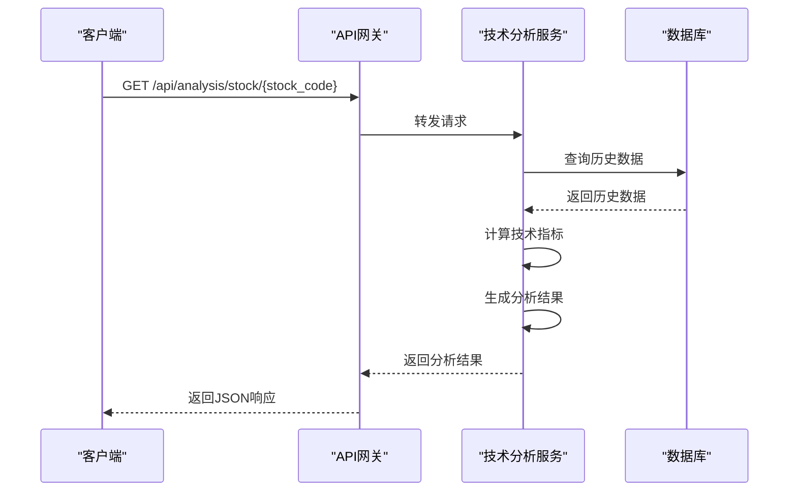
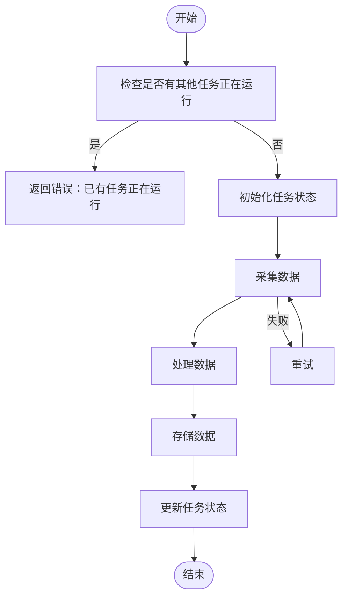
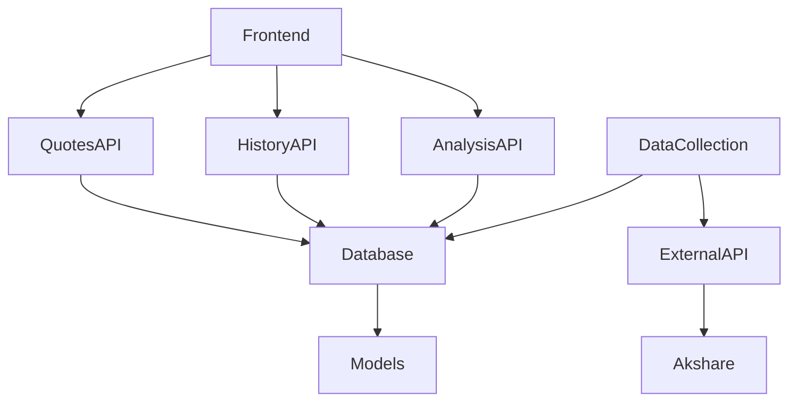

# 行情数据API

<cite>
**本文档引用的文件**
- [quotes_routes.py](file://backend_api/quotes_routes.py)
- [history_api.py](file://backend_api/stock/history_api.py)
- [stock_analysis_routes.py](file://backend_api/stock/stock_analysis_routes.py)
- [market_routes.py](file://backend_api/market_routes.py)
- [data_collection_api.py](file://backend_api/stock/data_collection_api.py)
- [stock_analysis.py](file://backend_api/stock/stock_analysis.py)
- [models.py](file://backend_api/models.py)
- [realtime.py](file://backend_core/data_collectors/akshare/realtime.py)
- [historical.py](file://backend_core/data_collectors/akshare/historical.py)
- [base.py](file://backend_core/data_collectors/akshare/base.py)
</cite>

## 目录
1. [简介](#简介)
2. [项目结构](#项目结构)
3. [核心组件](#核心组件)
4. [架构概述](#架构概述)
5. [详细组件分析](#详细组件分析)
6. [依赖分析](#依赖分析)
7. [性能考虑](#性能考虑)
8. [故障排除指南](#故障排除指南)
9. [结论](#结论)

## 简介
本项目是一个综合性的股票行情分析系统，提供实时行情、历史数据、技术分析和资金流向等功能。系统由前端、后端API和核心数据采集模块组成，通过FastAPI框架提供RESTful API服务。系统支持股票、指数和行业板块的实时行情查询，提供历史K线数据的多周期查询，以及基于技术指标的智能分析功能。数据采集模块通过akshare库从外部数据源获取数据，并存储到本地数据库中。

## 项目结构
项目采用分层架构，分为前端、后端API和核心数据采集模块。前端使用Vue.js框架构建用户界面，后端API使用FastAPI框架提供RESTful服务，核心数据采集模块负责从外部数据源获取数据。系统通过数据库存储股票基本信息、实时行情、历史数据和用户数据。API路由模块负责处理HTTP请求，调用相应的服务模块获取数据，并返回JSON格式的响应。

**图表来源**
- [quotes_routes.py](file://backend_api/quotes_routes.py)
- [history_api.py](file://backend_api/stock/history_api.py)
- [stock_analysis_routes.py](file://backend_api/stock/stock_analysis_routes.py)
- [market_routes.py](file://backend_api/market_routes.py)
- [data_collection_api.py](file://backend_api/stock/data_collection_api.py)

**章节来源**
- [quotes_routes.py](file://backend_api/quotes_routes.py)
- [history_api.py](file://backend_api/stock/history_api.py)
- [stock_analysis_routes.py](file://backend_api/stock/stock_analysis_routes.py)
- [market_routes.py](file://backend_api/market_routes.py)
- [data_collection_api.py](file://backend_api/stock/data_collection_api.py)

## 核心组件
系统的核心组件包括实时行情API、历史数据API、技术分析API和数据采集模块。实时行情API提供股票、指数和行业板块的实时行情数据查询服务，支持分页、搜索和排序功能。历史数据API提供历史K线数据的查询接口，支持多种时间周期和数据压缩格式。技术分析API提供基于技术指标的智能分析功能，包括布林带、支撑阻力位等。数据采集模块负责从外部数据源获取数据，并存储到本地数据库中。

**章节来源**
- [quotes_routes.py](file://backend_api/quotes_routes.py)
- [history_api.py](file://backend_api/stock/history_api.py)
- [stock_analysis_routes.py](file://backend_api/stock/stock_analysis_routes.py)
- [data_collection_api.py](file://backend_api/stock/data_collection_api.py)

## 架构概述
系统采用微服务架构，将不同的功能模块分离为独立的服务。API网关负责接收客户端请求，根据请求路径将请求转发到相应的服务模块。实时行情服务负责处理实时行情数据的查询请求，历史数据服务负责处理历史数据的查询请求，技术分析服务负责处理技术分析请求。数据采集服务负责从外部数据源获取数据，并存储到数据库中。所有服务通过数据库进行数据共享，确保数据的一致性。

**图表来源**
- [quotes_routes.py](file://backend_api/quotes_routes.py)
- [history_api.py](file://backend_api/stock/history_api.py)
- [stock_analysis_routes.py](file://backend_api/stock/stock_analysis_routes.py)
- [data_collection_api.py](file://backend_api/stock/data_collection_api.py)

## 详细组件分析

### 实时行情API分析
实时行情API提供股票、指数和行业板块的实时行情数据查询服务。API支持分页、搜索和排序功能，可以根据关键词、市场类型和排序字段进行查询。API返回的数据包括股票代码、名称、当前价格、涨跌幅、成交量、成交额等信息。API通过数据库查询获取数据，并对数据进行格式化处理，确保返回的数据格式一致。

#### 对于API/服务组件：

**图表来源**
- [quotes_routes.py](file://backend_api/quotes_routes.py)

**章节来源**
- [quotes_routes.py](file://backend_api/quotes_routes.py)

### 历史数据API分析
历史数据API提供历史K线数据的查询接口，支持多种时间周期和数据压缩格式。API支持按股票代码、起始日期和结束日期进行查询，可以指定是否包含交易备注。API返回的数据包括日期、开盘价、收盘价、最高价、最低价、成交量、成交额等信息。API还提供数据导出功能，可以将查询结果导出为CSV文件。

#### 对于API/服务组件：

**图表来源**
- [history_api.py](file://backend_api/stock/history_api.py)

**章节来源**
- [history_api.py](file://backend_api/stock/history_api.py)

### 技术分析API分析
技术分析API提供基于技术指标的智能分析功能，包括布林带、支撑阻力位等。API通过调用技术分析服务获取分析结果，并返回JSON格式的响应。技术分析服务从数据库获取历史数据，计算技术指标，并生成交易建议。API支持获取完整的分析结果，也可以获取特定部分的分析结果，如技术指标、价格预测、交易建议等。

#### 对于API/服务组件：

**图表来源**
- [stock_analysis_routes.py](file://backend_api/stock/stock_analysis_routes.py)
- [stock_analysis.py](file://backend_api/stock/stock_analysis.py)

**章节来源**
- [stock_analysis_routes.py](file://backend_api/stock/stock_analysis_routes.py)
- [stock_analysis.py](file://backend_api/stock/stock_analysis.py)

### 数据采集模块分析
数据采集模块负责从外部数据源获取数据，并存储到本地数据库中。模块使用akshare库从东方财富网等数据源获取实时行情和历史数据。数据采集器采用重试机制，确保在网络不稳定的情况下能够成功获取数据。采集到的数据经过格式化处理后存储到数据库中，确保数据的一致性和完整性。

#### 对于复杂逻辑组件：

**图表来源**
- [data_collection_api.py](file://backend_api/stock/data_collection_api.py)
- [realtime.py](file://backend_core/data_collectors/akshare/realtime.py)
- [historical.py](file://backend_core/data_collectors/akshare/historical.py)

**章节来源**
- [data_collection_api.py](file://backend_api/stock/data_collection_api.py)
- [realtime.py](file://backend_core/data_collectors/akshare/realtime.py)
- [historical.py](file://backend_core/data_collectors/akshare/historical.py)

## 依赖分析
系统各组件之间的依赖关系如下：前端依赖后端API提供的服务，后端API依赖数据库存储数据，数据采集模块依赖外部数据源获取数据。API路由模块依赖服务模块处理业务逻辑，服务模块依赖数据库访问模块进行数据操作。系统使用FastAPI框架提供的依赖注入机制，确保各组件之间的松耦合。

**图表来源**
- [quotes_routes.py](file://backend_api/quotes_routes.py)
- [history_api.py](file://backend_api/stock/history_api.py)
- [stock_analysis_routes.py](file://backend_api/stock/stock_analysis_routes.py)
- [data_collection_api.py](file://backend_api/stock/data_collection_api.py)
- [models.py](file://backend_api/models.py)

**章节来源**
- [quotes_routes.py](file://backend_api/quotes_routes.py)
- [history_api.py](file://backend_api/stock/history_api.py)
- [stock_analysis_routes.py](file://backend_api/stock/stock_analysis_routes.py)
- [data_collection_api.py](file://backend_api/stock/data_collection_api.py)
- [models.py](file://backend_api/models.py)

## 性能考虑
系统在设计时考虑了性能优化，采用多种策略提高响应速度和处理能力。API接口支持分页查询，避免一次性返回大量数据。数据库查询使用索引优化，提高查询效率。数据采集模块采用批量处理和异步操作，提高数据处理速度。系统还实现了缓存机制，减少对数据库的频繁访问。对于高并发场景，系统可以通过水平扩展增加服务器实例，提高处理能力。

## 故障排除指南
当系统出现故障时，可以按照以下步骤进行排查：首先检查API网关是否正常运行，然后检查后端服务是否能够正常访问数据库。如果数据采集模块出现问题，可以检查外部数据源是否可用，以及网络连接是否正常。系统日志记录了详细的运行信息，可以通过查看日志定位问题。对于数据库相关的问题，可以检查数据库连接配置和表结构是否正确。

**章节来源**
- [quotes_routes.py](file://backend_api/quotes_routes.py)
- [history_api.py](file://backend_api/stock/history_api.py)
- [stock_analysis_routes.py](file://backend_api/stock/stock_analysis_routes.py)
- [data_collection_api.py](file://backend_api/stock/data_collection_api.py)

## 结论
本系统提供了一个完整的股票行情分析解决方案，涵盖了实时行情、历史数据、技术分析和数据采集等功能。系统采用现代化的技术栈，具有良好的可扩展性和可维护性。通过合理的架构设计和性能优化，系统能够满足高并发、大数据量的处理需求。未来可以进一步优化数据采集模块，增加更多的数据源，提高数据的准确性和完整性。