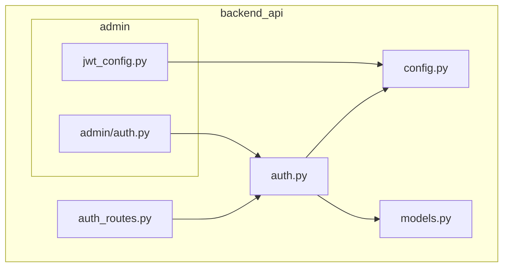
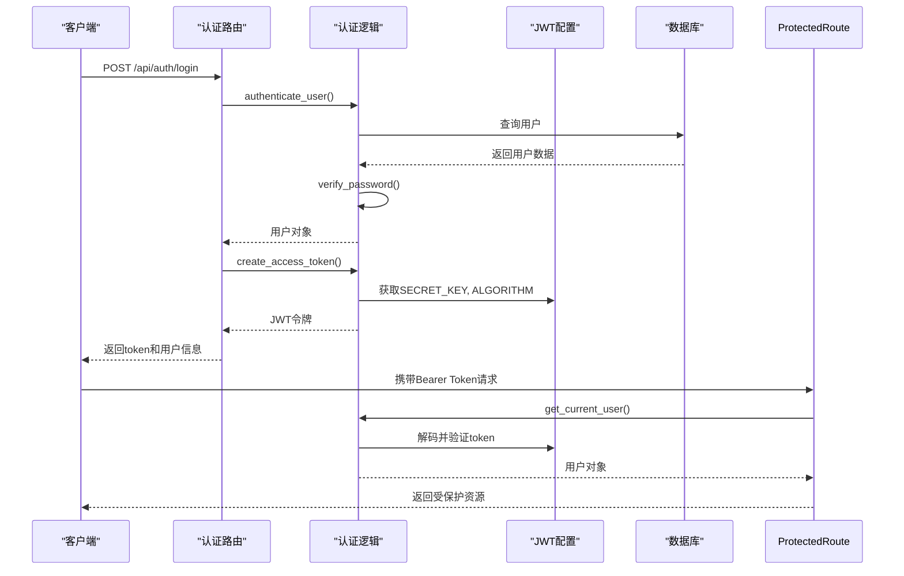
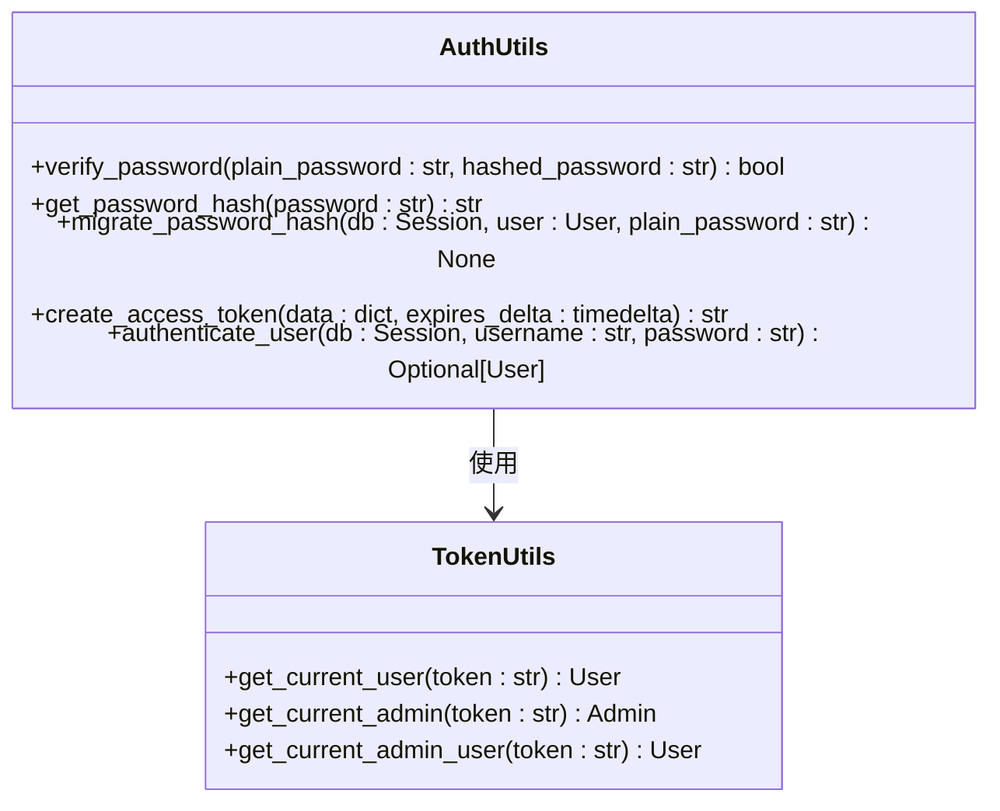
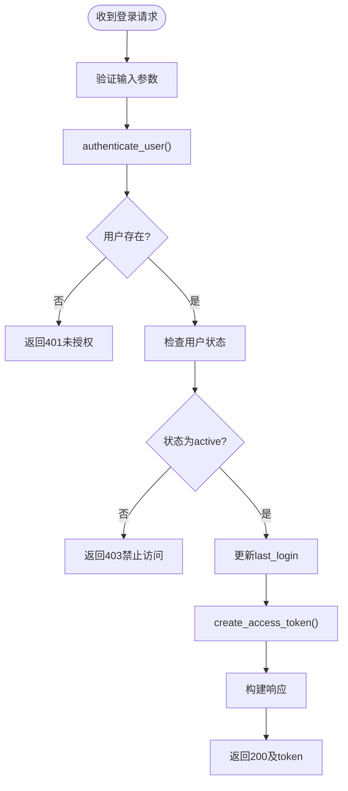
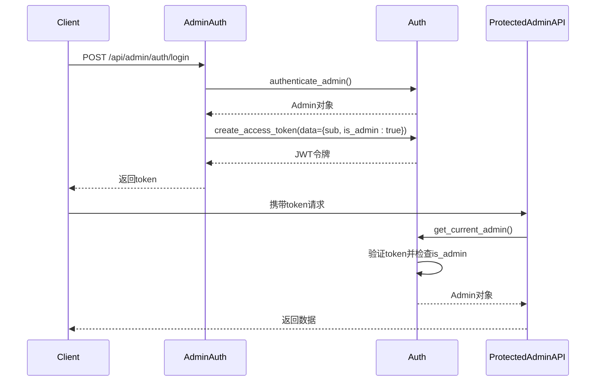
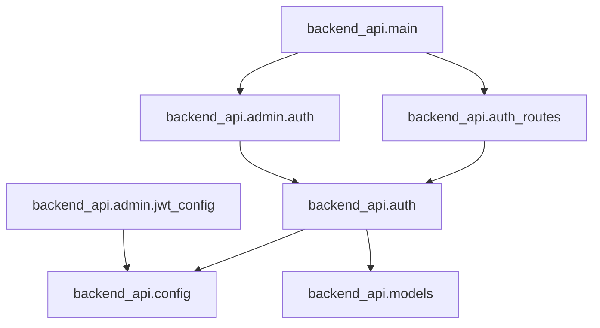

# 认证与授权

<cite>
**本文档中引用的文件**  
- [auth.py](file://backend_api/auth.py)
- [auth_routes.py](file://backend_api/auth_routes.py)
- [jwt_config.py](file://backend_api/admin/jwt_config.py)
- [admin/auth.py](file://backend_api/admin/auth.py)
- [models.py](file://backend_api/models.py)
- [config.py](file://backend_api/config.py)
</cite>

## 目录
1. [简介](#简介)
2. [项目结构](#项目结构)
3. [核心组件](#核心组件)
4. [架构概述](#架构概述)
5. [详细组件分析](#详细组件分析)
6. [依赖分析](#依赖分析)
7. [性能考虑](#性能考虑)
8. [故障排除指南](#故障排除指南)
9. [结论](#结论)

## 简介
本文档详细描述了股票分析系统中的认证与授权机制，重点聚焦于JWT身份验证的实现。文档涵盖用户和管理员的登录、令牌生成与验证、权限分级控制、安全配置及错误处理流程。通过分析 `auth.py`、`auth_routes.py`、`jwt_config.py` 和 `admin/auth.py` 等关键模块，全面揭示系统的安全架构设计与最佳实践。

## 项目结构
系统认证模块分布在多个目录中，主要逻辑位于 `backend_api` 及其子模块中。用户认证与管理员认证分离，确保职责清晰。JWT配置集中管理，支持环境变量注入，提升安全性与灵活性。

**图示来源**  
- [auth.py](file://backend_api/auth.py#L1-L197)
- [auth_routes.py](file://backend_api/auth_routes.py#L1-L331)
- [jwt_config.py](file://backend_api/admin/jwt_config.py#L1-L84)
- [admin/auth.py](file://backend_api/admin/auth.py#L1-L80)

**本节来源**  
- [backend_api](file://backend_api)
- [backend_api/admin](file://backend_api/admin)

## 核心组件
系统认证体系由四大核心组件构成：用户认证逻辑、管理员认证逻辑、JWT配置管理与API路由接口。各组件协同工作，实现安全、可扩展的身份验证机制。

**本节来源**  
- [auth.py](file://backend_api/auth.py#L1-L197)
- [auth_routes.py](file://backend_api/auth_routes.py#L1-L331)
- [jwt_config.py](file://backend_api/admin/jwt_config.py#L1-L84)
- [admin/auth.py](file://backend_api/admin/auth.py#L1-L80)

## 架构概述
系统采用基于JWT的无状态认证架构，结合FastAPI的安全依赖机制，实现用户与管理员的分级访问控制。整体流程包括登录认证、令牌生成、请求验证与权限检查。

**图示来源**  
- [auth.py](file://backend_api/auth.py#L1-L197)
- [auth_routes.py](file://backend_api/auth_routes.py#L1-L331)
- [jwt_config.py](file://backend_api/admin/jwt_config.py#L1-L84)

## 详细组件分析

### 用户认证逻辑分析
`auth.py` 模块实现了用户凭证验证、密码哈希兼容性迁移、令牌创建与用户提取等核心功能。

#### 认证与密码处理
系统支持 bcrypt 和 SHA-256 两种密码哈希算法，允许从旧系统平滑迁移。当检测到 SHA-256 哈希时，会在用户成功登录后自动迁移到更安全的 bcrypt 算法。

**图示来源**  
- [auth.py](file://backend_api/auth.py#L1-L197)

**本节来源**  
- [auth.py](file://backend_api/auth.py#L1-L197)

### 认证API端点设计
`auth_routes.py` 定义了用户登录、登出与状态查询等RESTful接口，并集成请求日志中间件以增强可观测性。

#### 登录流程
登录接口接收用户名和密码，验证后返回JWT令牌及用户信息。同时记录登录时间并生成详细日志。

**图示来源**  
- [auth_routes.py](file://backend_api/auth_routes.py#L1-L331)

**本节来源**  
- [auth_routes.py](file://backend_api/auth_routes.py#L1-L331)

### JWT配置与安全考量
`jwt_config.py` 提供了可配置的JWT参数，支持通过环境变量覆盖默认值，避免密钥硬编码。

#### 配置参数
| 参数 | 默认值 | 说明 |
|------|--------|------|
| secret_key | your-secret-key-here | JWT签名密钥，生产环境必须通过环境变量设置 |
| algorithm | HS256 | 加密算法，仅支持HS256、HS384、HS512 |
| access_token_expire_minutes | 1440 | 访问令牌有效期（分钟），默认24小时 |

系统在启动时验证配置有效性，并记录警告或错误日志。

**本节来源**  
- [jwt_config.py](file://backend_api/admin/jwt_config.py#L1-L84)
- [config.py](file://backend_api/config.py#L1-L48)

### 管理员权限控制机制
`admin/auth.py` 实现了管理员专用的认证流程，通过JWT中的 `is_admin` 声明实现角色权限分级。

#### 权限验证流程
管理员登录时，JWT令牌中包含 `"is_admin": true` 声明。后续请求通过 `get_current_admin` 依赖项验证该声明，确保只有管理员可访问受保护资源。

**图示来源**  
- [admin/auth.py](file://backend_api/admin/auth.py#L1-L80)
- [auth.py](file://backend_api/auth.py#L1-L197)

**本节来源**  
- [admin/auth.py](file://backend_api/admin/auth.py#L1-L80)

## 依赖分析
认证模块依赖于数据库访问、模型定义与配置管理，各组件间耦合度低，便于维护与测试。

**图示来源**  
- [auth.py](file://backend_api/auth.py#L1-L197)
- [auth_routes.py](file://backend_api/auth_routes.py#L1-L331)
- [jwt_config.py](file://backend_api/admin/jwt_config.py#L1-L84)
- [admin/auth.py](file://backend_api/admin/auth.py#L1-L80)
- [main.py](file://backend_api/main.py#L1-L128)

**本节来源**  
- 所有认证相关模块

## 性能考虑
- **密码哈希**：使用 bcrypt 提供强安全性，SHA-256 仅用于兼容旧数据。
- **令牌验证**：JWT解码为无状态操作，不查询数据库，提升性能。
- **日志记录**：异步日志写入避免阻塞主线程。
- **数据库操作**：登录成功后异步更新 `last_login`，失败时不中断流程。

## 故障排除指南
### 常见错误与处理
| 错误码 | 原因 | 解决方案 |
|-------|------|---------|
| 401 Unauthorized | 令牌无效、过期或格式错误 | 检查Authorization头格式是否为 `Bearer <token>`，重新登录获取新token |
| 403 Forbidden | 用户非管理员或账号被禁用 | 确认用户角色为admin，检查用户状态是否为active |
| 500 Internal Error | 服务器内部错误（如令牌生成失败） | 查看服务日志（auth.log, app.log），确认JWT配置正确 |

### 令牌存储建议
- 前端应将JWT存储在内存或 `httpOnly` Cookie中，避免XSS攻击。
- 不应存储在localStorage中，除非有额外的安全防护。
- 设置合理的过期时间，平衡安全与用户体验。

### 跨域认证问题
CORS配置已允许所有来源的凭据传递，确保前端可正确发送Authorization头。若仍存在问题，请检查：
- 前端请求是否设置了 `credentials: 'include'`
- 后端CORS中间件是否正确配置 `allow_credentials=True`
- 浏览器是否阻止第三方Cookie（尤其在跨域场景）

**本节来源**  
- [auth_routes.py](file://backend_api/auth_routes.py#L1-L331)
- [main.py](file://backend_api/main.py#L1-L128)
- [config.py](file://backend_api/config.py#L1-L48)

## 结论
本系统实现了基于JWT的健壮认证与授权机制，支持用户与管理员的分级访问控制。通过密码哈希迁移、环境变量配置、详细日志记录等设计，兼顾了安全性、兼容性与可维护性。建议生产环境中严格管理JWT密钥，定期轮换，并监控认证相关日志以及时发现异常行为。