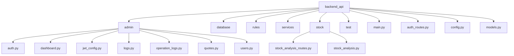
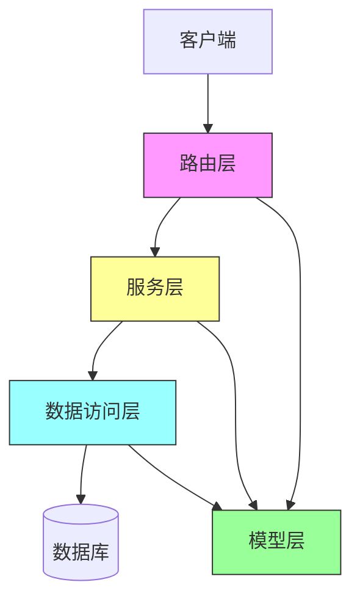
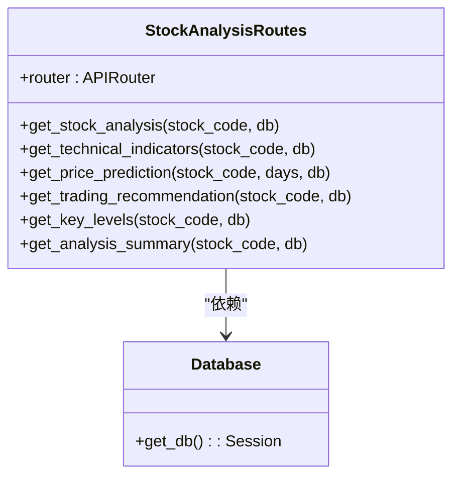
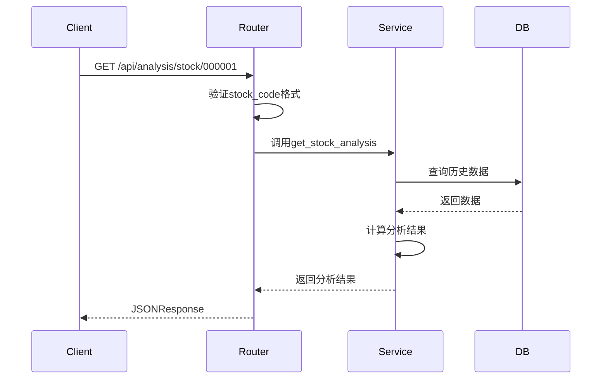
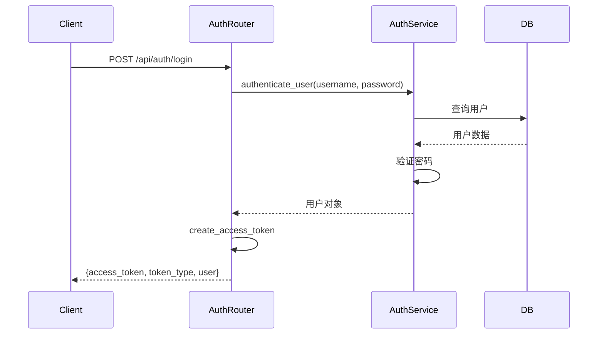
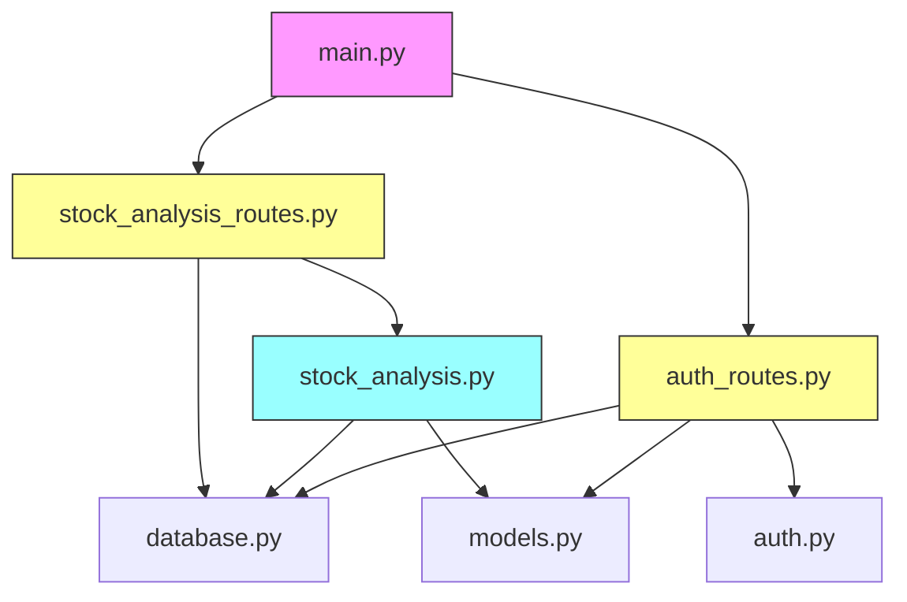

# API接口扩展

<cite>
**本文档引用的文件**
- [stock_analysis_routes.py](file://backend_api/stock/stock_analysis_routes.py)
- [auth_routes.py](file://backend_api/auth_routes.py)
- [main.py](file://backend_api/main.py)
- [stock_analysis.py](file://backend_api/stock/stock_analysis.py)
- [config.py](file://backend_api/config.py)
- [models.py](file://backend_api/models.py)
</cite>

## 目录
1. [引言](#引言)
2. [项目结构](#项目结构)
3. [核心组件](#核心组件)
4. [架构概述](#架构概述)
5. [详细组件分析](#详细组件分析)
6. [依赖分析](#依赖分析)
7. [性能考虑](#性能考虑)
8. [故障排除指南](#故障排除指南)
9. [结论](#结论)

## 引言
本文档旨在为开发者提供在backend_api中新增RESTful API端点的完整指南，以支持新的分析功能或数据服务。通过分析`stock_analysis_routes.py`文件，详细说明FastAPI路由注册、依赖注入、请求验证和响应序列化的实现方式。指导开发者如何定义新的Pydantic模型、编写业务逻辑服务函数，并通过合理的状态码与错误处理机制保障接口健壮性。同时说明如何集成JWT认证（auth_routes.py）与CORS配置，确保安全性与跨域兼容性。提供从接口设计、代码实现到Swagger文档自动生成的完整流程，并包含性能优化建议（如缓存策略、异步处理）。

## 项目结构
backend_api项目采用模块化设计，主要分为以下几个目录：
- admin：管理后台相关路由
- database：数据库配置与连接
- rules：技术规范文档
- services：业务服务逻辑
- stock：股票相关API路由与服务
- test：测试代码
- 根目录：包含主应用文件、认证路由、配置文件等

API路由按照功能模块分布在不同的文件中，如`stock_analysis_routes.py`负责股票分析相关的API，`auth_routes.py`负责用户认证相关的API。



**图示来源**
- [main.py](file://backend_api/main.py#L1-L129)
- [stock_analysis_routes.py](file://backend_api/stock/stock_analysis_routes.py#L1-L271)

**本节来源**
- [main.py](file://backend_api/main.py#L1-L129)
- [stock_analysis_routes.py](file://backend_api/stock/stock_analysis_routes.py#L1-L271)

## 核心组件
核心组件包括：
1. **FastAPI应用实例**：在main.py中创建，负责整体应用的配置与路由注册
2. **API路由器**：使用APIRouter创建模块化的路由，如stock_analysis_routes.py中的router
3. **数据库连接**：通过get_db函数提供数据库会话依赖
4. **认证系统**：基于JWT的认证机制，由auth_routes.py实现
5. **CORS配置**：在main.py中配置跨域资源共享
6. **日志系统**：统一的日志记录机制，用于调试与监控

这些组件共同构成了API服务的基础架构，支持新功能的快速开发与集成。

**本节来源**
- [main.py](file://backend_api/main.py#L1-L129)
- [stock_analysis_routes.py](file://backend_api/stock/stock_analysis_routes.py#L1-L271)
- [auth_routes.py](file://backend_api/auth_routes.py#L1-L332)

## 架构概述
系统采用分层架构设计，主要包括以下层次：
- **路由层**：处理HTTP请求，进行参数验证与响应序列化
- **服务层**：实现核心业务逻辑，如股票分析服务
- **数据访问层**：与数据库交互，获取与存储数据
- **模型层**：定义数据结构，包括SQLAlchemy模型与Pydantic模型

各层之间通过清晰的接口进行通信，保证了代码的可维护性与可测试性。



**图示来源**
- [stock_analysis_routes.py](file://backend_api/stock/stock_analysis_routes.py#L1-L271)
- [stock_analysis.py](file://backend_api/stock/stock_analysis.py#L1-L805)
- [models.py](file://backend_api/models.py#L1-L435)

**本节来源**
- [stock_analysis_routes.py](file://backend_api/stock/stock_analysis_routes.py#L1-L271)
- [stock_analysis.py](file://backend_api/stock/stock_analysis.py#L1-L805)

## 详细组件分析

### 股票分析路由分析
`stock_analysis_routes.py`文件定义了股票分析相关的API端点，使用FastAPI的APIRouter创建了一个前缀为`/api/analysis`的路由组。

#### 路由注册与依赖注入
每个API端点都使用装饰器注册，如`@router.get("/stock/{stock_code}")`。依赖注入通过`Depends(get_db)`实现，自动为每个请求提供数据库会话。



**图示来源**
- [stock_analysis_routes.py](file://backend_api/stock/stock_analysis_routes.py#L1-L271)

#### 请求验证与响应序列化
请求参数通过函数参数直接声明，如`stock_code: str`和`days: int = Query(30, description="预测天数", ge=1, le=365)`。Query函数提供了参数验证功能，确保输入符合要求。

响应使用JSONResponse进行序列化，统一返回格式包含success、message和data字段，便于前端处理。



**图示来源**
- [stock_analysis_routes.py](file://backend_api/stock/stock_analysis_routes.py#L1-L271)
- [stock_analysis.py](file://backend_api/stock/stock_analysis.py#L1-L805)

**本节来源**
- [stock_analysis_routes.py](file://backend_api/stock/stock_analysis_routes.py#L1-L271)
- [stock_analysis.py](file://backend_api/stock/stock_analysis.py#L1-L805)

### 认证系统分析
`auth_routes.py`实现了基于JWT的用户认证系统，包含登录、登出、状态检查等功能。

#### JWT认证流程
1. 用户通过`/api/auth/login`提交用户名密码
2. 服务器验证凭据，创建JWT令牌
3. 返回令牌给客户端
4. 客户端在后续请求中携带令牌
5. 服务器验证令牌，获取用户信息



**图示来源**
- [auth_routes.py](file://backend_api/auth_routes.py#L1-L332)
- [auth.py](file://backend_api/auth.py#L1-L100)

#### CORS配置
在main.py中通过CORSMiddleware配置跨域资源共享，允许指定的源访问API，支持凭证传输。

```python
app.add_middleware(
    CORSMiddleware,
    allow_origins=origins,
    allow_credentials=True,
    allow_methods=["*"],
    allow_headers=["*"],
    expose_headers=["*"],
    max_age=3600,
)
```

**本节来源**
- [auth_routes.py](file://backend_api/auth_routes.py#L1-L332)
- [main.py](file://backend_api/main.py#L1-L129)

## 依赖分析
系统依赖关系清晰，主要依赖链如下：



**图示来源**
- [main.py](file://backend_api/main.py#L1-L129)
- [stock_analysis_routes.py](file://backend_api/stock/stock_analysis_routes.py#L1-L271)
- [auth_routes.py](file://backend_api/auth_routes.py#L1-L332)

**本节来源**
- [main.py](file://backend_api/main.py#L1-L129)
- [stock_analysis_routes.py](file://backend_api/stock/stock_analysis_routes.py#L1-L271)
- [auth_routes.py](file://backend_api/auth_routes.py#L1-L332)

## 性能考虑
在开发新API时，应考虑以下性能优化策略：

1. **缓存策略**：对于不经常变化的数据，如股票基本信息，可以使用Redis等缓存系统
2. **异步处理**：对于耗时操作，如数据采集，可以使用Celery等任务队列
3. **数据库优化**：合理使用索引，避免N+1查询问题
4. **批量操作**：对于大量数据的读写，使用批量操作提高效率
5. **连接池**：使用数据库连接池，减少连接创建开销

此外，应监控API的响应时间与资源使用情况，及时发现性能瓶颈。

## 故障排除指南
常见问题及解决方案：

1. **CORS错误**：检查main.py中的CORS配置，确保请求源在allow_origins列表中
2. **数据库连接失败**：检查config.py中的数据库连接字符串
3. **JWT认证失败**：检查令牌是否过期，密钥是否匹配
4. **参数验证错误**：检查请求参数是否符合API文档要求
5. **500内部服务器错误**：查看日志文件（app.log, auth.log）获取详细错误信息

使用提供的测试文件（如test_stock_analysis.py）可以帮助快速定位问题。

**本节来源**
- [auth_routes.py](file://backend_api/auth_routes.py#L1-L332)
- [main.py](file://backend_api/main.py#L1-L129)
- [test](file://backend_api/test)

## 结论
本文档详细介绍了在backend_api中扩展RESTful API的完整流程。通过分析现有代码，展示了FastAPI路由注册、依赖注入、请求验证、响应序列化、JWT认证和CORS配置的最佳实践。开发者可以参照此模式，快速开发新的API端点，同时保持代码的一致性与可维护性。建议在开发新功能时，遵循相同的架构模式与编码规范，确保系统的整体质量。