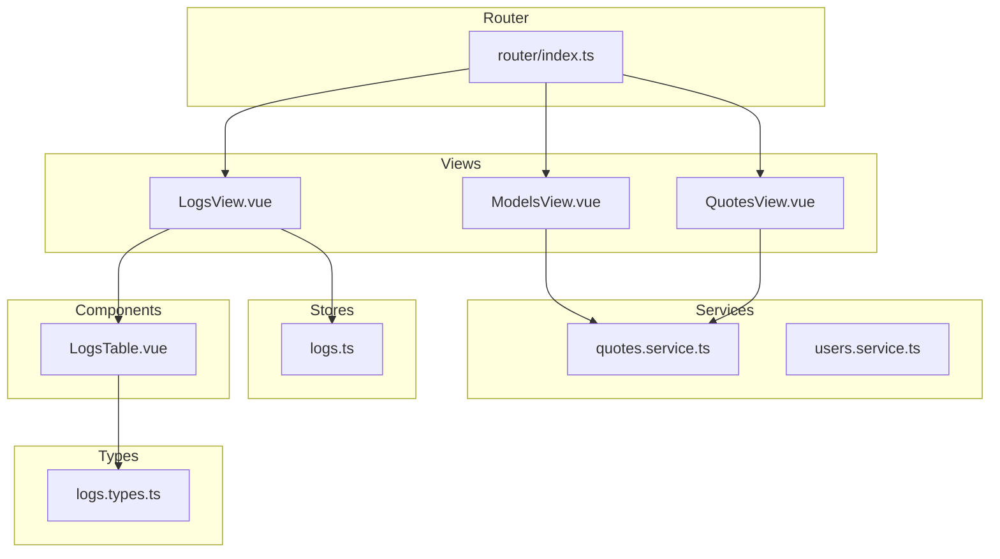
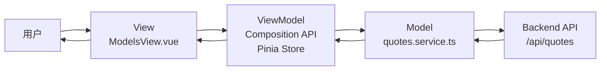
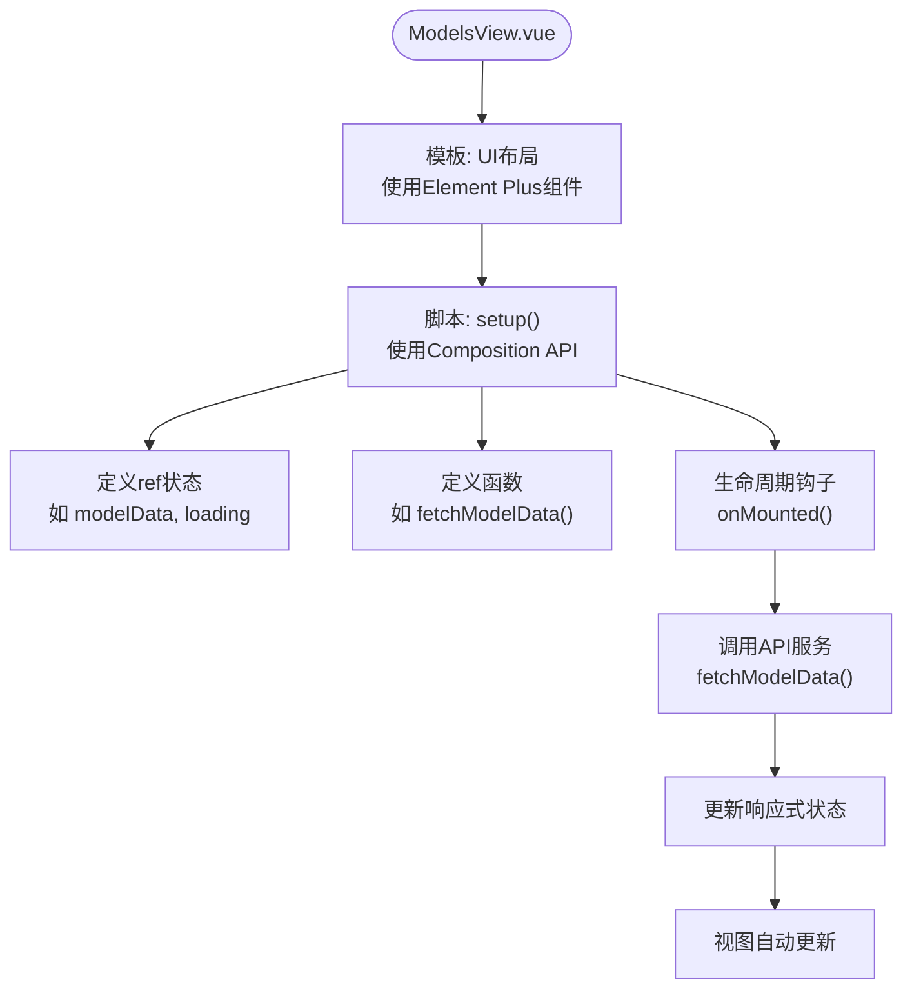
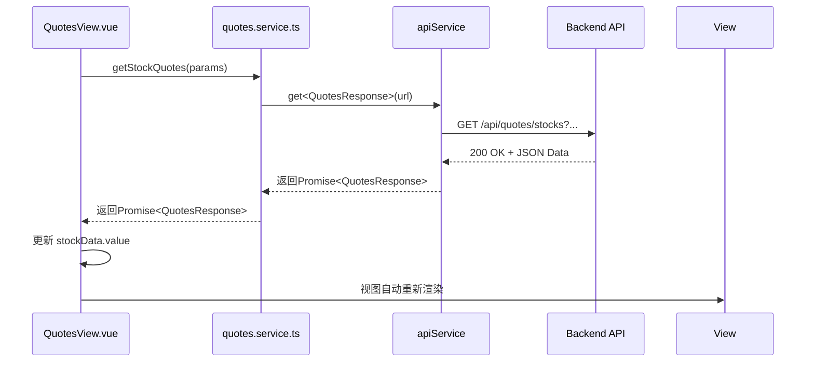
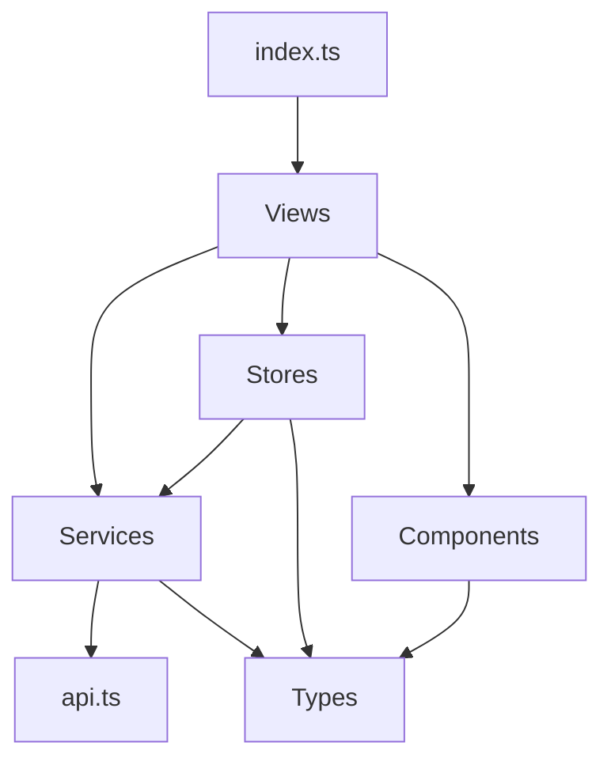

# 前端功能集成

<cite>
**本文档引用文件**  
- [ModelsView.vue](file://admin/src/views/ModelsView.vue)
- [quotes.service.ts](file://admin/src/services/quotes.service.ts)
- [index.ts](file://admin/src/router/index.ts)
- [QuotesView.vue](file://admin/src/views/QuotesView.vue)
- [users.service.ts](file://admin/src/services/users.service.ts)
- [logs.ts](file://admin/src/stores/logs.ts)
- [LogsView.vue](file://admin/src/views/LogsView.vue)
- [LogsTable.vue](file://admin/src/components/logs/LogsTable.vue)
- [logs.types.ts](file://admin/src/types/logs.types.ts)
</cite>

## 目录
1. [简介](#简介)
2. [项目结构](#项目结构)
3. [核心组件](#核心组件)
4. [架构概览](#架构概览)
5. [详细组件分析](#详细组件分析)
6. [依赖分析](#依赖分析)
7. [性能考虑](#性能考虑)
8. [故障排除指南](#故障排除指南)
9. [结论](#结论)

## 简介
本文档旨在为`admin`管理后台提供一份全面的前端功能集成开发指南，重点说明如何在系统中集成新的分析功能或数据展示模块。通过分析`ModelsView.vue`和`quotes.service.ts`等关键文件，详细阐述Vue 3 Composition API的使用方式、Pinia状态管理的联动机制以及Element Plus组件库的集成模式。文档将指导开发者完成从定义新的API服务调用、配置路由（router/index.ts）、创建可视化组件到实现响应式数据绑定的完整开发路径。同时，涵盖权限控制、加载状态、错误提示等用户体验细节的处理方案，并强调代码组织规范与可维护性原则，确保新功能能够无缝、高效地融入现有系统。

## 项目结构
`admin`管理后台采用基于Vue 3和TypeScript的现代化前端架构，项目结构清晰，遵循功能模块化组织原则。核心代码位于`admin/src`目录下，主要分为`components`（可复用UI组件）、`views`（页面级视图）、`services`（API服务层）、`stores`（Pinia状态管理）和`types`（类型定义）等关键目录。这种分层设计有效分离了关注点，便于团队协作和代码维护。路由配置集中于`router/index.ts`，统一管理应用的导航逻辑。



**图表来源**  
- [ModelsView.vue](file://admin/src/views/ModelsView.vue)
- [quotes.service.ts](file://admin/src/services/quotes.service.ts)
- [index.ts](file://admin/src/router/index.ts)
- [QuotesView.vue](file://admin/src/views/QuotesView.vue)
- [logs.ts](file://admin/src/stores/logs.ts)
- [LogsTable.vue](file://admin/src/components/logs/LogsTable.vue)
- [logs.types.ts](file://admin/src/types/logs.types.ts)

**本节来源**  
- [ModelsView.vue](file://admin/src/views/ModelsView.vue)
- [quotes.service.ts](file://admin/src/services/quotes.service.ts)
- [index.ts](file://admin/src/router/index.ts)

## 核心组件
`ModelsView.vue`和`QuotesView.vue`是`admin`后台中两个典型的视图组件，它们展示了如何利用Vue 3 Composition API构建功能完整的数据展示页面。`ModelsView.vue`目前是一个占位页面，其模板结构简单，仅包含一个表示“功能开发中”的图标和文字，这为未来集成复杂的预测模型提供了清晰的入口。`QuotesView.vue`则是一个功能完备的行情数据管理页面，它通过Composition API的`ref`和`onMounted`等函数，声明了多个响应式数据源（如`stockData`, `indexData`）和分页状态，并在组件挂载后自动加载数据。`quotes.service.ts`作为核心服务，定义了与后端`/api/quotes`端点交互的类型安全接口和方法，实现了数据获取的抽象化。

**本节来源**  
- [ModelsView.vue](file://admin/src/views/ModelsView.vue#L1-L15)
- [QuotesView.vue](file://admin/src/views/QuotesView.vue#L1-L819)
- [quotes.service.ts](file://admin/src/services/quotes.service.ts#L1-L122)

## 架构概览
整个`admin`后台的前端架构遵循MVVM（Model-View-ViewModel）模式。`View`（视图）由`*.vue`文件构成，负责UI渲染和用户交互；`ViewModel`由Composition API中的`setup`函数和Pinia `stores`共同承担，处理业务逻辑和状态管理；`Model`则由`types`目录下的类型定义和`services`目录下的API服务构成，代表应用的数据模型和数据访问层。路由`index.ts`作为应用的导航中枢，将不同的URL路径映射到具体的视图组件。当用户访问`/models`时，`ModelsView.vue`被加载，它通过`quotesService`获取数据，并将状态更新反映到视图上，形成一个完整的数据流闭环。



**图表来源**  
- [ModelsView.vue](file://admin/src/views/ModelsView.vue#L1-L15)
- [quotes.service.ts](file://admin/src/services/quotes.service.ts#L1-L122)
- [index.ts](file://admin/src/router/index.ts#L1-L102)

## 详细组件分析

### ModelsView.vue 分析
`ModelsView.vue`是集成新分析功能的起点。该组件目前处于开发阶段，其主要作用是为未来的预测模型功能提供一个独立的路由入口和UI容器。开发者可以在此基础上，通过Composition API引入新的响应式状态和计算属性，并利用Element Plus的`el-card`、`el-table`等组件构建复杂的可视化界面。



**图表来源**  
- [ModelsView.vue](file://admin/src/views/ModelsView.vue#L1-L15)

**本节来源**  
- [ModelsView.vue](file://admin/src/views/ModelsView.vue#L1-L15)

### QuotesView.vue 与 quotes.service.ts 联动分析
`QuotesView.vue`和`quotes.service.ts`的组合是理解数据流和状态管理的绝佳范例。`QuotesView.vue`通过导入`quotesService`实例，调用其`getStockQuotes`、`getIndexQuotes`等方法发起API请求。这些方法返回Promise，`QuotesView.vue`中的`fetchStockData`等函数通过`async/await`语法处理异步操作，将获取的数据赋值给`ref`定义的响应式变量（如`stockData.value`），从而触发视图更新。`quotes.service.ts`内部使用`apiService`进行HTTP通信，并通过泛型确保了类型安全。



**图表来源**  
- [QuotesView.vue](file://admin/src/views/QuotesView.vue#L1-L819)
- [quotes.service.ts](file://admin/src/services/quotes.service.ts#L1-L122)

**本节来源**  
- [QuotesView.vue](file://admin/src/views/QuotesView.vue#L1-L819)
- [quotes.service.ts](file://admin/src/services/quotes.service.ts#L1-L122)

### LogsView.vue 与 Pinia 状态管理分析
`LogsView.vue`展示了如何使用Pinia进行更复杂的状态管理。它不直接调用服务，而是通过`useLogsStore()`导入一个Pinia store。该store（`logs.ts`）集中管理了日志数据、加载状态、过滤条件和分页信息。`LogsView.vue`使用`storeToRefs`将store中的状态解构为响应式引用，实现了视图与状态的绑定。当用户操作（如切换标签页、更改分页）时，`LogsView.vue`调用store暴露的`switchTab`、`updatePagination`等action，这些action内部会调用`logs.service.ts`获取数据，并自动更新store中的状态，从而驱动所有使用该状态的组件更新。

```mermaid
classDiagram
class LogsView {
+setup()
+useLogsStore()
+storeToRefs()
+switchTab()
+updatePagination()
}
class LogsStore {
-historicalLogs : Ref~AnyLogEntry[]~
-realtimeLogs : Ref~AnyLogEntry[]~
-loading : Ref~boolean~
-filters : Ref~LogFilter~
-pagination : Ref~{current, pageSize, total}~
+fetchLogs()
+fetchRealtimeLogs()
+fetchOperationLogs()
+switchTab()
+updateFilters()
+updatePagination()
}
class LogsService {
+getLogs()
+getRealtimeLogs()
+getOperationLogs()
}
LogsView --> LogsStore : "使用"
LogsStore --> LogsService : "调用"
LogsService --> Backend : "HTTP请求"
```

**图表来源**  
- [LogsView.vue](file://admin/src/views/LogsView.vue#L1-L168)
- [logs.ts](file://admin/src/stores/logs.ts#L1-L242)
- [LogsTable.vue](file://admin/src/components/logs/LogsTable.vue#L1-L390)
- [logs.types.ts](file://admin/src/types/logs.types.ts#L1-L77)

**本节来源**  
- [LogsView.vue](file://admin/src/views/LogsView.vue#L1-L168)
- [logs.ts](file://admin/src/stores/logs.ts#L1-L242)

## 依赖分析
`admin`前端应用的依赖关系清晰且层次分明。最顶层的`views`依赖于`services`和`stores`来获取数据和管理状态。`services`依赖于底层的`apiService`（未在文件中直接显示，但被引用）进行HTTP通信，并依赖`types`中的接口进行类型定义。`stores`依赖于`services`来执行数据获取操作，并同样依赖`types`。`components`（如`LogsTable.vue`）作为可复用的UI单元，依赖于`types`来定义其`props`的数据结构。`router/index.ts`是整个应用的入口，它依赖于所有`views`组件来完成路由配置。



**图表来源**  
- [index.ts](file://admin/src/router/index.ts#L1-L102)
- [quotes.service.ts](file://admin/src/services/quotes.service.ts#L1-L122)
- [users.service.ts](file://admin/src/services/users.service.ts#L1-L55)
- [logs.ts](file://admin/src/stores/logs.ts#L1-L242)
- [LogsTable.vue](file://admin/src/components/logs/LogsTable.vue#L1-L390)
- [logs.types.ts](file://admin/src/types/logs.types.ts#L1-L77)

**本节来源**  
- [index.ts](file://admin/src/router/index.ts#L1-L102)
- [quotes.service.ts](file://admin/src/services/quotes.service.ts#L1-L122)
- [users.service.ts](file://admin/src/services/users.service.ts#L1-L55)
- [logs.ts](file://admin/src/stores/logs.ts#L1-L242)

## 性能考虑
在集成新功能时，应考虑性能优化。例如，`QuotesView.vue`中对股票数据的搜索是通过`handleStockSearch`函数在前端触发API重新请求实现的，这确保了数据的实时性，但频繁搜索可能增加服务器压力。可以考虑引入防抖（debounce）机制来优化。此外，`LogsTable.vue`组件通过`v-if`和`v-else-if`根据`logType`动态渲染不同的表格列，避免了不必要的DOM渲染，这是一种良好的性能实践。对于大型数据集，应始终利用分页（`page`, `pageSize`）来限制单次加载的数据量。

## 故障排除指南
当新集成的功能出现问题时，可参考以下步骤进行排查：
1.  **检查网络请求**：打开浏览器开发者工具的Network标签，确认API请求是否发出，URL、参数和响应状态码是否正确。
2.  **检查控制台日志**：查看Console标签，`quotes.service.ts`和`logs.ts`等文件中包含大量`console.log`和`console.error`语句，这些日志能帮助定位错误发生的位置和原因。
3.  **验证状态管理**：如果使用Pinia，检查store中的状态（如`loading`, `error`）是否按预期更新。确保action被正确调用。
4.  **检查类型定义**：确保`types`目录下的接口与后端API返回的实际数据结构一致，类型不匹配可能导致运行时错误。
5.  **审查路由配置**：确认`router/index.ts`中已正确添加新视图的路由，并且路径、名称和组件路径无误。

**本节来源**  
- [quotes.service.ts](file://admin/src/services/quotes.service.ts#L1-L122)
- [logs.ts](file://admin/src/stores/logs.ts#L1-L242)
- [index.ts](file://admin/src/router/index.ts#L1-L102)

## 结论
本文档通过分析`admin`管理后台的关键文件，为集成新的分析功能或数据展示模块提供了完整的开发路径。开发者应遵循现有架构，利用Vue 3 Composition API定义响应式逻辑，通过`services`层与后端API交互，并根据需要选择直接管理状态或使用Pinia进行集中管理。Element Plus组件库提供了丰富的UI元素，可用于快速构建专业界面。遵循清晰的代码组织规范和错误处理模式，将确保新功能的可维护性和用户体验。