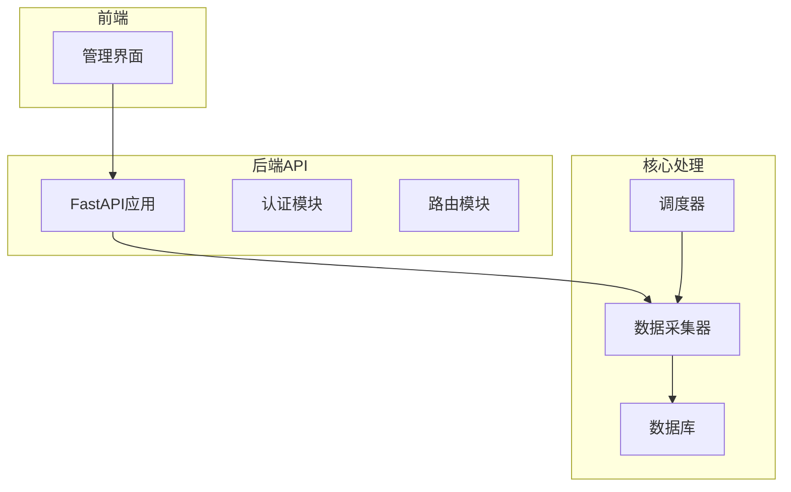
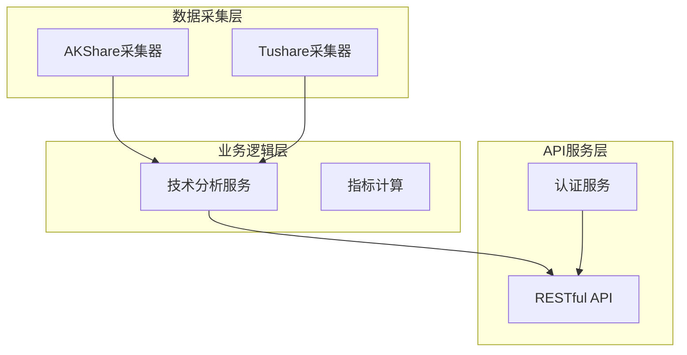
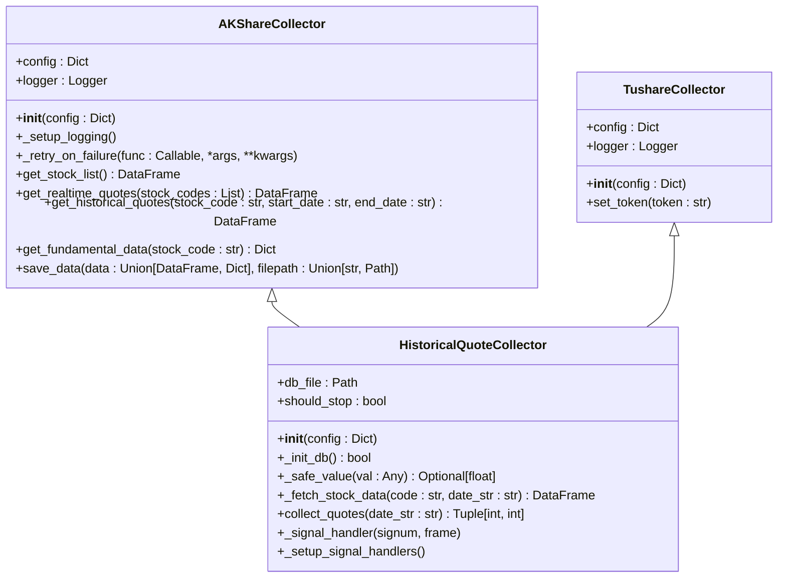
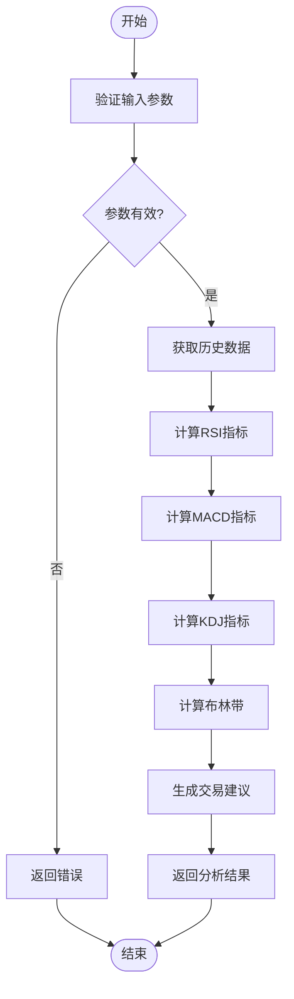
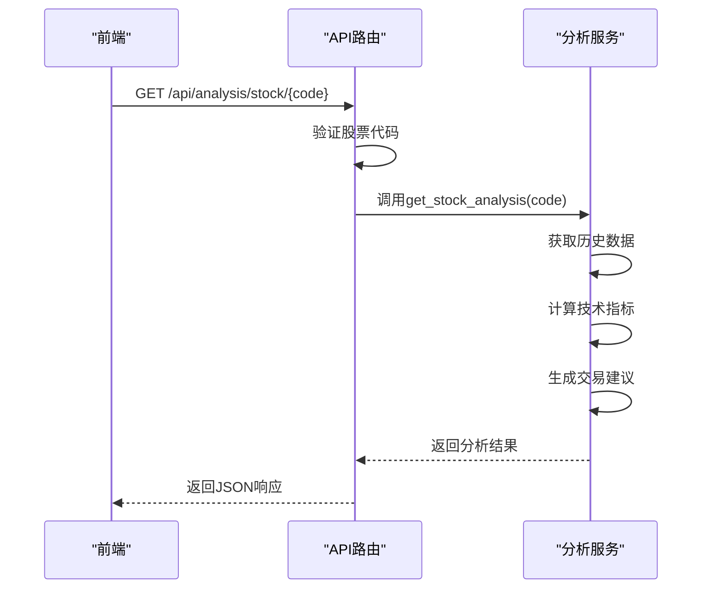
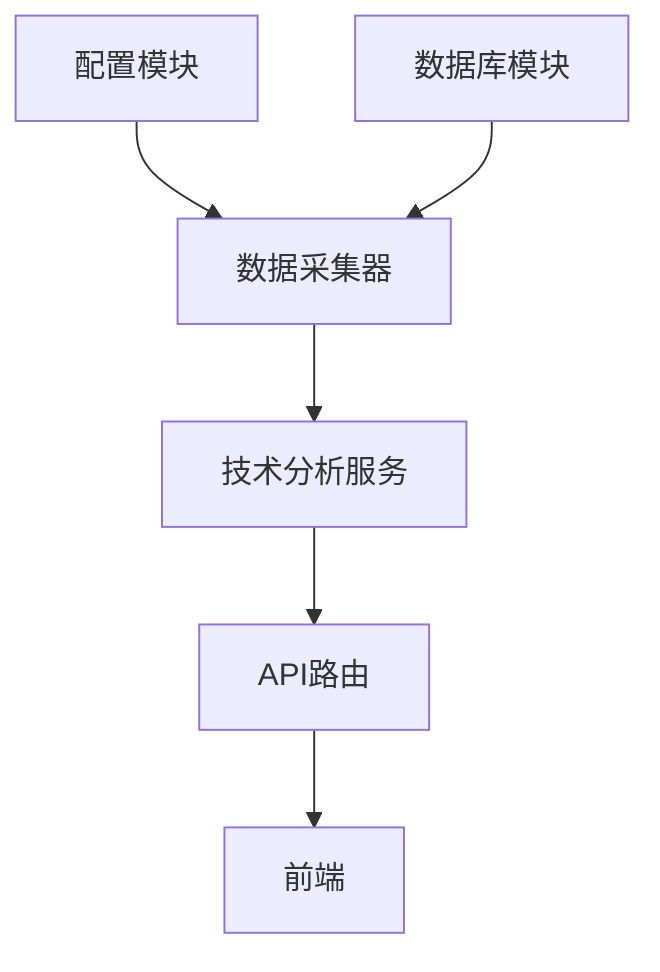

# 扩展开发

<cite>
**本文档引用的文件**
- [main.py](file://backend_core/data_collectors/main.py)
- [base.py](file://backend_core/data_collectors/akshare/base.py)
- [historical.py](file://backend_core/data_collectors/akshare/historical.py)
- [base.py](file://backend_core/data_collectors/tushare/base.py)
- [historical.py](file://backend_core/data_collectors/tushare/historical.py)
- [stock_analysis.py](file://backend_api/stock/stock_analysis.py)
- [stock_analysis_routes.py](file://backend_api/stock/stock_analysis_routes.py)
- [main.py](file://backend_api/main.py)
</cite>

## 目录
1. [引言](#引言)
2. [项目结构](#项目结构)
3. [核心组件](#核心组件)
4. [架构概述](#架构概述)
5. [详细组件分析](#详细组件分析)
6. [依赖分析](#依赖分析)
7. [性能考虑](#性能考虑)
8. [故障排除指南](#故障排除指南)
9. [结论](#结论)
10. [附录](#附录)（如有必要）

## 引言
本文档旨在为股票分析系统提供全面的扩展开发指导。文档详细说明了如何添加新的数据采集源（如接入新版本Tushare或AkShare接口）、实现新的技术分析指标（如RSI、MACD）或扩展API功能。以backend_core/data_collectors/中的采集器模块为例，解释插件式架构设计与注册机制。同时指导如何在backend_api中新增RESTful路由并在前端admin界面中集成展示。提供从模型定义、服务实现到UI联动的完整开发路径，确保扩展一致性。

## 项目结构
本项目采用分层架构设计，主要分为前端、后端API和核心数据处理三个部分。后端核心模块backend_core负责数据采集和处理，通过插件式架构支持多种数据源。后端API层backend_api提供RESTful接口服务，前端admin提供管理界面。这种分层设计使得系统具有良好的可扩展性和维护性。

**图示来源**
- [main.py](file://backend_api/main.py#L1-L129)

**本节来源**
- [main.py](file://backend_api/main.py#L1-L129)

## 核心组件
系统的核心组件包括数据采集器、技术分析服务和API路由。数据采集器采用插件式架构，支持AkShare和Tushare等多种数据源。技术分析服务提供RSI、MACD等指标计算功能。API路由层将这些功能暴露为RESTful接口，供前端调用。

**本节来源**
- [main.py](file://backend_core/data_collectors/main.py#L1-L244)
- [stock_analysis.py](file://backend_api/stock/stock_analysis.py#L1-L805)

## 架构概述
系统采用分层架构设计，包括数据采集层、业务逻辑层和API服务层。数据采集层通过插件式架构支持多种数据源，业务逻辑层实现技术分析算法，API服务层提供RESTful接口。各层之间通过清晰的接口进行通信，确保系统的可维护性和可扩展性。

**图示来源**
- [main.py](file://backend_core/data_collectors/main.py#L1-L244)
- [stock_analysis.py](file://backend_api/stock/stock_analysis.py#L1-L805)

## 详细组件分析
### 数据采集器分析
数据采集器模块采用插件式架构设计，通过基类提供通用功能，具体实现类继承基类并实现特定数据源的采集逻辑。这种设计使得添加新的数据源变得简单而一致。

#### 对象导向组件

**图示来源**
- [base.py](file://backend_core/data_collectors/akshare/base.py#L1-L232)
- [base.py](file://backend_core/data_collectors/tushare/base.py#L1-L21)
- [historical.py](file://backend_core/data_collectors/akshare/historical.py#L1-L227)

**本节来源**
- [base.py](file://backend_core/data_collectors/akshare/base.py#L1-L232)
- [base.py](file://backend_core/data_collectors/tushare/base.py#L1-L21)
- [historical.py](file://backend_core/data_collectors/akshare/historical.py#L1-L227)

### 技术分析服务分析
技术分析服务模块实现了多种技术指标的计算，包括RSI、MACD、KDJ和布林带等。这些指标为股票分析提供了重要的决策支持。

#### 复杂逻辑组件

**图示来源**
- [stock_analysis.py](file://backend_api/stock/stock_analysis.py#L1-L805)

**本节来源**
- [stock_analysis.py](file://backend_api/stock/stock_analysis.py#L1-L805)

### API路由分析
API路由模块负责将后端服务暴露为RESTful接口，供前端调用。通过FastAPI框架实现，支持多种HTTP方法和参数验证。

#### API/服务组件

**图示来源**
- [stock_analysis_routes.py](file://backend_api/stock/stock_analysis_routes.py#L1-L271)
- [stock_analysis.py](file://backend_api/stock/stock_analysis.py#L1-L805)

**本节来源**
- [stock_analysis_routes.py](file://backend_api/stock/stock_analysis_routes.py#L1-L271)
- [stock_analysis.py](file://backend_api/stock/stock_analysis.py#L1-L805)

## 依赖分析
系统各组件之间存在明确的依赖关系。数据采集器依赖于配置模块和数据库模块，技术分析服务依赖于数据采集器提供的数据，API路由依赖于技术分析服务。这种清晰的依赖关系确保了系统的可维护性和可测试性。

**图示来源**
- [main.py](file://backend_core/data_collectors/main.py#L1-L244)
- [stock_analysis.py](file://backend_api/stock/stock_analysis.py#L1-L805)

**本节来源**
- [main.py](file://backend_core/data_collectors/main.py#L1-L244)
- [stock_analysis.py](file://backend_api/stock/stock_analysis.py#L1-L805)

## 性能考虑
在扩展开发时需要考虑性能影响。数据采集器应实现适当的重试机制和错误处理，避免因网络问题导致服务中断。技术分析服务应优化算法复杂度，避免在高并发场景下成为性能瓶颈。API路由应实现适当的缓存策略，减少重复计算。

## 故障排除指南
当扩展功能出现问题时，首先检查日志文件。数据采集器的日志位于logs目录下，API服务的日志位于根目录的app.log文件中。检查配置文件是否正确，数据库连接是否正常。对于API接口问题，使用curl或Postman工具测试接口，确认请求参数和响应格式是否正确。

**本节来源**
- [main.py](file://backend_core/data_collectors/main.py#L1-L244)
- [stock_analysis.py](file://backend_api/stock/stock_analysis.py#L1-L805)

## 结论
本文档详细介绍了股票分析系统的扩展开发方法。通过插件式架构设计，系统能够灵活地支持多种数据源和技术指标。遵循本文档的指导，开发者可以快速添加新的功能，同时保持系统的稳定性和一致性。建议在开发新功能时，参考现有模块的设计模式，确保代码风格和架构的一致性。

## 附录
### 添加新数据采集源的步骤
1. 在backend_core/data_collectors目录下创建新的子目录
2. 创建base.py文件，定义采集器基类
3. 创建具体实现文件，继承基类并实现采集逻辑
4. 在main.py中注册新的采集器和定时任务
5. 在backend_api中添加相应的API路由

### 实现新技术分析指标的步骤
1. 在stock_analysis.py中添加新的指标计算方法
2. 在TechnicalIndicators类中集成新指标
3. 在StockAnalysisService中调用新指标
4. 在stock_analysis_routes.py中添加新的API端点
5. 在前端admin界面中添加相应的展示组件