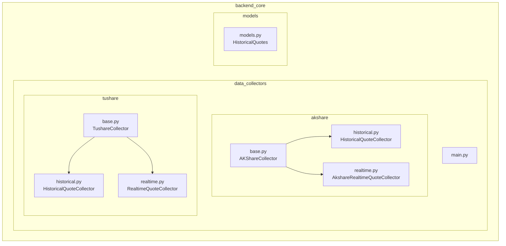
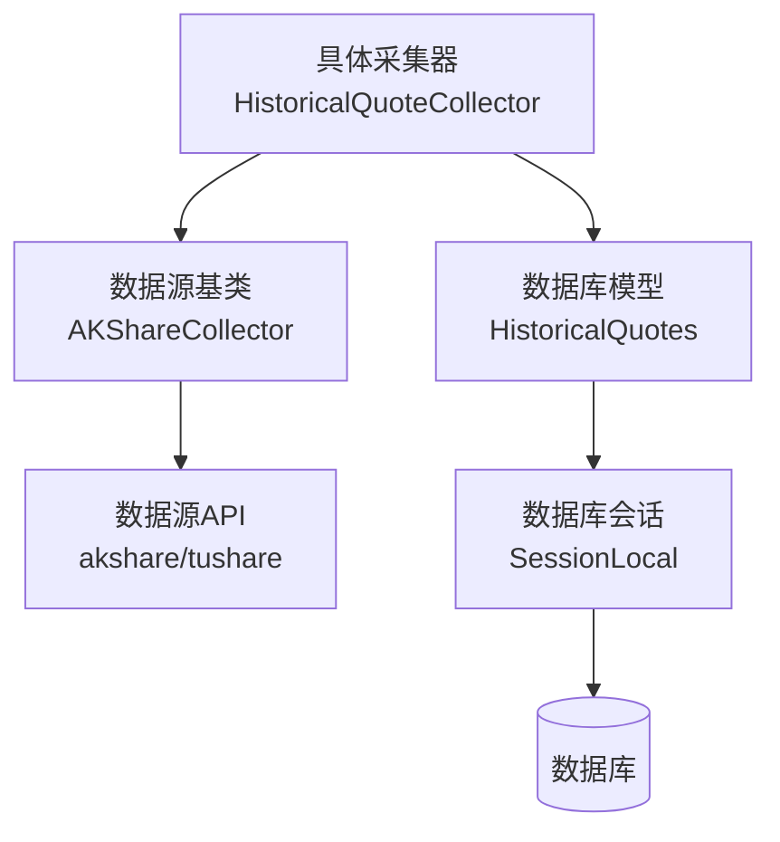
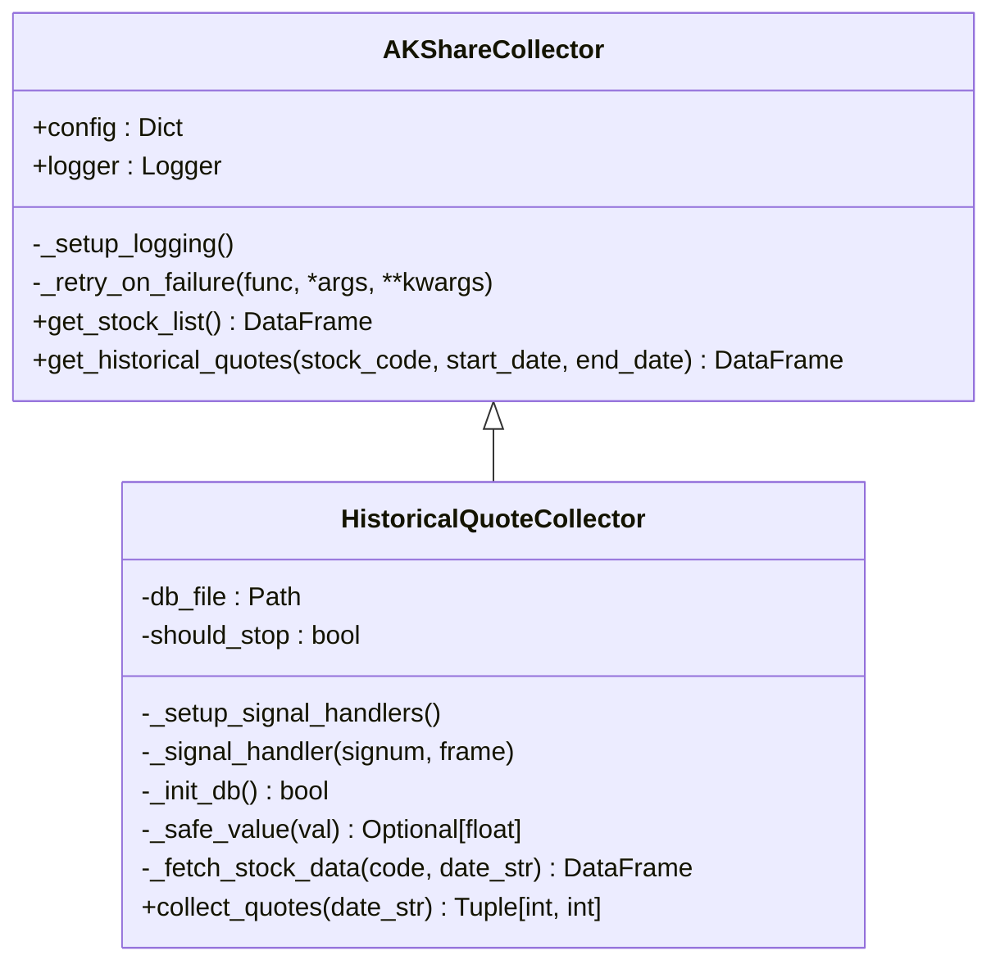
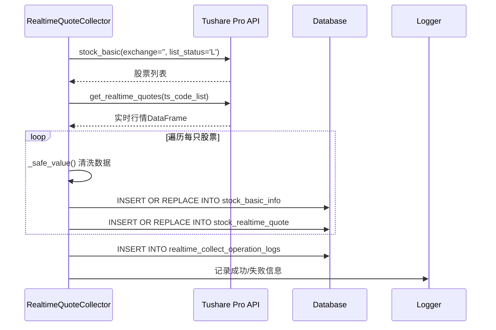
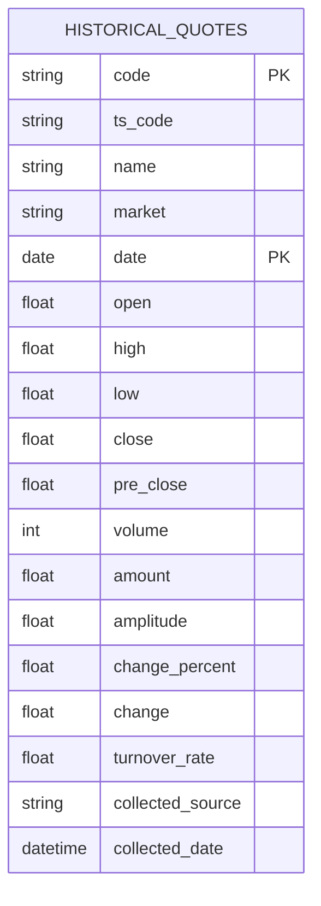
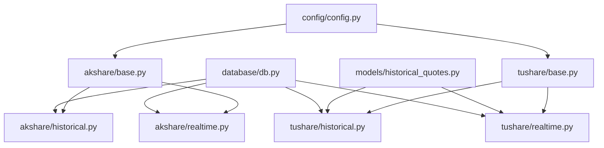

# 数据采集扩展

<cite>
**本文档中引用的文件**   
- [akshare/base.py](file://backend_core/data_collectors/akshare/base.py)
- [akshare/historical.py](file://backend_core/data_collectors/akshare/historical.py)
- [akshare/realtime.py](file://backend_core/data_collectors/akshare/realtime.py)
- [tushare/base.py](file://backend_core/data_collectors/tushare/base.py)
- [tushare/historical.py](file://backend_core/data_collectors/tushare/historical.py)
- [tushare/realtime.py](file://backend_core/data_collectors/tushare/realtime.py)
- [models/historical_quotes.py](file://backend_core/models/historical_quotes.py)
</cite>

## 目录
1. [简介](#简介)
2. [项目结构](#项目结构)
3. [核心组件](#核心组件)
4. [架构概述](#架构概述)
5. [详细组件分析](#详细组件分析)
6. [依赖分析](#依赖分析)
7. [性能考虑](#性能考虑)
8. [故障排除指南](#故障排除指南)
9. [结论](#结论)

## 简介
本文档旨在为开发者提供一份详尽的《数据采集扩展开发指南》，指导如何基于 `backend_core/data_collectors` 模块的插件式架构接入新的数据源（如新版Tushare或AkShare接口）。通过分析 `akshare` 和 `tushare` 目录下的采集器实现，深入解释 `BaseCollector` 抽象基类的设计原理、采集器注册机制与调度流程。文档将指导开发者如何实现新的历史数据采集器（historical.py）和实时数据采集器（realtime.py），涵盖数据清洗、格式映射、异常处理和日志记录的最佳实践。同时，提供从类定义、方法重写到单元测试（test.py）的完整开发示例，并说明如何与数据库模型（historical_quotes.py）对接以确保数据一致性。

## 项目结构
`backend_core/data_collectors` 模块采用清晰的插件式架构，每个数据源（如 `akshare` 和 `tushare`）拥有独立的子目录。每个子目录下包含一个 `base.py` 文件，定义了该数据源的抽象基类（如 `AKShareCollector` 和 `TushareCollector`），以及多个具体的采集器实现文件（如 `historical.py` 和 `realtime.py`）。这种结构实现了数据源的隔离与复用，便于扩展和维护。`models` 目录下的 `historical_quotes.py` 定义了与数据库表 `historical_quotes` 对应的SQLAlchemy模型，是数据持久化的关键。

**图源**
- [akshare/base.py](file://backend_core/data_collectors/akshare/base.py)
- [tushare/base.py](file://backend_core/data_collectors/tushare/base.py)
- [akshare/historical.py](file://backend_core/data_collectors/akshare/historical.py)
- [akshare/realtime.py](file://backend_core/data_collectors/akshare/realtime.py)
- [tushare/historical.py](file://backend_core/data_collectors/tushare/historical.py)
- [tushare/realtime.py](file://backend_core/data_collectors/tushare/realtime.py)
- [models/historical_quotes.py](file://backend_core/models/historical_quotes.py)

**节源**
- [akshare/base.py](file://backend_core/data_collectors/akshare/base.py)
- [tushare/base.py](file://backend_core/data_collectors/tushare/base.py)

## 核心组件
本模块的核心是 `BaseCollector` 抽象基类的设计。在 `akshare/base.py` 中，`AKShareCollector` 类提供了数据采集的通用功能，如日志记录、失败重试、数据获取等。`TushareCollector` 类在 `tushare/base.py` 中提供了类似的基础功能。具体的采集器（如 `HistoricalQuoteCollector`）通过继承这些基类来复用代码，并实现特定于数据源和数据类型的采集逻辑。`historical_quotes.py` 中的 `HistoricalQuotes` 模型则定义了数据存储的结构和约束。

**节源**
- [akshare/base.py](file://backend_core/data_collectors/akshare/base.py#L1-L231)
- [tushare/base.py](file://backend_core/data_collectors/tushare/base.py#L1-L20)
- [models/historical_quotes.py](file://backend_core/models/historical_quotes.py#L1-L27)

## 架构概述
系统采用分层架构。上层是具体的数据采集器（如 `akshare/historical.py` 中的 `HistoricalQuoteCollector`），负责调用数据源API并处理业务逻辑。中层是数据源基类（如 `akshare/base.py` 中的 `AKShareCollector`），提供通用的采集、重试和日志功能。底层是数据库模型（`models/historical_quotes.py`）和数据库会话（`database/db.py`），负责数据的持久化。采集器通过调用基类方法获取数据，经过清洗和转换后，利用SQLAlchemy ORM或原生SQL语句存入数据库。

**图源**
- [akshare/historical.py](file://backend_core/data_collectors/akshare/historical.py#L1-L226)
- [akshare/base.py](file://backend_core/data_collectors/akshare/base.py#L1-L231)
- [models/historical_quotes.py](file://backend_core/models/historical_quotes.py#L1-L27)

## 详细组件分析
### 历史数据采集器分析
`akshare/historical.py` 中的 `HistoricalQuoteCollector` 是一个典型的实现。它继承自 `AKShareCollector`，复用其日志和重试功能。`collect_quotes` 方法是核心，它首先获取股票列表，然后遍历每只股票，调用 `_fetch_stock_data` 获取单日历史数据，经过 `_safe_value` 方法清洗后，通过 `_init_db` 确保表结构存在，最终将数据插入 `historical_quotes` 表。该过程包含详细的异常处理和中断信号（SIGINT/SIGTERM）响应，确保了程序的健壮性。

**图源**
- [akshare/base.py](file://backend_core/data_collectors/akshare/base.py#L1-L231)
- [akshare/historical.py](file://backend_core/data_collectors/akshare/historical.py#L1-L226)

**节源**
- [akshare/historical.py](file://backend_core/data_collectors/akshare/historical.py#L1-L226)

### 实时数据采集器分析
`tushare/realtime.py` 中的 `RealtimeQuoteCollector` 展示了另一种实现。它同样继承自 `TushareCollector`。`collect_quotes` 方法首先通过 `pro.stock_basic` 获取股票列表，然后使用 `ts.get_realtime_quotes` 批量获取实时行情。数据清洗同样通过 `_safe_value` 方法完成。与历史采集器不同，它使用 `INSERT OR REPLACE` 语句来处理数据的插入和更新，并在操作完成后记录详细的日志到 `realtime_collect_operation_logs` 表，便于监控和审计。

**图源**
- [tushare/realtime.py](file://backend_core/data_collectors/tushare/realtime.py#L1-L157)
- [tushare/base.py](file://backend_core/data_collectors/tushare/base.py#L1-L20)

**节源**
- [tushare/realtime.py](file://backend_core/data_collectors/tushare/realtime.py#L1-L157)

### 数据库模型对接
`models/historical_quotes.py` 定义了 `HistoricalQuotes` ORM 模型，其字段与数据库表 `historical_quotes` 严格对应。在 `tushare/historical.py` 的 `collect_historical_quotes` 方法中，采集器通过 `SessionLocal` 创建数据库会话，并使用 `session.execute(text(...))` 执行SQL语句，将清洗后的数据（`data` 字典）插入或更新到数据库。`collected_source` 和 `collected_date` 字段的引入，确保了数据来源的可追溯性，是数据一致性的重要保障。

**图源**
- [models/historical_quotes.py](file://backend_core/models/historical_quotes.py#L1-L27)
- [tushare/historical.py](file://backend_core/data_collectors/tushare/historical.py#L1-L315)

**节源**
- [models/historical_quotes.py](file://backend_core/models/historical_quotes.py#L1-L27)

## 依赖分析
`backend_core/data_collectors` 模块高度依赖外部数据源库（`akshare` 和 `tushare`）以及内部的 `backend_core/database` 模块。`akshare` 和 `tushare` 目录下的 `base.py` 文件是各自采集器的基石，被 `historical.py` 和 `realtime.py` 等文件直接依赖。`models/historical_quotes.py` 被所有需要操作历史行情数据的采集器所依赖，以确保数据格式的统一。`config/config.py` 提供了全局配置，被基类用于初始化日志路径和数据库连接等。

**图源**
- [akshare/base.py](file://backend_core/data_collectors/akshare/base.py)
- [tushare/base.py](file://backend_core/data_collectors/tushare/base.py)
- [models/historical_quotes.py](file://backend_core/models/historical_quotes.py)
- [database/db.py](file://backend_core/database/db.py)
- [config/config.py](file://backend_core/config/config.py)

**节源**
- [akshare/base.py](file://backend_core/data_collectors/akshare/base.py)
- [tushare/base.py](file://backend_core/data_collectors/tushare/base.py)

## 性能考虑
采集器的性能主要受网络I/O和数据库写入的影响。`akshare/historical.py` 采用了逐个股票请求的模式，虽然简单但效率较低，建议在 `akshare` 支持批量请求时进行优化。`tushare/historical.py` 通过 `pro.daily` 一次性获取全市场数据，效率更高。在数据库写入方面，`tushare/historical.py` 实现了批量提交（每100条记录提交一次），有效减少了事务开销。`akshare/realtime.py` 和 `tushare/realtime.py` 都实现了重试机制来处理数据库锁冲突，保证了在高并发场景下的稳定性。

## 故障排除指南
当数据采集失败时，应首先检查日志文件（位于 `backend_core/logs` 目录下）。`_retry_on_failure` 装饰器会记录重试信息，帮助判断是网络波动还是API本身的问题。数据库操作失败通常会在日志中记录具体的SQL错误，如死锁（DeadlockDetected）或约束冲突。`realtime_collect_operation_logs` 和 `historical_collect_operation_logs` 表提供了操作级别的汇总日志，可用于快速定位是整体失败还是部分失败。对于 `tushare`，需确保 `token` 配置正确且未过期。

**节源**
- [akshare/base.py](file://backend_core/data_collectors/akshare/base.py#L1-L231)
- [tushare/historical.py](file://backend_core/data_collectors/tushare/historical.py#L1-L315)
- [akshare/realtime.py](file://backend_core/data_collectors/akshare/realtime.py#L1-L262)

## 结论
`backend_core/data_collectors` 模块通过抽象基类和插件式目录结构，成功实现了对多数据源的灵活支持。开发者在接入新数据源时，应遵循现有模式：创建独立目录，定义继承自 `BaseCollector` 的基类，并实现具体的 `historical.py` 和 `realtime.py` 采集器。务必复用基类的日志、重试功能，实现健壮的异常处理，并确保与 `models` 目录下的数据库模型正确对接，以维护整个系统的数据一致性和可维护性。