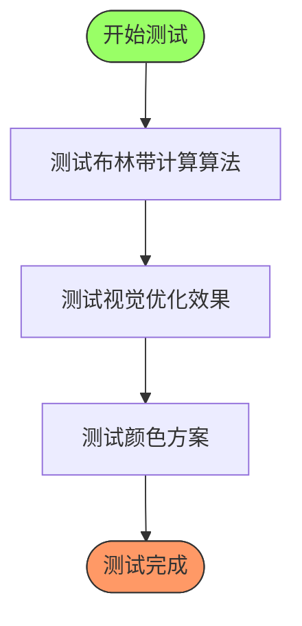
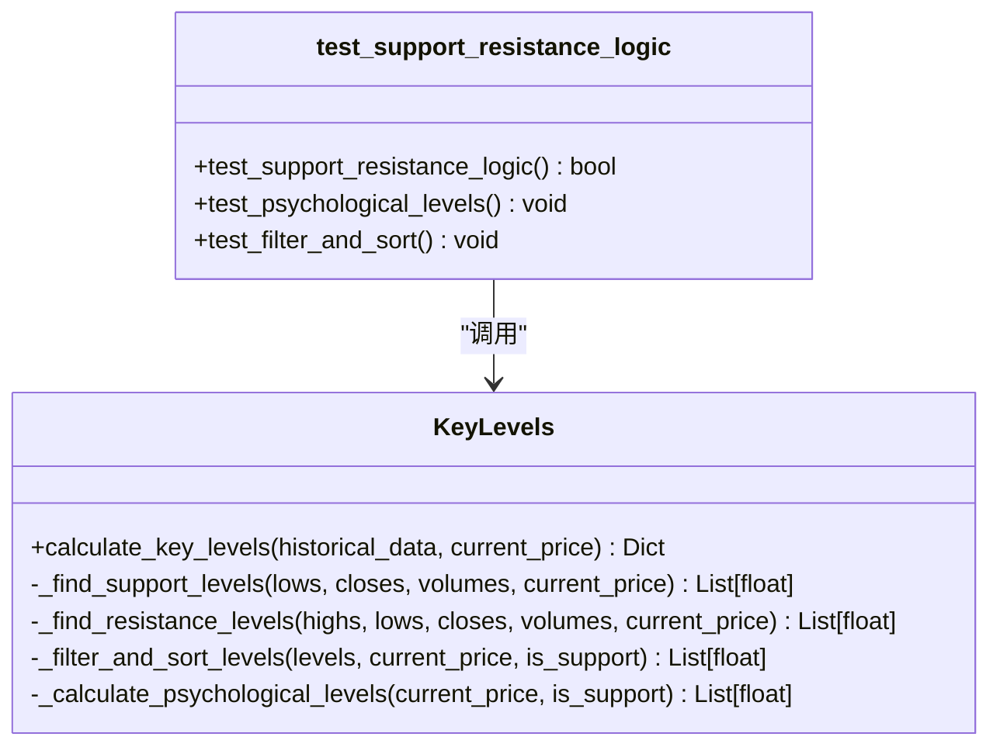
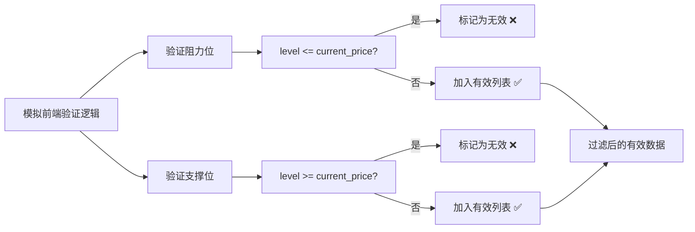
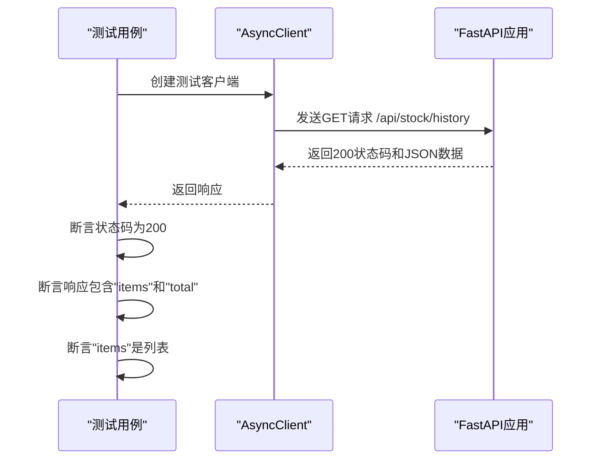

# 单元测试

<cite>
**本文档中引用的文件**  
- [test_bollinger_bands_optimization.py](file://test/test_bollinger_bands_optimization.py)
- [test_support_resistance_logic.py](file://test/test_support_resistance_logic.py)
- [test_frontend_validation.py](file://test/test_frontend_validation.py)
- [test_stock_history_api.py](file://backend_api/test/test_stock_history_api.py)
</cite>

## 目录
1. [引言](#引言)
2. [布林带参数优化测试分析](#布林带参数优化测试分析)
3. [支撑阻力位计算逻辑测试分析](#支撑阻力位计算逻辑测试分析)
4. [前端验证逻辑测试分析](#前端验证逻辑测试分析)
5. [后端API功能测试分析](#后端api功能测试分析)
6. [测试框架与最佳实践](#测试框架与最佳实践)
7. [外部依赖Mock实践](#外部依赖mock实践)
8. [测试覆盖率提升策略](#测试覆盖率提升策略)
9. [结论](#结论)

## 引言
本文档旨在深入分析股票分析系统中的核心单元测试用例，重点聚焦于技术指标算法、业务逻辑验证、前后端数据一致性以及API基础功能的测试实现。通过详细解读关键测试文件，展示如何使用Python的unittest和pytest框架构建可维护、高覆盖率的测试套件，确保系统核心功能的正确性和稳定性。

## 布林带参数优化测试分析

本节深入分析`test_bollinger_bands_optimization.py`文件，该文件专注于布林带（Bollinger Bands）技术指标的计算算法与视觉显示效果的优化验证。

**图示来源**  
- [test_bollinger_bands_optimization.py](file://test/test_bollinger_bands_optimization.py#L1-L147)

**本节来源**  
- [test_bollinger_bands_optimization.py](file://test/test_bollinger_bands_optimization.py#L1-L147)

### 计算算法断言逻辑
`test_bollinger_bands_calculation`函数通过生成模拟价格数据，对布林带的计算过程进行端到端验证。其核心断言逻辑体现在对计算结果的完整性与范围的检查：
- **数据完整性**：验证有效数据点的数量是否符合预期（即数据长度减去周期-1）。
- **数值范围**：通过`min`和`max`函数检查上轨、中线、下轨的值域是否在合理范围内，确保算法输出稳定。
- **计算精度**：明确使用`np.std(slice_data, ddof=1)`（样本标准差）而非总体标准差，并保留4位小数，符合金融数据分析的行业标准。

### 边界条件与优化验证
`test_visual_optimization`函数采用了一种独特的“对比式”断言，通过字典结构清晰地定义了优化前后的差异，并以文本形式输出验证结果。这实际上是一种**行为驱动开发（BDD）** 的实践，将技术需求（如“中线更突出”）直接映射为可验证的测试用例。关键的边界条件验证包括：
- **z-index层次**：确保布林带区域填充在最底层，中线在上层，避免遮挡K线图。
- **线条宽度与颜色**：验证线条宽度（2px中线）和颜色（橙色中线）是否符合UI设计规范。

## 支撑阻力位计算逻辑测试分析

本节分析`test_support_resistance_logic.py`文件，该文件是验证支撑阻力位计算准确性的核心测试，直接关联到`backend_api/stock/stock_analysis.py`中的`KeyLevels`类。

**图示来源**  
- [test_support_resistance_logic.py](file://test/test_support_resistance_logic.py#L1-L157)
- [stock_analysis.py](file://backend_api/stock/stock_analysis.py#L318-L635)

**本节来源**  
- [test_support_resistance_logic.py](file://test/test_support_resistance_logic.py#L1-L157)
- [stock_analysis.py](file://backend_api/stock/stock_analysis.py#L318-L635)

### 核心业务逻辑验证
`test_support_resistance_logic`函数是业务逻辑验证的典范，其断言逻辑严格遵循技术分析的基本原则：
- **支撑位验证**：遍历所有计算出的支撑位，使用`if level >= current_price`作为断言条件，确保每个支撑位都**严格小于**当前价格。任何不满足此条件的位点都会被标记为`❌`。
- **阻力位验证**：同理，确保每个阻力位都**严格大于**当前价格。
- **综合断言**：函数最终返回一个布尔值，只有当所有支撑位和阻力位都通过验证时，才返回`True`，这构成了一个强有力的集成测试断言。

### 分层测试策略
该测试文件采用了分层测试策略，将复杂的计算逻辑拆解为可独立验证的单元：
- `test_psychological_levels`：专门测试心理价位的生成逻辑，验证其是否符合“支撑位低于现价，阻力位高于现价”的规则。
- `test_filter_and_sort`：专门测试`_filter_and_sort_levels`方法，使用包含无效数据（如等于当前价格的价位）的测试集，验证过滤和排序功能的正确性。

## 前端验证逻辑测试分析

本节分析`test_frontend_validation.py`文件，该文件模拟了前端JavaScript中的数据验证逻辑，确保用户界面显示的数据符合业务规则。

**图示来源**  
- [test_frontend_validation.py](file://test/test_frontend_validation.py#L1-L115)

**本节来源**  
- [test_frontend_validation.py](file://test/test_frontend_validation.py#L1-L115)

### 验证逻辑与断言
`test_frontend_validation_logic`函数的核心是模拟前端的双重验证：
1.  **输入过滤**：在遍历测试数据时，立即检查每个价位的有效性，并将无效数据排除在`valid_resistance_levels`和`valid_support_levels`列表之外。
2.  **输出断言**：在过滤后，对`valid_resistance_levels`和`valid_support_levels`这两个“有效”列表进行二次检查，确保其中**确实不存在**任何违反规则的数据。这种“双重保险”式的断言极大地增强了测试的可靠性。

### 特定问题回归测试
`test_specific_problem`函数是一个典型的**回归测试**用例，它针对用户反馈的具体问题（支撑位73.86 >= 当前价格73.65）进行验证。它不关心复杂的计算，只关心这个特定的、已知的错误场景是否已被修复，这是一种非常高效的测试方法。

## 后端API功能测试分析

本节分析`test_stock_history_api.py`文件，该文件使用`pytest`和`httpx`库对FastAPI后端的股票历史数据API进行功能测试。

**图示来源**  
- [test_stock_history_api.py](file://backend_api/test/test_stock_history_api.py#L1-L43)

**本节来源**  
- [test_stock_history_api.py](file://backend_api/test/test_stock_history_api.py#L1-L43)

### API测试断言
该测试文件展示了API测试的标准断言模式：
- **状态码断言**：`assert resp.status_code == 200` 确保请求成功。
- **结构断言**：`assert "items" in data` 和 `assert "total" in data` 确保响应JSON包含预期的字段。
- **类型断言**：`assert isinstance(data["items"], list)` 确保数据类型正确。
- **业务逻辑断言**：`test_get_stock_history_with_date_filter`通过检查返回的每条数据的日期是否在请求的范围内，来验证日期过滤功能的正确性。
- **文件下载断言**：`test_export_stock_history`验证了CSV导出功能，断言了正确的`content-type`和`content-disposition`响应头。

## 测试框架与最佳实践

本项目结合使用了Python内置的`unittest`风格和更现代的`pytest`框架，体现了灵活的测试策略。

### unittest风格实践
`test_bollinger_bands_optimization.py`和`test_support_resistance_logic.py`等文件采用了传统的`if __name__ == "__main__":`入口，通过`print`语句输出详细的测试报告。这种方式非常适合**集成测试**和**调试**，因为它能提供非常清晰、人类可读的输出，便于开发人员理解测试过程和结果。

### pytest框架实践
`test_stock_history_api.py`文件使用了`pytest`框架，其优势在于：
- **异步支持**：`@pytest.mark.asyncio`装饰器使得编写异步API测试变得简单直接。
- **简洁的断言**：直接使用Python的`assert`语句，比`unittest`的`self.assert*`方法更简洁。
- **测试发现**：`pytest`能自动发现和运行测试，无需手动调用。

## 外部依赖Mock实践

虽然当前分析的测试文件中未直接展示Mock的使用，但项目结构中的`market_routes_with_mock.py`文件名暗示了Mock实践的存在。对于本系统，Mock外部依赖的最佳实践应包括：

### 数据库Mock
对于依赖数据库的测试（如`test_app_complete.py`中的`setUpClass`），最佳实践是使用**内存数据库**（如SQLite in-memory）或**临时文件数据库**。该实践已在`test_app_complete.py`中体现，通过修改`app.config['DATABASE']`指向一个临时的测试数据库文件，并在`tearDownClass`中将其删除，实现了测试的隔离性和可重复性。

### API调用Mock
对于调用外部数据源（如`akshare`）的模块，应使用`unittest.mock`库的`patch`装饰器来模拟网络请求。例如，在测试`data_collectors/akshare/historical.py`时，应Mock `akshare`库的API调用，返回预定义的模拟数据，而不是进行真实的网络请求。这能保证测试的快速、稳定和可重复。

## 测试覆盖率提升策略

为了提升测试覆盖率，应采取以下策略：

### 覆盖核心算法的边界条件
以`KeyLevels._filter_and_sort_levels`方法为例，应编写测试用例覆盖以下边界情况：
- 输入空列表。
- 输入包含重复价位的列表。
- 输入包含与当前价格相等的价位。
- 输入包含多个非常接近（小于最小距离）的价位。
- 输入所有价位都无效（如支撑位都高于现价）的情况。

### 使用参数化测试
对于具有多种输入组合的函数，应使用`pytest.mark.parametrize`。例如，可以为`_calculate_fibonacci_levels`编写参数化测试，覆盖不同的`high`、`low`、`current_price`组合，以及`is_support`为`True`和`False`的情况。

### 集成测试与单元测试结合
- **单元测试**：专注于单个函数或方法，如`test_psychological_levels`，确保其内部逻辑正确。
- **集成测试**：测试多个组件的协同工作，如`test_support_resistance_logic`，它测试了`calculate_key_levels`这个高层接口，验证了整个计算流程的正确性。

## 结论
通过对`test_bollinger_bands_optimization.py`、`test_support_resistance_logic.py`、`test_frontend_validation.py`和`test_stock_history_api.py`等核心测试文件的分析，可以看出本项目已建立起一套较为完善的测试体系。测试覆盖了从核心算法、业务逻辑到前后端API的各个层面。未来应进一步引入`pytest`和`unittest.mock`来增强测试的自动化和隔离性，并通过参数化测试和边界条件测试来系统性地提升测试覆盖率，确保股票分析系统的长期稳定和可靠。