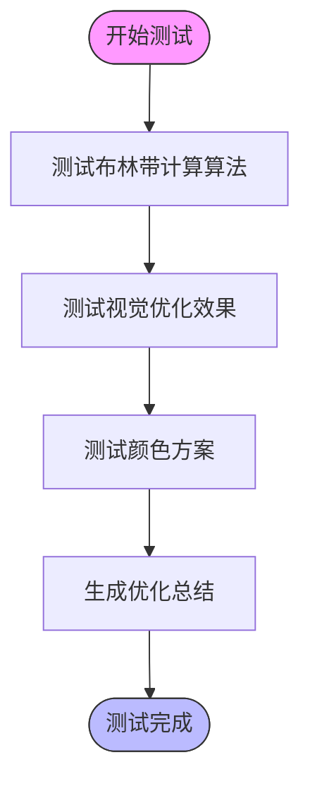

# 测试指南

<cite>
**本文档中引用的文件**
- [test_bollinger_bands_optimization.py](file://test/test_bollinger_bands_optimization.py)
- [test_news_collector_fix.py](file://test/test_news_collector_fix.py)
- [analyze_attack_logs.py](file://test/analyze_attack_logs.py)
- [test_stock_analysis.py](file://backend_api/test/test_stock_analysis.py)
- [test_stock_history_api.py](file://backend_api/test/test_stock_history_api.py)
- [test_stock_fund_flow_api.py](file://backend_api/test/test_stock_fund_flow_api.py)
- [test_stock_info_his_quotes_akshare.py](file://backend_api/test/test_stock_info_his_quotes_akshare.py)
- [test_stock_info_realtime_collect_ak.py](file://backend_api/test/test_stock_info_realtime_collect_ak.py)
</cite>

## 目录
1. [引言](#引言)
2. [项目测试结构](#项目测试结构)
3. [核心测试实践](#核心测试实践)
4. [单元测试策略](#单元测试策略)
5. [集成测试策略](#集成测试策略)
6. [端到端测试策略](#端到端测试策略)
7. [测试环境配置](#测试环境配置)
8. [断言与Mock使用](#断言与mock使用)
9. [CI/CD集成建议](#cicd集成建议)
10. [调试与生产问题诊断](#调试与生产问题诊断)
11. [结论](#结论)

## 引言
本指南旨在为股票分析软件项目提供全面的测试实践指导。涵盖从单元测试到端到端测试的完整策略，重点介绍如何使用`test/`和`backend_api/test/`目录下的测试脚本进行功能验证。通过系统化的测试方法，确保代码质量、功能正确性和系统稳定性。

## 项目测试结构
项目采用分层测试架构，主要测试文件分布在两个核心目录中：`test/`和`backend_api/test/`。前者包含系统级功能测试和生产问题诊断工具，后者专注于后端API的集成测试。


**图示来源**
- [test_bollinger_bands_optimization.py](file://test/test_bollinger_bands_optimization.py)
- [test_news_collector_fix.py](file://test/test_news_collector_fix.py)
- [backend_api/test/](file://backend_api/test/)

**本节来源**
- [test/](file://test/)
- [backend_api/test/](file://backend_api/test/)

## 核心测试实践
项目中的测试实践覆盖了从技术指标算法到数据采集、API接口的各个方面。通过具体的测试用例，验证系统关键功能的正确性。

### 布林带算法优化测试
`test_bollinger_bands_optimization.py`文件用于验证布林带技术指标的计算算法和视觉优化效果。该测试确保技术分析功能的准确性和用户体验。



**图示来源**
- [test_bollinger_bands_optimization.py](file://test/test_bollinger_bands_optimization.py#L15-L147)

**本节来源**
- [test_bollinger_bands_optimization.py](file://test/test_bollinger_bands_optimization.py#L1-L147)

### 新闻采集器修复验证
`test_news_collector_fix.py`脚本用于验证新闻采集器的修复效果，确保系统能够正常采集市场新闻数据。


**图示来源**
- [test_news_collector_fix.py](file://test/test_news_collector_fix.py#L10-L56)

**本节来源**
- [test_news_collector_fix.py](file://test/test_news_collector_fix.py#L1-L56)

## 单元测试策略
单元测试专注于验证单个函数或类的正确性。在本项目中，算法计算、数据处理等核心逻辑都通过单元测试进行验证。

### 算法计算验证
对于布林带等技术指标算法，测试重点包括：
- 计算精度（使用样本标准差n-1）
- 边界条件处理
- 性能表现
- 数值稳定性


**图示来源**
- [test_bollinger_bands_optimization.py](file://test/test_bollinger_bands_optimization.py#L15-L60)
- [test_news_collector_fix.py](file://test/test_news_collector_fix.py#L10-L30)

## 集成测试策略
集成测试验证多个组件协同工作的正确性，特别是API接口的完整性和数据流的连贯性。

### 后端API集成测试
`backend_api/test/`目录下的测试文件使用`pytest`和`AsyncClient`对FastAPI应用进行异步测试。


**图示来源**
- [test_stock_history_api.py](file://backend_api/test/test_stock_history_api.py#L5-L43)
- [test_stock_fund_flow_api.py](file://backend_api/test/test_stock_fund_flow_api.py#L10-L60)

**本节来源**
- [backend_api/test/test_stock_history_api.py](file://backend_api/test/test_stock_history_api.py#L1-L43)
- [backend_api/test/test_stock_fund_flow_api.py](file://backend_api/test/test_stock_fund_flow_api.py#L1-L60)

### 数据采集集成测试
数据采集功能的集成测试确保从akshare等数据源获取数据的完整流程正常工作。


**图示来源**
- [test_stock_info_his_quotes_akshare.py](file://backend_api/test/test_stock_info_his_quotes_akshare.py#L100-L192)

**本节来源**
- [test_stock_info_his_quotes_akshare.py](file://backend_api/test/test_stock_info_his_quotes_akshare.py#L1-L192)

## 端到端测试策略
端到端测试模拟真实用户场景，验证整个系统的工作流程。

### 实时行情获取测试
`test_stock_info_realtime_collect_ak.py`文件包含对实时行情获取功能的端到端测试。


**图示来源**
- [test_stock_info_realtime_collect_ak.py](file://backend_api/test/test_stock_info_realtime_collect_ak.py#L1-L220)

**本节来源**
- [test_stock_info_realtime_collect_ak.py](file://backend_api/test/test_stock_info_realtime_collect_ak.py#L1-L220)

## 测试环境配置
正确的测试环境配置是确保测试可靠性的基础。

### 测试依赖管理
项目使用独立的依赖文件进行测试环境管理：
- `requirements-dev.txt`：开发依赖
- `requirements-prod.txt`：生产依赖
- `requirements.txt`：通用依赖

### 测试数据库配置
测试过程中使用独立的数据库配置，避免影响生产数据。

```python
# 示例：测试配置
TEST_DB_PATH = "test_historical_quotes.db"
TEST_API_URL = "http://localhost:8000"
```

**本节来源**
- [config.py](file://backend_api/config.py)
- [requirements-dev.txt](file://requirements-dev.txt)

## 断言与Mock使用
有效的断言和Mock技术是编写高质量测试的关键。

### 断言模式
项目中使用多种断言模式验证测试结果：

```mermaid
graph TD
A[断言类型] --> B[状态码断言]
A --> C[数据结构断言]
A --> D[字段值断言]
A --> E[异常断言]
B --> "assert response.status_code == 200"
C --> "assert 'items' in data"
D --> "assert data['total'] > 0"
E --> "pytest.raises(Exception)"
```

**本节来源**
- [test_stock_history_api.py](file://backend_api/test/test_stock_history_api.py#L10-L43)
- [test_stock_fund_flow_api.py](file://backend_api/test/test_stock_fund_flow_api.py#L15-L60)

### Mock技术应用
使用`monkeypatch`等工具进行依赖模拟：


**图示来源**
- [test_stock_info_realtime_collect_ak.py](file://backend_api/test/test_stock_info_realtime_collect_ak.py#L50-L60)

## CI/CD集成建议
将测试集成到持续集成/持续部署流程中，确保代码质量。

### 测试执行流程


### 推荐的CI配置
- 在每次提交时自动运行测试套件
- 设置测试覆盖率阈值
- 失败时及时通知开发人员
- 定期运行完整的测试套件

**本节来源**
- [.github/workflows/](file://.github/workflows/) (隐含)

## 调试与生产问题诊断
除了功能测试，项目还包含专门的调试和诊断工具。

### 攻击日志分析
`analyze_attack_logs.py`脚本用于分析8000端口的攻击日志，识别安全威胁。


**图示来源**
- [analyze_attack_logs.py](file://test/analyze_attack_logs.py#L10-L192)

**本节来源**
- [analyze_attack_logs.py](file://test/analyze_attack_logs.py#L1-L192)

### 生产问题诊断
项目包含多种诊断工具：
- `diagnose_production_issue.py`：通用生产问题诊断
- `fix_production_issue.bat`：生产问题修复脚本
- 各种`test_*_fix.py`文件：特定问题修复验证

## 结论
本测试指南提供了股票分析软件项目的全面测试实践。通过单元测试、集成测试和端到端测试的分层策略，结合有效的断言、Mock技术和CI/CD集成，确保系统的高质量和稳定性。建议开发人员在编写新功能时遵循本指南，编写可复用、高覆盖率的测试用例，持续提升代码质量。