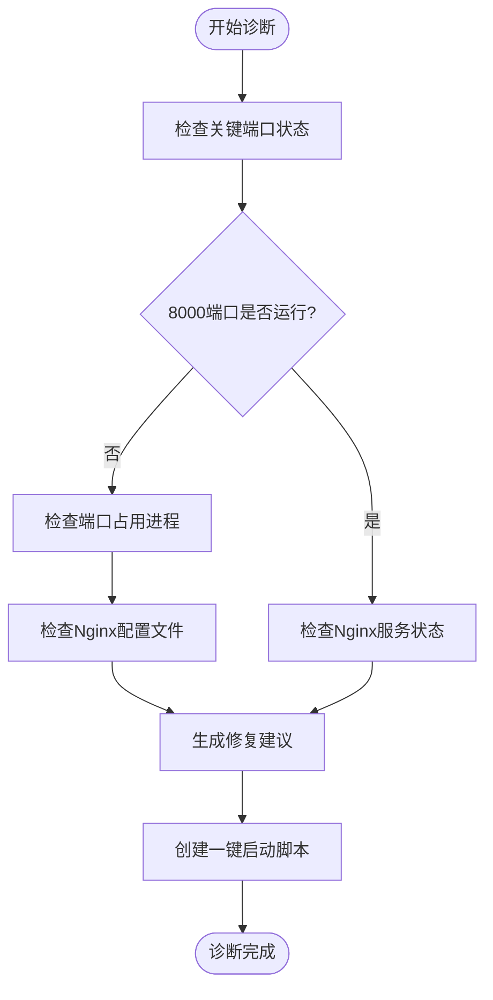
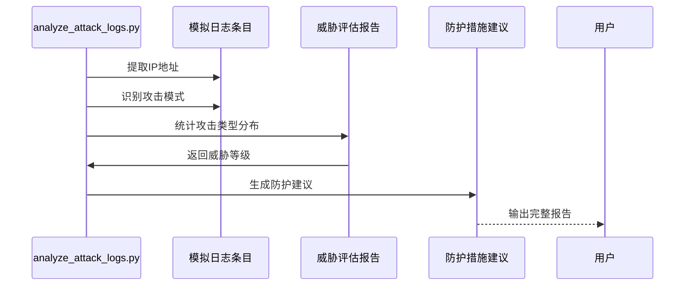
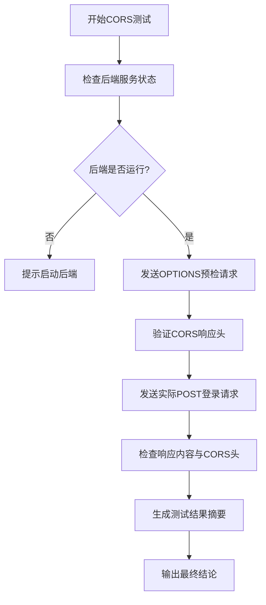
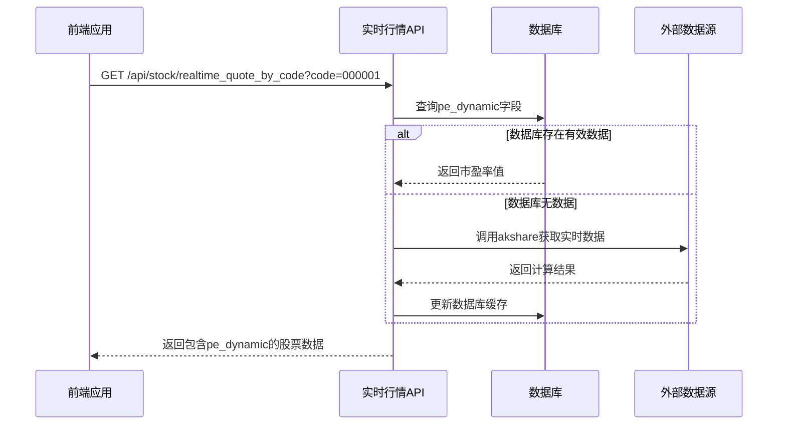

# 调试与生产问题诊断

<cite>
**本文档引用文件**  
- [diagnose_production_issue.py](file://test/diagnose_production_issue.py)
- [analyze_attack_logs.py](file://test/analyze_attack_logs.py)
- [test_cors_fix.py](file://backend_api/test/test_cors_fix.py)
- [test_db_pe_ratio.py](file://backend_api/test/test_db_pe_ratio.py)
</cite>

## 目录
1. [引言](#引言)
2. [系统性排查方法论](#系统性排查方法论)
3. [操作日志与安全日志分析](#操作日志与安全日志分析)
4. [跨域问题复现与修复](#跨域问题复现与修复)
5. [数据库计算偏差诊断](#数据库计算偏差诊断)
6. [典型场景排查流程](#典型场景排查流程)
7. [标准化操作流程](#标准化操作流程)
8. [结论](#结论)

## 引言
本文档旨在为股票分析系统提供一套完整的生产级调试与故障诊断指南。基于`diagnose_production_issue.py`和`analyze_attack_logs.py`等核心脚本，构建系统性的问题排查方法论。涵盖服务连接异常、安全攻击识别、跨域访问控制、数据一致性校验等关键场景，帮助运维和开发人员快速定位并解决生产环境中的复杂问题。

## 系统性排查方法论

本节介绍基于`diagnose_production_issue.py`脚本构建的系统性排查框架，用于诊断生产环境中常见的服务连接问题。



**图示来源**  
- [diagnose_production_issue.py](file://test/diagnose_production_issue.py#L50-L230)

**节来源**  
- [diagnose_production_issue.py](file://test/diagnose_production_issue.py#L50-L230)

## 操作日志与安全日志分析

本节详细说明如何使用`analyze_attack_logs.py`脚本解析操作日志与安全日志，以识别异常行为和潜在攻击。

### 攻击日志分析流程



**图示来源**  
- [analyze_attack_logs.py](file://test/analyze_attack_logs.py#L30-L192)

**节来源**  
- [analyze_attack_logs.py](file://test/analyze_attack_logs.py#L30-L192)

### 攻击类型识别

| 攻击类型 | 特征描述 | 防护建议 |
|---------|--------|--------|
| CONNECT方法攻击 | 尝试建立代理隧道，绕过防火墙 | 限制8000端口访问，启用WAF |
| 恶意域名访问 | 访问敏感政治网站（如epochtimes.com） | 配置DNS过滤，添加访问控制 |
| 登录页面扫描 | 扫描/login.html等入口 | 启用登录失败锁定机制 |
| 多IP协同攻击 | 多个IP地址协同发起请求 | 设置IP访问频率限制 |

## 跨域问题复现与修复

本节演示如何使用`test_cors_fix.py`脚本复现和验证跨域资源共享（CORS）问题的修复情况。

### CORS问题诊断流程



**图示来源**  
- [test_cors_fix.py](file://backend_api/test/test_cors_fix.py#L10-L120)

**节来源**  
- [test_cors_fix.py](file://backend_api/test/test_cors_fix.py#L10-L120)

### CORS头验证标准

- **Access-Control-Allow-Origin**: 必须包含`http://localhost:8000`
- **Access-Control-Allow-Credentials**: 应设置为`true`以支持凭据传输
- **Access-Control-Allow-Methods**: 至少包含`GET, POST, OPTIONS`
- **Access-Control-Allow-Headers**: 包含`Content-Type`等必要头部

## 数据库计算偏差诊断

本节说明如何使用`test_db_pe_ratio.py`脚本对数据库中市盈率（PE Ratio）计算偏差进行诊断与验证。

### 市盈率数据获取流程



**图示来源**  
- [test_db_pe_ratio.py](file://backend_api/test/test_db_pe_ratio.py#L10-L183)

**节来源**  
- [test_db_pe_ratio.py](file://backend_api/test/test_db_pe_ratio.py#L10-L183)

### 数据一致性校验要点

- **优先级**: 市盈率数据优先从数据库获取，akshare作为备选
- **时效性**: 数据库更新频率直接影响数据新鲜度
- **完整性**: 确保所有测试股票代码均有对应记录
- **准确性**: 对比数据库值与实时计算值的差异范围

## 典型场景排查流程

### 性能瓶颈分析

1. 使用`diagnose_production_issue.py`检查各服务端口响应时间
2. 分析Nginx错误日志中是否存在超时记录
3. 监控数据库查询执行计划，优化慢查询
4. 检查Python服务是否出现内存泄漏

### 权限异常追踪

1. 审查`auth.py`中的JWT令牌生成与验证逻辑
2. 检查用户角色与API端点的权限映射
3. 分析操作日志中失败的权限校验记录
4. 验证CORS配置是否影响凭据传递

### 服务不可达问题

1. 运行`diagnose_production_issue.py`进行端口扫描
2. 检查对应进程是否被意外终止
3. 验证启动脚本路径与依赖环境
4. 查看Windows任务管理器确认服务状态

## 标准化操作流程

### 日志过滤命令

```bash
# 查看Nginx错误日志
type C:\work\stock_quote_analayze\tools\nginx-1.28.0\logs\error.log

# 过滤包含CONNECT方法的攻击日志
findstr "CONNECT" attack.log

# 统计不同IP的访问次数
python analyze_attack_logs.py | findstr "次访问"
```

### 关键指标监控

- **服务状态**: `netstat -ano | findstr :8000`
- **进程检查**: `tasklist | findstr python`
- **API可用性**: `curl http://localhost:5000/api/auth/status`
- **数据库连接**: `python test_postgres_connection.py`

### 快速恢复步骤

1. 执行`start_production_services.bat`一键启动所有服务
2. 运行`diagnose_production_issue.py`验证修复效果
3. 检查Nginx配置有效性：`nginx.exe -t`
4. 重启Nginx服务：`nginx.exe -s stop` → `nginx.exe`

## 结论

本文档通过分析`diagnose_production_issue.py`、`analyze_attack_logs.py`、`test_cors_fix.py`和`test_db_pe_ratio.py`四个核心脚本，构建了一套完整的生产环境调试与故障诊断体系。该体系覆盖了服务连接、安全防护、跨域访问、数据一致性等多个关键维度，提供了可操作的排查流程和标准化解决方案。建议将这些诊断脚本集成到日常运维流程中，定期执行健康检查，提升系统的稳定性和安全性。