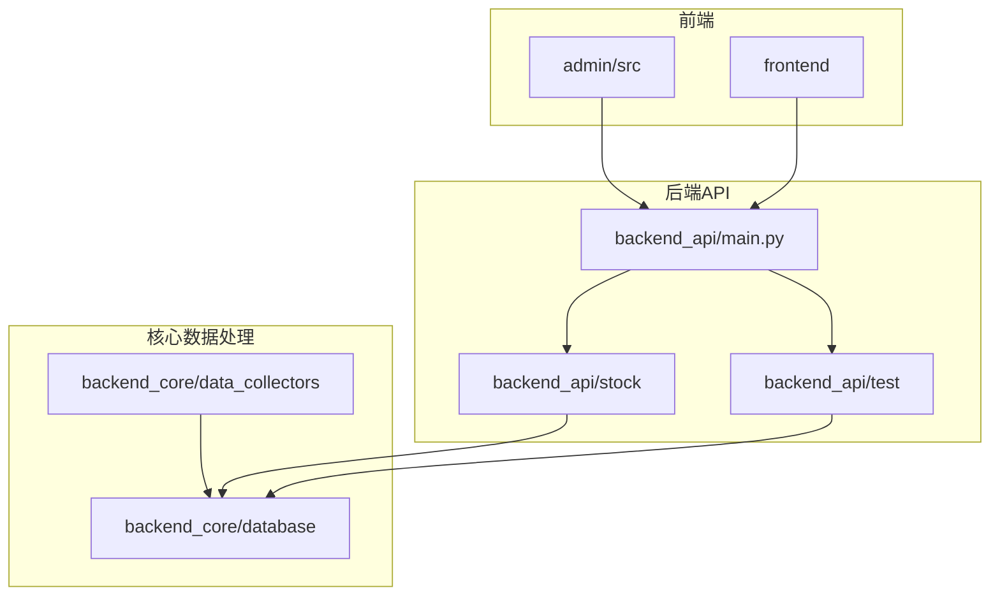
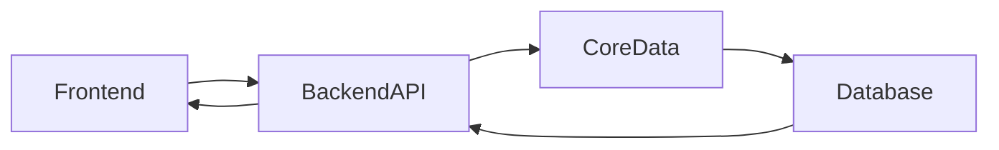
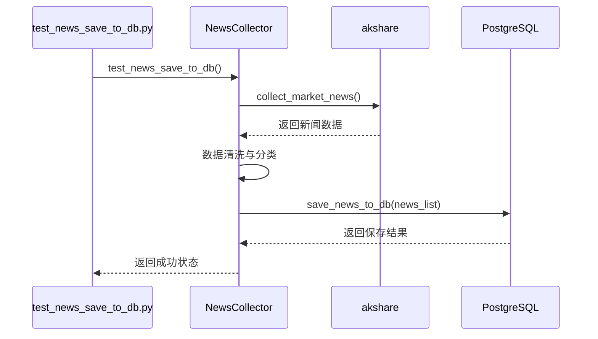
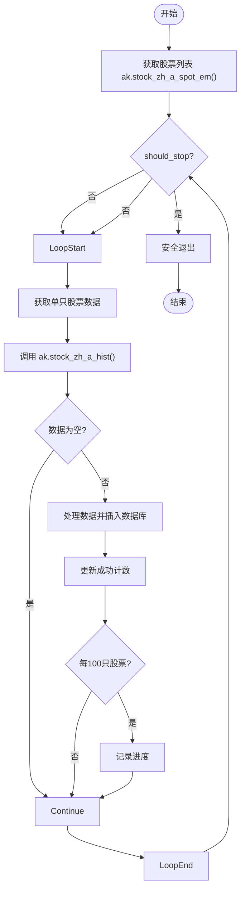
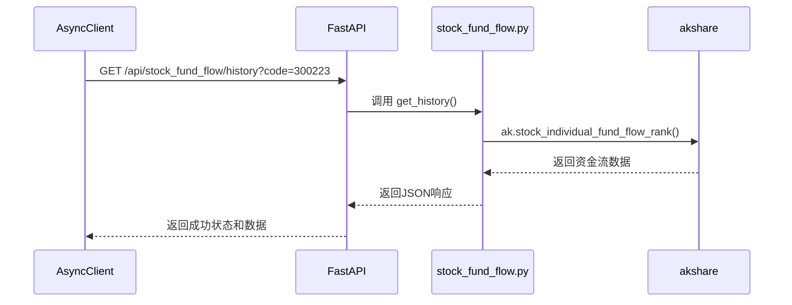
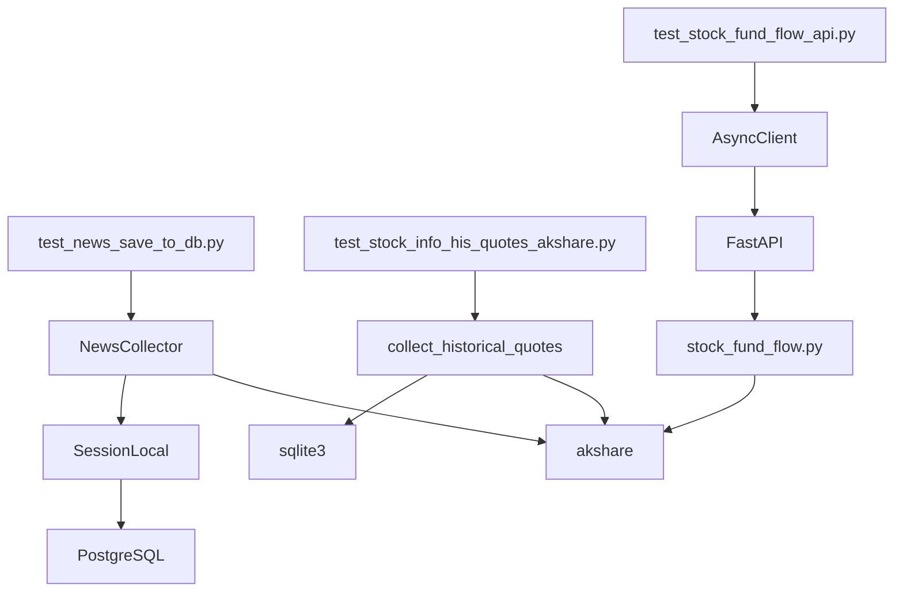

# 集成测试

<cite>
**本文档中引用的文件**  
- [test_news_save_to_db.py](file://test/test_news_save_to_db.py)
- [news_collector.py](file://backend_core/data_collectors/news_collector.py)
- [db.py](file://backend_core/database/db.py)
- [test_stock_info_his_quotes_akshare.py](file://backend_api/test/test_stock_info_his_quotes_akshare.py)
- [test_postgres_connection.py](file://test/test_postgres_connection.py)
- [stock_news.py](file://backend_api/stock/stock_news.py)
- [stock_fund_flow.py](file://backend_api/stock/stock_fund_flow.py)
</cite>

## 目录
1. [引言](#引言)
2. [项目结构](#项目结构)
3. [核心组件](#核心组件)
4. [架构概述](#架构概述)
5. [详细组件分析](#详细组件分析)
6. [依赖分析](#依赖分析)
7. [性能考虑](#性能考虑)
8. [故障排除指南](#故障排除指南)
9. [结论](#结论)

## 引言
本文档旨在为股票分析软件系统提供全面的集成测试指南，重点描述跨模块协作的验证方法。文档详细说明了如何通过 `test_news_save_to_db.py` 测试新闻采集器与数据库的完整写入流程，分析 `test_stock_info_his_quotes_akshare.py` 中从 AkShare 数据源到后端 API 再到数据库的端到端链路验证。涵盖了用户管理、行情接口、资金流数据等关键路径的集成测试用例设计，并解释了如何通过 `test_postgres_connection.py` 模拟真实环境依赖。此外，还提供了测试数据准备、事务回滚机制和 API 间调用时序验证的实用技巧。

## 项目结构
本项目采用分层微服务架构，主要分为前端、后端API和核心数据处理三大模块。前端使用Vue框架构建管理界面，后端API基于FastAPI提供RESTful服务，核心数据处理模块负责与AkShare等数据源对接并执行数据采集任务。数据库采用PostgreSQL存储结构化数据。



**Diagram sources**
- [test/test_news_save_to_db.py](file://test/test_news_save_to_db.py#L1-L54)
- [backend_api/test/test_stock_info_his_quotes_akshare.py](file://backend_api/test/test_stock_info_his_quotes_akshare.py#L1-L192)

**Section sources**
- [test/test_news_save_to_db.py](file://test/test_news_save_to_db.py#L1-L54)
- [backend_api/test/test_stock_info_his_quotes_akshare.py](file://backend_api/test/test_stock_info_his_quotes_akshare.py#L1-L192)

## 核心组件
系统的核心组件包括新闻采集器、行情数据采集器、资金流数据服务和数据库访问层。新闻采集器负责从财新网等来源获取市场资讯，行情数据采集器通过AkShare获取股票历史和实时数据，资金流数据服务提供个股资金流向分析，所有数据最终通过SQLAlchemy ORM持久化到PostgreSQL数据库。

**Section sources**
- [backend_core/data_collectors/news_collector.py](file://backend_core/data_collectors/news_collector.py#L1-L428)
- [backend_api/stock/stock_fund_flow.py](file://backend_api/stock/stock_fund_flow.py#L1-L137)

## 架构概述
系统采用典型的三层架构：表示层（前端）、业务逻辑层（后端API）和数据访问层（核心模块）。前端通过HTTP请求与后端API交互，后端API调用核心模块提供的数据采集服务，核心模块通过数据库会话将数据写入PostgreSQL。整个流程通过集成测试确保各层之间的无缝协作。



**Diagram sources**
- [backend_api/main.py](file://backend_api/main.py)
- [backend_core/data_collectors/news_collector.py](file://backend_core/data_collectors/news_collector.py#L1-L428)

## 详细组件分析

### 新闻采集与存储流程分析
该流程验证了从新闻采集到数据库存储的完整链路。`test_news_save_to_db.py` 作为测试入口，调用 `NewsCollector` 类的 `collect_market_news` 方法从AkShare获取原始新闻数据，经过清洗和分类后，通过 `save_news_to_db` 方法持久化到数据库。

#### 对象导向组件：
```mermaid
classDiagram
class NewsCollector {
+collect_market_news() List[Dict]
+collect_stock_news(stock_code) List[Dict]
+save_news_to_db(news_list) int
-_classify_news(title, content) int
-_extract_summary(content) str
-_extract_tags(title, content) List[str]
}
class NewsCollector --> SessionLocal : "使用"
NewsCollector --> akshare : "依赖"
```

**Diagram sources**
- [test/test_news_save_to_db.py](file://test/test_news_save_to_db.py#L1-L54)
- [backend_core/data_collectors/news_collector.py](file://backend_core/data_collectors/news_collector.py#L1-L428)

#### API服务组件：


**Diagram sources**
- [test/test_news_save_to_db.py](file://test/test_news_save_to_db.py#L1-L54)
- [backend_core/data_collectors/news_collector.py](file://backend_core/data_collectors/news_collector.py#L1-L428)

**Section sources**
- [test/test_news_save_to_db.py](file://test/test_news_save_to_db.py#L1-L54)
- [backend_core/data_collectors/news_collector.py](file://backend_core/data_collectors/news_collector.py#L1-L428)

### 行情数据端到端验证分析
该流程验证了从AkShare数据源到后端API再到数据库的完整链路。`test_stock_info_his_quotes_akshare.py` 调用 `collect_historical_quotes` 函数，通过AkShare获取指定日期的股票历史行情数据，经过数据清洗后批量插入SQLite数据库。

#### 复杂逻辑组件：


**Diagram sources**
- [backend_api/test/test_stock_info_his_quotes_akshare.py](file://backend_api/test/test_stock_info_his_quotes_akshare.py#L1-L192)

**Section sources**
- [backend_api/test/test_stock_info_his_quotes_akshare.py](file://backend_api/test/test_stock_info_his_quotes_akshare.py#L1-L192)

### 资金流数据接口测试分析
该流程验证了资金流数据API的正确性和健壮性。通过 `test_stock_fund_flow_api.py` 中的异步测试用例，验证了 `/api/stock_fund_flow/history` 接口在各种参数条件下的行为，包括成功查询、缺失参数、日期过滤和错误处理。

#### API服务组件：


**Diagram sources**
- [backend_api/test/test_stock_fund_flow_api.py](file://backend_api/test/test_stock_fund_flow_api.py#L1-L60)
- [backend_api/stock/stock_fund_flow.py](file://backend_api/stock/stock_fund_flow.py#L1-L137)

**Section sources**
- [backend_api/test/test_stock_fund_flow_api.py](file://backend_api/test/test_stock_fund_flow_api.py#L1-L60)
- [backend_api/stock/stock_fund_flow.py](file://backend_api/stock/stock_fund_flow.py#L1-L137)

## 依赖分析
系统各组件之间存在明确的依赖关系。前端依赖后端API提供的REST接口，后端API依赖核心数据处理模块的数据采集能力，核心模块依赖外部数据源AkShare和内部数据库服务。数据库访问层通过SQLAlchemy ORM与PostgreSQL交互，确保数据一致性和事务完整性。



**Diagram sources**
- [test/test_news_save_to_db.py](file://test/test_news_save_to_db.py#L1-L54)
- [backend_api/test/test_stock_info_his_quotes_akshare.py](file://backend_api/test/test_stock_info_his_quotes_akshare.py#L1-L192)
- [backend_api/test/test_stock_fund_flow_api.py](file://backend_api/test/test_stock_fund_flow_api.py#L1-L60)

**Section sources**
- [test/test_news_save_to_db.py](file://test/test_news_save_to_db.py#L1-L54)
- [backend_api/test/test_stock_info_his_quotes_akshare.py](file://backend_api/test/test_stock_info_his_quotes_akshare.py#L1-L192)
- [backend_api/test/test_stock_fund_flow_api.py](file://backend_api/test/test_stock_fund_flow_api.py#L1-L60)

## 性能考虑
在集成测试中需要考虑多个性能因素。新闻采集和存储流程应测试批量插入的效率，行情数据采集应验证重试机制和连接池配置的有效性，资金流数据API应评估高并发下的响应时间和资源消耗。建议使用连接池参数优化数据库访问，通过 `pool_size` 和 `max_overflow` 控制连接数量，避免资源耗尽。

## 故障排除指南
当集成测试失败时，应按照以下步骤进行排查：首先验证数据库连接是否正常，通过 `test_postgres_connection.py` 确认PostgreSQL服务可达性和表结构完整性；其次检查外部数据源访问是否受限，AkShare可能因反爬虫策略返回空数据；然后验证数据清洗逻辑是否正确处理了异常值和缺失值；最后确认事务管理是否正确实现了回滚机制，在数据处理失败时不会留下脏数据。

**Section sources**
- [test/test_postgres_connection.py](file://test/test_postgres_connection.py#L1-L112)
- [backend_core/database/db.py](file://backend_core/database/db.py#L1-L32)

## 结论
本文档详细阐述了股票分析软件系统的集成测试策略，覆盖了新闻采集、行情数据处理和资金流分析等关键业务流程。通过端到端的测试用例设计，确保了系统各模块之间的协同工作能力。建议在持续集成环境中定期运行这些测试，以及时发现和修复潜在问题，保障系统的稳定性和数据的准确性。