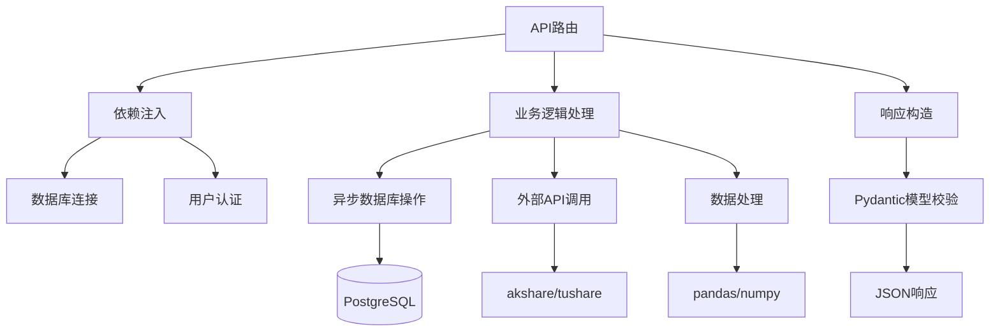

# 编码规范

<cite>
**本文档引用的文件**
- [backend_core_technical_spec.md](file://backend_core/rules/backend_core_technical_spec.md)
- [frontend_technical_spec.md](file://frontend/rules/frontend_technical_spec.md)
- [backend_technical_spec.md](file://backend_api/rules/backend_technical_spec.md)
- [fastapi_python_cursor_rules_zh.md](file://backend_api/rules/fastapi_python_cursor_rules_zh.md)
</cite>

## 目录
1. [引言](#引言)
2. [前端TypeScript与Vue 3规范](#前端typescript与vue-3规范)
3. [后端Python FastAPI规范](#后端python-fastapi规范)
4. [接口定义规范](#接口定义规范)
5. [变量命名规范](#变量命名规范)
6. [错误处理规范](#错误处理规范)
7. [日志记录规范](#日志记录规范)
8. [代码示例对比](#代码示例对比)
9. [总结](#总结)

## 引言

本文档旨在为股票分析系统建立统一的编码规范，涵盖前端与后端开发标准，确保代码一致性、可维护性和可读性。文档依据 `rules` 目录下的技术规范文件制定，包括：
- `backend_core_technical_spec.md`：backend_core 模块的技术规范
- `frontend_technical_spec.md`：前端模块的技术规范
- `backend_technical_spec.md`：backend_api 模块的技术规范
- `fastapi_python_cursor_rules_zh.md`：FastAPI 与 Python 开发最佳实践

通过遵循本规范，开发团队能够高效协作，降低维护成本，提升系统稳定性。

**Section sources**
- [backend_core_technical_spec.md](file://backend_core/rules/backend_core_technical_spec.md#L1-L160)
- [frontend_technical_spec.md](file://frontend/rules/frontend_technical_spec.md#L1-L295)
- [backend_technical_spec.md](file://backend_api/rules/backend_technical_spec.md#L1-L262)
- [fastapi_python_cursor_rules_zh.md](file://backend_api/rules/fastapi_python_cursor_rules_zh.md#L1-L63)

## 前端TypeScript与Vue 3规范

尽管当前前端项目采用原生 JavaScript 和 HTML 构建，但为未来技术演进考虑，本节提供基于 TypeScript 与 Vue 3 Composition API 的推荐规范。

### 代码风格
- 使用 2 个空格缩进
- 使用单引号包裹字符串
- 每行代码不超过 120 字符
- 使用 UTF-8 编码
- 使用 ES6+ 模块化语法

### Vue 3 Composition API 使用规范
- 使用 `setup()` 函数组织逻辑
- 使用 `ref` 和 `reactive` 定义响应式数据
- 使用 `computed` 定义计算属性
- 使用 `watch` 监听数据变化
- 逻辑按功能组织，避免在组件中编写复杂业务逻辑

### 类型定义
- 所有接口和复杂对象需定义 TypeScript 接口
- API 响应数据应使用 `interface` 明确定义结构
- 使用泛型提高代码复用性

**Section sources**
- [frontend_technical_spec.md](file://frontend/rules/frontend_technical_spec.md#L1-L295)

## 后端Python FastAPI规范

### 依赖注入规范
- 使用 FastAPI 的依赖注入系统管理共享资源（如数据库连接）
- 定义可复用的依赖函数，如 `get_db()`、`get_current_user()`
- 依赖函数应具有清晰的类型注解和文档字符串
- 避免在路由函数中直接创建资源，优先通过依赖注入获取

### 异步处理规范
- 所有 I/O 操作（数据库、外部 API）必须使用 `async/await`
- 路由函数根据操作类型选择 `def`（同步）或 `async def`（异步）
- 使用异步数据库驱动（如 asyncpg）
- 高频数据访问应结合 Redis 缓存，减少数据库压力
- 大数据集响应采用惰性加载，避免内存溢出

### 函数式编程优先
- 优先使用纯函数，避免类的过度使用
- 函数应遵循“接收对象，返回对象”（RORO）模式
- 保持函数职责单一，便于测试和复用



**Diagram sources**
- [backend_technical_spec.md](file://backend_api/rules/backend_technical_spec.md#L1-L262)
- [fastapi_python_cursor_rules_zh.md](file://backend_api/rules/fastapi_python_cursor_rules_zh.md#L1-L63)

**Section sources**
- [backend_technical_spec.md](file://backend_api/rules/backend_technical_spec.md#L1-L262)
- [fastapi_python_cursor_rules_zh.md](file://backend_api/rules/fastapi_python_cursor_rules_zh.md#L1-L63)

## 接口定义规范

### URL设计
- 使用名词复数形式（如 `/users`, `/stocks`）
- 当前项目使用 `/api/stock/xxx` 结构，保持一致性
- 资源层级不超过三层
- 避免动词出现在URL中，使用HTTP方法表达操作

### 请求与响应
- 使用 Pydantic 模型进行请求参数校验和响应结构定义
- 响应格式统一为：
  ```json
  {
    "success": true,
    "message": "操作成功",
    "data": {},
    "error": null
  }
  ```
  或分页数据：
  ```json
  {
    "items": [],
    "total": 100
  }
  ```

### 状态码使用
- 200：操作成功
- 400：请求参数错误
- 401：未认证
- 403：无权限
- 404：资源不存在
- 500：服务器内部错误

**Section sources**
- [backend_technical_spec.md](file://backend_api/rules/backend_technical_spec.md#L1-L262)

## 变量命名规范

### 前端命名
- **变量名**：小驼峰命名法（`stockList`, `currentPrice`）
- **函数名**：小驼峰命名法（`getStockData`, `updateUserProfile`）
- **常量**：大写字母加下划线（`API_BASE_URL`, `MAX_RETRY_COUNT`）
- **类名**：大驼峰命名法（`StockChart`, `UserManager`）
- **文件名**：小写字母加中划线（`stock-detail.js`, `user-profile.css`）

### 后端命名
- **文件名**：小写字母加下划线（`stock_routes.py`, `auth_service.py`）
- **函数名**：小写字母加下划线（`get_stock_data`, `create_user`）
- **类名**：大驼峰命名法（`StockService`, `DatabaseManager`）
- **常量**：大写字母加下划线（`DATABASE_URL`, `JWT_SECRET_KEY`）
- **布尔变量**：使用描述性前缀（`is_active`, `has_permission`）

**Section sources**
- [frontend_technical_spec.md](file://frontend/rules/frontend_technical_spec.md#L1-L295)
- [backend_technical_spec.md](file://backend_api/rules/backend_technical_spec.md#L1-L262)

## 错误处理规范

### 统一异常处理
- 所有异常必须被捕获并记录日志
- 使用 `try-except` 结构，避免异常向上抛出
- 优先在函数开头处理边界情况和错误条件，使用 `if-return` 模式减少嵌套
- 避免不必要的 `else` 语句

### API错误响应
- 使用 `HTTPException` 统一抛出HTTP错误
- 错误信息应用户友好，避免暴露敏感信息
- 记录详细的错误日志，便于排查问题

```python
try:
    # 业务逻辑
except ValueError as e:
    logger.error(f"参数错误: {str(e)}")
    raise HTTPException(status_code=400, detail="参数格式错误")
except Exception as e:
    logger.error(f"服务器内部错误: {str(e)}")
    raise HTTPException(status_code=500, detail="操作失败")
```

**Section sources**
- [backend_technical_spec.md](file://backend_api/rules/backend_technical_spec.md#L1-L262)
- [fastapi_python_cursor_rules_zh.md](file://backend_api/rules/fastapi_python_cursor_rules_zh.md#L1-L63)

## 日志记录规范

### 日志级别
- `DEBUG`：调试信息，开发环境使用
- `INFO`：关键操作记录，如用户登录、数据采集开始
- `WARNING`：潜在问题，如重试、降级
- `ERROR`：错误发生，但服务仍可运行
- `CRITICAL`：严重错误，可能导致服务中断

### 日志内容
- 包含时间戳、日志级别、模块名、函数名
- 记录关键操作的输入参数和结果
- 异常日志必须包含完整堆栈信息
- 日志建议按天分文件，便于管理和归档

### 生产环境
- 重要异常需集成报警系统（如邮件、企业微信）
- 日志文件应定期备份和归档
- 避免在日志中记录敏感信息（密码、密钥）

**Section sources**
- [backend_core_technical_spec.md](file://backend_core/rules/backend_core_technical_spec.md#L1-L160)
- [backend_technical_spec.md](file://backend_api/rules/backend_technical_spec.md#L1-L262)

## 代码示例对比

### 正确写法 vs 错误写法

#### 后端异步处理（正确）
```python
async def get_stock_history(db: Session, code: str):
    """获取股票历史行情"""
    result = await db.execute(
        text("SELECT * FROM historical_quotes WHERE code = :code"),
        {"code": code}
    )
    return result.fetchall()
```

#### 后端同步阻塞（错误）
```python
def get_stock_history(code: str):
    # 错误：同步操作阻塞事件循环
    conn = sqlite3.connect("stock.db")
    cursor = conn.cursor()
    cursor.execute("SELECT * FROM historical_quotes WHERE code = ?", (code,))
    return cursor.fetchall()
```

#### 前端模块化（正确）
```javascript
// stock-api.js
export async function getStockData(code) {
    const response = await fetch(`/api/stock/${code}`);
    return response.json();
}

// stock.js
import { getStockData } from './stock-api.js';
```

#### 前端全局污染（错误）
```javascript
// 错误：全局函数，无模块化
function getStockData(code) {
    // 实现...
}
// 其他文件也定义同名函数，导致冲突
```

**Section sources**
- [backend_technical_spec.md](file://backend_api/rules/backend_technical_spec.md#L1-L262)
- [frontend_technical_spec.md](file://frontend/rules/frontend_technical_spec.md#L1-L295)

## 总结

本编码规范文档基于项目现有技术规范文件，系统性地定义了前端与后端的开发标准。通过遵循这些规范，开发团队能够：
- 保持代码风格统一，提升可读性
- 有效管理依赖和异步操作，提高系统性能
- 规范接口定义，确保前后端协作顺畅
- 统一错误处理和日志记录，便于问题排查
- 提升代码质量和可维护性

建议所有开发者在日常开发中严格遵守本规范，并在代码审查中作为重要依据。随着技术演进，本规范将定期更新以适应新的最佳实践。