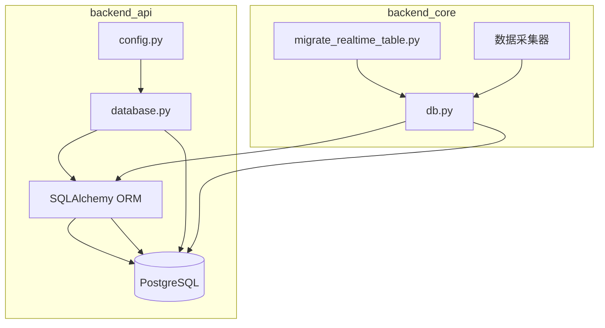
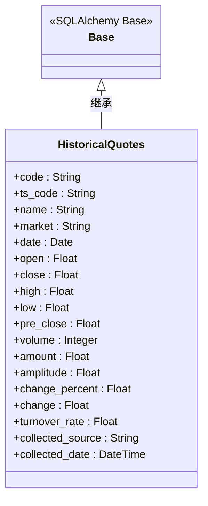
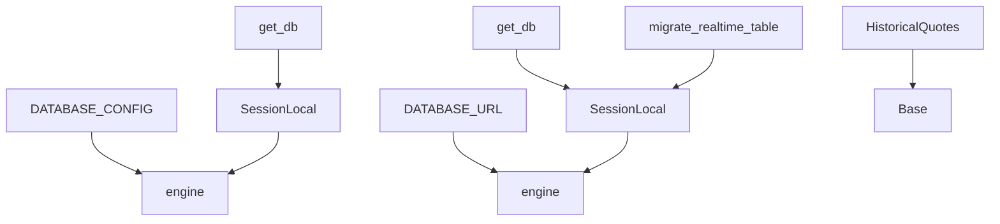

# 数据库架构与优化

<cite>
**本文档引用的文件**  
- [backend_api/database.py](file://backend_api/database.py)
- [backend_core/database/db.py](file://backend_core/database/db.py)
- [backend_core/migrate_realtime_table.py](file://backend_core/migrate_realtime_table.py)
- [backend_api/config.py](file://backend_api/config.py)
- [backend_core/models/historical_quotes.py](file://backend_core/models/historical_quotes.py)
</cite>

## 目录
1. [引言](#引言)
2. [项目结构](#项目结构)
3. [核心组件](#核心组件)
4. [架构概述](#架构概述)
5. [详细组件分析](#详细组件分析)
6. [依赖分析](#依赖分析)
7. [性能考虑](#性能考虑)
8. [故障排除指南](#故障排除指南)
9. [结论](#结论)

## 引言
本文档旨在全面阐述股票分析系统中数据库的架构设计与优化策略。重点涵盖两个核心后端模块（backend_api 和 backend_core）中的数据库连接配置、SQLAlchemy ORM 基类与会话管理、数据库迁移流程、连接池与事务机制，以及查询性能优化实践。通过本指南，开发与运维人员可深入理解系统的数据持久层设计，并掌握其维护与优化方法。

## 项目结构
本系统采用前后端分离的微服务架构，数据库相关代码主要分布在 `backend_api` 和 `backend_core` 两个后端模块中。`backend_api` 负责提供 RESTful API 接口，其数据库配置位于 `backend_api/database.py`。`backend_core` 负责核心数据采集与处理任务，其数据库配置位于 `backend_core/database/db.py`。两个模块共享同一个 PostgreSQL 数据库实例，但拥有独立的数据库会话管理机制。数据库迁移脚本 `migrate_realtime_table.py` 位于 `backend_core` 根目录，用于执行特定的表结构变更。

**Section sources**
- [backend_api/database.py](file://backend_api/database.py#L1-L71)
- [backend_core/database/db.py](file://backend_core/database/db.py#L1-L32)
- [backend_core/migrate_realtime_table.py](file://backend_core/migrate_realtime_table.py#L1-L225)

## 核心组件
系统数据库层的核心组件包括：基于 SQLAlchemy 的 ORM 基类 `Base`，用于定义所有数据模型；数据库引擎 `engine`，负责与 PostgreSQL 数据库建立连接；会话工厂 `SessionLocal`，用于创建与数据库交互的会话实例；以及会话管理函数 `get_db`，通过上下文管理器或生成器为应用提供数据库会话。此外，`migrate_realtime_table.py` 作为独立的数据库迁移脚本，是保障数据表结构演进的关键工具。

**Section sources**
- [backend_api/database.py](file://backend_api/database.py#L15-L70)
- [backend_core/database/db.py](file://backend_core/database/db.py#L5-L30)

## 架构概述
系统采用 SQLAlchemy ORM 框架作为数据库抽象层，实现了数据模型与数据库操作的解耦。`backend_api` 和 `backend_core` 模块分别初始化各自的数据库连接，但指向同一数据库。`backend_api` 通过 FastAPI 的依赖注入机制提供数据库会话，而 `backend_core` 则在数据采集任务中直接使用会话。数据库迁移通过独立的 Python 脚本完成，遵循“备份-修改-恢复”的安全流程，确保数据完整性。

**Diagram sources**
- [backend_api/database.py](file://backend_api/database.py#L1-L71)
- [backend_core/database/db.py](file://backend_core/database/db.py#L1-L32)
- [backend_core/migrate_realtime_table.py](file://backend_core/migrate_realtime_table.py#L1-L225)

## 详细组件分析

### SQLAlchemy ORM 基类与会话管理
#### 基类定义
SQLAlchemy 的声明式基类 `Base` 是所有数据模型的父类。在 `backend_api/database.py` 和 `backend_core/database/db.py` 中，均通过 `declarative_base()` 创建了 `Base` 实例。此基类为所有继承它的模型类提供了元数据（metadata），使得 SQLAlchemy 能够自动映射 Python 类到数据库表。

**Diagram sources**
- [backend_core/database/db.py](file://backend_core/database/db.py#L5)
- [backend_core/models/historical_quotes.py](file://backend_core/models/historical_quotes.py#L1-L27)

#### 会话管理机制
会话（Session）是 SQLAlchemy ORM 与数据库交互的核心。系统通过 `sessionmaker` 工厂创建 `SessionLocal` 类，该类绑定到特定的数据库引擎。`get_db()` 函数是会话管理的关键，它使用生成器（`Generator`）和 `try...finally` 语句确保会话在使用后被正确关闭，防止连接泄露。

在 `backend_api` 中，`get_db` 作为 FastAPI 的依赖项，为每个 API 请求提供一个独立的数据库会话。在 `backend_core` 中，`get_db` 在数据采集脚本中被调用，为后台任务提供会话。`backend_core` 版本的 `get_db` 还在会话开始时执行了 `SET TRANSACTION ISOLATION LEVEL READ COMMITTED` 语句，以优化事务隔离级别。

**Section sources**
- [backend_api/database.py](file://backend_api/database.py#L15-L70)
- [backend_core/database/db.py](file://backend_core/database/db.py#L15-L30)

### 数据库迁移脚本分析
#### 用途与执行流程
`migrate_realtime_table.py` 脚本的核心用途是为 `stock_realtime_quote` 表安全地添加 `trade_date` 字段，并将其与 `code` 字段共同设为主键，以支持按交易日期查询历史实时数据。

执行流程如下：
1.  **初始化**：设置日志记录器，并将项目根目录加入 Python 路径。
2.  **连接数据库**：导入 `backend_core.database.db` 中的 `SessionLocal` 并创建会话。
3.  **检查与决策**：
    *   检查 `stock_realtime_quote` 表是否存在。若不存在，则直接创建包含 `trade_date` 的新表。
    *   若表存在，则检查 `trade_date` 字段是否存在。若不存在，则进入迁移流程。
4.  **安全迁移**：
    *   **备份数据**：使用 `SELECT *` 将现有所有数据读取到内存。
    *   **创建临时表**：使用 `CREATE TABLE ... AS SELECT` 创建一个临时表作为数据副本。
    *   **删除原表**：使用 `DROP TABLE` 删除旧表。
    *   **创建新表**：使用 `CREATE TABLE` 语句创建具有新结构（包含 `trade_date` 主键）的新表。
    *   **恢复数据**：遍历内存中的备份数据，为每条记录插入当前日期作为 `trade_date`，并写入新表。
    *   **清理**：删除临时表。
5.  **创建索引**：为 `(code, trade_date)` 创建复合索引以优化查询性能。
6.  **提交与清理**：提交事务，并关闭数据库会话。

此流程确保了即使在迁移过程中发生错误，也能通过回滚事务来保护数据。

**Section sources**
- [backend_core/migrate_realtime_table.py](file://backend_core/migrate_realtime_table.py#L1-L225)

### 连接池与事务管理
#### 连接池配置
连接池是管理数据库连接、提高性能和资源利用率的关键。两个模块均配置了连接池：
*   **backend_api**：`pool_size=5`，`max_overflow=10`，表示基础连接池大小为5，最多可溢出10个连接（共15个）。
*   **backend_core**：`pool_size=10`，`max_overflow=20`，配置更为激进，以适应后台数据采集的高并发需求。此外，`backend_core` 配置了 `pool_pre_ping=True`（连接前检查有效性）和 `pool_recycle=3600`（每小时回收连接），并设置了 `connect_args` 来配置数据库级别的超时参数（`deadlock_timeout`, `lock_timeout`, `statement_timeout`），有效减少了死锁和长查询问题。

**Section sources**
- [backend_api/database.py](file://backend_api/database.py#L10-L14)
- [backend_core/database/db.py](file://backend_core/database/db.py#L10-L15)

#### 事务管理机制
系统通过 SQLAlchemy 的会话（Session）进行隐式事务管理。当调用 `session.commit()` 时，会话中所有的数据库操作作为一个事务提交。如果发生异常，则调用 `session.rollback()` 回滚事务。`migrate_realtime_table.py` 脚本是显式使用事务的典范，它在 `try` 块中执行所有 DDL 和 DML 操作，并在 `except` 块中调用 `rollback()`，确保了迁移操作的原子性。

**Section sources**
- [backend_core/migrate_realtime_table.py](file://backend_core/migrate_realtime_table.py#L100-L110)

### 查询性能优化
#### 索引策略
合理的索引是查询性能的基石。`migrate_realtime_table.py` 脚本在迁移完成后，会为 `stock_realtime_quote` 表的 `(code, trade_date)` 字段创建名为 `idx_realtime_code_date` 的复合索引。此索引对于“查询某只股票在某段时间内的实时行情”这类查询至关重要，能将全表扫描优化为高效的索引查找。

**Section sources**
- [backend_core/migrate_realtime_table.py](file://backend_core/migrate_realtime_table.py#L180-L185)

#### 大规模数据查询优化建议
1.  **使用分页**：对于返回大量记录的查询，务必使用 `LIMIT` 和 `OFFSET` 或游标进行分页。
2.  **避免 `SELECT ***：** 只查询需要的字段，减少网络传输和内存占用。
3.  **利用复合索引**：确保查询条件能有效利用已创建的复合索引，查询条件的顺序应与索引字段顺序一致。
4.  **使用 `EXPLAIN`**：对于慢查询，使用 `EXPLAIN` 或 `EXPLAIN ANALYZE` 命令分析执行计划，找出性能瓶颈。
5.  **批量操作**：在执行大量 `INSERT` 或 `UPDATE` 时，使用 `session.bulk_insert_mappings()` 或 `session.execute()` 批量执行，减少网络往返次数。

### 数据库备份、恢复与监控
#### 最佳实践
*   **备份**：应建立定期的自动化备份策略（如每日全量备份+每小时增量备份）。可以使用 `pg_dump` 工具导出数据。`migrate_realtime_table.py` 脚本中“备份现有数据”的做法仅适用于小数据量的表结构迁移，不适用于生产环境的常规备份。
*   **恢复**：定期进行恢复演练，验证备份的有效性。恢复流程应文档化。
*   **监控**：监控数据库的关键指标，如连接数、CPU/内存使用率、慢查询日志、锁等待情况。`backend_core` 中配置的 `echo=False` 和详细的日志记录是监控的基础。可以集成 Prometheus 和 Grafana 等专业监控工具。

**Section sources**
- [backend_core/migrate_realtime_table.py](file://backend_core/migrate_realtime_table.py#L130-L140)

## 依赖分析
系统数据库层的依赖关系清晰。`backend_api/database.py` 依赖于 `backend_api/config.py` 中的 `DATABASE_CONFIG` 来获取连接字符串和池配置。`backend_core/database/db.py` 直接硬编码了 `DATABASE_URL`，耦合度较高。`backend_core` 下的所有数据模型（如 `HistoricalQuotes`）都直接依赖于 `backend_core/database/db.py` 中的 `Base` 基类。`migrate_realtime_table.py` 脚本依赖于 `backend_core/database/db.py` 来获取数据库会话，体现了其作为 `backend_core` 子系统的定位。

**Diagram sources**
- [backend_api/database.py](file://backend_api/database.py#L1-L71)
- [backend_api/config.py](file://backend_api/config.py#L1-L48)
- [backend_core/database/db.py](file://backend_core/database/db.py#L1-L32)
- [backend_core/models/historical_quotes.py](file://backend_core/models/historical_quotes.py#L1-L27)
- [backend_core/migrate_realtime_table.py](file://backend_core/migrate_realtime_table.py#L1-L225)

## 性能考虑
系统的性能瓶颈可能出现在数据库层面，尤其是在处理大规模历史数据查询或高并发实时数据写入时。`backend_core` 配置了更大的连接池和更严格的超时控制，表明其对后台任务的性能要求更高。为 `stock_realtime_quote` 表添加 `(code, trade_date)` 复合主键和索引，是应对未来数据量增长的关键优化。建议持续监控慢查询日志，并根据实际查询模式调整索引策略。

## 故障排除指南
*   **数据库连接失败**：检查 `DATABASE_URL` 或 `DATABASE_CONFIG["url"]` 是否正确，确认数据库服务是否运行，网络是否通畅。
*   **连接池耗尽**：检查应用是否存在会话未关闭的 bug。可临时增加 `max_overflow` 值，但根本解决方法是修复资源泄露。
*   **死锁**：`backend_core` 的 `connect_args` 已设置 `deadlock_timeout`，可帮助快速发现死锁。应优化事务逻辑，减少锁的持有时间。
*   **迁移脚本执行失败**：检查日志输出，确认错误发生在哪个步骤。如果是数据恢复阶段，需检查 `backup_data` 的结构是否与新表的 `INSERT` 语句匹配。
*   **查询性能低下**：使用 `EXPLAIN` 分析查询计划，确认是否使用了正确的索引。

**Section sources**
- [backend_core/database/db.py](file://backend_core/database/db.py#L10-L15)
- [backend_core/migrate_realtime_table.py](file://backend_core/migrate_realtime_table.py#L1-L225)

## 结论
本系统通过 SQLAlchemy ORM 构建了稳定的数据访问层，`backend_api` 和 `backend_core` 模块各有侧重地配置了数据库连接。`migrate_realtime_table.py` 脚本展示了安全、可靠的数据库迁移实践。通过合理的连接池配置、事务管理和索引策略，系统具备了处理股票数据的能力。未来应持续关注数据增长带来的性能挑战，并完善数据库的备份与监控体系，以保障系统的稳定运行。