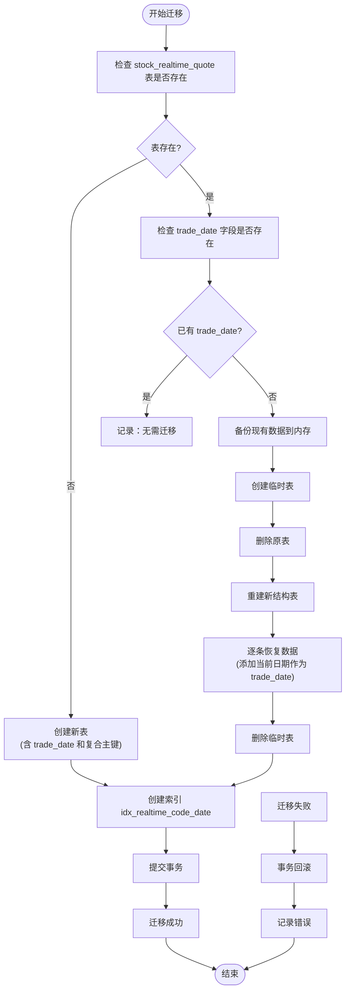
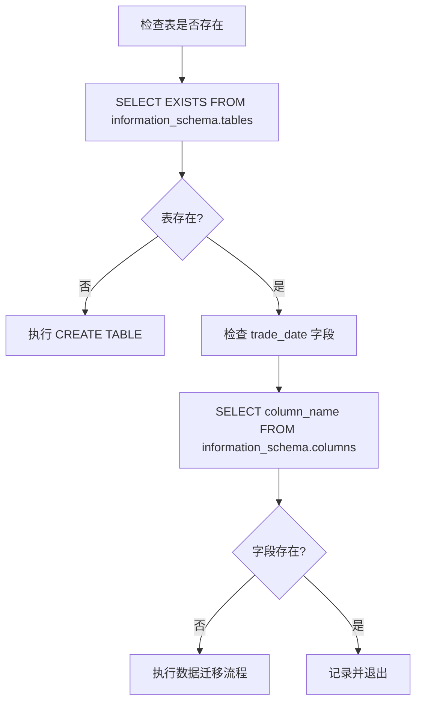
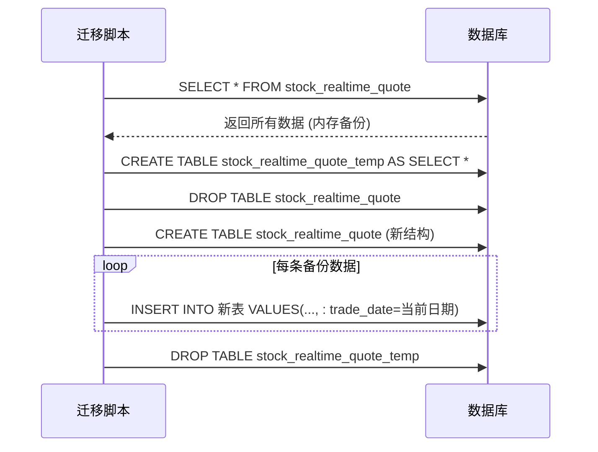
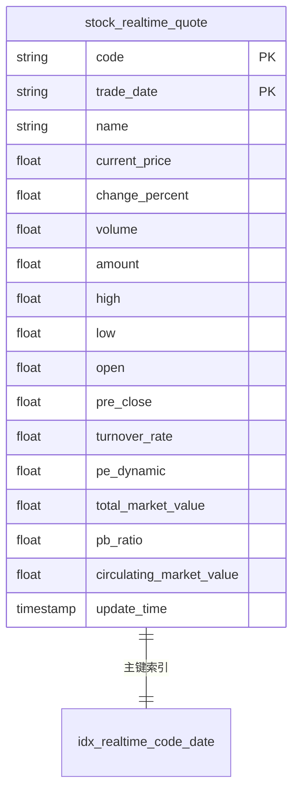
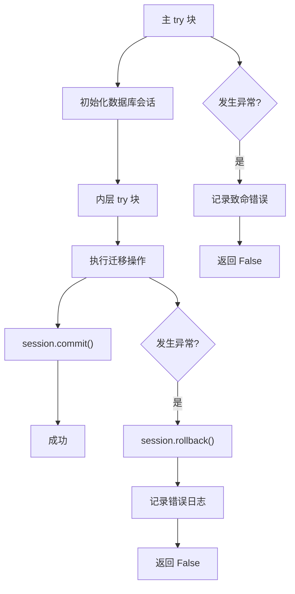
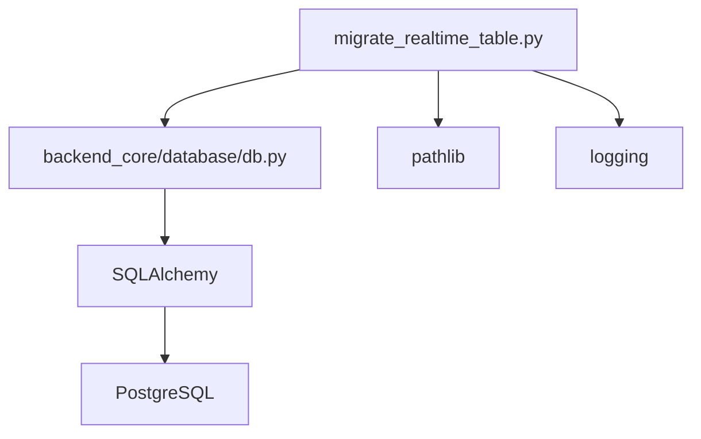

# 数据库迁移策略

<cite>
**本文档引用的文件**   
- [migrate_realtime_table.py](file://backend_core/migrate_realtime_table.py)
- [db.py](file://backend_core/database/db.py)
</cite>

## 目录
1. [引言](#引言)
2. [项目结构](#项目结构)
3. [核心组件](#核心组件)
4. [架构概述](#架构概述)
5. [详细组件分析](#详细组件分析)
6. [依赖分析](#依赖分析)
7. [性能考虑](#性能考虑)
8. [故障排除指南](#故障排除指南)
9. [结论](#结论)

## 引言
本文档深入分析 `backend_core/migrate_realtime_table.py` 脚本的完整执行流程，详细说明为 `stock_realtime_quote` 表添加 `trade_date` 字段的数据库迁移方案。涵盖表存在性检查、字段检测、数据备份与恢复机制、通过临时表实现无损结构变更、主键约束升级、索引创建策略及其对查询性能的影响、错误处理机制（事务回滚、异常捕获）和日志记录实践。同时提供在生产环境中安全执行数据库迁移的操作指南和回滚预案。

## 项目结构
该迁移脚本位于 `backend_core` 模块中，属于核心数据处理与调度系统的一部分。其主要职责是确保数据库表结构与应用需求保持一致，特别是在引入新的时间维度字段 `trade_date` 后，保证历史数据的兼容性和未来数据采集的完整性。

**Section sources**
- [migrate_realtime_table.py](file://backend_core/migrate_realtime_table.py#L1-L225)

## 核心组件

`migrate_realtime_table.py` 是一个独立的数据库迁移脚本，负责 `stock_realtime_quote` 表的结构升级。它通过 SQLAlchemy 与 PostgreSQL 数据库交互，实现了安全、可重复的迁移逻辑，包括表创建、字段添加、数据迁移和索引构建。

**Section sources**
- [migrate_realtime_table.py](file://backend_core/migrate_realtime_table.py#L1-L225)

## 架构概述

该迁移脚本遵循典型的数据库迁移模式：检查状态 -> 备份数据 -> 修改结构 -> 恢复数据 -> 验证结果。它利用数据库会话和事务控制来确保操作的原子性，防止部分更新导致的数据不一致。

**Diagram sources**
- [migrate_realtime_table.py](file://backend_core/migrate_realtime_table.py#L1-L225)

## 详细组件分析

### 迁移流程分析
该脚本的核心功能是安全地为 `stock_realtime_quote` 表添加 `trade_date` 字段，并将主键从单一的 `code` 升级为 `(code, trade_date)` 的复合主键，以支持按交易日查询和去重。

#### 表与字段检测
脚本首先使用 `information_schema.tables` 和 `information_schema.columns` 系统表来检查目标表和字段的存在性。这种基于标准 SQL 的查询方式确保了跨数据库的兼容性。

**Diagram sources**
- [migrate_realtime_table.py](file://backend_core/migrate_realtime_table.py#L45-L65)

#### 数据备份与恢复机制
当需要迁移时，脚本采用“临时表+重建”的策略来实现无损变更。它首先将所有现有数据加载到内存中，然后创建一个临时表作为物理备份，接着删除原表并用新结构重建，最后将内存中的数据恢复到新表，并为每条记录填充当前日期作为 `trade_date` 的初始值。

**Diagram sources**
- [migrate_realtime_table.py](file://backend_core/migrate_realtime_table.py#L75-L150)

#### 主键与索引管理
新表结构明确指定了 `(code, trade_date)` 作为主键，这能有效防止同一股票在同一天产生重复的实时报价记录。同时，脚本创建了名为 `idx_realtime_code_date` 的索引，该索引与主键重合，数据库会自动优化，确保基于 `code` 和 `trade_date` 的查询（如“某股票某日的实时行情”）具有极高的性能。

**Diagram sources**
- [migrate_realtime_table.py](file://backend_core/migrate_realtime_table.py#L100-L115)

#### 错误处理与日志记录
脚本实现了多层异常捕获。外层 `try-except` 捕获导入和初始化错误，内层 `try-except` 捕获数据库操作异常，并在发生错误时执行 `session.rollback()` 回滚事务，确保数据库状态不被破坏。`logging` 模块被用于记录关键步骤和错误信息，便于追踪迁移过程。

**Diagram sources**
- [migrate_realtime_table.py](file://backend_core/migrate_realtime_table.py#L50-L60)

**Section sources**
- [migrate_realtime_table.py](file://backend_core/migrate_realtime_table.py#L1-L225)

## 依赖分析

该脚本依赖于项目的核心数据库配置和会话管理模块。

**Diagram sources**
- [migrate_realtime_table.py](file://backend_core/migrate_realtime_table.py#L10-L15)
- [db.py](file://backend_core/database/db.py#L1-L32)

**Section sources**
- [migrate_realtime_table.py](file://backend_core/migrate_realtime_table.py#L1-L225)
- [db.py](file://backend_core/database/db.py#L1-L32)

## 性能考虑
- **数据量影响**：迁移过程中将所有数据加载到内存，对于超大表可能存在内存溢出风险。建议在数据量极大时，采用分页备份和恢复的策略。
- **锁竞争**：`DROP TABLE` 和 `CREATE TABLE` 操作会持有表级锁，可能阻塞其他数据写入服务。应在业务低峰期执行。
- **索引效率**：`idx_realtime_code_date` 索引极大优化了按股票代码和交易日期的查询，是本次迁移的核心性能收益点。

## 故障排除指南
- **迁移失败**：检查日志中的错误信息，确认数据库连接、权限和表状态。回滚后可重新执行脚本。
- **数据丢失**：理论上不会发生，因有内存备份和临时表双重保障。若发生，可从最近的数据库备份中恢复。
- **主键冲突**：新表启用复合主键后，任何尝试插入相同 `(code, trade_date)` 的记录都将被拒绝，这是预期行为。

**Section sources**
- [migrate_realtime_table.py](file://backend_core/migrate_realtime_table.py#L160-L220)

## 结论
`migrate_realtime_table.py` 脚本提供了一个健壮、安全的数据库迁移方案，成功地为 `stock_realtime_quote` 表引入了 `trade_date` 字段和复合主键，为后续的按日数据分析和历史换手率计算奠定了坚实的基础。其清晰的日志、事务回滚和数据备份机制确保了生产环境操作的安全性。