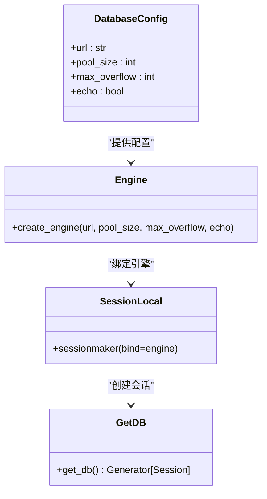
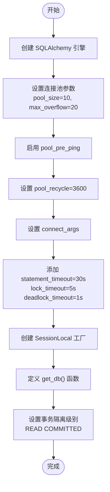
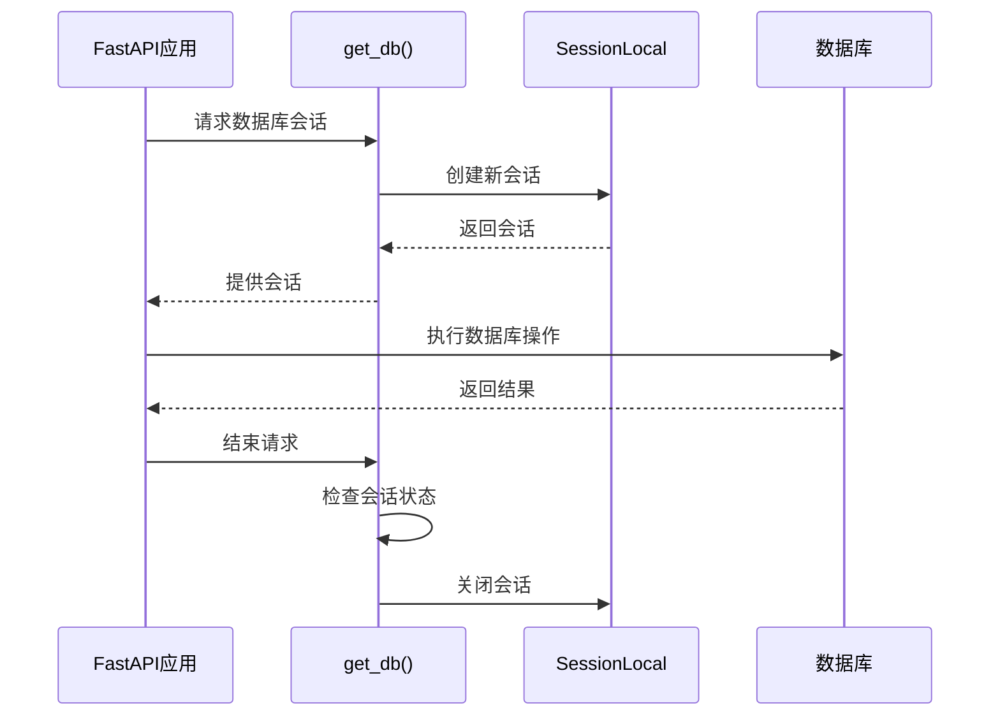
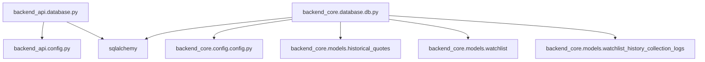

# 数据库连接管理

<cite>
**本文档引用的文件**   
- [database.py](file://backend_api/database.py)
- [db.py](file://backend_core/database/db.py)
- [config.py](file://backend_api/config.py)
- [config.py](file://backend_core/config/config.py)
</cite>

## 目录
1. [项目结构](#项目结构)
2. [核心组件](#核心组件)
3. [架构概述](#架构概述)
4. [详细组件分析](#详细组件分析)
5. [依赖分析](#依赖分析)
6. [性能考虑](#性能考虑)
7. [故障排除指南](#故障排除指南)
8. [结论](#结论)

## 项目结构

本项目包含两个主要后端模块：`backend_api` 和 `backend_core`，分别负责API服务和核心数据处理。数据库连接配置在两个模块中独立实现，以适应不同的使用场景和性能需求。

```mermaid
graph TB
subgraph "backend_api"
database[database.py]
config[config.py]
end
subgraph "backend_core"
db[database/db.py]
core_config[config/config.py]
end
database --> config : "引用 DATABASE_CONFIG"
db --> core_config : "直接定义 DATABASE_URL"
```

**图示来源**  
- [database.py](file://backend_api/database.py#L1-L71)
- [db.py](file://backend_core/database/db.py#L1-L32)
- [config.py](file://backend_api/config.py#L1-L48)
- [config.py](file://backend_core/config/config.py#L1-L47)

**本节来源**  
- [backend_api/database.py](file://backend_api/database.py#L1-L71)
- [backend_core/database/db.py](file://backend_core/database/db.py#L1-L32)

## 核心组件

`backend_api` 和 `backend_core` 模块均使用 SQLAlchemy 实现数据库连接管理，但配置策略有所不同。`backend_api` 使用集中式配置对象 `DATABASE_CONFIG`，而 `backend_core` 直接在 `db.py` 中定义连接参数。两者均通过 `SessionLocal` 工厂创建会话，并提供 `get_db()` 函数用于依赖注入或上下文管理。

**本节来源**  
- [database.py](file://backend_api/database.py#L1-L71)
- [db.py](file://backend_core/database/db.py#L1-L32)

## 架构概述

系统采用分层架构，`backend_api` 面向HTTP请求处理，`backend_core` 负责后台数据采集与计算。数据库连接管理在两个层级中分别实现，确保各自的最佳性能和稳定性。

```mermaid
graph TD
Client[客户端] --> API[backend_api]
API --> DB[(数据库)]
Core[backend_core] --> DB
API --> Core
API -.-> DB : "短时、高并发会话"
Core -.-> DB : "长时、批量操作会话"
```

**图示来源**  
- [database.py](file://backend_api/database.py#L1-L71)
- [db.py](file://backend_core/database/db.py#L1-L32)

## 详细组件分析

### backend_api 数据库连接分析

`backend_api` 的数据库配置通过 `config.py` 中的 `DATABASE_CONFIG` 字典集中管理，便于环境适配和统一维护。`create_engine` 使用 `pool_size=5` 和 `max_overflow=10`，适用于中等并发的Web请求场景。



**图示来源**  
- [database.py](file://backend_api/database.py#L1-L71)
- [config.py](file://backend_api/config.py#L1-L48)

**本节来源**  
- [database.py](file://backend_api/database.py#L1-L71)
- [config.py](file://backend_api/config.py#L1-L48)

### backend_core 数据库连接分析

`backend_core` 的数据库连接配置更加精细化，直接在 `db.py` 中定义 `DATABASE_URL` 并配置了多项高级参数。`pool_pre_ping=True` 确保连接有效性，`pool_recycle=3600` 防止连接老化。`connect_args` 中设置了 `statement_timeout`、`lock_timeout` 等参数，有效防止长时间阻塞和死锁。



**图示来源**  
- [db.py](file://backend_core/database/db.py#L1-L32)

**本节来源**  
- [db.py](file://backend_core/database/db.py#L1-L32)

### SessionLocal 与 get_db() 机制分析

两个模块均使用 `sessionmaker` 创建 `SessionLocal` 工厂，禁用自动提交和自动刷新以确保事务控制的显式性。`get_db()` 函数通过生成器实现依赖注入或上下文管理，确保会话在使用后正确关闭。



**图示来源**  
- [database.py](file://backend_api/database.py#L29-L37)
- [db.py](file://backend_core/database/db.py#L24-L32)

**本节来源**  
- [database.py](file://backend_api/database.py#L29-L37)
- [db.py](file://backend_core/database/db.py#L24-L32)

## 依赖分析



**图示来源**  
- [database.py](file://backend_api/database.py#L1-L71)
- [db.py](file://backend_core/database/db.py#L1-L32)

**本节来源**  
- [database.py](file://backend_api/database.py#L1-L71)
- [db.py](file://backend_core/database/db.py#L1-L32)

## 性能考虑

`backend_core` 的数据库配置明显更注重长时间运行任务的稳定性。`pool_size=10` 和 `max_overflow=20` 提供更大的连接容量，`pool_pre_ping` 和 `pool_recycle` 机制有效防止连接失效。SQL级别的超时设置（`statement_timeout=30s`）可防止查询长时间阻塞，`lock_timeout=5s` 减少死锁影响，`deadlock_timeout=1s` 快速检测死锁。

相比之下，`backend_api` 的配置更简洁，适用于典型的Web API场景，连接池较小，未启用预检机制，依赖FastAPI的请求生命周期自动管理会话。

## 故障排除指南

- **数据库连接失败**：检查 `DATABASE_URL` 是否正确，确保数据库服务正在运行。
- **会话未关闭**：确保所有 `get_db()` 调用都在 `try-finally` 块中或使用依赖注入。
- **死锁频繁**：参考 `backend_core` 的 `connect_args` 配置，设置合理的 `lock_timeout` 和 `deadlock_timeout`。
- **连接池耗尽**：增加 `pool_size` 和 `max_overflow`，或优化代码减少会话持有时间。
- **长时间查询阻塞**：启用 `statement_timeout` 限制查询执行时间。

**本节来源**  
- [database.py](file://backend_api/database.py#L1-L71)
- [db.py](file://backend_core/database/db.py#L1-L32)

## 结论

`backend_api` 和 `backend_core` 的数据库连接管理体现了不同服务层的设计权衡。`backend_api` 采用简洁配置，适合高并发、短生命周期的API请求；`backend_core` 采用精细化配置，确保后台任务的稳定性和可靠性。在实际应用中，应根据服务特性选择合适的连接管理策略，并优先采用 `backend_core` 中的超时和预检机制以提高系统健壮性。