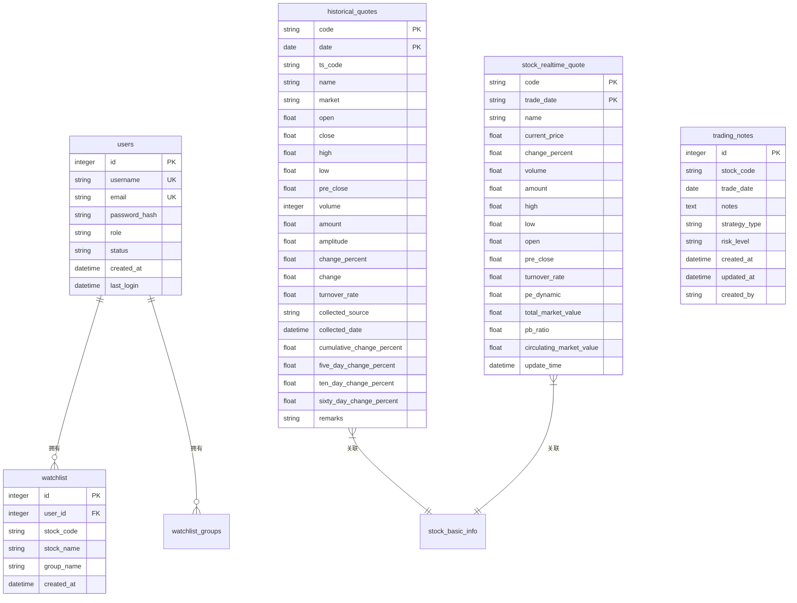
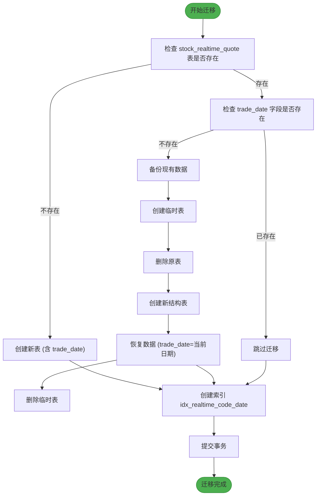

# 数据模型与数据库设计

<cite>
**本文档引用的文件**  
- [backend_api/models.py](file://backend_api/models.py)
- [backend_core/models/historical_quotes.py](file://backend_core/models/historical_quotes.py)
- [backend_core/models/watchlist.py](file://backend_core/models/watchlist.py)
- [backend_core/migrate_realtime_table.py](file://backend_core/migrate_realtime_table.py)
</cite>

## 目录
1. [引言](#引言)
2. [核心数据模型](#核心数据模型)
3. [核心表结构图](#核心表结构图)
4. [字段说明与约束](#字段说明与约束)
5. [SQLAlchemy ORM 映射机制](#sqlalchemy-orm-映射机制)
6. [数据库迁移策略](#数据库迁移策略)
7. [数据生命周期管理](#数据生命周期管理)
8. [数据库性能优化建议](#数据库性能优化建议)
9. [结论](#结论)

## 引言

本项目为股票行情分析系统，其数据模型设计围绕用户管理、股票行情、自选股及操作日志等核心功能展开。数据库采用关系型模型，通过 SQLAlchemy ORM 实现对象与表的映射。本文档整合 `backend_api/models.py` 与 `backend_core/models/` 中的实体定义，详细说明用户表（users）、历史行情表（historical_quotes）、自选股表（watchlist）等核心表结构，并阐述数据库迁移、数据生命周期及性能优化策略。

**Section sources**
- [backend_api/models.py](file://backend_api/models.py#L1-L435)

## 核心数据模型

系统主要包含以下核心实体模型：

- **User（用户）**：系统用户信息，包含用户名、邮箱、密码哈希、角色等。
- **Watchlist（自选股）**：用户关注的股票列表，支持分组管理。
- **HistoricalQuotes（历史行情）**：存储股票历史交易数据，包括价格、成交量、涨跌幅等。
- **StockRealtimeQuote（实时行情）**：存储股票实时报价数据。
- **TradingNotes（交易笔记）**：用户对特定股票在特定日期的交易记录与分析。

这些模型分布在 `backend_api/models.py` 和 `backend_core/models/` 目录下，其中 `backend_api/models.py` 主要服务于API接口，而 `backend_core/models/` 更侧重于数据采集与核心业务逻辑。

**Section sources**
- [backend_api/models.py](file://backend_api/models.py#L15-L100)
- [backend_core/models/historical_quotes.py](file://backend_core/models/historical_quotes.py#L1-L28)
- [backend_core/models/watchlist.py](file://backend_core/models/watchlist.py#L1-L12)

## 核心表结构图

**Diagram sources**
- [backend_api/models.py](file://backend_api/models.py#L15-L30)
- [backend_api/models.py](file://backend_api/models.py#L60-L80)
- [backend_api/models.py](file://backend_api/models.py#L350-L380)
- [backend_core/models/historical_quotes.py](file://backend_core/models/historical_quotes.py#L1-L28)

## 字段说明与约束

### 用户表 (users)
| 字段名 | 数据类型 | 约束 | 说明 |
| :--- | :--- | :--- | :--- |
| id | Integer | PRIMARY KEY, INDEX | 用户唯一标识 |
| username | String | UNIQUE, NOT NULL | 用户名，唯一 |
| email | String | UNIQUE, NOT NULL | 邮箱，唯一 |
| password_hash | String | NOT NULL | 密码哈希值 |
| role | String | DEFAULT 'user' | 用户角色（user/admin） |
| status | String | DEFAULT 'active' | 账户状态（active/inactive） |
| created_at | DateTime | DEFAULT now() | 创建时间 |
| last_login | DateTime | NULLABLE | 最后登录时间 |

### 自选股表 (watchlist)
| 字段名 | 数据类型 | 约束 | 说明 |
| :--- | :--- | :--- | :--- |
| id | Integer | PRIMARY KEY, INDEX | 自选股记录ID |
| user_id | Integer | FOREIGN KEY (users.id), NOT NULL | 关联用户ID |
| stock_code | String | NOT NULL | 股票代码 |
| stock_name | String | NOT NULL | 股票名称 |
| group_name | String | DEFAULT 'default' | 分组名称 |
| created_at | DateTime | DEFAULT now() | 创建时间 |

### 历史行情表 (historical_quotes)
| 字段名 | 数据类型 | 约束 | 说明 |
| :--- | :--- | :--- | :--- |
| code | String | PRIMARY KEY | 股票代码 |
| date | Date | PRIMARY KEY | 交易日期 |
| open | Float | NOT NULL | 开盘价 |
| close | Float | NOT NULL | 收盘价 |
| high | Float | NOT NULL | 最高价 |
| low | Float | NOT NULL | 最低价 |
| volume | Integer | NOT NULL | 成交量 |
| amount | Float | NOT NULL | 成交额 |
| change_percent | Float | NOT NULL | 涨跌幅 |
| turnover_rate | Float | | 换手率 |
| collected_source | String | | 数据来源 |
| collected_date | DateTime | DEFAULT now() | 采集时间 |
| five_day_change_percent | Float | | 5日涨跌幅 |
| remarks | String | | 备注 |

**索引策略**：
- 主键 `(code, date)` 已提供高效查询。
- 可为 `collected_date` 建立索引以优化按采集时间的范围查询。

**Section sources**
- [backend_api/models.py](file://backend_api/models.py#L15-L30)
- [backend_core/models/historical_quotes.py](file://backend_core/models/historical_quotes.py#L1-L28)

## SQLAlchemy ORM 映射机制

本系统使用 SQLAlchemy 的声明式基类（`declarative_base`）来定义 ORM 模型。每个 Python 类对应一个数据库表，通过 `__tablename__` 指定表名。

- **字段映射**：类属性通过 `Column` 构造函数映射到数据库列。例如，`id = Column(Integer, primary_key=True)` 将 `id` 属性映射为表的主键整数列。
- **数据类型**：使用 SQLAlchemy 提供的类型（如 `Integer`, `String`, `Float`, `DateTime`, `Date`）来定义列的数据类型。
- **关系映射**：使用 `relationship()` 函数建立模型间的关联。例如，`User` 模型中的 `watchlists = relationship("Watchlist", back_populates="user")` 表明一个用户可以拥有多个自选股记录，而 `Watchlist` 模型通过 `user` 属性反向引用用户。
- **外键约束**：通过 `ForeignKey("users.id")` 在 `Watchlist` 模型中定义外键，确保数据完整性。

这种映射机制使得开发者可以使用面向对象的方式操作数据库，无需直接编写 SQL 语句。

**Section sources**
- [backend_api/models.py](file://backend_api/models.py#L1-L10)
- [backend_api/models.py](file://backend_api/models.py#L15-L30)
- [backend_core/models/historical_quotes.py](file://backend_core/models/historical_quotes.py#L1-L10)

## 数据库迁移策略

数据库迁移通过脚本 `backend_core/migrate_realtime_table.py` 实现，用于安全地修改 `stock_realtime_quote` 表结构。

### 迁移脚本功能
该脚本的核心功能是为 `stock_realtime_quote` 表添加 `trade_date` 字段，并将其与 `code` 字段共同组成复合主键。

### 迁移流程

**Diagram sources**
- [backend_core/migrate_realtime_table.py](file://backend_core/migrate_realtime_table.py#L1-L226)

**Section sources**
- [backend_core/migrate_realtime_table.py](file://backend_core/migrate_realtime_table.py#L1-L226)

## 数据生命周期管理

### 历史数据归档
- **归档策略**：对于 `historical_quotes` 表，可定期将超过一定年限（如5年）的历史数据归档到单独的归档表或数据仓库中，以保持主表的查询性能。
- **实现方式**：可通过定时任务（如 `backend_core/scheduler/` 中的调度器）执行 SQL 脚本，将旧数据 `INSERT INTO archive_table` 后再从主表 `DELETE`。

### 日志保留策略
- **操作日志**：`operation_logs` 表（在 `backend_api/admin/logs.py` 中定义）应设置保留策略，例如仅保留最近6个月或1年的日志。
- **实现方式**：通过数据库的 `PARTITION` 功能按时间分区，或通过定时任务定期清理过期日志。

## 数据库性能优化建议

### 查询优化
- **避免 SELECT ***：始终明确指定需要的字段，减少数据传输量。
- **使用 JOIN 代替子查询**：对于关联查询，使用 `JOIN` 通常比子查询更高效。
- **批量操作**：在插入或更新大量数据时，使用 `session.bulk_insert_mappings()` 或 `session.bulk_update_mappings()` 方法。

### 索引优化
- **为查询字段创建索引**：在 `WHERE`, `ORDER BY`, `JOIN` 子句中频繁使用的字段上创建索引。
- **复合索引**：对于多条件查询，创建复合索引。例如，为 `historical_quotes` 表的 `(code, date)` 创建复合索引（已为主键）。
- **避免过度索引**：索引会增加写入开销，只为真正需要的查询创建索引。

### 连接池配置
- **使用连接池**：SQLAlchemy 默认使用连接池（`create_engine` 时配置）。
- **合理配置参数**：
  - `pool_size`: 连接池大小，根据应用并发量设置（如20-50）。
  - `max_overflow`: 允许超出 `pool_size` 的连接数（如10）。
  - `pool_recycle`: 设置连接回收时间（如3600秒），防止数据库主动断开空闲连接导致的 `MySQL server has gone away` 错误。
  - `pool_pre_ping`: 设置为 `True`，在每次从池中获取连接时先进行健康检查，自动重建失效连接。

## 结论

本文档详细阐述了股票分析系统的数据模型与数据库设计。系统通过 SQLAlchemy ORM 实现了清晰的实体映射，核心表结构设计合理，涵盖了用户、自选股、历史行情等关键数据。通过专用的迁移脚本，系统能够安全地演进数据库结构。未来应实施数据归档和日志保留策略，并持续进行查询和索引优化，以确保数据库在数据量增长时仍能保持高性能。