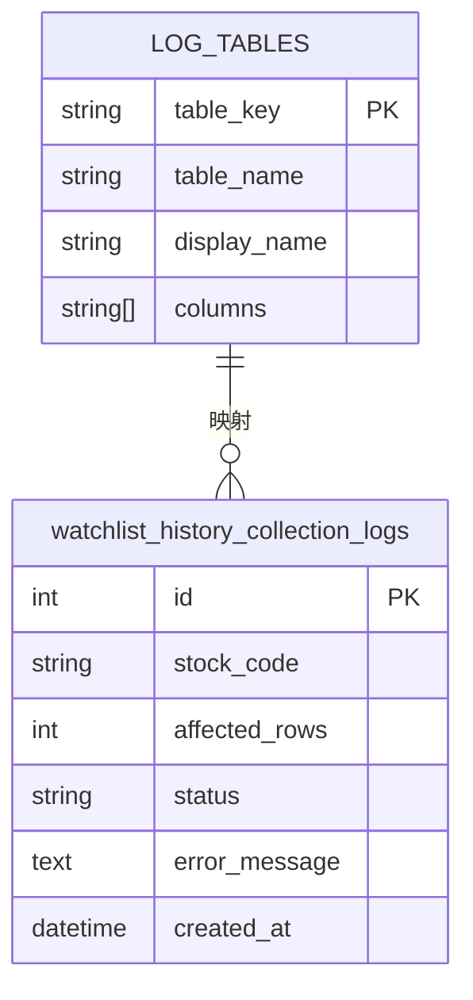

# 数据采集任务状态模型

<cite>
**本文档引用的文件**
- [watchlist_history_collection_logs.py](file://backend_core/models/watchlist_history_collection_logs.py)
- [logs.py](file://backend_api/admin/logs.py)
- [data_collection_api.py](file://backend_api/stock/data_collection_api.py)
</cite>

## 目录
1. [引言](#引言)
2. [核心数据模型](#核心数据模型)
3. [状态字段设计与生命周期映射](#状态字段设计与生命周期映射)
4. [日志系统中的状态映射关系](#日志系统中的状态映射关系)
5. [状态在监控与统计中的作用](#状态在监控与统计中的作用)
6. [基于状态的API查询示例](#基于状态的api查询示例)
7. [状态变更规则与交互逻辑](#状态变更规则与交互逻辑)
8. [异常状态排查与处理建议](#异常状态排查与处理建议)

## 引言
本文档深入分析股票分析系统中数据采集任务的状态模型设计，重点围绕自选股历史数据采集日志表 `WatchlistHistoryCollectionLogs` 的 `status` 字段展开。该字段作为任务状态机的核心实现，记录了数据同步任务的执行结果（成功/失败），并贯穿于任务的整个生命周期。文档将结合管理后台的日志配置，阐述状态模型在系统监控、统计分析和告警机制中的关键作用。

## 核心数据模型

`WatchlistHistoryCollectionLogs` 模型定义了自选股历史数据采集任务的执行日志，其核心字段包括任务标识、影响行数、执行状态和错误信息。

**Section sources**
- [watchlist_history_collection_logs.py](file://backend_core/models/watchlist_history_collection_logs.py#L0-L11)

## 状态字段设计与生命周期映射

`status` 字段是 `WatchlistHistoryCollectionLogs` 模型中的关键状态机实现，其值（如 `success` 或 `failed`）直接反映了单次数据采集操作的最终结果。该字段的设计与数据同步任务的完整生命周期紧密对应：

- **pending (待处理)**: 任务已创建并加入调度队列，但尚未开始执行。此状态通常由调度器在任务初始化时设定。
- **running (运行中)**: 任务已经开始执行，正在处理数据。此状态在任务启动时由数据采集器更新。
- **completed/success (已完成/成功)**: 任务已成功执行完毕，所有目标数据均被正确采集和存储。`status` 字段被设置为 `success`。
- **failed (失败)**: 任务在执行过程中遇到错误而终止。`status` 字段被设置为 `failed`，同时 `error_message` 字段会记录具体的错误详情。

此状态机通过 `status` 字段的原子性更新，确保了任务状态的清晰和可追溯性。

**Section sources**
- [data_collection_api.py](file://backend_api/stock/data_collection_api.py#L469-L504)
- [data_collection_api.py](file://backend_api/stock/data_collection_api.py#L501-L533)

## 日志系统中的状态映射关系

管理后台的 `logs.py` 文件通过 `LOG_TABLES` 配置，将 `WatchlistHistoryCollectionLogs` 表集成到统一的日志查询系统中。该配置建立了日志表与前端展示之间的映射关系。



**Diagram sources**
- [logs.py](file://backend_api/admin/logs.py#L30-L38)
- [watchlist_history_collection_logs.py](file://backend_core/models/watchlist_history_collection_logs.py#L0-L11)

**Section sources**
- [logs.py](file://backend_api/admin/logs.py#L30-L38)

## 状态在监控与统计中的作用

`status` 字段是系统监控、统计和告警功能的数据基石：

1.  **监控任务执行情况**：管理员可以通过日志查询界面，实时查看 `status` 为 `running` 的任务，监控其执行进度和持续时间。
2.  **统计成功率**：系统通过 `get_log_stats` 接口，对 `status` 字段进行分组统计，计算出成功(`success`)和失败(`failed`)任务的数量，从而得出数据采集的整体成功率。
3.  **触发告警机制**：当系统检测到 `status` 为 `failed` 的任务数量在短时间内异常增加，或某个任务长时间处于 `running` 状态时，可以触发告警，通知运维人员及时介入。

**Section sources**
- [logs.py](file://backend_api/admin/logs.py#L226-L250)
- [logs.py](file://backend_api/admin/logs.py#L180-L220)

## 基于状态的API查询示例

管理后台提供了强大的日志查询API，允许通过 `status` 参数精确筛选采集记录。以下是一个查询自选股历史采集日志中所有失败记录的API调用示例：

```http
GET /api/admin/logs/query/watchlist_history?status=failed&page=1&page_size=20
```

此请求将返回 `watchlist_history_collection_logs` 表中所有 `status` 字段值为 `failed` 的日志条目，便于开发和运维人员集中分析失败原因。

**Section sources**
- [logs.py](file://backend_api/admin/logs.py#L250-L300)

## 状态变更规则与交互逻辑

`status` 字段的变更遵循严格的业务规则，并与调度器、数据采集器等组件紧密交互：

1.  **初始化**：调度器创建采集任务时，通常会初始化一个任务状态对象，`status` 设为 `pending`。
2.  **启动**：当任务被调度执行时，数据采集器将其 `status` 更新为 `running`。
3.  **成功完成**：任务成功处理完所有数据后，采集器将 `status` 设置为 `success`，并记录 `affected_rows`。
4.  **执行失败**：任务在执行过程中抛出异常，异常处理逻辑会捕获错误，并将 `status` 设置为 `failed`，同时将错误堆栈信息写入 `error_message` 字段。

这种交互逻辑确保了状态变更的原子性和一致性。

**Section sources**
- [data_collection_api.py](file://backend_api/stock/data_collection_api.py#L469-L504)
- [data_collection_api.py](file://backend_api/stock/data_collection_api.py#L531-L559)

## 异常状态排查与处理建议

当发现任务长时间处于 `running` 状态时，应进行以下排查：

1.  **检查进程状态**：确认执行该任务的后端进程是否仍在运行，是否发生卡死或死锁。
2.  **分析日志细节**：查看该任务最近的日志输出，定位其卡在哪个具体操作步骤。
3.  **检查资源**：评估系统CPU、内存、数据库连接等资源是否耗尽。
4.  **检查网络**：确认与数据源（如AkShare）的网络连接是否正常。
5.  **处理建议**：对于确认已卡死的任务，可考虑通过管理API强制终止，并在修复潜在问题后重新调度。

**Section sources**
- [data_collection_api.py](file://backend_api/stock/data_collection_api.py#L501-L533)
- [logs.py](file://backend_api/admin/logs.py#L300-L350)