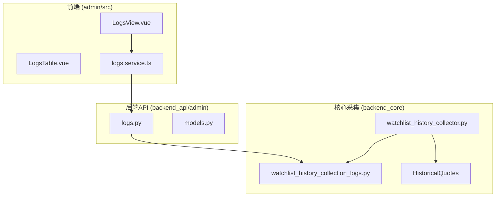
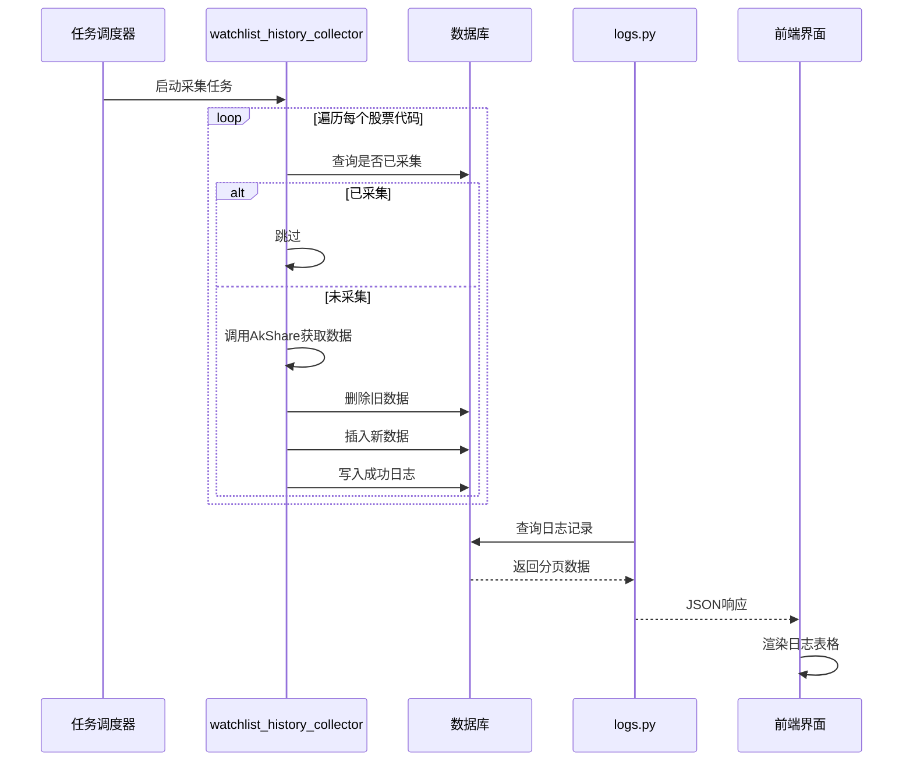
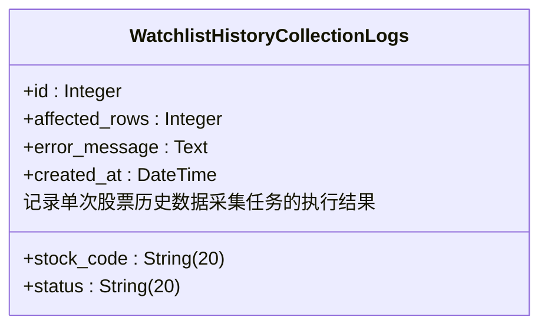
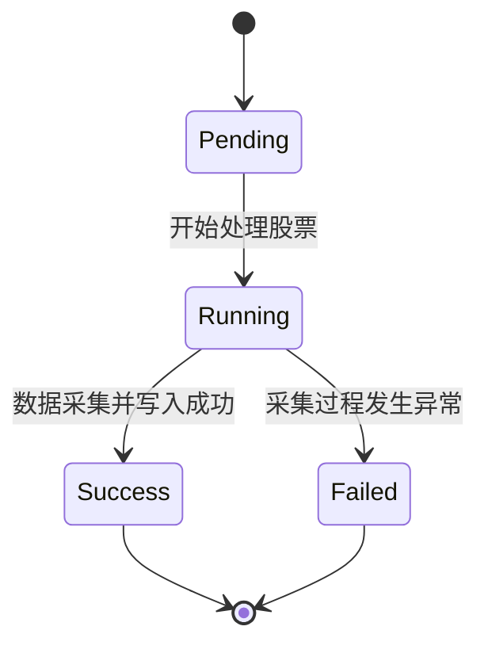
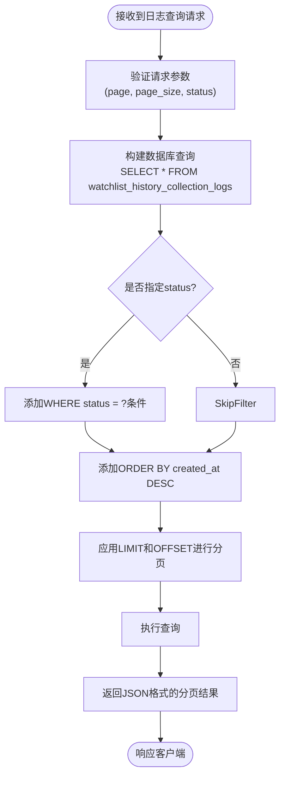
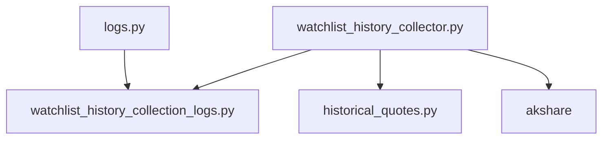

# 数据采集日志

<cite>
**本文档引用文件**  
- [watchlist_history_collection_logs.py](file://backend_core/models/watchlist_history_collection_logs.py)
- [historical_quotes.py](file://backend_core/models/historical_quotes.py)
- [watchlist_history_collector.py](file://backend_core/data_collectors/akshare/watchlist_history_collector.py)
- [logs.py](file://backend_api/admin/logs.py)
</cite>

## 目录
1. [引言](#引言)
2. [项目结构](#项目结构)
3. [核心组件](#核心组件)
4. [架构概述](#架构概述)
5. [详细组件分析](#详细组件分析)
6. [依赖分析](#依赖分析)
7. [性能考虑](#性能考虑)
8. [故障排查指南](#故障排查指南)
9. [结论](#结论)

## 引言
本文档深入分析股票分析系统中的数据采集日志模型，重点围绕`watchlist_history_collection_logs`表的监控机制展开。详细阐述其核心字段的设计意图与业务含义，结合`QuoteSyncTask`模型说明数据同步任务的全生命周期管理，并说明该日志系统在故障排查、成功率统计和异常监控中的关键作用。

## 项目结构
系统采用前后端分离架构，核心数据采集逻辑位于`backend_core`模块，日志查询接口由`backend_api`提供，前端通过Vue组件展示日志信息。

**图示来源**  
- [LogsView.vue](file://admin/src/views/LogsView.vue)
- [logs.py](file://backend_api/admin/logs.py)
- [watchlist_history_collection_logs.py](file://backend_core/models/watchlist_history_collection_logs.py)

**本节来源**  
- [watchlist_history_collection_logs.py](file://backend_core/models/watchlist_history_collection_logs.py)
- [logs.py](file://backend_api/admin/logs.py)

## 核心组件
本系统的核心日志模型`WatchlistHistoryCollectionLogs`用于记录自选股历史行情数据采集任务的执行情况，每个字段均承载明确的业务语义，为系统监控和故障排查提供关键数据支持。

**本节来源**  
- [watchlist_history_collection_logs.py](file://backend_core/models/watchlist_history_collection_logs.py)

## 架构概述
系统通过`watchlist_history_collector.py`中的采集任务定期执行数据同步，将结果写入`historical_quotes`表，并在`watchlist_history_collection_logs`表中记录每次采集的详细日志。管理员可通过API接口查询日志，前端进行可视化展示。

**图示来源**  
- [watchlist_history_collector.py](file://backend_core/data_collectors/akshare/watchlist_history_collector.py)
- [logs.py](file://backend_api/admin/logs.py)

## 详细组件分析

### 日志模型分析
`WatchlistHistoryCollectionLogs`模型定义了数据采集的关键监控指标。

**图示来源**  
- [watchlist_history_collection_logs.py](file://backend_core/models/watchlist_history_collection_logs.py#L5-L11)

#### 核心字段设计意图
- **stock_code（股票代码）**: 标识本次采集任务所针对的具体股票，是日志记录的业务主键之一，用于关联具体的采集对象。
- **affected_rows（影响行数）**: 记录本次采集操作实际写入数据库的行情数据条数，用于量化采集成果和验证数据完整性。
- **status（状态）**: 标记任务执行结果，采用`success/failed`二元状态，为系统提供清晰的任务健康度指示。
- **error_message（错误详情）**: 当采集失败时，存储异常堆栈或错误描述，是故障排查的第一手资料。
- **created_at（创建时间）**: 记录日志生成时间，用于时间序列分析、监控趋势和审计追溯。

**本节来源**  
- [watchlist_history_collection_logs.py](file://backend_core/models/watchlist_history_collection_logs.py#L5-L11)

### 采集任务状态机分析
系统通过`collect_watchlist_history`函数实现了一个隐式的任务状态机，其生命周期如下：

**图示来源**  
- [watchlist_history_collector.py](file://backend_core/data_collectors/akshare/watchlist_history_collector.py#L100-L135)

#### 任务全生命周期管理
1. **Pending（待处理）**: 任务被调度器触发，进入待处理状态。
2. **Running（运行中）**: 遍历自选股列表，对每个股票代码执行采集逻辑。
3. **Success（成功）**: 成功从AkShare获取数据，完成数据库upsert操作，并写入`status='success'`的日志。
4. **Failed（失败）**: 采集过程中抛出异常，捕获后回滚事务，写入`status='fail'`及`error_message`的日志。

**本节来源**  
- [watchlist_history_collector.py](file://backend_core/data_collectors/akshare/watchlist_history_collector.py#L100-L135)

### 日志查询接口分析
`backend_api/admin/logs.py`中的查询接口提供了对日志数据的结构化访问能力。

**图示来源**  
- [logs.py](file://backend_api/admin/logs.py)

#### 查询功能实现
- **分页查询**: 通过`page`和`page_size`参数实现，避免一次性加载过多数据，提升接口性能和用户体验。
- **按状态过滤**: 支持通过`status`参数筛选`success`或`failed`的日志，便于针对性地监控成功任务或排查失败任务。
- **错误追踪**: 失败日志中的`error_message`字段可直接用于追踪具体错误原因，结合`stock_code`可快速定位问题股票。

**本节来源**  
- [logs.py](file://backend_api/admin/logs.py)

## 依赖分析
系统各组件间存在明确的依赖关系，确保了数据采集、记录和查询的完整闭环。

**图示来源**  
- [watchlist_history_collector.py](file://backend_core/data_collectors/akshare/watchlist_history_collector.py)
- [logs.py](file://backend_api/admin/logs.py)

**本节来源**  
- [watchlist_history_collector.py](file://backend_core/data_collectors/akshare/watchlist_history_collector.py)
- [logs.py](file://backend_api/admin/logs.py)

## 性能考虑
- **采集间隔**: 代码中`time.sleep(10)`确保每次采集请求间隔10秒，遵守AkShare的反爬虫策略，避免被封禁。
- **批量操作**: 使用SQLAlchemy的`on_conflict_do_update`实现upsert，避免了先查后插的低效操作，提升了数据写入性能。
- **查询优化**: 日志查询接口按`created_at`倒序排列，确保最新日志优先展示，符合监控场景需求。

## 故障排查指南
当出现采集失败时，应遵循以下分析流程：

1. **定位失败日志**: 在管理后台按`status=failed`过滤，找到最近的失败记录。
2. **解析错误消息**: 查看`error_message`字段，判断是网络超时、API变更、数据格式异常还是数据库问题。
3. **重试机制建议**: 
   - 对于临时性网络错误，可手动触发重试或等待下次调度。
   - 对于AkShare API变更导致的错误，需更新`watchlist_history_collector.py`中的调用逻辑。
   - 对于数据库约束错误，需检查`historical_quotes`表结构与数据的兼容性。
4. **性能优化策略**:
   - 考虑将`time.sleep(10)`调整为指数退避策略，提高采集效率。
   - 对`watchlist_history_collection_logs`表的`stock_code`和`created_at`字段建立索引，加速查询。
   - 实现失败任务的自动重试队列，提升系统健壮性。

**本节来源**  
- [watchlist_history_collector.py](file://backend_core/data_collectors/akshare/watchlist_history_collector.py#L120-L130)
- [logs.py](file://backend_api/admin/logs.py)

## 结论
`watchlist_history_collection_logs`表是本系统数据采集模块的监控基石。其精心设计的字段为任务状态跟踪、故障诊断和性能分析提供了全面的数据支持。结合清晰的状态机管理和高效的日志查询接口，该日志系统显著提升了数据采集流程的可观测性和可维护性，是保障系统稳定运行的关键组件。