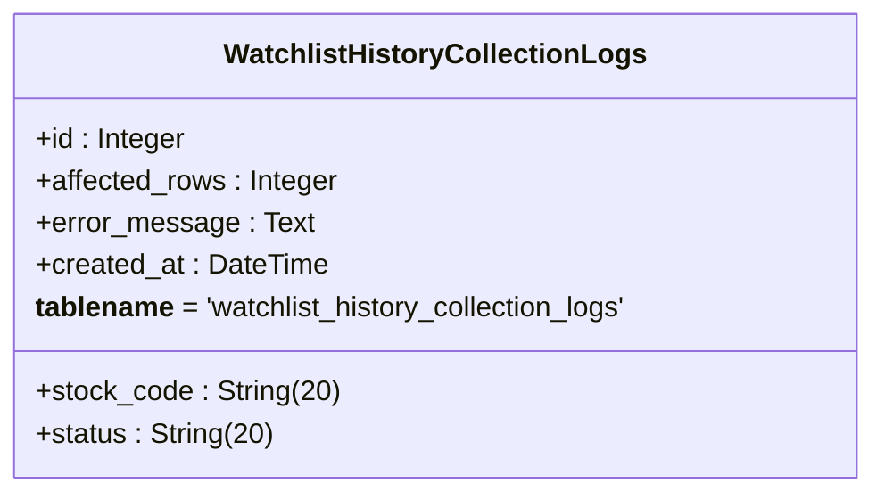
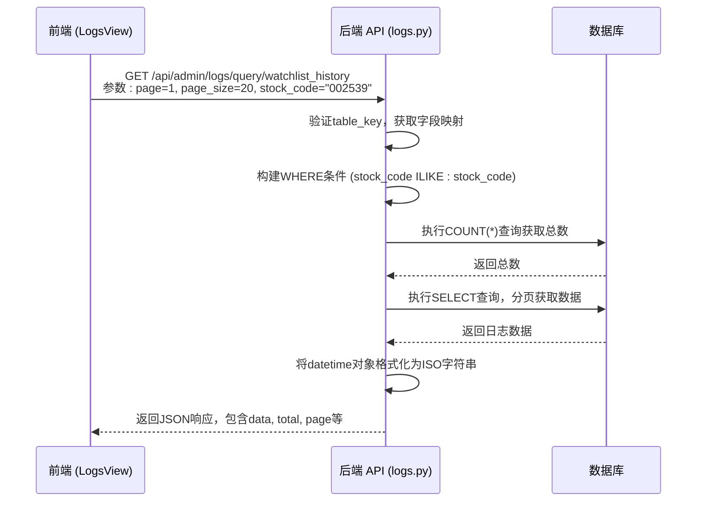

# 数据采集记录详情

<cite>
**本文档引用的文件**
- [watchlist_history_collection_logs.py](file://backend_core/models/watchlist_history_collection_logs.py)
- [logs.py](file://backend_api/admin/logs.py)
- [watchlist_history_collector.py](file://backend_core/data_collectors/akshare/watchlist_history_collector.py)
- [logs.types.ts](file://admin/src/types/logs.types.ts)
- [logs.service.ts](file://admin/src/services/logs.service.ts)
</cite>

## 目录
1. [引言](#引言)
2. [核心字段业务含义](#核心字段业务含义)
3. [SQLAlchemy模型定义](#sqlalchemy模型定义)
4. [日志查询接口实现](#日志查询接口实现)
5. [实际应用场景](#实际应用场景)
6. [错误消息解析指南](#错误消息解析指南)
7. [性能优化建议](#性能优化建议)
8. [前端集成与展示](#前端集成与展示)
9. [结论](#结论)

## 引言
本文档全面解析股票分析软件系统中数据采集日志记录的详细字段信息，重点阐述`watchlist_history_collection_logs`表中`stock_code`（股票代码）、`affected_rows`（影响行数）、`error_message`（错误详情）和`created_at`（创建时间）等核心字段的业务含义与技术实现。通过分析后端核心模型定义与管理API接口，揭示日志系统的数据结构、查询机制与实际应用价值，为系统维护、性能分析与故障排查提供权威参考。

**Section sources**
- [watchlist_history_collection_logs.py](file://backend_core/models/watchlist_history_collection_logs.py)
- [logs.py](file://backend_api/admin/logs.py)

## 核心字段业务含义
`watchlist_history_collection_logs`表是自选股历史数据采集过程的审计与监控中心，其核心字段承载着关键的业务与技术信息。

- **stock_code (股票代码)**: 标识本次采集操作所针对的具体股票。该字段是连接日志记录与具体股票数据的桥梁，用于追踪特定股票的数据采集历史、成功率和效率。在分析单只股票的数据质量或排查其采集问题时，此字段是首要的筛选条件。

- **affected_rows (影响行数)**: 记录本次采集操作成功写入数据库的行情数据条数。该数值直接反映了数据采集的“产出量”，是衡量采集效率和数据完整性的重要指标。例如，一个成功的采集任务可能影响数千行数据，而为0则可能意味着数据源为空或采集过程在写入前已失败。

- **error_message (错误详情)**: 当采集状态为`fail`时，此字段存储详细的错误信息，通常为异常的堆栈跟踪或描述性文本。它是故障诊断的“第一现场”，提供了定位问题根源（如网络超时、API限流、数据解析错误）的关键线索。

- **created_at (创建时间)**: 记录日志条目生成的精确时间戳。此字段是进行时间序列分析的基础，可用于监控采集任务的执行频率、分析每日/每周的采集成功率趋势，或在发生系统性故障时，通过时间范围快速定位受影响的日志。

**Section sources**
- [watchlist_history_collection_logs.py](file://backend_core/models/watchlist_history_collection_logs.py)

## SQLAlchemy模型定义
`WatchlistHistoryCollectionLogs`模型基于SQLAlchemy ORM框架定义，精确映射了数据库表的结构与约束。

**Diagram sources**
- [watchlist_history_collection_logs.py](file://backend_core/models/watchlist_history_collection_logs.py#L5-L11)

**Section sources**
- [watchlist_history_collection_logs.py](file://backend_core/models/watchlist_history_collection_logs.py#L5-L11)

### 字段数据类型与约束
- **id**: `Column(Integer, primary_key=True, autoincrement=True)`。主键，整数类型，自动递增，确保每条日志的唯一性。
- **stock_code**: `Column(String(20), nullable=False)`。可变字符串，最大长度20，不允许为空。此长度足以容纳A股、港股及美股代码。
- **affected_rows**: `Column(Integer)`。整数类型，可为空。当采集失败时，此值通常为0或`NULL`。
- **status**: `Column(String(20))`。可变字符串，最大长度20，用于存储`success`或`fail`等状态标识。
- **error_message**: `Column(Text)`。长文本类型，用于存储可能非常冗长的错误堆栈信息，无长度限制。
- **created_at**: `Column(DateTime, default=datetime.now)`。日期时间类型，插入记录时自动填充为当前时间。

### 存储策略
该模型继承自`Base`，并与数据库会话集成。日志的写入由`watchlist_history_collector.py`中的`log_collection`函数完成，采用标准的ORM `add`和`commit`操作，确保了数据的一致性和事务性。

**Section sources**
- [watchlist_history_collection_logs.py](file://backend_core/models/watchlist_history_collection_logs.py#L5-L11)
- [watchlist_history_collector.py](file://backend_core/data_collectors/akshare/watchlist_history_collector.py#L50-L58)

## 日志查询接口实现
`backend_api/admin/logs.py`中的`query_logs`接口为前端管理界面提供了强大的日志查询能力。

**Diagram sources**
- [logs.py](file://backend_api/admin/logs.py#L180-L275)

**Section sources**
- [logs.py](file://backend_api/admin/logs.py#L180-L275)

### 接口功能详解
- **分页查询**: 通过`page`和`page_size`参数实现，有效防止一次性加载过多数据导致性能问题。
- **条件过滤**:
  - **时间范围**: 使用`start_date`和`end_date`参数，通过`created_at`字段进行筛选。
  - **状态筛选**: 使用`status`参数，可筛选`success`或`fail`的日志。
  - **股票代码筛选**: 使用`stock_code`参数，仅适用于`watchlist_history`表，支持模糊匹配（`ILIKE`），便于快速定位特定股票的日志。
- **错误追踪**: 当查询失败时，接口捕获异常并返回HTTP 500错误，同时将错误详情包含在响应中，便于后端开发人员调试API本身的问题。

## 实际应用场景
### 通过affected_rows分析采集效率
运营人员可以定期查询`watchlist_history_collection_logs`表，按`created_at`分组统计每日的`SUM(affected_rows)`。一个持续下降的趋势可能预示着数据源的变化或采集逻辑的退化，需要及时介入分析。

### 通过error_message定位数据源异常
当监控系统发现大量`status`为`fail`的日志时，运维人员可以立即查询`error_message`字段。例如，若错误信息包含`"HTTP 429 Too Many Requests"`，则表明AKShare API的调用频率超过了限制，解决方案是调整采集任务的`time.sleep()`间隔。

### 通过created_at进行时间序列分析
通过`get_log_stats`接口，可以获取按日统计的成功与失败数量。将这些数据可视化为折线图，可以清晰地看到系统在特定日期（如节假日后）的稳定性，或评估一次代码发布后对采集成功率的影响。

**Section sources**
- [logs.py](file://backend_api/admin/logs.py#L277-L348)
- [watchlist_history_collection_logs.py](file://backend_core/models/watchlist_history_collection_logs.py)

## 错误消息解析指南
常见错误消息及其可能原因：
- **`ConnectionError` / `TimeoutError`**: 网络问题或AKShare服务器暂时不可达。建议重试。
- **`KeyError: '日期'`**: 数据源返回的JSON结构发生变化，导致`watchlist_history_collector.py`中`df.iterrows()`访问不存在的列。需要检查AKShare API文档并更新数据解析逻辑。
- **`DatabaseError`**: 数据库连接中断或SQL执行失败。需检查数据库服务状态和连接池配置。
- **`ValueError: invalid literal for int()`**: 数据类型转换错误，可能源于数据源返回了非预期的字符串。需要在数据插入前增加数据清洗和验证步骤。

**Section sources**
- [watchlist_history_collector.py](file://backend_core/data_collectors/akshare/watchlist_history_collector.py#L115-L130)

## 性能优化建议
1. **数据库索引**: 为`watchlist_history_collection_logs`表的`stock_code`和`created_at`字段创建复合索引，可极大提升按股票代码和时间范围查询的性能。
2. **日志归档**: 对于历史久远的日志，可考虑定期归档到冷存储，以保持主表的查询效率。
3. **异步日志写入**: 考虑将日志写入操作放入消息队列（如Redis或RabbitMQ），由后台Worker异步处理，避免阻塞核心的采集任务。
4. **前端分页优化**: 在前端`LogsView.vue`中，利用`get_overall_stats`接口预先加载统计信息，避免在未筛选时就加载全部日志数据。

**Section sources**
- [watchlist_history_collection_logs.py](file://backend_core/models/watchlist_history_collection_logs.py)
- [logs.py](file://backend_api/admin/logs.py)

## 前端集成与展示
前端管理界面通过`logs.service.ts`中的`LogsService`类与后端API交互。`LogsTable.vue`组件接收`LogsResponse`类型的响应，将`data`数组中的日志条目渲染为表格。`LogsFilter.vue`组件则提供了筛选股票代码、状态和日期的UI，其参数通过`queryParams`传递给后端，实现了与`query_logs`接口的无缝对接。

**Section sources**
- [logs.service.ts](file://admin/src/services/logs.service.ts)
- [logs.types.ts](file://admin/src/types/logs.types.ts)
- [LogsTable.vue](file://admin/src/components/logs/LogsTable.vue)

## 结论
`watchlist_history_collection_logs`表及其配套的查询接口构成了系统数据采集过程的“黑匣子”。通过对`stock_code`、`affected_rows`、`error_message`和`created_at`等字段的深入分析，不仅可以实现对采集任务的精细化监控，还能为系统优化和故障排查提供坚实的数据支持。结合SQLAlchemy的稳健模型定义和FastAPI的高效接口，该日志系统设计合理，具备良好的可维护性和扩展性。