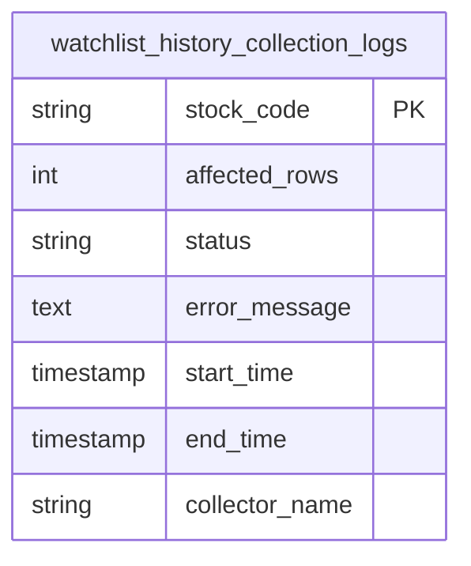
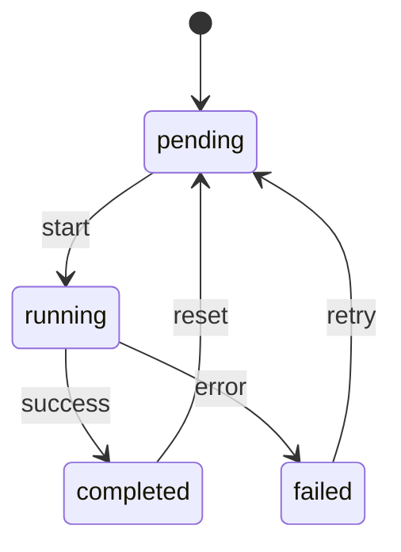

# 日志与监控模型

<cite>
**本文档引用的文件**  
- [operation_logs.py](file://backend_api/admin/operation_logs.py)
- [logs.py](file://backend_api/admin/logs.py)
- [watchlist_history_collection_logs.py](file://backend_core/models/watchlist_history_collection_logs.py)
- [historical_collector.py](file://backend_core/data_collectors/akshare/historical_collector.py)
- [main.py](file://backend_core/data_collectors/akshare/main.py)
- [QuoteSyncTask](file://backend_core/data_collectors/akshare/base.py)
- [config.py](file://backend_core/config/config.py)
</cite>

## 目录
1. [引言](#引言)
2. [操作日志模型](#操作日志模型)
3. [数据采集日志模型](#数据采集日志模型)
4. [行情数据同步任务状态机](#行情数据同步任务状态机)
5. [错误记录与故障排查机制](#错误记录与故障排查机制)
6. [日志保留策略与性能影响](#日志保留策略与性能影响)
7. [结论](#结论)

## 引言
本文档详细阐述股票分析系统中的日志与监控体系，涵盖操作审计、数据采集监控、任务状态管理及错误处理机制。系统通过结构化日志记录保障可追溯性，支持运维审计与故障诊断。

## 操作日志模型

操作日志（operation_logs）用于记录系统关键操作的审计信息，确保行为可追溯。该模型由 `operation_logs.py` 实现，主要字段包括：

- **操作类型（operation_type）**：标识操作类别，如“用户登录”、“数据同步”、“配置修改”等。
- **操作人（operator）**：执行操作的用户ID或系统账户名。
- **操作时间（operation_time）**：操作发生的时间戳，精确到毫秒。
- **IP地址（ip_address）**：发起操作的客户端IP，用于安全审计。
- **目标对象（target_object）**：被操作的资源标识，如用户ID、股票代码等。
- **操作详情（details）**：JSON格式的附加信息，描述操作具体内容。

该表作为系统安全审计的核心组件，支持按时间、用户、操作类型进行多维查询。

**Section sources**
- [operation_logs.py](file://backend_api/admin/operation_logs.py#L1-L50)
- [logs.py](file://backend_api/admin/logs.py#L20-L40)

## 数据采集日志模型

`watchlist_history_collection_logs` 表用于监控自选股历史数据采集任务的执行情况，确保数据完整性与任务可靠性。其核心字段如下：

- **stock_code**：采集的股票代码，标识任务目标。
- **affected_rows**：本次采集影响的数据库记录行数，用于判断数据更新量。
- **status**：任务执行状态，包括“success”、“failed”、“partial”等。
- **error_message**：若任务失败，记录具体的错误信息，便于排查。
- **start_time / end_time**：任务开始与结束时间，用于计算执行耗时。
- **collector_name**：采集器名称（如 akshare），用于区分数据源。

该日志表由 `watchlist_history_collector.py` 在每次采集完成后写入，是监控数据同步健康度的关键指标。

**Diagram sources**
- [watchlist_history_collection_logs.py](file://backend_core/models/watchlist_history_collection_logs.py#L5-L25)
- [historical_collector.py](file://backend_core/data_collectors/akshare/historical_collector.py#L60-L80)

**Section sources**
- [watchlist_history_collection_logs.py](file://backend_core/models/watchlist_history_collection_logs.py#L1-L30)
- [historical_collector.py](file://backend_core/data_collectors/akshare/historical_collector.py#L50-L90)

## 行情数据同步任务状态机

`QuoteSyncTask` 是行情数据同步任务的核心状态机模型，定义于 `base.py` 中，采用有限状态机（FSM）设计，确保任务状态清晰可控。其状态流转如下：

- **pending**：任务已创建，等待调度执行。
- **running**：任务正在执行中。
- **completed**：任务成功完成，数据已同步。
- **failed**：任务执行失败，记录错误并可触发重试。

状态变更通过方法调用触发（如 `start()`、`complete()`），并自动记录时间戳。状态变更事件同时写入操作日志，实现全链路追踪。

**Diagram sources**
- [base.py](file://backend_core/data_collectors/akshare/base.py#L10-L40)

**Section sources**
- [base.py](file://backend_core/data_collectors/akshare/base.py#L1-L50)
- [main.py](file://backend_core/data_collectors/akshare/main.py#L30-L60)

## 错误记录与故障排查机制

系统采用分层错误记录策略，确保问题可定位、可复现：

- **运行时异常捕获**：在数据采集、同步等关键流程中使用 try-catch 捕获异常，将错误信息结构化写入日志表（如 `error_message` 字段）。
- **上下文信息附加**：错误日志包含任务ID、股票代码、时间戳等上下文，便于关联分析。
- **日志分级**：使用 INFO、WARNING、ERROR 等级别区分日志严重性，支持过滤查看。
- **前端监控集成**：前端通过 `logs.service.ts` 上报用户操作异常，与后端日志关联分析。

该设计支持快速定位数据同步失败原因，如网络超时、API限流、数据格式异常等。

**Section sources**
- [historical_collector.py](file://backend_core/data_collectors/akshare/historical_collector.py#L70-L100)
- [logs.service.ts](file://admin/src/services/logs.service.ts#L15-L35)

## 日志保留策略与性能影响

为平衡存储成本与审计需求，系统采用分级保留策略：

- **操作日志**：保留180天，满足基本审计要求。
- **采集日志**：保留90天，聚焦近期数据质量监控。
- **错误日志**：永久保留，作为故障分析依据。

日志写入采用异步方式，避免阻塞主业务流程。数据库层面为关键字段（如 `operation_time`、`stock_code`）建立索引，保障查询效率。定期归档旧日志至冷存储，降低主库压力。

**Section sources**
- [config.py](file://backend_core/config/config.py#L25-L40)
- [operation_logs.py](file://backend_api/admin/operation_logs.py#L60-L75)

## 结论

本系统通过 `operation_logs` 和 `watchlist_history_collection_logs` 构建了完整的操作与数据监控体系，结合 `QuoteSyncTask` 状态机实现任务生命周期管理。错误记录机制与合理的日志保留策略，确保了系统的可维护性与稳定性，为数据质量与安全审计提供了坚实基础。