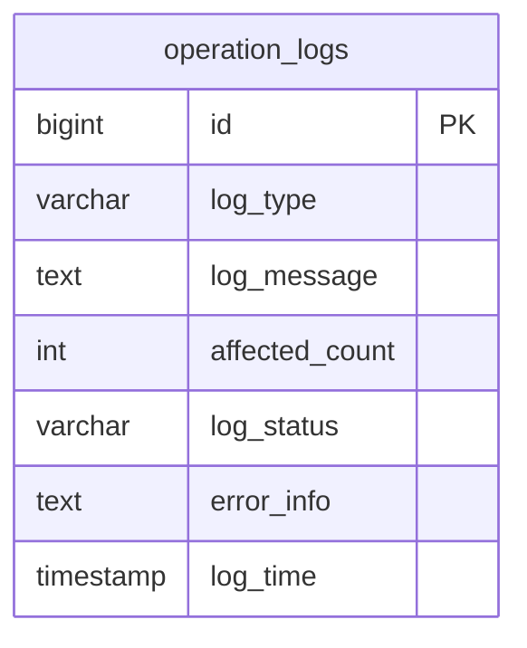
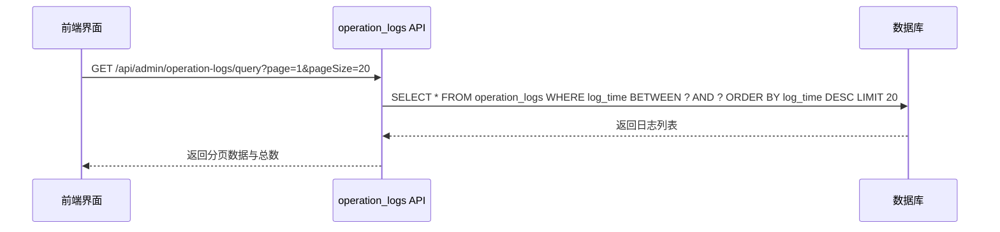
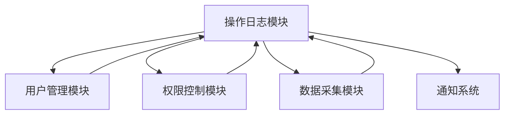

# 系统操作日志

<cite>
**本文档引用文件**  
- [logs.py](file://backend_api/admin/logs.py)
- [operation_logs.py](file://backend_api/admin/operation_logs.py)
</cite>

## 目录
1. [简介](#简介)
2. [操作日志表结构](#操作日志表结构)
3. [字段定义与用途](#字段定义与用途)
4. [应用场景](#应用场景)
5. [日志查询与统计功能实现](#日志查询与统计功能实现)
6. [日志记录调用示例](#日志记录调用示例)
7. [模块集成关系](#模块集成关系)
8. [常见问题排查指引](#常见问题排查指引)
9. [总结](#总结)

## 简介
本系统操作日志文档详细描述了`operation_logs`表的结构、字段含义及其在系统中的应用。该日志模型用于记录用户行为审计、权限变更和数据修改等关键操作，支持通过API进行查询、筛选和统计分析。文档结合`backend_api/admin/logs.py`和`backend_api/admin/operation_logs.py`中的实现，说明技术细节与使用方式。

**Section sources**
- [logs.py](file://backend_api/admin/logs.py#L1-L385)
- [operation_logs.py](file://backend_api/admin/operation_logs.py#L1-L245)

## 操作日志表结构
`operation_logs`表是系统核心日志存储结构之一，用于持久化记录所有重要操作事件。其主要字段包括：`id`（唯一标识）、`log_type`（操作类型）、`log_message`（操作描述）、`affected_count`（影响行数）、`log_status`（状态：成功/失败）、`error_info`（错误信息）以及`log_time`（操作时间）。该表通过统一接口暴露给管理后台，支持分页查询、条件筛选和统计分析。



**Diagram sources**
- [operation_logs.py](file://backend_api/admin/operation_logs.py#L10-L15)

## 字段定义与用途
以下为`operation_logs`表各字段的详细定义与用途说明：

- **id**: 主键，自增整数，唯一标识每条日志记录。
- **log_type**: 操作类型，字符串类型，表示操作的类别，如“用户管理”、“数据导入”、“权限变更”等，便于分类检索。
- **log_message**: 操作描述，文本类型，详细描述本次操作的具体内容，例如“更新用户角色为管理员”。
- **affected_count**: 影响行数，整数类型，记录该操作影响的数据条目数量，适用于批量操作场景。
- **log_status**: 状态，字符串类型，取值为“success”或“error”，标识操作执行结果。
- **error_info**: 错误信息，文本类型，当`log_status`为“error”时，记录具体的异常堆栈或错误原因。
- **log_time**: 操作时间，时间戳类型，记录操作发生的具体时间，用于时间范围查询和趋势分析。

这些字段共同构成了完整的操作上下文，支持后续审计、监控与问题追溯。

**Section sources**
- [operation_logs.py](file://backend_api/admin/operation_logs.py#L10-L15)

## 应用场景
`operation_logs`表广泛应用于以下关键业务场景：

### 用户行为审计
系统记录所有敏感操作（如登录、登出、密码修改、角色变更），确保可追溯性，满足合规性要求。

### 权限变更追踪
每次权限分配或回收均生成日志，明确责任归属，防止越权操作。

### 数据修改监控
对数据库增删改操作进行记录，特别是在批量导入、导出或清理任务中，通过`affected_count`评估影响范围。

### 故障排查支持
当系统出现异常时，可通过`error_info`快速定位错误源头，结合`log_time`进行时间轴分析。

### 运维统计分析
利用`log_type`和`log_status`生成每日操作统计报表，辅助运维决策。

**Section sources**
- [operation_logs.py](file://backend_api/admin/operation_logs.py#L40-L245)

## 日志查询与统计功能实现
系统通过`backend_api/admin/logs.py`和`backend_api/admin/operation_logs.py`提供完整的日志查询与统计能力。

### 统一查询接口
`/api/admin/logs/query/{table_key}` 支持多表查询，通过`LOG_TABLES`配置映射不同日志表结构，实现字段兼容。对于`operation_logs`表，支持按日期范围、状态、操作类型等条件筛选。

### 专用操作日志接口
`/api/admin/operation-logs/query` 提供针对`operation_logs`表的专用查询接口，直接使用标准字段名进行过滤，提升查询效率。

### 统计功能实现
- **全局统计**：`/api/admin/logs/stats` 返回各日志表的总数、今日记录数及错误数。
- **趋势分析**：`/api/admin/operation-logs/stats` 提供按日统计的成功与失败数量，支持指定天数范围。
- **类型分布**：统计不同`log_type`的操作频率，帮助识别高频操作。

### 分页与排序
所有查询接口均支持分页参数（`page`, `page_size`）和按时间倒序排列，确保前端展示性能。



**Diagram sources**
- [operation_logs.py](file://backend_api/admin/operation_logs.py#L40-L150)
- [logs.py](file://backend_api/admin/logs.py#L150-L300)

## 日志记录调用示例
在业务代码中记录操作日志的标准方式如下（伪代码示例）：

```python
# 记录一次用户权限变更操作
log_entry = {
    "log_type": "权限变更",
    "log_message": f"将用户 {user_id} 的角色从 {old_role} 更新为 {new_role}",
    "affected_count": 1,
    "log_status": "success",
    "error_info": None,
    "log_time": datetime.now()
}
# 调用日志服务写入数据库
operation_log_service.create(log_entry)
```

实际调用应封装在服务层，确保事务一致性，并在异常捕获块中记录失败日志。

**Section sources**
- [operation_logs.py](file://backend_api/admin/operation_logs.py#L40-L100)

## 模块集成关系
`operation_logs`模块与多个核心模块紧密集成：

- **用户管理模块**：在用户创建、删除、角色变更时触发日志记录。
- **权限控制模块**：每次权限检查失败或策略变更均生成审计日志。
- **数据采集模块**：历史与实时数据采集任务完成后记录执行结果。
- **通知系统**：严重错误日志可触发告警通知。

这种松耦合设计通过事件驱动或AOP方式实现，避免侵入核心业务逻辑。



**Diagram sources**
- [operation_logs.py](file://backend_api/admin/operation_logs.py#L1-L245)
- [logs.py](file://backend_api/admin/logs.py#L1-L385)

## 常见问题排查指引
### 日志缺失
- **检查点1**：确认日志写入代码是否被正确调用，特别是在异步任务中。
- **检查点2**：查看数据库连接是否正常，是否存在事务未提交问题。
- **检查点3**：验证日志级别配置，确保“info”及以上级别日志未被过滤。

### 状态异常
- **错误状态过多**：检查`error_info`字段内容，定位高频错误类型，优化相关逻辑。
- **状态未更新**：确认业务逻辑中是否遗漏了成功/失败状态的设置。

### 查询性能下降
- **建议1**：为`log_time`、`log_type`、`log_status`字段建立复合索引。
- **建议2**：对历史日志进行归档处理，减少单表数据量。

### 时间偏差
- **校准系统时间**：确保所有服务节点使用NTP同步时间，避免日志时间错乱。

**Section sources**
- [operation_logs.py](file://backend_api/admin/operation_logs.py#L40-L245)
- [logs.py](file://backend_api/admin/logs.py#L150-L385)

## 总结
`operation_logs`表作为系统审计与监控的核心组件，提供了完整的操作记录能力。通过标准化字段设计、灵活的查询接口和广泛的模块集成，支持用户行为审计、权限追踪和故障排查等多种场景。建议定期审查日志策略，优化索引与归档机制，确保系统长期稳定运行。